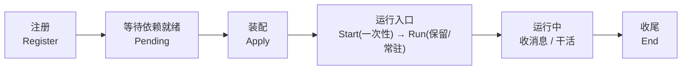
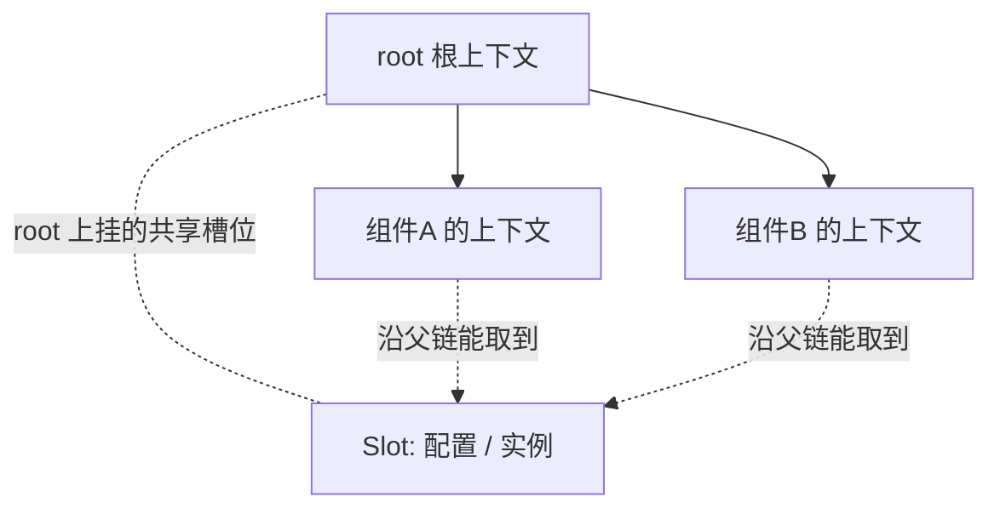
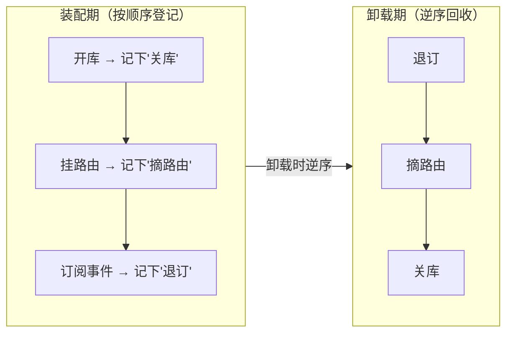

> 万事开头难。这一天的决定是：**先不写任何业务，先把负责管理组件的内核做出来**。

---

## 一、这天做了什么

我们要造的是一个能"装很多功能"的程序。想让一个内核能一视同仁地管好每一块功能，就得先约定：**每块组件必须回答同一套问题。**

抽象出来的几个问题就是：

```
我叫什么？          —— 一个名字，也是别人找我的称呼,其概念上相当于一个句柄
我是干什么的？       —— 给人看的组件说明
我依赖谁？          —— 装我之前，得先装好谁
我现在什么状态？     —— 给外部看的运行情况
装我之前要做什么？   —— 一次准备动作,做好初始化
依赖都就绪后做什么？ —— 真正搭起我自己（装配）
装好之后做什么？     —— 先执行一次性动作(Start),再进入运行入口(Run,保留)
别人给我发消息怎么办？—— 收到消息时怎么处理
卸我之前做什么？     —— 收尾、持久化等,进行优雅关闭
```

其概念上就有点类似于操作系统内核一样。

只要每块组件都照着这套问题回答，内核就能用**同一套流程和规范**去进行管理。

### 在代码里，这套"问题"就是一张契约

内核里用一张"接口契约"把上面的问题固定下来（位于 `GoTenon/plugin.go`）：

```go
// 源代码,位于 GoTenon/plugin.go
type PluginInfo interface {
	Name() string                              // 我叫什么（句柄）
	Desc() map[string]string                   // 我是干什么的
	Inject() []string                          // 我依赖谁
	Status() map[string]any                   // 我现在的运行状态
	Register() error                           // 入表前的一次准备
	Apply(ctx *GoTenonContext, cfg any) error  // 依赖就绪后：装配
	Start() error                              // 装载完成后的一次性动作
	Run() error                                // 运行入口(保留,目前多数组件留空)
	DealWithMessage(Message) error             // 收到消息怎么处理
	End() error                                // 卸载前：收尾
}
```


内核就是**围绕这几个方法**转的：把所有组件排好队，一个个调它们的方法。



> 说明：`Start` 与 `Run` 是两个**不同的钩子**，调用时机相同（装载成功后紧挨着依次调用）。
> `Start` 用于"装载完成即要做的一次性动作"（如打印帮助、执行一次指令）；
> `Run` 是**保留接口**，预留给"常驻服务 / 特殊运行模式"等用途，目前多数组件留空，便于将来与 `Start` 区分。

---

## 二、为什么先做这个

先把规矩立住,之后的开发才会越走越宽,这样的代码看了才不烧心(划掉)。

定好之后，就有了一个共同的抽象:**新功能 = 新组件**，就如图操作系统内核一般,新的功能和软件不需要修改内核,于是中间件,状态等就被抽象成了基础设施,在此之上提供基础设施和服务间的统一管理。

> 换句话说：内核不关心"你是什么业务"，只关心"你是不是按契约回答"。这就是它能"以不变应万变"的原因。

---

## 三、顺带搭的两样地基

### 1. 组件之间怎么"传东西"

每块组件有一块属于自己的"上下文"，里面可以放东西（比如共享的实例、配置）。子级能顺着"父链"找到父级放的东西。这是在Go语言中使用非常频繁也很经典的设计.一般来说上下文都会被设计为不可变的,但是在此处,为了支持组件间频繁的信息修改,需要支持可变的上下文.这里传递的是较为静态的信息,例如配置等。

代码里，"上下文"是一棵树，每个节点就是一块组件的地盘（位于 `GoTenon/scope.go`）：

```go
// 源代码,位于 GoTenon/scope.go（节选）
type GoTenonContext struct {
	Name     string                              // 来自哪个组件
	parent   *GoTenonContext                     // 父上下文
	children []*GoTenonContext                   // 子上下文（弱引用）
	slots    map[string]*Slot                    // 本层私有槽位：name -> slot
	// ... 省略 Info / labels / effects 等
}

type Slot struct {          // 一个"槽位"
	Name  string
	Value any               // 实际承载的实例 / 句柄
	Owner *GoTenonContext
}

// 在本层开一个私有槽位（同名复用，不覆盖已有值）
func (c *GoTenonContext) Isolate(name string) *GoTenonContext { /* ... */ }

// 从本层沿祖先链向上找这个槽位
func (c *GoTenonContext) SlotOf(name string) *Slot { /* ... */ }
```

一句话读法：**`Isolate` 是"在自家墙上挂个柜子"，`SlotOf` 是"从自家柜子一路找到总部的柜子"。**



这样组件需要共享的东西靠"传递"拿到,将各个节点交由组件自身去维护,就可以避免全局变量那种修改同一对象导致的并发问题。

### 2. 一切都可撤销

组件在"装配"时会做很多的事（开库、挂路由、订阅事件）。我们希望**每做一件，都要登记这个动作"怎么撤销"**。等到卸载时，内核**按相反顺序**把这些撤销动作跑一遍。

像是操作系统中,一个程序会申请资源,会开启子进程等,我们希望程序在结束时可以将这些资源释放,但是此处由于组件和服务间的复杂性,很难找到一种统一方式将这些资源统一抽象,于是我们只能将这类资源的管理交由组件自己来实现。

代码里，"可撤销"就是一个"撤销函数"，登记到当前上下文（位于 `GoTenon/effect.go`）：

```go
// 源代码,位于 GoTenon/effect.go
type Disposer func() error      // 一个"怎么撤销"的动作

// 把撤销动作登记到当前上下文；返回幂等包装后的撤销函数
func (c *GoTenonContext) Register(d Disposer) Disposer { /* ... */ }

// 卸载时：逆序执行本层全部 Disposer
// for i := len(items) - 1; i >= 0; i-- { items[i]() }
```



> 内核不强行统一各种资源，而是**统一"登记与回收"的入口**，具体怎么撤由组件自己写。

---

## 四、跑出来什么

基于以上的能力,我们就可以开始创造组件了.但此刻的内核功能还不够完善：**它还不能很好地传递运行时消息、也不知道其他组件可以提供什么功能**。这留到了下一篇。

