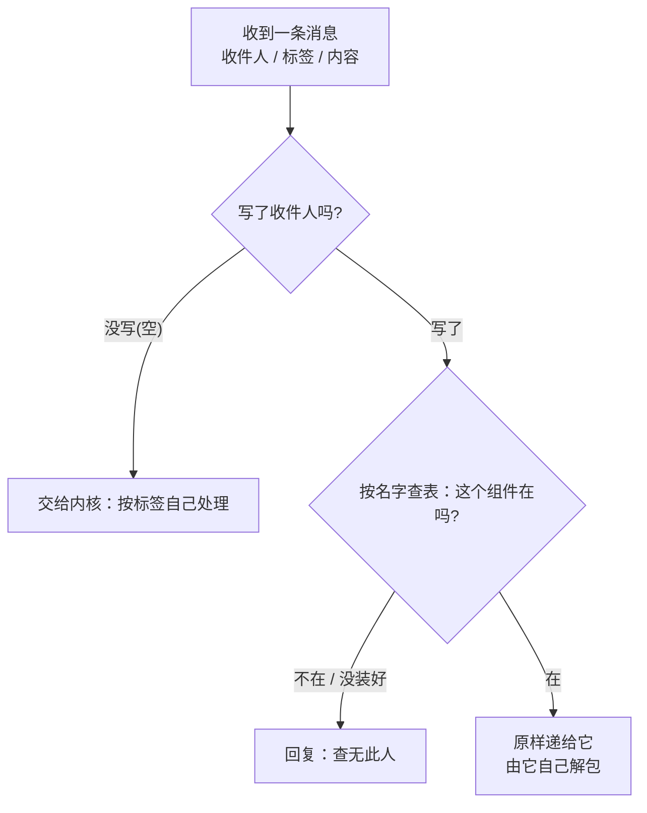
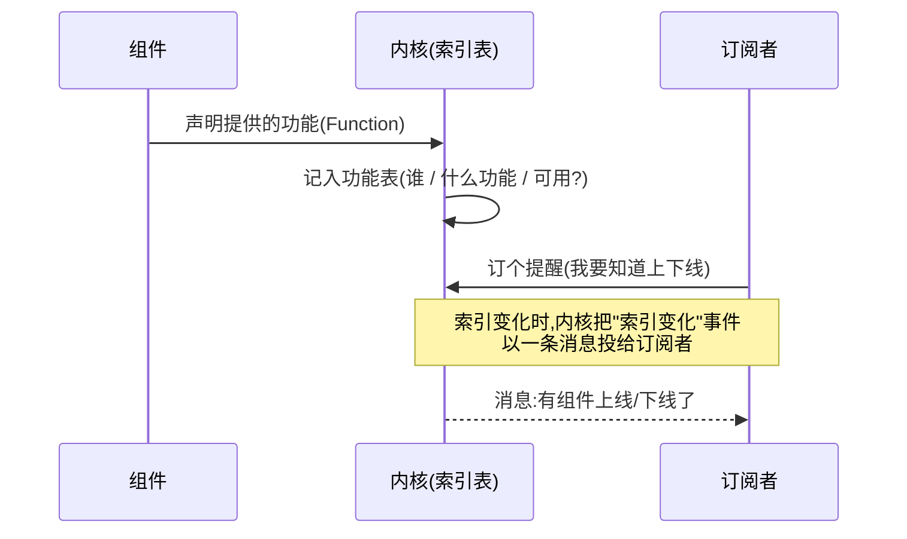
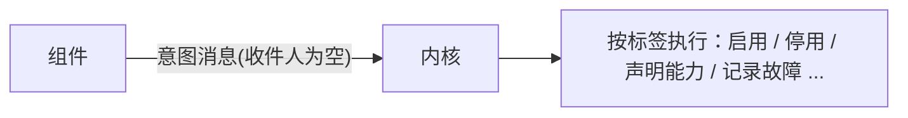
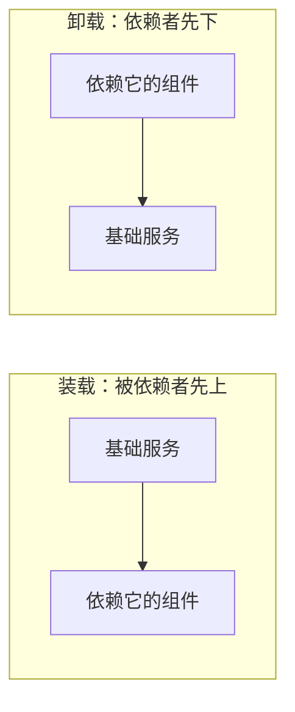

> 上一篇规定好了统一的抽象。但组件之间还不能互相通信，也无法确定彼此之间的功能。

---

## 一、给消息套一个"统一信封"

组件之间怎么通信？我们规定：所有消息都套同一个信封，信封上写三样东西：

```
收件人：写给哪个组件（不写 = 写给内核本身）
标签：  这条消息是干嘛的（由收件人自己解释）
内容：  具体要传的东西
```

- **写了收件人**：内核只负责"按名字找到那个组件，把信封原样递过去"，信封里的"标签"和"内容"是什么意思，由收件人自己决定。
- **没写收件人**：这条是给**内核**的，内核按"标签"自己处理。这样,通过标签和信息,内核也可以处理一些组件希望处理的特殊情况,例如关闭某些已经存在的组件,或者让内核执行其他的特殊功能
- **找不到收件人**（没这个组件、或它没装好）：直接告诉发信人"查无此人"。

信封上的"标签"是数字编号，我们把它分成两段：**0 到 15 留给内核自己用，16 往后留给各个组件自己用。**

### 在代码里，信封就长这样

```go
// 源代码,位于 GoTenon/message.go
type Message struct {
	Name string      // 收件人：空 = 发往内核 / 系统
	Type MessageType // 标签：语义由收件人解释
	Data any         // 内容
}
```

而"送信"的分叉判断，代码里就几行：

```go
// 源代码,位于 GoTenon/message.go（节选）
func (p *DefaultMessageProcesser) Handle(msg *Message) (*Message, error) {
	if msg.Name == "" {
		return p.Manager.handleSystem(msg) // 没写收件人 → 交给内核
	}
	return p.deliver(msg)                  // 写了收件人 → 原样递给目标
}
```



---

## 二、让内核"认得本事"（能力索引）

只通信还不够，还得能发现功能和提供者。在组件中,有些组件是全局的基础设施,为其他的组件提供通用的基础功能,为了发现和寻找到这些组件,让其完成其能力的声明并让其他组件调用,于是：

- 每块组件可以**声明自己提供的功能**（我能做哪几件事）；
- 内核维护一份全局的组件功能表，记着 **哪个组件,提供什么功能,现在是否可用**；
- 别的组件可以**查功能表**,也可以**订个提醒**（功能可用/下线后发送通知.这也就是前文所说的需要内核发送的运行时消息）。

这里有个用得着的小讲究：**"提醒"也用消息来发**，不另开一套"回调函数"的通道。这样"通知"和"声明"是同一套机制，不做两套。

### 花名册与"订提醒"在代码里

组件声明功能，用的是一个可选的能力描述接口：

```go
// 源代码,位于 GoTenon/plugin.go（节选）
type FunctionOffer interface {
	Function() map[string]any // 报出：我在什么状态下能做哪几件事
	ExecuteFunction(any)      // 收到调用时执行
}
```

内核侧实现：

```go
// 源代码,位于 GoTenon/index.go（节选）
type CapabilityEntry struct { // 功能表里的一条
	Plugin    string         // 谁提供
	Name      string         // 能力名
	Desc      map[string]any // 能力描述
	Available bool           // 现在能不能用
}
type Subscription struct { // 一个"提醒"
	Subscriber string
	Filter     func(IndexEvent) bool
}
```



因为要让能力描述尽量灵活以适应尽可能多的场景,所以这里使用map的格式,其规范由项目全局定义,来适配不同的情况,这里推荐使用MCP Schema(嗯对)

---

## 三、还有一类"意图"消息

除了传数据，组件有时要"表达意图"：我想开机、我想停、我出故障了……

组件**不能也不应该直接去调度内核**，所以用一条"意图消息"把想法告诉内核，由内核去执行。

```go
// 源代码,位于 GoTenon/signal.go（节选）
type SignalRequest struct {
	From   string // 谁发的
	Target string // 目标组件(可空)
	Signal Signal // 想干嘛(启用/停用/声明能力/上报故障...)
	Args   any
}
```



---

## 四、依赖自动排队

组件在"我依赖谁"里声明依赖后，内核把它们连成一张网：**装载时，被依赖的先上；卸载时，依赖别人的先下。** 顺序一般由内核管理。(不过特殊的情况需要自己编排)

此外**被依赖的未开启的组件依旧会被启动装载**，直到没有别的组件再引用它才跟着下线。也就是自动依赖加载/卸载的机制



---

## 五、跑出来什么

内核现在能：装组件、按依赖排先后装载顺序、消息通信、维护功能表。**一个能承载业务的插件库成型了。**

