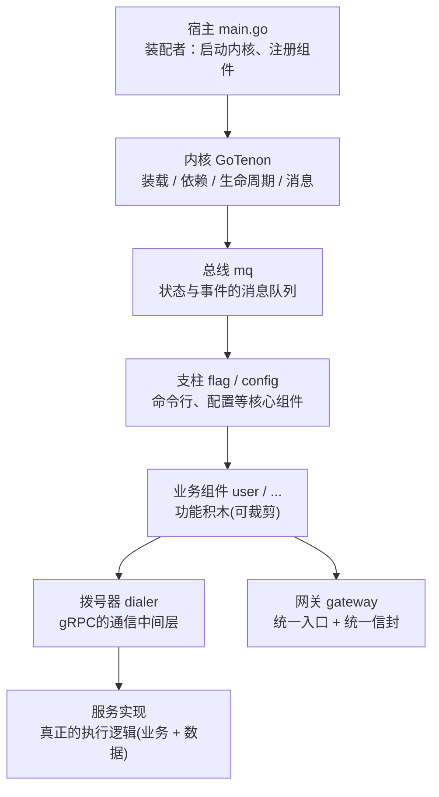
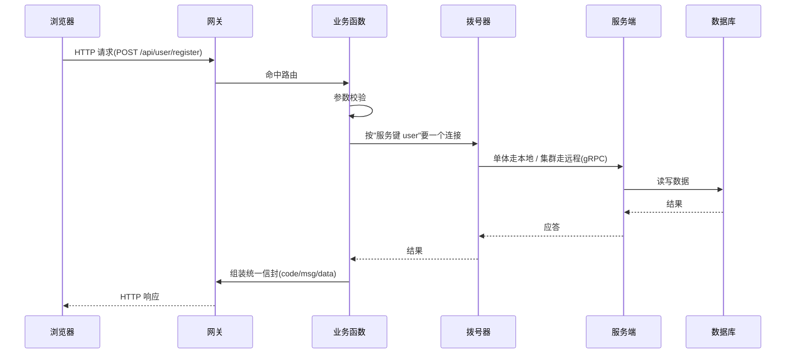
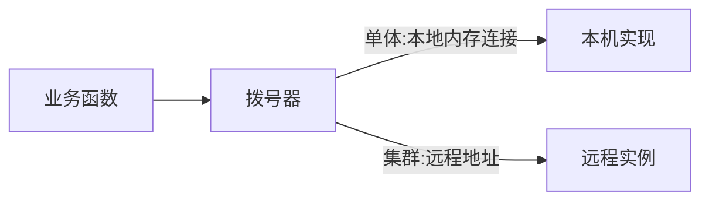

这一天开始造真正的产品。但在写功能之前，先把**整个项目的架构**定下来。

---

## 一、一张图看懂：系统长什么样

整个系统的全貌：



用大白话对每一层：

| 层 |  一句话 |
| --- | --- |
| 内核 |  只管装载、排依赖、组件生命周期、传消息 |
| 总线 | 所有状态变化与事件都通过消息发送到这里 |
| 支柱 | 命令行、配置，是业务组件的地基 |
| 拨号器 |  远程调用之间通信，不关心对方在哪 |
| 业务组件 | 一个组件一个功能组，能单独开关 |
| 网关 |  唯一对外入口，向外提供统一的 HTTP服务 |

启动顺序是**内核 → 总线 → 支柱组件 → 业务组件**（后启动的依赖先启动的，停机时反过来）。

---

## 二、一次请求怎么走完全程

以"注册用户"为例：



- 业务函数**只认"服务键 + 拨号器"**，不关心服务在本地还是远程；
- 返回**统一信封**，前端只管认这一种格式。

于是彼此之间提供了一个抽象,让各个层次聚焦于当前层次的工作,使用下层提供的接口,为上层提供服务。

---

## 三、核心设计思路

下面逐块讲"为什么这么设计"，并贴关键源码。

### 3.1 组件登记表：核心固定、业务可配

所有组件登记在同一张表里，`core` 决定它是"骨架"还是"业务"：

```go
// 源代码,位于 component.go（节选）
var components = []component{
	{name: "mq",      plugin: mq.NewPlugin(),      core: true},
	{name: "config",  plugin: config.NewPlugin(),  core: true, cfg: config.Spec{...}},
	{name: "gateway", plugin: gateway.NewPlugin(), core: true},
	{name: "user",    plugin: user.NewPlugin()},   // core=false → 业务组件
}
```

- `core: true` → 固定启用；
- `core: false` → 按配置段里的"是否启用"开关。

### 3.2 拨号器：单体 / 集群的"开关"

业务代码永远这样拿服务：

```go
// 源代码,位于 dialer/dialer.go（节选）
func (d *Dialer) Server() *grpc.Server { return d.server } // 提供方:注册实现
func (d *Dialer) Dial(ctx context.Context, service string) (*grpc.ClientConn, error)
// 单体:内部用内存连接(bufconn);集群:地址指向远程
```



**同一行业务代码**，单体时是本地调用，拆分时自动变跨网络——这就是"设计微服务、部署单体"的落地机制。

为什么要用这套方式？

最初想直接写微服务模式，借此锻炼架构能力。但纯微服务会带来部署上的不便：服务拆得多，往往就得上 K8s 这类重型框架；而我又希望部署足够轻便，两者存在冲突。

于是改为可组合的方式：

- **关闭对外的微服务 → 单体架构**：各服务在本地调用，一个可执行程序就是完整应用；
- **开启对外的微服务 → 微服务架构**：同一个可执行程序也能作为单个微服务运行；
  - 小型集群：多个实例之间做负载均衡式调用；
  - 中型微服务（实例很多）：可以只开启单个微服务，按需组合。

这样一来，凭一个程序就能实现不同规模的调整：

| 场景 | 架构形态 | 调用方式 | 部署特点 |
| --- | --- | --- | --- |
| 小规模 / 开发 | 单体 | 本地调用 | 一个可执行程序 |
| 小型集群 | 微服务 | 跨网络 + 负载均衡 | 多实例互相调用 |
| 中型微服务 | 微服务 | 按需开启单个服务 | 灵活组合，不必全量上 K8s |

### 3.3 网关：唯一入口 + 统一信封

组件把路由注册函数输入进网关，网关执行注册并统一返回格式：

```go
// 源代码,位于 gateway/gateway.go（节选）
func (r *Router) Handle(method, pattern string, h HandlerFunc) GoTenon.Disposer // 注册一条路由
func OK(c *Ctx, data any)   { c.JSON(200, common.Response{Code: 200, Msg: "ok", Data: data}) }
func Fail(c *Ctx, s int, m string) { c.JSON(s, common.Response{Code: s, Msg: m}) }
```

### 3.4 总线：控制面用消息

组件间的"状态变化"与"上下线事件"都走消息总线。为什么需要这样一层中间层，另见《架构手记（五）：总线中间层》一文。
