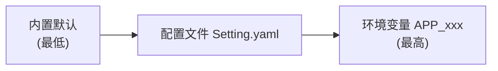
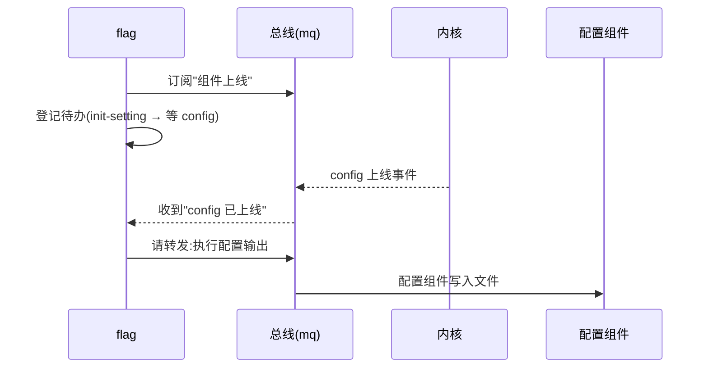
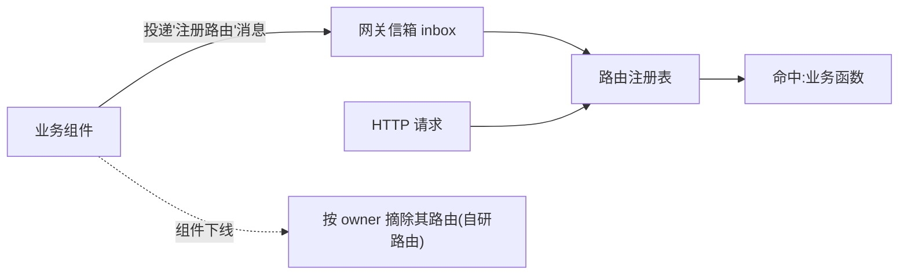
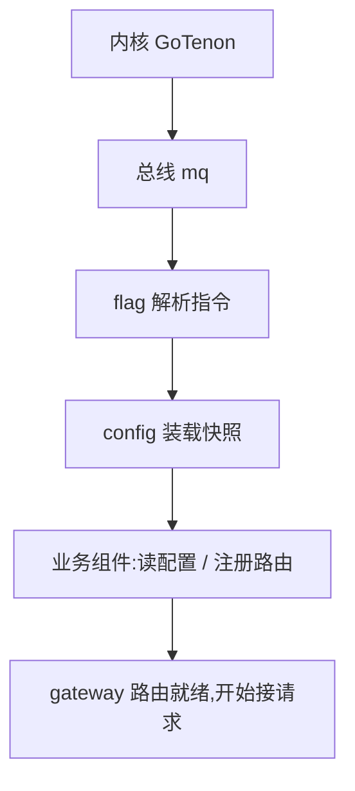

上一篇讲了整体架构（分层、拨号器、网关、取舍）。这一篇把最早的三块"**支柱组件**"单独拆开讲清楚——**配置、命令行（flag）、网关**，它们是后面所有业务的公共地基。

---

## 一、配置组件：一份配置管全部

### 1.1 设计目标

- **一份配置文件**，按组件名分段：每段就是那个组件的配置；
- **组件只读自己那段**；
- 值的优先级明确：**内置默认 < 配置文件 < 环境变量**；
- 读进来后是一份**只读快照**，运行期不再改（要改走重载）。

### 1.2 快照与"规格"

配置容器本身是个"线程安全、只读"的快照；装配时由宿主交给它一份"规格"：

```go
// 源代码,位于 core/config/struct.go
type Config struct {          // 容器:句柄稳定,内部快照原子替换
	snap atomic.Value         // 合并后的只读快照 map[string]any
	ver  atomic.Uint64
	mu   sync.Mutex           // 串行化写入
}

type Spec struct {            // 宿主装载本组件时传入的环境变量信息
	Defaults  map[string]any  // 内置默认(最低)
	Path      string          // 配置文件路径
	File      map[string]any  // 已解析的配置(可选)
	Required  []string        // 必填键:缺失即报错
	EnvPrefix string          // 环境变量前缀,默认 APP_
}
```

### 1.3 三层合并：默认 < 文件 < 环境

```go
// 源代码,位于 core/config/read.go（节选）
func loadSnapshot(spec Spec) (map[string]any, error) {
	file := spec.File
	if spec.Path != "" {
		fm, _ := readFile(spec.Path)      // 读并解析配置文件
		file = mergeMaps(file, fm)
	}
	merged := mergeMaps(spec.Defaults, file) // 默认 < 文件
	applyEnv(merged, spec.EnvPrefix)         // 文件 < 环境变量
	merged = normalize(merged)               // 键统一小写
	// ... 校验必填
	return merged, nil
}
```



### 1.4 设计取舍

- **为什么由组件自己读文件**：宿主只告诉它"文件在哪"，读/解析/合并都归配置组件，宿主保持轻。
- **为什么不干脆用全局变量**：容器由宿主预挂到根上下文，组件经"槽位"拿到同一份。这样可测试、可隔离（某个子树能给一份不同的配置），也不会到处 import 全局。

---

## 二、命令行组件（flag）：前功能 与 后功能

### 2.1 设计目标

把"这次运行要做什么"从命令行里析出来，分成两类动作：

- **前功能**：不依赖别的服务，启动时立刻做（如 `help`、`run`）；
- **后功能**：依赖某个组件（如"输出默认配置"要等配置组件就绪），要**等目标上线再执行**。

### 2.2 参数从哪来、结果放哪

宿主把原始命令行参数经"注册"传给 flag；解析结果只归 flag 自己用（在私有子树里开个槽位存着，不占公共槽位）：

```go
// 源代码,位于 flag/plugin.go（节选）
func (p *Plugin) Apply(ctx *GoTenon.GoTenonContext, cfg any) error {
	raw, ok := cfg.([]string)   // 宿主经 Register 传入 os.Args
	out, err := Parse(raw)      // 解析成"指令集合"
	p.out = out
	ctx.Isolate(FlagsService)   // 结果只本组件用:自隔离槽位
	ctx.SlotOf(FlagsService).Value = out
	// ...
}
```

### 2.3 后功能

flag **不硬依赖**配置组件，而是"订阅提醒"：等配置组件上线了，再把"输出配置"这个请求转过去。这正是"进程内通信走总线"的典型用法,也是之前提到过的内核消息无状态无存储的尴尬情况:

```go
// 源代码,位于 flag/plugin.go（节选）
ctx.Register(q.Subscribe(mq.TopicComponentReady, "flag")) // 订阅"组件上线"
p.addWait(mq.TopicComponentReady, "config", func() {       // 登记待办:等 config
	_ = q.Forward("config", TypeSettingRequest, setting)   // 转发"执行配置输出"
})
```



### 2.4 设计取舍

- **前功能/后功能分开**：`help` 这种立刻执行；`init-setting` 这种要等目标就绪。
- **用"待办 + 订阅上线 + 转发"做弱依赖**，而不是静态声明依赖——这样 flag 不需要认识 config 的内部，顺序也更灵活。

---

## 三、网关组件：路由注册表 + 统一信封

### 3.1 设计目标

网关不是"按路径转发的代理"，而是一张**路由注册表**：

- 业务组件把"我有哪些接口"**注册**进来；
- 请求按路由分发给对应的业务函数；
- 所有回信统一成一种"信封"。

### 3.2 路由注册与"组件下线自动摘路由"

网关持有一个可切换的 web 后端 + 一张"路由归属表"（记住每条路由是谁注册的），组件下线时按归属把它的路由摘掉：

```go
// 源代码,位于 gateway/gateway.go（节选）
type Router struct {
	fw     Framework                     // 可切换的 web 后端
	owners map[string][]GoTenon.Disposer // owner 组件 -> 其路由的注销函数
	inbox  chan GoTenon.Message          // 信箱:组件把路由"投"进来
}
func (r *Router) Submit(msg GoTenon.Message) error { /* 入队即返回 */ }
func (r *Router) addOwnerRoute(owner, method, pattern string, h HandlerFunc) {
	d := r.fw.Register(method, pattern, h) // 注册,拿到"注销函数"
	r.owners[owner] = append(r.owners[owner], d)
}
func (r *Router) RemoveOwner(owner string) { /* 组件下线:摘除它注册的全部路由 */ }
```

但是显然,Gin不支持路由摘除,所以之后会考虑自研路由来实现这个功能

所以后端也抽象成一个统一接口，便于在 **自研路由 与 Gin 引擎** 之间切换：

```go
// 源代码,位于 gateway/framework.go（节选）
type Framework interface {
	Name() string
	Register(method, pattern string, h HandlerFunc) GoTenon.Disposer // 返回注销函数
	ServeHTTP(w http.ResponseWriter, r *http.Request)
}
```



### 3.3 统一信封

```go
// 源代码,位于 gateway/gateway.go（节选）
func OK(c *Ctx, data any)                 // 成功:HTTP 200 + {code:200,msg:"ok",data}
func Fail(c *Ctx, status int, msg string) // 失败:HTTP 状态码 + {code,msg}
```

### 3.4 设计取舍：Gin 还是自研

| 后端 | 优点 | 代价 |
| --- | --- | --- |
| **自研动态路由**（std） | 可**注册也可摘除**，组件下线自动摘路由 | 需要自己维护 |
| **Gin 引擎**（gin，默认） | 生态成熟、性能好、原生路由 | 路由**不可摘除**（下线不自动摘） |

默认用 Gin（生态好），需要热插拔/自动摘路由时切到自研路由——把取舍交给配置。

---

## 四、三者如何协同（一次启动）

启动顺序是硬规矩：**内核 → 总线 → flag → 配置 → 业务组件**。三者各就各位后，业务才有"配置可读、指令可执行、请求可进"的环境。


