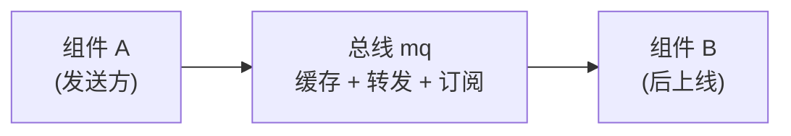

> 内核的消息是"无状态、不存储"的：发出去时对方不在线，消息就丢了。这一篇单独讲**总线 mq**——如何用一层中间层缓存、转发、解耦，化解这个尴尬。

---

## 一、问题出在哪

内核的消息通信是**无状态、不存储**的——消息发出去了，对方没在线时无法接收，这条消息就丢失了。

于是出现一个尴尬场景：

- 我想给某个组件发消息；
- 但那个组件**还没上线**；
- 我只能**等它上线再发**；
- 可它上线的前提，是**依赖我先加载完**（我是它的依赖项，它一定在我之后加载）。

结果就是：

> **我发早了，它收不到；我想发准，就得等它上线；而它上线又得等我先好。**

---

## 二、更麻烦的是：想"等它上线"，就得反过来监听它

如果我想做到"等对方上线后再发"，那我必须：

- 能收到"对方已上线"的通知；
- 也就是我**要订阅对方的上线事件**。

但这就出问题了：

- 我本来是**下层/被依赖方**；
- 却要反过来**引用上层的上线状态**；
- 这**违反分层原则**（下层不应依赖上层）。

---

## 三、所以需要一个中间层：总线

用一个**中间层**来缓存、转发、解耦，缓解这种"无状态的尴尬"：



消息总线的作用：

- **消息可以先缓存到总线**，不必要求对方当场在线；
- **订阅关系由总线维护**，发送方不必知道谁上线了；
- **上下线事件也走总线**，双方都只跟总线打交道；
- 这样**下层不用引用上层**，分层原则不被破坏。

状态变化、上下线事件、组件间的通信都走消息总线：

```go
// 源代码,位于 mq/mq.go（节选）
func (q *Queue) Publish(topic string, data any) error            // 发到主题
func (q *Queue) Subscribe(topic, subscriber string) GoTenon.Disposer // 订阅
func (q *Queue) Forward(target string, t GoTenon.MessageType, data any) error // 转发给某组件
```
