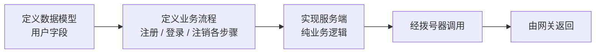
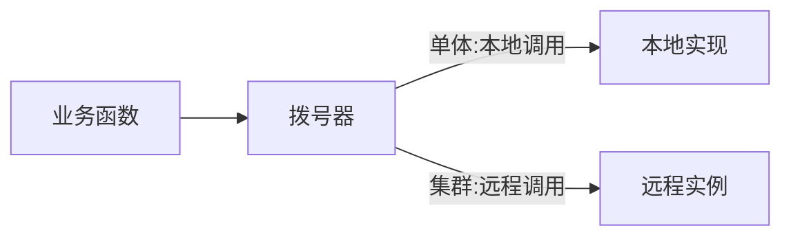
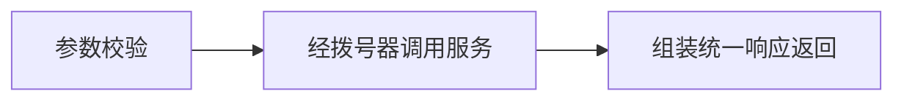

> 项目骨架搭建完成后，第一次把"一条真实请求"从浏览器发送到数据库，再原路返回。打通它，即验证了整套骨架。
> 本文对应提交 `ec845dc`，以"用户"为例走一遍全链路：**定义数据模型 → 定义业务流程 → 实现服务 → 经拨号器调用 → 由网关返回**，每个环节附上真实源码。

---

## 一、为什么从"用户"开始

用户功能几乎是现代网站的基础：**没有用户，认证就无从谈起。**
凡是带登录/认证的网站，背后一定有一张用户表。因此第一个模块示例选择用户，且只做最小可用的一版——三个接口：

| 接口 | 作用 |
| --- | --- |
| 注册 | 创建账号 |
| 登录 | 校验账号密码，签发令牌 |
| 注销 | 吊销令牌 |

本次目标是打通**端到端链路**，使这三个接口能够实际运行。打通之后，整套骨架就开始具备实际功能。

---

## 二、动手前先定义两件事：数据模型 与 业务流程

编码之前，先把两件事定义清楚。

### 2.1 数据持久化：定义用户表结构

先确定**数据的存储方式**：用户包含哪些字段、哪些必须唯一（如用户名）、哪些需要加密存储（如密码）。

本版以轻量起步，字段从最小集开始；密码采用"加盐哈希"存储，不保存明文。用户表定义如下：

```go
// 源代码,位于 services/user/model.go
type Model struct {            // 所有业务表共用的基础字段
	ID        uint `gorm:"primarykey"`
	CreatedAt time.Time
	UpdatedAt time.Time
	DeletedAt gorm.DeletedAt `gorm:"index"` // 软删除
}

type UserModel struct {        // 用户表
	Model
	UserName string  `gorm:"size:32;uniqueIndex"` // 用户名：唯一
	Password string  `gorm:"size:64" json:"-"`    // 哈希密码：不序列化到 JSON
	Email    *string `gorm:"size:128;uniqueIndex"`// 邮箱：可空,唯一
	Role     RoleType                             // 角色:管理员/会员/普通/封禁...
	// ... 昵称、头像、简介等
}
```

> 两个细节：密码字段加 `json:"-"`，**永不序列化**；邮箱用可空指针，使"未填写邮箱"的多个用户不产生唯一约束冲突。

### 2.2 业务流程与中间件

再定义**流程**：注册需查重、登录需校验密码、注销需吊销令牌；过程中是否需要经过认证、限流等中间件。流程理清后才便于编码。



---

## 三、服务提供方：只实现业务

服务端实现契约约定的几个**远程调用接口**（这类跨语言的远程调用方式即 gRPC），只包含纯业务逻辑——校验参数、查重、加盐哈希、写库。

"契约约定的接口"先行定义：

```proto
// 接口契约,位于 api/user/v1/user.proto
service UserService {
  rpc Register(RegisterRequest) returns (RegisterResponse);
  rpc Login(LoginRequest)       returns (LoginResponse);
  rpc Logout(LogoutRequest)     returns (LogoutResponse);
}
```

该文件可通过工具**生成各语言的客户端与服务端桩代码**，我们只需实现接口，无需处理中间的数据结构与通信细节。

注册接口实现如下（仅列关键部分）：

```go
// 源代码,位于 services/user/server.go（节选）
func (s *Server) Register(ctx context.Context, req *userv1.RegisterRequest) (*userv1.RegisterResponse, error) {
	if req.GetUsername() == "" || len(req.GetPassword()) < 6 {
		return nil, status.Error(codes.InvalidArgument, "用户名不能为空,密码至少 6 位")
	}
	// 查重
	var cnt int64
	if err := s.db.Model(&UserModel{}).Where("user_name = ?", req.GetUsername()).Count(&cnt).Error; err != nil {
		return nil, status.Error(codes.Internal, err.Error())
	}
	if cnt > 0 {
		return nil, status.Error(codes.AlreadyExists, "用户名已存在")
	}
	// 加盐哈希 + 入库
	h, _ := HashPassword(req.GetPassword())
	u := UserModel{UserName: req.GetUsername(), Password: h, Role: UserRole}
	if err := s.db.Create(&u).Error; err != nil {
		return nil, status.Error(codes.Internal, err.Error())
	}
	return &userv1.RegisterResponse{UserId: int64(u.ID)}, nil
}
```

出错时，用一套统一的**错误码**表达（如 `InvalidArgument`、`AlreadyExists`、`Unauthenticated`），转换为 HTTP 状态码的工作交由网关处理。这样网关可以统一管理和调用业务函数。

| 服务端错误码 | 含义 | 映射的 HTTP 状态码 |
| --- | --- | --- |
| `InvalidArgument` | 参数不合法 | 400 |
| `Unauthenticated` | 未登录 / 令牌无效 | 401 |
| `AlreadyExists` | 资源已存在 | 409 |
| 其它 | 服务内部错误 | 500 |

---

## 四、拨号器：统一本地与远程调用

业务函数的执行与普通函数本质相同，区别仅在于：**参数通过网络传入**（通常为请求头与请求体），**结果也通过网络返回**。

这类服务通常拆分为两个阶段：

1. **校验**：检查参数是否合法（通常较简单）；
2. **执行**：调用服务并获取结果。

而"调用服务"存在两种形态：

- **单体**部署时，调用发生在**本地**；
- **集群**部署时，调用需要**跨网络**访问远程实例。

两种差异由**拨号器**统一抽象。原因是微服务通常分为两部分：**服务治理**（注册、发现、负载均衡等）与**调用**。将治理部分单独抽为独立组件，即为拨号器。

```go
// 源代码,位于 dialer/dialer.go（节选）
func (d *Dialer) Server() *grpc.Server // 提供方:注册自身实现
func (d *Dialer) Dial(ctx context.Context, service string) (*grpc.ClientConn, error)
// 内部:单体走内存连接,集群走远程地址(待实现)
```



<details>
<summary>为什么单体也要走远程调用链路？</summary>

因为"校验 → 调用 → 组装响应"这套流程在单体与集群下必须一致。若单体直接调用函数、集群走网络，就会形成**两套代码路径**，后续拆分容易出问题。让单体也走同一套链路（仅把"网络"替换为内存连接），业务代码即可**单体/集群不变**。

代价是进程内多了一次序列化/反序列化，这是"一致性优先于性能"的取舍。

</details>

综上，**核心能力以微服务形式实现，校验前置**；服务端由组件维护，通信由 gRPC 库封装，服务治理由拨号器承担，组件只需专注业务实现。

---

## 五、网关：统一入口 + 统一响应

所有外部请求都经由**网关组件**进入。业务组件在装配期将调用入口注册到网关：

```
请求 → 路由分发 → 业务函数 → 经拨号器调用服务 → 组装响应 → 返回
```

响应统一为一种结构，便于前端处理：

```
{ 状态码, 提示, 数据 }
```

错误同样统一：将服务端错误码转换为 HTTP 状态码（400、401、409……）并附带中文提示。

```go
// 源代码,位于 gateway/gateway.go（节选）
func OK(c *Ctx, data any)                 // 成功:HTTP 200 + {code:200,msg:"ok",data}
func Fail(c *Ctx, status int, msg string) // 失败:HTTP 状态码 + {code,msg}
```

组件在装配期将路由注册到网关（见 `services/user/plugin.go` 节选）：

```go
// 源代码,位于 services/user/plugin.go（节选）
userv1.RegisterUserServiceServer(d.Server(), srv) // 将实现注册到拨号器
cc, _ := d.Dial(context.Background(), "user")     // 从拨号器获取连接
cli := userv1.NewUserServiceClient(cc)            // 生成客户端桩
gw := ctx.SlotOf(gateway.ServiceName).Value.(*gateway.Router)
gw.Submit(gateway.RouteMessage("user", "POST", "/api/user/register", handleRegister(cli)))
```

---

## 六、业务函数的统一处理流程

每个业务函数都遵循同一条流程：**参数校验 → 经拨号器调用服务 → 组装统一响应**。业务函数只面对一个与框架无关的请求对象，不依赖具体的 Web 框架。

```go
// 源代码,位于 services/user/handler.go
func handleRegister(cli userv1.UserServiceClient) gateway.HandlerFunc {
	return func(c *gateway.Ctx) {
		var in struct {
			Username string `json:"username"`
			Password string `json:"password"`
		}
		if err := c.BindJSON(&in); err != nil {        // 1. 参数校验
			gateway.Fail(c, http.StatusBadRequest, "参数不合法")
			return
		}
		resp, err := cli.Register(c.Context(),         // 2. 经客户端调用服务
			&userv1.RegisterRequest{Username: in.Username, Password: in.Password})
		if err != nil {
			writeErr(c, err)                           //    错误码转换
			return
		}
		gateway.OK(c, map[string]any{"userId": resp.GetUserId()}) // 3. 组装响应
	}
}
```



---

## 七、运行结果

```
注册 alice           -> 成功，返回编号
再注册 alice         -> 用户名已存在
登录 alice           -> 成功，返回令牌
注销                 -> 成功
```

第一条链路打通，骨架得到验证。但"启动哪些组件"仍是硬编码——下一篇，改为由配置决定。

> 下一篇：《架构手记（七）：配置驱动组件启停》。
