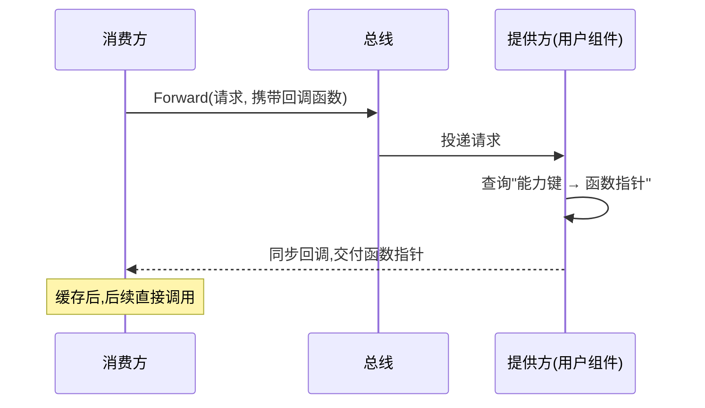

> 本文讲"能力外借（capability lending）"：组件在不跨模块 import 的前提下，将自己的能力以**函数指针**的形式提供给其他组件。
> 对应提交 `fba1b0f`，内容包括：为何不复用消息通信与能力声明、以函数指针作为接口、装配期时序问题与回调方案、以及用 Redis 做高频缓存。文末附真实源码。

---

## 一、为什么不复用"消息通信"与"能力声明"

在它之前，组件间协作主要有两条路径：**消息通信**与**能力声明**。二者面向的是"程序内部的功能接口"，调用频率低——典型场景是命令行调度、配置读取。

而鉴权属于"**服务级接口**"：其调用频率与 QPS 直接相关，属于高频调用。若仍通过消息通信或能力声明实现，每次调用都要经过消息分发链路，**性能开销与延迟明显**。

结论：该层接口需要**更低开销、同步**的调用方式，不能沿用上层机制。

---

## 二、方案：以函数指针作为接口

用户组件对外高频提供的能力很明确：**鉴权**——判断请求方是否登录、角色与权限是什么。它有两个硬约束：

1. 不能在每个组件里重复实现；
2. 不得跨模块 import（须保持组件解耦）。

方案：**以函数指针充当接口**，并通过消息将"具体实现的函数指针"交付给调用方。

```go
// 源代码,位于 common/cap/cap.go（节选）
type Request struct {
	Key   string       // 能力键
	ReqID uint64       // 请求序号
	Reply func(Reply)  // 回调函数:提供方处理后同步调用,交付函数指针
}
type Reply struct {
	Key   string
	ReqID uint64
	Fn    any    // 函数指针(进程内)
	Err   string
}
```

能力键与函数签名构成双方共同遵守的**契约**：

```go
// 源代码,位于 common/cap/auth.go（节选）
const (
	KeyAuthParse        = "auth.parse"
	KeyAuthRequireLogin = "auth.requireLogin"
	KeyAuthRequireRoles = "auth.requireRoles"
	KeyAuthIsRevoked    = "auth.isRevoked"
	KeyAuthRoleOf       = "auth.roleOf"
)
type RequireRolesFunc func(token string, allow RoleMask) (*Claims, error)
```

---

## 三、装配期时序问题与回调方案

**问题**：组件在装配期（`Apply/Start/Run`）尚未注册到内核的 `router`，因此**无法接收发给自身的消息**，无法通过"应答消息"完成交付。

**方案**：请求中**携带回调函数**，提供方处理后**同步回调**，将函数指针直接交付给调用方。

**提供方未上线时**：订阅组件上线事件（`component.ready`），待其上线后重发请求；提供方下线（`component.gone`）时清除本地缓存，避免调用到已卸载组件。



```go
// 源代码,位于 common/cap/client.go（节选）
func (c *Client) Bind(fwd Forwarder, provider string, keys ...string) {
	for _, k := range keys {
		req := Request{Key: k, ReqID: c.next(), Reply: func(rep Reply) {
			if rep.Err == "" { c.store(rep.Key, rep.Fn) } // 回调:存入缓存
		}}
		_ = fwd.Forward(provider, TypeRequest, req)
	}
}
```

```go
// 源代码,位于 common/cap/provider.go（节选）
func (p *Provider) Handled(msg GoTenon.Message) bool {
	if msg.Type != TypeRequest { return false }
	req := msg.Data.(Request)
	rep := Reply{Key: req.Key, ReqID: req.ReqID}
	if fn, ok := p.get(req.Key); ok { rep.Fn = fn } else { rep.Err = "capability not found" }
	if req.Reply != nil { req.Reply(rep) } // 同步回调
	return true
}
```

---

## 四、为什么用 Redis 缓存加速

鉴权是高频操作。若每次鉴权都查询数据库，开销过大——数据库涉及落盘读写，效率低于内存。

因此将高频状态（黑名单、角色）放入 **Redis**（内存缓存），查询延迟低；该状态的维护由组件自身负责。

```go
// 源代码,位于 services/user/cache.go（节选）
func (c *cache) Revoke(token string, t BlackType) {
	// 写入黑名单:key = token_black_<token>,value = 类型,TTL = 令牌剩余有效期
	_ = c.rdb.Set(ctx, blacklistKeyPrefix+token, int(t), remain).Err()
}
func (c *cache) Revoked(token string) (BlackType, bool) {
	v, err := c.rdb.Get(ctx, blacklistKeyPrefix+token).Int() // 命中内存,不查库
	if err != nil { return 0, false }
	bt := BlackType(v)
	return bt, bt != 0
}
```

---

## 五、能力外借（capability lending）

内容、评论、视频等组件都需要鉴权。若各自实现，重复且易出现安全漏洞。做法：**由用户组件集中实现，其他组件按能力键获取对应的函数指针**。

- 消费方**不 import 提供方**，只依赖 `common/cap` 的契约；
- 取用为控制面（一次消息），调用为数据面（函数指针直接调用）；
- 上线/等待的协调由总线负责。

---

## 六、JWT：access 与 refresh 双令牌

早期登录成功后，服务端维护一张**会话表**，每次请求都要查询。问题是：每次请求都要查库；多实例部署时还需共享会话，成本高。

改为**自包含（self-contained）令牌**（JWT）：令牌本身携带"用户标识、角色、过期时间"，服务端只需**本地验签**，无需查库。

令牌分两种配合使用：

- **access token**：日常访问使用，有效期短；
- **refresh token**：用于换取新的 access token，有效期长，单独保管。

两者使用**不同的签名密钥**，互不影响。

```go
// 源代码,位于 common/jwts/jwt.go（节选）
func Issue(cfg Config, c Claims) (access, refresh string, err error) // 一次签发一对
func ParseAccess(cfg Config, token string) (*AccessClaims, error)    // 本地校验 access
func ParseRefresh(cfg Config, token string) (*RefreshClaims, error)  // 本地校验 refresh
```


---

## 七、登出：Redis 黑名单吊销

JWT 的固有问题是**一旦签发，在过期前一直有效**，无法主动失效。解决方式：用 Redis 维护一张**黑名单**。

- 登出时把令牌写入黑名单，**TTL 取该令牌的剩余有效期**（到期自动清理）；
- 每次验令牌前先查黑名单，命中即拒绝。

此外缓存用户角色，避免每请求查库；角色变更时主动失效该缓存，保证即时生效。

用户组件将上述能力封装为可外借的接口（`AuthRequireLogin` / `AuthRequireRoles` / `AuthIsRevoked` 等），其他组件按能力键获取。

---

## 八、实测

```
注册           -> 成功
登录           -> 成功，返回 access + refresh
刷新           -> 成功，换取新的一对
登出           -> 成功
再次登出       -> 401 登录凭证无效     ← Redis 黑名单生效
```

