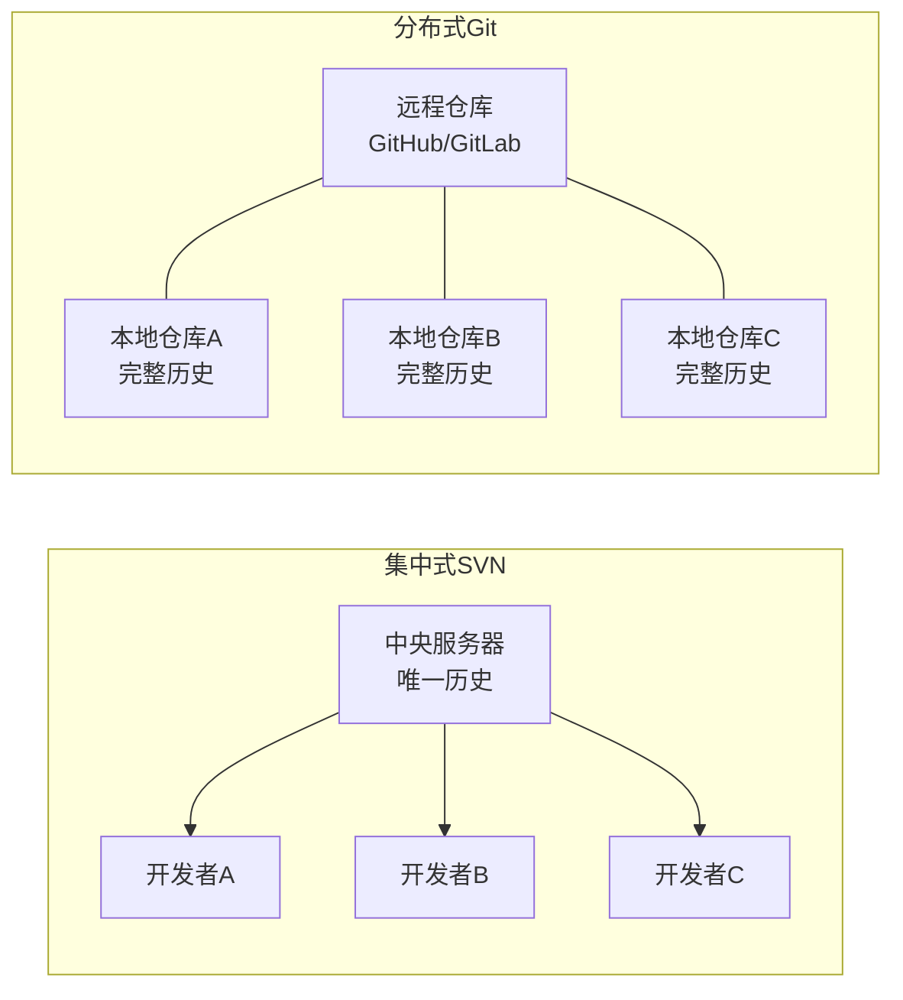
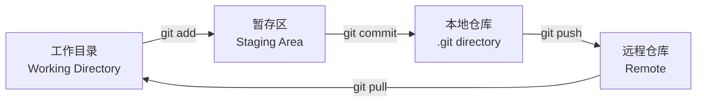
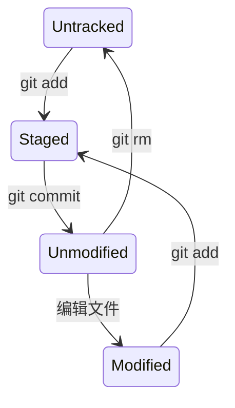
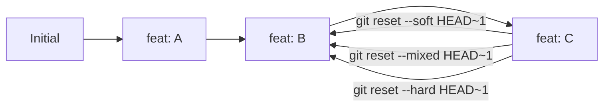
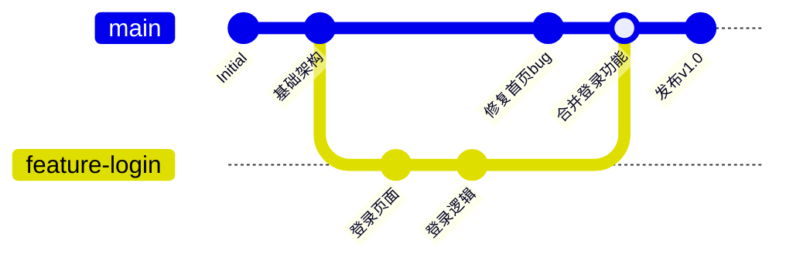

# Git 入门指南：从零开始的版本控制与协作

> Git 是目前世界上最流行的分布式版本控制系统，由 Linux 之父 Linus Torvalds 于 2005 年创建。无论你是个人开发者还是团队协作，Git 都是绕不开的基础工具。

---

## 目录

1. [什么是版本控制？](#一什么是版本控制)
2. [Git 的核心概念](#二git-的核心概念)
3. [安装与初始配置](#三安装与初始配置)
4. [获取仓库：初始化 vs 克隆](#四获取仓库初始化-vs-克隆)
5. [日常三连：add / commit / status](#五日常三连-add--commit--status)
6. [时光穿梭：查看与回退版本](#六时光穿梭查看与回退版本)
7. [分支管理：并行开发的精髓](#七分支管理并行开发的精髓)
8. [远程协作：推送与拉取](#八远程协作推送与拉取)
9. [.gitignore：不该被跟踪的文件](#九gitignore不该被跟踪的文件)
10. [实战场景串联](#十实战场景串联)
11. [常见问题与速查表](#十一常见问题与速查表)

---

## 一、什么是版本控制？

**版本控制**是一种记录一个或多个文件内容变化，以便将来查阅特定版本修订情况的系统。

想象你写论文时：

| 方式 | 问题 |
|------|------|
| `论文_最终版.doc` | 下一秒就变"最终版2" |
| `论文_最终版_真的不改了.doc` | 三天后改回来找不到 |
| 用 Git 管理 | **每次改动都有记录，随时可以回退** |

Git 是**分布式**版本控制系统——每个开发者本地都有一份完整的代码仓库历史，即使没有网络也能正常工作。

### 集中式 vs 分布式



**Git 的优势**：
- 每个人本地都有完整历史，离线也能工作
- 分支操作轻量快速
- 数据完整性高（内容通过 SHA-1 哈希校验）
- 团队协作灵活

---

## 二、Git 的核心概念

### 1. 三个工作区域

理解 Git，首先要理解文件的三个"住处"：



| 区域 | 说明 |
|------|------|
| **工作目录** | 你电脑上看到的文件，直接编辑的地方 |
| **暂存区（Staging Area）** | 下一次要提交的文件的"待提交清单" |
| **本地仓库（.git）** | Git 保存所有版本历史的地方 |

### 2. 文件的四种状态



| 状态 | 含义 |
|------|------|
| **Untracked** | 新文件，Git 还没跟踪 |
| **Unmodified** | 文件已跟踪，没有改动 |
| **Modified** | 文件已修改，但还没放到暂存区 |
| **Staged** | 已暂存，准备提交 |

---

## 三、安装与初始配置

### 1. 安装

| 系统 | 方式 |
|------|------|
| **Windows** | 下载 [git-scm.com](https://git-scm.com) 安装包，一路默认即可 |
| **macOS** | `brew install git` 或安装 Xcode Command Line Tools |
| **Linux** | `sudo apt install git`（Debian/Ubuntu） / `sudo dnf install git`（Fedora） |

安装后打开终端（或 Git Bash），验证：

```bash
git --version
# 输出类似：git version 2.40.0
```

### 2. 配置用户名和邮箱

这是 Git 提交时的"签名"，**只需要配置一次**：

```bash
git config --global user.name "你的名字"
git config --global user.email "你的邮箱@example.com"
```

`--global` 表示全局生效。也可以对单个项目去掉 `--global` 单独配置。

查看所有配置：

```bash
git config --list
```

### 3. 配置别名（可选）

给常用命令起短名字，提高效率：

```bash
git config --global alias.st status
git config --global alias.co checkout
git config --global alias.br branch
git config --global alias.ci commit
git config --global alias.lg "log --oneline --graph --all"
```

配置后 `git st` 等价于 `git status`，`git lg` 可以看漂亮的分支历史图。

---

## 四、获取仓库：初始化 vs 克隆

### 1. 初始化一个新仓库

想把一个本地文件夹交给 Git 管理：

```bash
cd 你的项目文件夹
git init
```

执行后该文件夹下会生成一个隐藏的 `.git` 子目录，这就是你的本地仓库。

### 2. 克隆一个已有仓库

从远程（比如 GitHub）复制一个项目到本地：

```bash
git clone https://github.com/用户名/仓库名.git
```

这会在当前目录下创建一个同名文件夹，里面包含完整的版本历史。

---

## 五、日常三连：add / commit / status

这是 Git 最核心的操作循环：

### 1. `git status` — 查看当前状态

```bash
git status
```

任何时候不确定仓库状态，先敲这个。它会告诉你：
- 哪些文件被修改了
- 哪些文件在暂存区
- 哪些文件还没被跟踪

### 2. `git add` — 添加到暂存区

```bash
# 添加单个文件
git add README.md

# 添加所有改动的文件（慎用，建议先用 git status 看清楚）
git add .

# 添加当前目录所有 .go 文件
git add *.go
```

### 3. `git commit` — 提交到仓库

```bash
git commit -m "feat: 添加用户登录功能"
```

**提交信息规范**（约定俗成）：

| 前缀 | 含义 |
|------|------|
| `feat:` | 新功能 |
| `fix:` | 修复 bug |
| `docs:` | 文档变更 |
| `refactor:` | 代码重构 |
| `test:` | 添加测试 |
| `chore:` | 构建/工具变更 |

### 完整的日常循环

```bash
# 1. 查看当前状态
git status

# 2. 添加文件到暂存区
git add 文件名

# 3. 提交到本地仓库
git commit -m "feat: 完成了某个功能"

# 4. 查看提交历史
git log --oneline
```

---

## 六、时光穿梭：查看与回退版本

### 1. 查看提交历史

```bash
# 完整日志
git log

# 一行显示一个提交
git log --oneline

# 图形化显示分支
git log --oneline --graph --all
```

输出示例：

```
e3a1b2d (HEAD -> main) fix: 修复登录超时问题
9f8e7d6 feat: 添加用户注册功能
a1b2c3d Initial commit
```

括号中的 `HEAD` 表示当前所在的版本。

### 2. 查看具体改动

```bash
# 查看工作目录的改动（未暂存）
git diff

# 查看已暂存的改动
git diff --staged

# 查看某两次提交之间的差异
git diff 提交哈希1 提交哈希2
```

### 3. 回退版本



```bash
# 回退到上一个版本（保留工作目录和暂存区改动）
git reset --soft HEAD~1

# 回退到上一个版本（保留工作目录，清空暂存区）— 默认模式
git reset --mixed HEAD~1

# 回退到上一个版本（工作目录都回退，会丢失未提交的改动）
git reset --hard HEAD~1

# 回退到指定版本
git reset --hard 提交哈希
```

> 注: **`--hard` 要慎用**：它会把工作目录的内容也一并回退，未提交的修改会丢失。如果不确定，先用 `git stash` 暂存当前改动。

### 4. 如果后悔了找回来

```bash
# 查看所有 HEAD 移动记录（包括被 reset 丢弃的）
git reflog

# 输出示例
# e3a1b2d HEAD@{0}: reset: moving to HEAD~1
# 9f8e7d6 HEAD@{1}: commit: feat: 添加用户注册功能

# 恢复到被丢弃的版本
git reset --hard 9f8e7d6
```

**`git reflog` 是你的后悔药**——只要你在本地操作过，Git 都会记录。

---

## 七、分支管理：并行开发的精髓

### 1. 什么是分支

分支让你从主线上"分叉"出去，独立开发新功能，互不干扰。



### 2. 分支常用命令

```bash
# 查看本地分支（* 表示当前所在分支）
git branch

# 创建新分支
git branch feature-login

# 切换到指定分支
git checkout feature-login

# 创建并切换（一步到位，最常用）
git checkout -b feature-login

# 合并指定分支到当前分支
git merge feature-login

# 删除分支（已合并后）
git branch -d feature-login
```

### 3. 合并与冲突

当两个分支修改了同一个文件的同一部分时，Git 不知道该听谁的，就会产生**冲突**。

合并时出现冲突的输出：

```
Auto-merging index.html
CONFLICT (content): Merge conflict in index.html
Automatic merge failed; fix conflicts and then commit the result.
```

打开冲突文件，你会看到：

```html
<<<<<<< HEAD
<title>我的网站</title>
=======
<title>我的个人主页</title>
>>>>>>> feature-title
```

- `<<<<<<< HEAD` 到 `=======` 是当前分支的内容
- `=======` 到 `>>>>>>> feature-title` 是要合并进来的分支的内容

**解决步骤**：

```bash
# 1. 手动编辑文件，决定保留哪部分（或都保留）
# 2. 删除 <<<<<<<、=======、>>>>>>> 标记行
# 3. 标记为已解决
git add index.html
# 4. 完成合并
git commit
```

---

## 八、远程协作：推送与拉取

### 1. 关联远程仓库

```bash
# 添加远程仓库（通常叫 origin）
git remote add origin https://github.com/你的用户名/仓库名.git

# 查看远程仓库
git remote -v
```

### 2. 推送（Push）

把本地的提交推送到远程：

```bash
# 首次推送：将 main 分支推送到 origin，并建立关联
git push -u origin main

# 后续推送（已经关联过了）
git push
```

### 3. 拉取（Pull）

获取远程的最新改动并合并到当前分支：

```bash
# 相当于 git fetch + git merge
git pull

# 更安全的方式：先看看远程有什么，再决定
git fetch        # 下载远程数据，但不合并
git log --oneline origin/main  # 看看远程的变动
git merge origin/main           # 确认没问题再合并
```

### 4. 常用远程操作流程

```bash
# 日常协作三板斧
git pull                  # 先拉取最新代码
# ... 修改代码 ...
git add .
git commit -m "feat: xxx"
git push                  # 推送自己的提交
```

---

## 九、`.gitignore`：不该被跟踪的文件

有些文件不需要加入版本控制（编译产物、依赖包、敏感信息等），在项目根目录创建 `.gitignore` 文件来排除它们。

### 常见示例

```gitignore
# 编译产物
*.exe
*.dll
*.so
*.class
/target/

# 依赖目录
node_modules/
vendor/

# IDE 配置
.idea/
.vscode/
*.swp

# 系统文件
.DS_Store
Thumbs.db

# 环境变量（可能含密码）
.env
.env.local

# 日志
*.log
```

> 已经跟踪的文件不受 `.gitignore` 影响。如果想取消跟踪已提交的文件：
> ```bash
> git rm --cached 文件名
> ```

---

## 十、实战场景串联

将前面的知识点串起来，模拟一个完整流程：

### 场景：从零开始一个项目并推送到 GitHub

```bash
# 1. 创建项目文件夹并初始化
mkdir my-project
cd my-project
git init

# 2. 创建 .gitignore
echo "node_modules/" > .gitignore
echo ".env" >> .gitignore

# 3. 创建 README
echo "# My Project" > README.md

# 4. 添加并提交
git add .
git commit -m "chore: 项目初始化"

# 5. 在 GitHub 上创建空仓库后，关联并推送
git remote add origin https://github.com/你的用户名/my-project.git
git branch -M main          # 如果默认分支不是 main
git push -u origin main
```

### 场景：开发新功能

```bash
# 1. 确保 main 是最新的
git checkout main
git pull

# 2. 创建功能分支
git checkout -b feature-add-search

# 3. 开发、提交
git add search.go
git commit -m "feat: 添加搜索功能"
git add search_test.go
git commit -m "test: 添加搜索测试"

# 4. 推送到远程（让队友也能看到）
git push -u origin feature-add-search

# 5. 回到 main 合并
git checkout main
git merge feature-add-search
git push

# 6. 删除本地分支（可选）
git branch -d feature-add-search
```

### 场景：遇到冲突时

```bash
# 在 main 分支上合并 feature 分支时提示冲突
git merge feature-payment
# CONFLICT in payment.go

# 1. 打开 payment.go，手动解决冲突
# 2. 标记为已解决
git add payment.go
# 3. 完成合并
git commit -m "merge: 合并 payment 功能"
```

---

## 十一、常见问题与速查表

### 常见问题

| 问题 | 解决方案 |
|------|----------|
| 提交信息写错了 | `git commit --amend -m "新的信息"` |
| 漏了一个文件想补进同一个提交 | `git add 漏掉的文件` → `git commit --amend --no-edit` |
| 想撤销暂存区的文件 | `git restore --staged 文件名` |
| 想撤销工作目录的修改 | `git restore 文件名`（不可恢复） |
| 想暂存当前工作去处理别的事 | `git stash` → 做完 → `git stash pop` |
| 想放弃所有未提交的修改 | `git reset --hard HEAD` |

### 命令速查表

| 命令 | 作用 |
|------|------|
| `git init` | 初始化本地仓库 |
| `git clone <url>` | 克隆远程仓库 |
| `git status` | 查看工作目录状态 |
| `git add <file>` | 将文件添加到暂存区 |
| `git commit -m "msg"` | 提交暂存区到本地仓库 |
| `git log` | 查看提交历史 |
| `git diff` | 查看文件改动 |
| `git branch` | 列出本地分支 |
| `git checkout -b <name>` | 创建并切换分支 |
| `git merge <branch>` | 合并分支 |
| `git pull` | 拉取远程最新代码 |
| `git push` | 推送本地提交到远程 |
| `git remote -v` | 查看远程仓库地址 |
| `git reset --hard HEAD~1` | 回退到上一个版本 |
| `git reflog` | 查看所有操作历史 |
