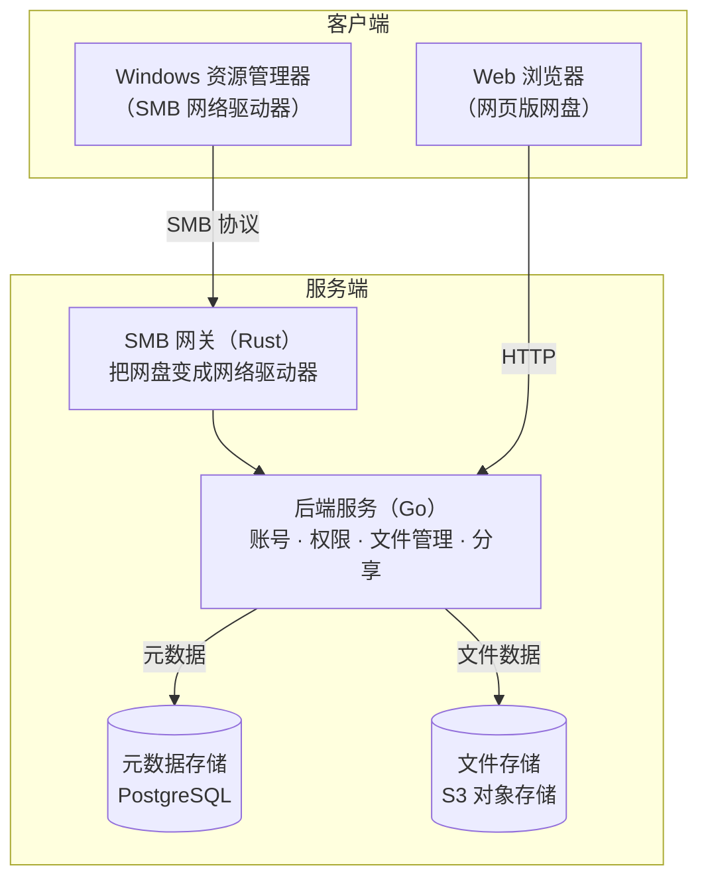
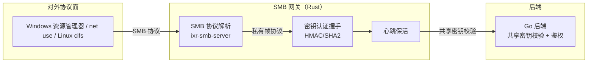
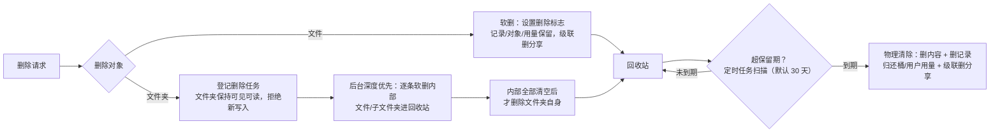
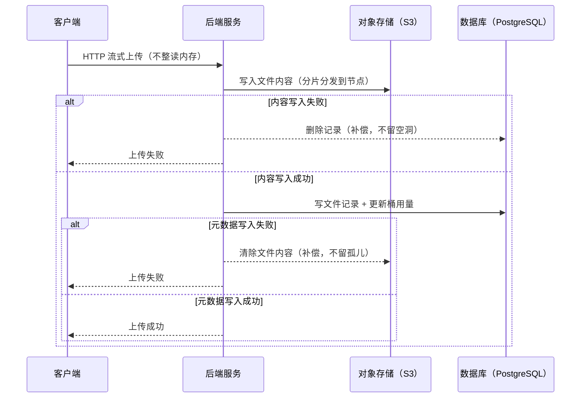
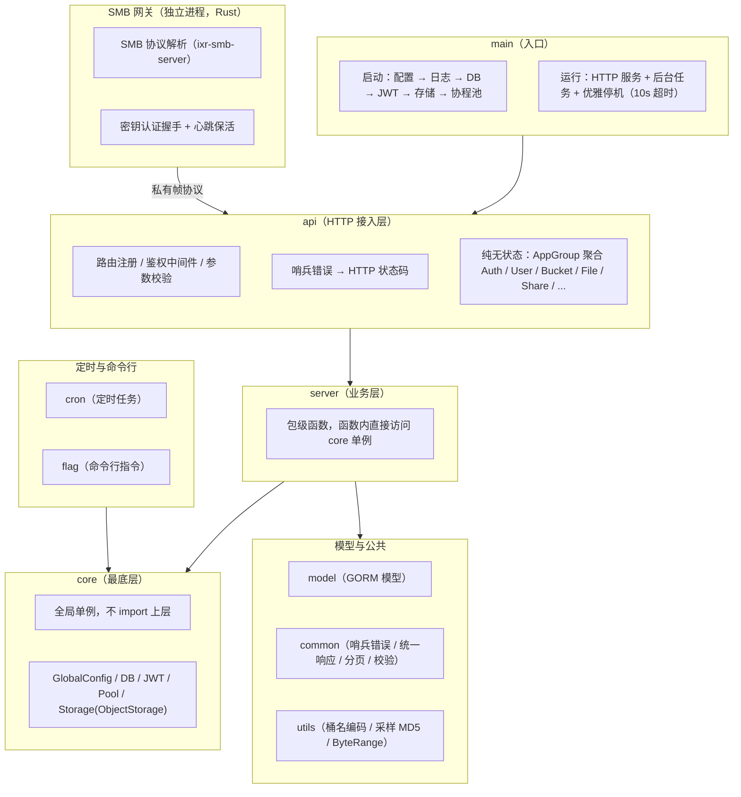

> [github地址](https://github.com/Bury-Lee/OrbitCloud)

## 一、为什么会有这个项目

<details>
  <summary>项目背景</summary>

  本项目前身为我个人的网盘小项目 <strong>NetDisk</strong>，最初仅服务于个人日常文件存储需求。
  后在实习期间，因企业级协作场景的特殊要求，对该项目进行了全面重构与功能升级，
  希望其演变为一套可支撑团队协同办公的企业级网盘系统 —— <strong>OrbitCloud</strong>。

  从“个人工具”到“企业级协作平台”，OrbitCloud 在保留轻量、便捷核心体验的同时，
  引入了多用户权限管理、文件共享协作、操作日志审计等企业级能力，
  以满足真实生产环境下的稳定性与安全性要求。

</details>

为什么不直接使用现成的方案？先看看市面上各类方案的实际体验：

| 方案 | 痛点 |
| --- | --- |
| 直接在服务器上跑 samba 挂硬盘 | 缺少权限等级管理、没有 Web 界面、没有分享能力；而且没有容灾能力，也无法轻松扩容 |
| 市面上的商业网盘 | 要求下载专用 App，且普遍限速 |
| 自己组装 Nextcloud / Seafile 等开源网盘项目 | 过于笨重；且对本地磁盘的使用场景缺少灵活性，无法直接提供给应用程序使用，大多也没有分布式能力与容灾能力 |
| 裸对象存储（MinIO 等） | 没有用户体系、没有目录树，纯面向开发者的存储 API |

而我希望的形态是：既有网盘的全套能力（Web 界面、账号权限、分享、配额），又能提供本地磁盘般的访问体验（资源管理器直接挂载，应用软件可直接使用）。
因此，它适合各类组织团体使用——小到家庭共享，大到企业内部协作，都可以用它完成内部文件的管理与协作。

## 二、核心竞争力

| 竞争力 | 说明 |
| --- | --- |
| **SMB 网关** | 网盘提供标准的网络驱动器接口，Windows 资源管理器、Linux cifs 均可原生使用，无需安装任何客户端 |
| **分布式架构** | 元数据与文件数据分离，使用 S3 协议对象存储，增加节点即可扩容 |
| **权限体系** | 多级权限、用户组、文件级访问控制、桶配额 |
| **开箱即用** | 提供打包好的 Docker 镜像，几分钟即可运行，免编译 |
| **开源可商用** | Apache 2.0，二次开发不限制，文档齐全 |

## 三、设计思路：三个关键决定

### 3.1 两个入口，一个大脑

资源管理器和浏览器是两个完全不同的入口，但背后是**同一个后端、同一份数据**。HTTP 也好、SMB 也好，都只是将用户操作转译为后端请求。你在资源管理器里拖进去的文件，Web 端立刻可见；在 Web 端建的分享链接，SMB 侧同样生效——双端读写同一份数据。



### 3.2 元数据和文件数据分开

这是整个系统最核心的决定。两类数据的访问模式与一致性要求完全不同：

| | 元数据 | 文件数据 |
| --- | --- | --- |
| 内容 | 账号、权限、目录树、配额 | 文件二进制本体 |
| 特性 | 强一致、事务、复杂查询 | 大体量、顺序读写 |
| 适合的存储 | 关系型数据库（PostgreSQL） | S3 协议对象存储 |

### 3.3 多一层 SMB 网关

SMB 网关的作用，是把网盘对外提供的能力从 HTTP API 与 Web 界面，转换为标准的文件共享协议（SMB）接口——用户和应用得到的是可挂载、可直接读写路径的网络文件系统，而非需要专用客户端或浏览器才能访问的网盘服务。网关自身是一层协议转换器：对外实现 SMB 协议解析（Windows 原生支持），对内通过私有帧协议与后端通信，两侧解耦。协议面（对用户）与认证面（对后端）相互隔离，鉴权在网关内侧完成，不会把裸 SMB 直接暴露给后端。



网关与后端之间的认证不暴露裸 SMB：双方通过共享密钥完成握手校验（密钥 ≥16 字节，经环境变量注入），配置缺失或校验不通过时直接拒绝启动——不会在配置错误的情况下带病运行。

## 四、核心特点与功能

### 4.1 SMB 网关：网盘 = 本地磁盘

这是项目最特别的地方，也是与其他网页网盘方案拉开差距的核心能力。

为什么要选 SMB？普通网盘客户端（同步盘、虚拟盘）都需要安装常驻客户端，存在学习与维护成本；而且**网页端网盘对系统应用的集成能力天然缺失**——例如在浏览器中编辑 Office 文档，需要反复进行上传、下载操作，体验割裂，没有用户愿意为编辑一个文档而走这样的流程。而 SMB 是 Windows 的原生协议，应用可以把挂载路径当本地路径直接读写，无需任何适配。

| 对比 | 传统网盘客户端 | SMB 网关方案 |
| --- | --- | --- |
| 安装 | 每台机器装客户端 | 零安装，系统原生 |
| 应用兼容 | 只认自己的客户端/网页 | 任何应用按本地路径直接用 |
| 使用直觉 | 打开 App → 登录 → 上传 | 资源管理器双击、拖拽 |
| 跨平台 | 看厂商 | Windows / Linux / macOS 通吃 |

挂载后就是一个普通的网络驱动器：

```powershell
# 资源管理器地址栏直接访问（桶名 = 共享名）
\\127.0.0.1\my-bucket

# 或命令行挂载
net use Z: \\127.0.0.1\my-bucket /user:xxx
```

**桶在语义上等价于一块磁盘，即一个 SMB 共享实例**：在 Web 端建桶、配权限、设配额，在资源管理器中即对应一个可用的网络驱动器。SMB 网关用 Rust 编写，基于 [ixr-smb-server](https://github.com/Bebbssos/rust-smb-server) 定制（vendored 进仓库），在内存占用与并发吞吐上相比脚本语言实现更具优势。这里要特别感谢 [Bebbssos](https://github.com/Bebbssos) 的 [rust-smb-server](https://github.com/Bebbssos/rust-smb-server) 项目——没有这个成熟可靠的 SMB 协议实现，整个网关的落地会艰难得多。

### 4.2 权限体系

Web 端提供完整的账号与权限管理：

| 能力 | 说明 |
| --- | --- |
| 四级权限 | 0 超级管理员 / 1 管理员 / >3 普通用户，0~9 可扩展；管理员权限必须严格高于目标才能操作 |
| 用户组 | 组管理 + 成员管理，批量授权 |
| 文件级访问控制 | 可见组设置精确控制单个文件/文件夹对哪些组可见 |
| 桶配额 | 每个桶独立设置容量上限，防止个别人占满存储 |

### 4.3 分享

分享支持限制，可叠加使用：

| 类型 | 说明 |
| --- | --- |
| 限时 | 过期自动失效 |
| 提取码 | 访问需要输入提取码 |

文件和文件夹都能分享，外部分享链接可直接访问。

### 4.4 文件管理

- 上传、批量上传、流式下载、在线预览
- 重命名、移动、复制、删除全都有
- 建目录，多级目录管理
- 批量操作逐条独立处理，单个失败不影响其他

### 4.5 回收站与后台任务

- 删除进回收站（默认保留 30 天），超期由定时任务自动物理清除
- 大文件夹删除/复制走后台任务，崩溃可恢复（自动续跑）
- 上传补偿机制：任何时刻不留孤儿数据——文件内容写失败就删记录，元数据写失败就清文件内容
- 定时清理过期登录令牌、过期分享、过期日志

删除与回收站的完整流程：



- **文件删除**：软删（设置删除标志），记录/文件内容/用量均保留，级联删除指向该文件的分享；回收站内条目不可见不可达
- **文件夹删除**：删除操作登记为后台任务（记录操作者与权限快照），文件夹置为"删除中"状态——**保持可见可读，但拒绝一切新写入**（上传/建目录/移动/复制进来都会被拦）；后台深度优先先逐条软删内部，内部全部清空后才删除文件夹自身。中断时子树结构完整，可续跑/恢复
- **任务可靠性**：删除/复制任务均带任务级锁与幂等处理，进程崩溃重启后自动续跑未完成任务；目录删除按操作者的可见组跳过不可见条目，含残留的文件夹不删自身，不产生孤儿
- **回收站**：支持查询、恢复（原父目录已删则自动恢复到桶根，重名自动重命名）、提前永久删除；超过保留期（默认 30 天）由定时任务物理清除——删文件内容、删记录、归还桶/用户用量、级联删分享，目录按整棵子树清除
- **复制任务**：目标名冲突自动重命名，复制继承源条目的可见组权限
- **上传补偿**：文件内容写失败就删元数据记录，元数据写失败就清文件内容——任何时刻不留孤儿数据

## 五、分布式与容灾

上传时序：



## 六、部署与运维

### 6.1 部署

有打包好的 Docker 镜像，可以便捷而快速地部署。

### 6.2 文档

部署指南、Windows 挂载手册、配置参考、API 文档、架构设计均有中文版，按文档操作即可顺利完成部署。

## 七、技术栈

| 层 | 选型 |
| --- | --- |
| 后端 | Go 1.25 + gin + GORM |
| 对象存储 | minio-go/v7，S3 协议（RustFS / MinIO / OSS / COS） |
| SMB 网关 | Rust + tokio + ixr-smb-server |
| 前端 | Vue 3 |
| 协程池 | agilePool（全局 goroutine 池统一限流） |

代码分层：



## 八、适用场景

- **企业内部**：部门文件共享、权限管控、按桶配额，替换共享文件夹方案
- **家庭/个人**：自建网盘，在 Windows 资源管理器中直接获得一块自己的云盘空间，无需学习任何新客户端
- **NAS / 服务器用户**：把 NAS 从"局域网共享"升级为带权限、带分享、带容灾的网盘系统
- **开发者**：开源 Apache 2.0，可商用可二开，代码分层清晰，文档齐全

如果你需要一套既有完整网盘能力、又能提供本地磁盘级访问体验的存储方案，OrbitCloud 也许可以帮到你。欢迎 Star、提 issue、提 PR。
