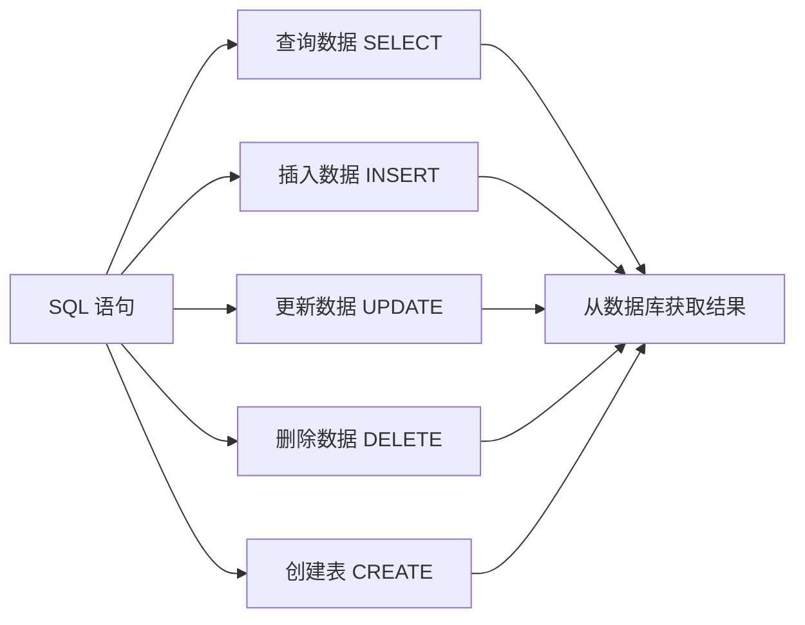
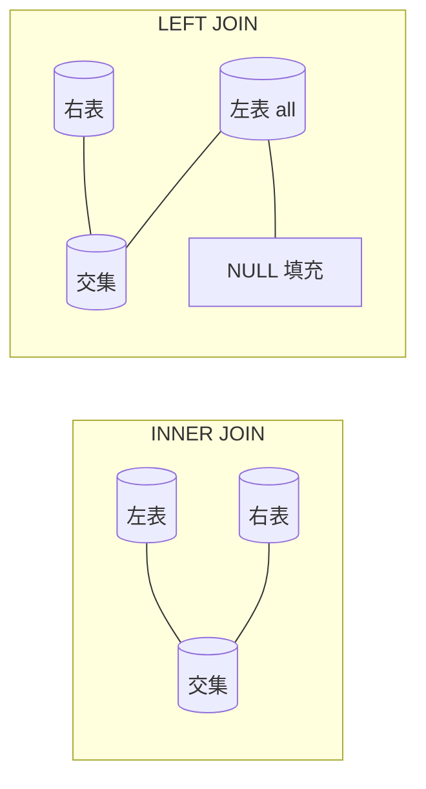
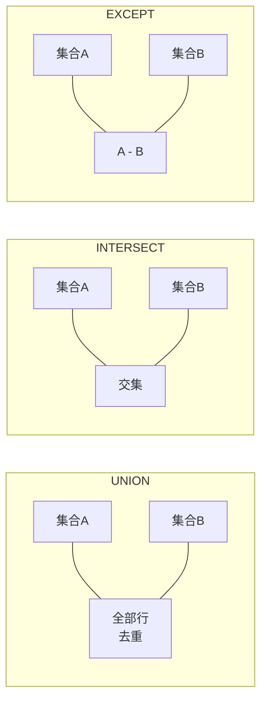
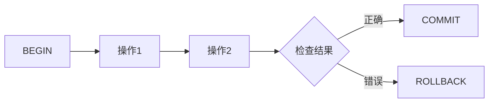
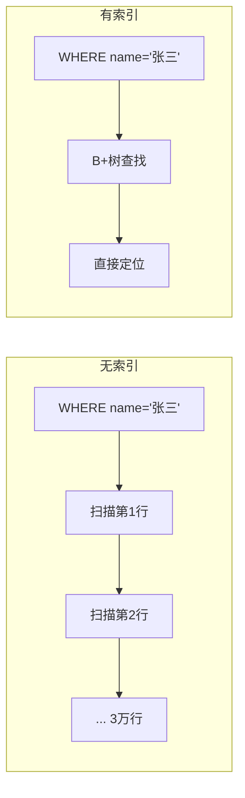

# SQL 语言入门：从零开始学数据库查询与数据管理

> SQL（Structured Query Language，结构化查询语言）是操作关系型数据库的标准语言。无论是后端开发者、数据分析师，还是想自己做个带数据库的小项目，SQL 都是必须掌握的基础技能。
>
> 本文以 **SQLite** 为例（所有 SQL 语句在主流数据库上基本通用），从最核心的操作讲起，配合大量可直接运行的示例，覆盖 SQLite 的绝大部分实用功能。

---

## 目录

1. [什么是 SQL？](#1-什么是-sql)
2. [准备工作：SQLite 环境](#2-准备工作sqlite-环境)
3. [数据库与表的基本操作](#3-数据库与表的基本操作)
4. [SQLite 数据类型](#4-sqlite-数据类型)
5. [核心操作一：查询（SELECT）](#5-核心操作一查询select)
6. [核心操作二：插入（INSERT）与 UPSERT](#6-核心操作二插入insert-与-upsert)
7. [核心操作三：更新（UPDATE）](#7-核心操作三更新update)
8. [核心操作四：删除（DELETE）](#8-核心操作四删除delete)
9. [进阶查询：聚合、分组、排序与条件表达式](#9-进阶查询聚合分组排序与条件表达式)
10. [子查询](#10-子查询)
11. [CTE 与递归 CTE（WITH 子句）](#11-cte-与递归-ctewith-子句)
12. [多表查询：JOIN 与集合运算](#12-多表查询join-与集合运算)
13. [窗口函数](#13-窗口函数)
14. [约束与表设计进阶](#14-约束与表设计进阶)
15. [事务控制](#15-事务控制)
16. [索引与性能优化](#16-索引与性能优化)
17. [内置函数大全](#17-内置函数大全)
18. [视图与触发器](#18-视图与触发器)
19. [JSON 支持](#19-json-支持)
20. [全文搜索 FTS5](#20-全文搜索-fts5)
21. [PRAGMA 与数据库管理](#21-pragma-与数据库管理)
22. [实战：学生成绩管理系统](#22-实战学生成绩管理系统)
23. [完整命令速查表](#23-完整命令速查表)

---

## 一、什么是 SQL？

### SQL 能做什么？



SQL 是一种**声明式**语言——你只需要告诉数据库"想要什么"，而不需要告诉它"怎么去找"。

### SQL 语言的分类

| 分类 | 全称 | 用途 | 代表命令 |
|------|------|------|----------|
| **DDL** | 数据定义语言 | 定义数据库结构 | `CREATE`、`ALTER`、`DROP` |
| **DML** | 数据操作语言 | 操作数据 | `SELECT`、`INSERT`、`UPDATE`、`DELETE` |
| **DCL** | 数据控制语言 | 权限控制 | `GRANT`、`REVOKE`（SQLite 不支持） |
| **TCL** | 事务控制语言 | 事务管理 | `BEGIN`、`COMMIT`、`ROLLBACK` |

> 入门阶段，**DDL + DML** 能应对 90% 的日常需求。事务控制和索引优化在生产环境中同样至关重要。

---

## 二、准备工作：SQLite 环境

### 安装与启动

SQLite 不需要安装服务器，是一个自包含的嵌入式数据库：

```bash
# Windows — 下载 sqlite3.exe 放入 PATH
# macOS
brew install sqlite3

# Linux
sudo apt install sqlite3     # Debian/Ubuntu
sudo dnf install sqlite      # Fedora

# 创建并进入数据库
sqlite3 school.db
```

进入后你会看到：

```
sqlite>
```

在这里输入 SQL 语句并以 `;` 结束。下面是一些有用的元命令（以 `.` 开头，不需要分号）：

| 元命令 | 作用 |
|--------|------|
| `.help` | 查看所有元命令 |
| `.tables` | 列出所有表 |
| `.schema 表名` | 查看表的 CREATE 语句 |
| `.headers on` | 显示列名 |
| `.mode column` | 按列对齐输出 |
| `.quit` | 退出 |

```bash
# 查看版本
sqlite3 --version

# 直接在命令行执行 SQL（适合脚本）
sqlite3 school.db "SELECT * FROM students;"

# 从文件执行 SQL
sqlite3 school.db < script.sql

# 导出数据库为 SQL 文本
sqlite3 school.db .dump > backup.sql

# 从 SQL 文本恢复数据库
sqlite3 new.db < backup.sql
```

### 其他数据库环境

| 数据库 | 安装方式 |
|--------|----------|
| MySQL | `docker run --name mysql -e MYSQL_ROOT_PASSWORD=root -p 3306:3306 -d mysql` |
| PostgreSQL | `docker run --name pg -e POSTGRES_PASSWORD=root -p 5432:5432 -d postgres` |

> 本文的 SQL 语句以 SQLite 为主，但绝大多数在其他数据库上也通用，个别差异会标注。

---

## 三、数据库与表的基本操作

### 1. 创建数据库

SQLite 中"创建数据库"就是创建一个文件：

```bash
sqlite3 school.db
```

进入后，数据库就自动创建好了。其他数据库：

```sql
CREATE DATABASE school;       -- MySQL / PG
USE school;                   -- MySQL
```

### 2. 创建表

```sql
CREATE TABLE students (
    id          INTEGER PRIMARY KEY,    -- 学号，主键
    name        TEXT    NOT NULL,       -- 姓名
    gender      TEXT,
    age         INTEGER,
    major       TEXT,
    enrolled_at DATE
);
```

### 3. 查看表结构

```sql
.tables                              -- SQLite 元命令
SHOW TABLES;                         -- MySQL
\dt                                  -- PostgreSQL

PRAGMA table_info(students);         -- SQLite
DESC students;                       -- MySQL
\d students                          -- PostgreSQL

-- SQLite 还可以直接看建表语句
.schema students
```

### 4. 修改表结构（ALTER TABLE）

```sql
-- 添加字段
ALTER TABLE students ADD COLUMN phone TEXT;

-- 删除字段（SQLite 3.35.0+ 支持）
ALTER TABLE students DROP COLUMN phone;

-- 重命名字段
ALTER TABLE students RENAME COLUMN phone TO mobile;

-- 重命名表
ALTER TABLE students RENAME TO old_students;
```

> SQLite 的 `ALTER TABLE` 功能有限：不支持修改字段类型、添加约束等。如需复杂变更，通常采用"新建表 → 复制数据 → 删旧表 → 重命名"的方式。

### 5. 删除表与索引

```sql
DROP TABLE students;        -- 不可逆
DROP INDEX idx_name;        -- 删除索引
```

### 6. 临时表

临时表只在当前连接可见，连接关闭后自动删除：

```sql
-- 创建临时表
CREATE TEMP TABLE tmp_data (id INTEGER, value TEXT);

-- 或在表名前加前缀
CREATE TEMPORARY TABLE tmp_data (id INTEGER, value TEXT);
```

临时表在复杂查询中经常用来存储中间结果，比子查询更灵活。

### 7. ROWID 与 WITHOUT ROWID

每个 SQLite 表默认都有一个隐式的 `rowid` 列（或 `_rowid_`、`oid`）：

```sql
-- rowid 自动存在，即使你没定义
SELECT rowid, * FROM students;

-- 如果定义了 INTEGER PRIMARY KEY，它就成了 rowid 的别名
CREATE TABLE t1 (id INTEGER PRIMARY KEY, name TEXT);
-- 此时 id 就是 rowid，插入时可以用 NULL 让 SQLite 自动分配
INSERT INTO t1 VALUES (NULL, '张三');
```

**WITHOUT ROWID 表**（用于性能优化）：

```sql
-- 不使用隐式 rowid，适合用非整数做主键的场景
CREATE TABLE t2 (a TEXT, b TEXT, PRIMARY KEY (a, b)) WITHOUT ROWID;
```

> 日常开发中几乎用不到 `WITHOUT ROWID`，了解即可——它主要用在数据量极大的场景下节省空间。

---

## 四、SQLite 数据类型

SQLite 使用**动态类型系统**——值有自己的类型，而不是列强制规定类型。

### 1. 五种存储类

SQLite 内部只使用 5 种存储类（Storage Class）：

| 存储类 | 说明 | 示例 |
|--------|------|------|
| `NULL` | 空值 | `NULL` |
| `INTEGER` | 有符号整数（1~8 字节） | `42` |
| `REAL` | 浮点数（8 字节 IEEE） | `3.14` |
| `TEXT` | 字符串（UTF-8 / UTF-16） | `'hello'` |
| `BLOB` | 二进制大对象，逐字节原样存储 | `x'48656C6C6F'` |

**与其他数据库最大的区别**：在 MySQL 中，`INTEGER` 列只能存整数；在 SQLite 中，你可以往任何列放任何类型（`STRICT` 表除外）。

```sql
CREATE TABLE t (a INTEGER);
INSERT INTO t VALUES (42);         -- OK
INSERT INTO t VALUES ('hello');    -- SQLite 也能存进去！类型亲和性会尝试转换
```

### 2. 类型亲和性（Type Affinity）

虽然列不强制类型，但 SQLite 会给每列一个"偏好"——即类型亲和性：

| 亲和性 | 匹配规则 |
|--------|----------|
| `TEXT` | 优先存为 TEXT |
| `NUMERIC` | 优先转数字（DATE / BOOLEAN 等） |
| `INTEGER` | 优先转 INTEGER |
| `REAL` | 优先转 REAL |
| `BLOB` | 不做任何转换 |

例如 `CREATE TABLE t (a INT, b TEXT)` 中，`a` 是 `INTEGER` 亲和性，`b` 是 `TEXT` 亲和性。插入 `'123'` 到 `a` 列时，SQLite 会尝试转成整数 123。

### 3. 布尔值

SQLite 没有独立的布尔类型，用整数 0 和 1 表示：

```sql
CREATE TABLE tasks (
    id      INTEGER PRIMARY KEY,
    title   TEXT,
    done    INTEGER DEFAULT 0   -- 0 = 未完成, 1 = 完成
);

SELECT * FROM tasks WHERE done;          -- done = 1 的行
SELECT * FROM tasks WHERE NOT done;      -- done = 0 的行
```

自 3.23.0 起，SQLite 识别的 `TRUE` / `FALSE` 关键字就是 1 和 0。

### 4. 日期和时间

SQLite **没有**独立的日期/时间类型，而是用三种方式存储：

| 存储方式 | 示例 | 适用场景 |
|----------|------|----------|
| **TEXT** | `'2025-03-15 14:30:00'` | 人类可读，最常用 |
| **INTEGER** | `1742029800`（Unix 时间戳） | 排序高效，时区无关 |
| **REAL** | `2460743.104167`（Julian Day） | 天文/科学计算 |

```sql
-- 三种存法等价
CREATE TABLE events (
    id       INTEGER PRIMARY KEY,
    ts_text  TEXT,       -- '2025-03-15 14:30:00'
    ts_int   INTEGER,    -- 1742029800
    ts_real  REAL        -- 2460743.104167
);

-- 当前时间
SELECT datetime('now');          -- TEXT 格式
SELECT strftime('%s','now');     -- Unix 时间戳
SELECT julianday('now');         -- Julian Day
```

> 日常推荐用 **TEXT 格式**（ISO 8601：`'YYYY-MM-DD HH:MM:SS'`），兼具可读性和可排序性。

### 5. STRICT 表（严格类型表）

从 SQLite 3.37.0 开始，可以创建严格类型表——违反类型的插入会报错：

```sql
CREATE TABLE t (a INT, b TEXT) STRICT;

INSERT INTO t VALUES (42, 'hello');    -- OK
INSERT INTO t VALUES ('abc', 'hello'); -- 报错：类型不匹配
-- Error: cannot store TEXT value in INT column of strict table
```

> 如果你是从 MySQL/PostgreSQL 转过来的，推荐使用 `STRICT` 表，行为更接近传统数据库。

---

## 五、核心操作一：查询（SELECT）

### 1. 基础查询

```sql
-- 查询所有字段
SELECT * FROM students;

-- 查询指定字段
SELECT name, major FROM students;

-- 字段可以计算
SELECT name, age, age + 1 AS next_year_age FROM students;

-- 字段别名
SELECT name AS 姓名, major AS 专业 FROM students;
```

### 2. WHERE 条件过滤

```sql
-- 精准匹配
SELECT * FROM students WHERE major = '计算机科学';

-- 范围比较
SELECT * FROM students WHERE age >= 18;
SELECT * FROM students WHERE age BETWEEN 18 AND 22;

-- 多条件（AND / OR）
SELECT * FROM students
WHERE major = '计算机科学' AND age > 20;

-- IN 列表
SELECT * FROM students WHERE major IN ('计算机科学', '软件工程');

-- 模糊匹配（LIKE）
-- % 匹配任意多个字符，_ 匹配单个字符
SELECT * FROM students WHERE name LIKE '张%';      -- 姓张
SELECT * FROM students WHERE name LIKE '王_';      -- 姓王且名字两个字

-- 大小写不敏感匹配（SQLite 默认 LIKE 不区分大小写）
SELECT * FROM students WHERE name LIKE '%zhang%';

-- NULL 判断
SELECT * FROM students WHERE gender IS NULL;       -- 正确
SELECT * FROM students WHERE gender = NULL;        -- 永远不成立
```

### 3. 限制与分页

```sql
-- 取前 10 条
SELECT * FROM students LIMIT 10;

-- 分页：跳过前 5 条，取 10 条
SELECT * FROM students LIMIT 10 OFFSET 5;

-- 简写：LIMIT 10 OFFSET 5 等价于 LIMIT 5, 10（MySQL 语法，SQLite 也支持）
```

### 4. 去重

```sql
SELECT DISTINCT major FROM students;

-- 多列去重（组合唯一）
SELECT DISTINCT major, gender FROM students;
```

### 5. 排序

```sql
-- 升序（默认）
SELECT * FROM students ORDER BY age;

-- 降序
SELECT * FROM students ORDER BY age DESC;

-- 多级排序
SELECT * FROM students ORDER BY major, age DESC;

-- 按 NULL 位置排序（SQLite 默认 NULL 在低值）
SELECT * FROM students ORDER BY gender NULLS LAST;   -- 3.30.0+
```

---

## 六、核心操作二：插入（INSERT）与 UPSERT

### 1. 基本插入

```sql
-- 插入完整行（按列顺序）
INSERT INTO students VALUES (1, '张三', '男', 20, '计算机科学', '2023-09-01');

-- 指定列插入（推荐）
INSERT INTO students (id, name, gender, age, major, enrolled_at)
VALUES (2, '李四', '女', 21, '软件工程', '2023-09-01');

-- 批量插入
INSERT INTO students (id, name, gender, age, major, enrolled_at) VALUES
    (3, '王五', '男', 22, '计算机科学', '2022-09-01'),
    (4, '赵六', '女', 20, '数据科学',  '2023-09-01'),
    (5, '孙七', '男', 23, '软件工程',  '2021-09-01');
```

### 2. 插入冲突处理（ON CONFLICT）

当插入遇到主键或唯一约束冲突时，可以指定处理策略：

```sql
-- 方式一：冲突时忽略（不报错，也不插入）
INSERT OR IGNORE INTO students (id, name) VALUES (1, '张三重复');

-- 方式二：冲突时替换（先删后插）
INSERT OR REPLACE INTO students (id, name, major) VALUES (1, '张三', '人工智能');
-- 等价于 DELETE + INSERT

-- 方式三：冲突时中止（默认行为）
INSERT OR ABORT INTO students (id, name) VALUES (1, '张三');

-- 其他选项：ROLLBACK / FAIL
```

### 3. UPSERT（Insert ... ON CONFLICT DO ...）

自 SQLite 3.24.0 起，更灵活的 UPSERT 语法：

```sql
-- 冲突时更新
INSERT INTO students (id, name, major)
VALUES (1, '张三', '人工智能')
ON CONFLICT(id) DO UPDATE SET
    name = excluded.name,
    major = excluded.major;

-- excluded 代表你试图插入的新值
-- 等价于：UPDATE students SET name='张三', major='人工智能' WHERE id=1;

-- 冲突时什么也不做
INSERT INTO students (id, name)
VALUES (1, '张三')
ON CONFLICT(id) DO NOTHING;

-- 带 WHERE 条件的有条件更新
INSERT INTO students (id, name, major)
VALUES (1, '张三', '人工智能')
ON CONFLICT(id) DO UPDATE SET
    major = excluded.major
WHERE students.major IS NULL;   -- 只在原值为 NULL 时才更新
```

### 4. INSERT ... RETURNING

自 SQLite 3.35.0 起，插入后直接返回数据：

```sql
INSERT INTO students (name, major)
VALUES ('周八', '网络工程')
RETURNING *;

INSERT INTO students (name, major)
VALUES ('吴九', '网络安全')
RETURNING id, name;
```

> `RETURNING` 也适用于 `UPDATE` 和 `DELETE`，在后面会提到。

### 5. 从查询结果插入

```sql
-- 将查询结果直接插入到另一个表
INSERT INTO students_backup (id, name, major)
SELECT id, name, major FROM students WHERE major = '计算机科学';
```

---

## 七、核心操作三：更新（UPDATE）

### 1. 基础更新

```sql
-- 注：不加 WHERE 会更新所有行！
UPDATE students SET age = 21;

-- 更新特定行
UPDATE students SET age = 21 WHERE name = '张三';

-- 更新多个字段
UPDATE students
SET major = '人工智能', age = 22
WHERE name = '王五';
```

> **永远先检查 WHERE 条件**：
> ```sql
> SELECT * FROM students WHERE name = '张三';    -- 先确认
> UPDATE students SET age = 21 WHERE name = '张三';  -- 再更新
> ```

### 2. UPDATE 带 ORDER BY 和 LIMIT

SQLite 需要编译选项 `SQLITE_ENABLE_UPDATE_DELETE_LIMIT` 才支持（大多数发行版未启用）：

```sql
-- 如果支持（SQLite 默认为关闭）
UPDATE students SET major = '待定'
WHERE major IS NULL
ORDER BY id
LIMIT 5;
```

### 3. UPDATE FROM（多表关联更新）

自 SQLite 3.33.0 起，可以根据另一张表来更新：

```sql
-- 将学生的专业更新为课程表中对应的学院名称
UPDATE students
SET major = c.department
FROM courses c
WHERE students.major = c.name;
```

### 4. UPDATE ... RETURNING

```sql
UPDATE students SET age = age + 1
WHERE id = 1
RETURNING id, name, age;
-- 返回更新后的数据
```

---

## 八、核心操作四：删除（DELETE）

### 1. 基础删除

```sql
-- 注：不加 WHERE 会清空整个表！
DELETE FROM students;

-- 删除特定行
DELETE FROM students WHERE name = '孙七';

-- 删除所有行（更快的方式：重置自增主键，不可回滚）
TRUNCATE TABLE students;    -- SQLite 不支持 TRUNCATE
-- SQLite 用这个替代
DELETE FROM students;       -- 或 DROP TABLE 重建
```

> 删除前先用 `SELECT` 确认：
> ```sql
> SELECT * FROM students WHERE name = '孙七';    -- 先确认
> DELETE FROM students WHERE name = '孙七';      -- 再删除
> ```

### 2. DELETE ... RETURNING

```sql
DELETE FROM students
WHERE id = 5
RETURNING id, name;   -- 返回被删除的数据，用于日志或确认
```

### 3. 带子查询的删除

```sql
-- 删除没有成绩的学生
DELETE FROM students
WHERE id NOT IN (SELECT DISTINCT student_id FROM scores);
```

---

## 九、进阶查询：聚合、分组、排序与条件表达式

### 1. 聚合函数

```sql
-- 统计行数
SELECT COUNT(*) FROM students;

-- 年龄统计
SELECT
    AVG(age) AS 平均年龄,
    MAX(age) AS 最大年龄,
    MIN(age) AS 最小年龄,
    SUM(age) AS 总年龄
FROM students;

-- 统计非空值的数量
SELECT COUNT(name) FROM students;    -- 统计 name 非空的行数

-- 去重统计
SELECT COUNT(DISTINCT major) FROM students;
```

### 2. GROUP BY 分组

```sql
-- 按专业统计人数
SELECT major, COUNT(*) AS 人数
FROM students
GROUP BY major;

-- 按专业统计平均年龄
SELECT major, AVG(age) AS 平均年龄
FROM students
GROUP BY major;

-- 多列分组
SELECT major, gender, COUNT(*) AS 人数
FROM students
GROUP BY major, gender;
```

### 3. HAVING 过滤分组

`WHERE` 过滤的是**行**，`HAVING` 过滤的是**分组结果**：

```sql
-- 找出学生人数 >= 2 的专业
SELECT major, COUNT(*) AS 人数
FROM students
GROUP BY major
HAVING COUNT(*) >= 2;

-- WHERE 和 HAVING 一起用
-- 先 WHERE 过滤行，再 GROUP BY，再 HAVING 过滤组
SELECT major, AVG(age) AS 平均年龄
FROM students
WHERE age >= 18
GROUP BY major
HAVING AVG(age) > 20;
```

### 4. CASE WHEN 条件表达式

相当于 SQL 里的 if-else，可以在 SELECT / WHERE / ORDER BY 等任何位置使用：

```sql
-- 简单 CASE（等值匹配）
SELECT
    name,
    CASE major
        WHEN '计算机科学' THEN 'CS'
        WHEN '软件工程'   THEN 'SE'
        ELSE '其他'
    END AS major_abbr
FROM students;

-- 搜索 CASE（条件判断，更灵活）
SELECT
    name,
    age,
    CASE
        WHEN age < 20 THEN '低年级'
        WHEN age BETWEEN 20 AND 22 THEN '中年级'
        WHEN age > 22 THEN '高年级'
        ELSE '未知'
    END AS grade_level
FROM students;

-- CASE WHEN 在聚合中做条件统计
SELECT
    major,
    COUNT(*) AS total,
    SUM(CASE WHEN gender = '男' THEN 1 ELSE 0 END) AS 男生数,
    SUM(CASE WHEN gender = '女' THEN 1 ELSE 0 END) AS 女生数
FROM students
GROUP BY major;

-- CASE WHEN 在 ORDER BY 中自定义排序
SELECT * FROM students
ORDER BY
    CASE major
        WHEN '计算机科学' THEN 1
        WHEN '软件工程'   THEN 2
        ELSE 3
    END;
```

### 5. GROUP_CONCAT — 将分组内的值拼成字符串

这是一个非常实用的 SQLite 特有聚合函数：

```sql
-- 把每个专业的学生名字拼成一行
SELECT major, GROUP_CONCAT(name) AS students_list
FROM students
GROUP BY major;

-- 结果：
-- 计算机科学 | 张三,王五
-- 软件工程   | 李四,孙七

-- 指定分隔符
SELECT major, GROUP_CONCAT(name, ' | ') AS students_list
FROM students
GROUP BY major;

-- 去重 + 排序后拼接
SELECT major, GROUP_CONCAT(DISTINCT name ORDER BY name) AS students_list
FROM students
GROUP BY major;
```

---

## 十、子查询

子查询（Subquery）就是嵌套在另一个 SQL 语句中的 `SELECT` 查询。

### 1. WHERE 中的子查询

```sql
-- 标量子查询：返回单个值
SELECT * FROM students
WHERE age > (SELECT AVG(age) FROM students);
-- 先计算平均年龄，再查找大于平均年龄的学生

-- IN 子查询
SELECT * FROM students
WHERE id IN (SELECT student_id FROM scores WHERE score >= 90);
-- 查找成绩 >= 90 的学生

-- NOT IN 子查询
SELECT * FROM students
WHERE id NOT IN (SELECT DISTINCT student_id FROM scores);
-- 查找没有成绩的学生（没选课）

-- EXISTS 子查询（比 IN 更高效，找到一条就停止）
SELECT * FROM students s
WHERE EXISTS (
    SELECT 1 FROM scores sc
    WHERE sc.student_id = s.id AND sc.score >= 90
);
-- 查找有任意一门课成绩 >= 90 的学生
```

### 2. FROM 中的子查询（派生表）

```sql
-- 子查询作为一个"临时表"
SELECT avg_score.name, avg_score.平均分
FROM (
    SELECT s.name, AVG(sc.score) AS 平均分
    FROM students s
    JOIN scores sc ON s.id = sc.student_id
    GROUP BY s.id, s.name
) avg_score
WHERE avg_score.平均分 >= 80;
```

### 3. SELECT 中的标量子查询

```sql
SELECT
    name,
    major,
    (SELECT AVG(score) FROM scores WHERE student_id = students.id) AS 平均成绩
FROM students;
```

### 4. EXISTS 与 NOT EXISTS

`EXISTS` 只关心子查询是否有返回行，不关心具体值：

```sql
-- 选了课的学生
SELECT * FROM students s
WHERE EXISTS (SELECT 1 FROM scores sc WHERE sc.student_id = s.id);

-- 没选课的学生（注意：NOT IN 遇到 NULL 会有问题，NOT EXISTS 不会）
SELECT * FROM students s
WHERE NOT EXISTS (SELECT 1 FROM scores sc WHERE sc.student_id = s.id);
```

> **`NOT IN` 的陷阱**：如果子查询结果中包含 `NULL`，`NOT IN` 会返回空结果！
> ```sql
> -- 如果 scores 表中 student_id 列存在 NULL
> SELECT * FROM students WHERE id NOT IN (SELECT student_id FROM scores);  -- 永远空
> SELECT * FROM students WHERE id NOT IN (SELECT student_id FROM scores WHERE student_id IS NOT NULL);  -- OK
> -- 推荐用 NOT EXISTS 替代
> ```

---

## 十一、CTE 与递归 CTE（WITH 子句）

CTE（Common Table Expression，公用表表达式）让你给一个查询取个名字，然后在后续查询中复用——比子查询更清晰，且可以**递归**。

### 1. 基本 CTE

```sql
-- 先定义一个"虚拟表"，再查询它
WITH good_students AS (
    SELECT student_id, AVG(score) AS avg_score
    FROM scores
    GROUP BY student_id
    HAVING AVG(score) >= 85
)
SELECT s.name, g.avg_score
FROM students s
JOIN good_students g ON s.id = g.student_id;
```

### 2. 多个 CTE

```sql
WITH
    cs_students AS (
        SELECT * FROM students WHERE major = '计算机科学'
    ),
    cs_scores AS (
        SELECT sc.* FROM scores sc
        JOIN cs_students cs ON sc.student_id = cs.id
    )
SELECT cs.name, sc.course, sc.score
FROM cs_students cs
JOIN cs_scores sc ON cs.id = sc.student_id;
```

### 3. 递归 CTE

递归 CTE 是 SQLite 最强大的特性之一——它可以生成序列、遍历树形结构等。

基本结构：

```sql
WITH RECURSIVE 名称 AS (
    -- 初始查询（种子行）
    SELECT ...
    UNION ALL
    -- 递归部分：引用自身
    SELECT ... FROM 名称 WHERE ...
)
SELECT * FROM 名称;
```

#### 生成数字序列

```sql
-- 生成 1 到 10 的数字序列
WITH RECURSIVE numbers(n) AS (
    SELECT 1                        -- 种子：n=1
    UNION ALL
    SELECT n + 1 FROM numbers       -- 递归：每次加 1
    WHERE n < 10                    -- 终止条件
)
SELECT * FROM numbers;

-- 结果：1, 2, 3, 4, 5, 6, 7, 8, 9, 10
```

#### 生成日期序列

```sql
-- 生成 2025-01-01 到 2025-01-07 的日期序列
WITH RECURSIVE dates(d) AS (
    SELECT '2025-01-01'
    UNION ALL
    SELECT date(d, '+1 day')
    FROM dates
    WHERE d < '2025-01-07'
)
SELECT * FROM dates;
```

#### 遍历树形结构——组织架构

```sql
-- 员工表：每个员工有个上级
CREATE TABLE employees (
    id        INTEGER PRIMARY KEY,
    name      TEXT,
    manager_id INTEGER REFERENCES employees(id)
);

INSERT INTO employees VALUES
    (1, 'CEO', NULL),
    (2, '技术总监', 1),
    (3, '产品总监', 1),
    (4, '前端组长', 2),
    (5, '后端组长', 2),
    (6, '前端开发A', 4),
    (7, '前端开发B', 4),
    (8, '后端开发A', 5);

-- 从"技术总监"出发，递归查找所有下属
WITH RECURSIVE subordinates AS (
    -- 种子：找到技术总监
    SELECT id, name, manager_id, 0 AS level
    FROM employees
    WHERE name = '技术总监'
    UNION ALL
    -- 递归：找到每个下属的下属
    SELECT e.id, e.name, e.manager_id, s.level + 1
    FROM employees e
    JOIN subordinates s ON e.manager_id = s.id
)
SELECT * FROM subordinates ORDER BY level, id;

-- 结果：
-- id | name       | manager_id | level
-- 2  | 技术总监   | 1          | 0
-- 4  | 前端组长   | 2          | 1
-- 5  | 后端组长   | 2          | 1
-- 6  | 前端开发A  | 4          | 2
-- 7  | 前端开发B  | 4          | 2
-- 8  | 后端开发A  | 5          | 2
```

> 递归 CTE 广泛用于：菜单树、分类树、组织结构、地铁线路、图遍历等。

---

## 十二、多表查询：JOIN 与集合运算

### 1. 建表演示

```sql
CREATE TABLE scores (
    id          INTEGER PRIMARY KEY,
    student_id  INTEGER NOT NULL,
    course      TEXT NOT NULL,
    score       INTEGER NOT NULL,
    FOREIGN KEY (student_id) REFERENCES students(id)
);

INSERT INTO scores (student_id, course, score) VALUES
    (1, '数据库原理', 85),
    (1, '数据结构',   92),
    (2, '数据库原理', 78),
    (3, '操作系统',   88);
```

### 2. INNER JOIN（内连接）

只返回两个表中匹配的行：

```sql
SELECT s.name, sc.course, sc.score
FROM students s
INNER JOIN scores sc ON s.id = sc.student_id;
```

| name | course | score |
|------|--------|-------|
| 张三 | 数据库原理 | 85 |
| 张三 | 数据结构 | 92 |
| 李四 | 数据库原理 | 78 |
| 王五 | 操作系统 | 88 |

### 3. LEFT JOIN（左连接）

返回左表所有行，右表没有匹配的填 NULL：

```sql
SELECT s.name, sc.course, sc.score
FROM students s
LEFT JOIN scores sc ON s.id = sc.student_id;
```

### 4. JOIN 对比



| JOIN 类型 | 结果 |
|-----------|------|
| **INNER JOIN** | 两张表都匹配的行 |
| **LEFT JOIN** | 左表全部 + 右表匹配的行 |
| **RIGHT JOIN** | SQLite 不支持，用 LEFT JOIN 交换表顺序代替 |
| **FULL OUTER JOIN** | SQLite 不支持，用 LEFT JOIN UNION 实现 |
| **CROSS JOIN** | 笛卡尔积，通常需要 WHERE 过滤 |

### 5. 笛卡尔积——忘记 ON 条件的后果

```sql
-- 没有 ON 条件
SELECT s.name, sc.course, sc.score
FROM students s, scores sc;
-- 或：FROM students s CROSS JOIN scores sc;

-- 如果 students 5 行 × scores 4 行 = 20 行
-- 实际大表上可能产生百亿行中间结果
```

> **如何避免**：写 JOIN 永远带上 `ON` 条件。如果真的需要笛卡尔积，用 `CROSS JOIN` 显式表明意图。

### 6. 自连接（Self JOIN）

同一张表和自己连接，用于处理层级关系或行间比较：

```sql
-- 场景：查找同专业的学生对
SELECT a.name || ' 和 ' || b.name AS 同学对, a.major
FROM students a
JOIN students b ON a.major = b.major AND a.id < b.id;
-- a.id < b.id 防止重复（张三-李四 和 李四-张三）
```

### 7. 自然连接（NATURAL JOIN）

自动根据同名字段连接（不推荐——隐式行为容易出意外）：

```sql
SELECT * FROM students NATURAL JOIN scores;
-- 等价于 ON students.id = scores.student_id（如果 id 是同名的）
```

### 8. UNION / INTERSECT / EXCEPT

合并多个查询的结果，而不是像 JOIN 那样横向拼接列：



```sql
-- UNION：合并两个查询结果（去重）
SELECT name FROM students WHERE major = '计算机科学'
UNION
SELECT name FROM students WHERE age > 22;
-- 结果：在计算机科学专业 或 年龄>22 的学生（去重）

-- UNION ALL：合并两个查询结果（不去重，更快）
SELECT name FROM students WHERE major = '计算机科学'
UNION ALL
SELECT name FROM students WHERE age > 22;

-- INTERSECT：两个查询的交集
SELECT name FROM students WHERE major = '计算机科学'
INTERSECT
SELECT name FROM students WHERE age > 22;
-- 结果：既在计算机科学专业 又 年龄>22 的学生

-- EXCEPT：第一个查询减去第二个查询
SELECT name FROM students WHERE major = '计算机科学'
EXCEPT
SELECT name FROM students WHERE age > 22;
-- 结果：计算机科学专业中年龄 <= 22 的学生
```

> **注意**：`UNION` / `INTERSECT` / `EXCEPT` 要求每个 SELECT 的列数相同，且对应列类型兼容。

---

## 十三、窗口函数

窗口函数（Window Function）是 SQL 中 **最强大也最优雅** 的特性之一。它可以在不改变行数的情况下，对每一行计算一个"窗口"范围内的值——排名、累计、移动平均等。

SQLite 自 3.25.0 起支持窗口函数。

### 1. 基础语法

```sql
窗口函数 OVER (
    PARTITION BY 分组列    -- 可选，在每个组内独立计算
    ORDER BY 排序列         -- 可选，定义窗口内的顺序
    ROWS/RANGE BETWEEN ... -- 可选，定义窗口大小
)
```

### 2. 排名窗口函数

```sql
-- ROW_NUMBER()：给每行一个唯一的序号
SELECT
    name,
    major,
    score,
    ROW_NUMBER() OVER (ORDER BY score DESC) AS 排名
FROM students s
JOIN scores sc ON s.id = sc.student_id;

-- 按专业分组排名
SELECT
    name,
    major,
    score,
    ROW_NUMBER() OVER (PARTITION BY major ORDER BY score DESC) AS 专业内排名
FROM students s
JOIN scores sc ON s.id = sc.student_id;

-- RANK()：并列排名（跳过后续名次）
-- 1, 2, 2, 4, 5

-- DENSE_RANK()：并列排名（不跳过名次）
-- 1, 2, 2, 3, 4
SELECT
    name,
    score,
    RANK()        OVER (ORDER BY score DESC) AS rank,
    DENSE_RANK() OVER (ORDER BY score DESC) AS dense_rank
FROM students s
JOIN scores sc ON s.id = sc.student_id;
```

### 3. 窗口聚合函数

在窗口内做聚合计算，保留每一行：

```sql
-- 累计总和
SELECT
    name,
    score,
    SUM(score) OVER (ORDER BY score DESC) AS 累计分数
FROM students s
JOIN scores sc ON s.id = sc.student_id;

-- 移动平均（前 2 行 + 当前行 + 后 2 行）
SELECT
    name,
    score,
    AVG(score) OVER (
        ORDER BY score
        ROWS BETWEEN 2 PRECEDING AND 2 FOLLOWING
    ) AS 移动平均
FROM students s
JOIN scores sc ON s.id = sc.student_id;

-- 分组内的累计
SELECT
    name,
    major,
    score,
    SUM(score) OVER (PARTITION BY major ORDER BY score DESC) AS 专业内累计
FROM students s
JOIN scores sc ON s.id = sc.student_id;
```

### 4. 偏移窗口函数

```sql
-- LAG()：取前一行的值
-- LEAD()：取后一行的值
SELECT
    name,
    score,
    LAG(score)  OVER (ORDER BY score) AS 前一名的分数,
    LEAD(score) OVER (ORDER BY score) AS 后一名的分数,
    score - LAG(score) OVER (ORDER BY score) AS 分差
FROM students s
JOIN scores sc ON s.id = sc.student_id;

-- FIRST_VALUE() / LAST_VALUE()：窗口内第一行/最后一行的值
SELECT
    name,
    major,
    score,
    FIRST_VALUE(score) OVER (PARTITION BY major ORDER BY score DESC) AS 专业最高分,
    score - FIRST_VALUE(score) OVER (PARTITION BY major ORDER BY score DESC) AS 与最高分差距
FROM students s
JOIN scores sc ON s.id = sc.student_id;
```

### 5. 窗口函数速查

| 函数 | 作用 |
|------|------|
| `ROW_NUMBER()` | 唯一行号（1, 2, 3, ...） |
| `RANK()` | 并列排名，有间隔（1, 1, 3） |
| `DENSE_RANK()` | 并列排名，无间隔（1, 1, 2） |
| `NTILE(n)` | 把结果分成 n 桶（分桶统计） |
| `LAG(val, offset, default)` | 取前第 offset 行的值 |
| `LEAD(val, offset, default)` | 取后第 offset 行的值 |
| `FIRST_VALUE(val)` | 窗口内第一个值 |
| `LAST_VALUE(val)` | 窗口内最后一个值 |
| `SUM/AVG/COUNT/MAX/MIN OVER` | 窗口内聚合 |

---

## 十四、约束与表设计进阶

### 1. 常用约束

| 约束 | 含义 | 示例 |
|------|------|------|
| `PRIMARY KEY` | 主键，唯一标识一行 | `id INTEGER PRIMARY KEY` |
| `FOREIGN KEY` | 外键，关联其他表 | `FOREIGN KEY (sid) REFERENCES students(id)` |
| `NOT NULL` | 不能为空 | `name TEXT NOT NULL` |
| `UNIQUE` | 值必须唯一 | `email TEXT UNIQUE` |
| `DEFAULT` | 默认值 | `status TEXT DEFAULT 'active'` |
| `CHECK` | 值满足条件 | `age INTEGER CHECK (age > 0 AND age < 150)` |

### 2. 主键

```sql
-- 自动递增（推荐）
CREATE TABLE t1 (
    id INTEGER PRIMARY KEY AUTOINCREMENT,
    name TEXT
);
-- AUTOINCREMENT 确保 id 不会重用已删除的值

-- 普通自增（id 可能被 DELETE 后重用）
CREATE TABLE t2 (
    id INTEGER PRIMARY KEY,
    name TEXT
);

-- 复合主键
CREATE TABLE t3 (
    student_id INTEGER,
    course_id  INTEGER,
    score      INTEGER,
    PRIMARY KEY (student_id, course_id)
);
```

### 3. 外键与级联操作

SQLite 支持外键，但**默认关闭**，需要手动开启：

```sql
-- 每次连接都要执行
PRAGMA foreign_keys = ON;
```

定义外键时可以指定在主表删除/更新时的行为：

```sql
CREATE TABLE scores (
    student_id INTEGER,
    course_id  INTEGER,
    score      INTEGER,
    PRIMARY KEY (student_id, course_id),
    FOREIGN KEY (student_id) REFERENCES students(id)
        ON DELETE CASCADE         -- 删除学生时，自动删除其成绩
        ON UPDATE SET NULL,       -- 学生 ID 更新时，成绩表的 student_id 设 NULL
    FOREIGN KEY (course_id) REFERENCES courses(id)
        ON DELETE RESTRICT        -- 有成绩引用时，不允许删除课程
        ON UPDATE NO ACTION       -- 不处理
);
```

| 级联选项 | 行为 |
|----------|------|
| `CASCADE` | 级联操作：删除父行时删除子行；更新父行时更新子行 |
| `SET NULL` | 父行变更时，子行的外键列设为 NULL |
| `SET DEFAULT` | 父行变更时，子行的外键列设为默认值 |
| `RESTRICT` | 有子行引用时，禁止删除/更新父行 |
| `NO ACTION` | 不自动处理（依赖应用层） |

### 4. CHECK 约束

```sql
CREATE TABLE products (
    id    INTEGER PRIMARY KEY,
    name  TEXT NOT NULL,
    price REAL CHECK (price > 0),
    qty   INTEGER CHECK (qty >= 0)
);

-- 插入违反 CHECK 的数据会报错
INSERT INTO products VALUES (1, '商品', -5);  -- Error: CHECK constraint failed
```

### 5. 生成列（GENERATED COLUMNS）

自 SQLite 3.31.0 起支持，根据其他列自动计算：

```sql
CREATE TABLE invoices (
    id       INTEGER PRIMARY KEY,
    quantity INTEGER,
    price    REAL,
    total    REAL GENERATED ALWAYS AS (quantity * price) STORED
    -- STORED：值存储到磁盘（占用空间）
    -- VIRTUAL：值不存储，查询时计算（节省空间，默认）
);

INSERT INTO invoices (quantity, price) VALUES (3, 29.9);
SELECT * FROM invoices;
-- id | quantity | price | total
-- 1  | 3        | 29.9  | 89.7
```

### 6. 表设计——一对多与多对多

```sql
-- 一对多：一个班级有多个学生
CREATE TABLE classes (
    id   INTEGER PRIMARY KEY,
    name TEXT NOT NULL
);
CREATE TABLE students (
    id       INTEGER PRIMARY KEY,
    name     TEXT NOT NULL,
    class_id INTEGER REFERENCES classes(id)
);

-- 多对多：一个学生可选多门课，一门课有多个学生
-- 需要中间表
CREATE TABLE courses (
    id   INTEGER PRIMARY KEY,
    name TEXT NOT NULL
);
CREATE TABLE enrollments (
    student_id INTEGER REFERENCES students(id),
    course_id  INTEGER REFERENCES courses(id),
    enrolled_at DATE DEFAULT CURRENT_DATE,
    PRIMARY KEY (student_id, course_id)
);
```

---

## 十五、事务控制

### 1. 什么是事务？

**事务（Transaction）** 是一组 SQL 操作，要么**全部成功**，要么**全部失败**。

```sql
-- 转账场景：两步必须同时成功或同时失败
UPDATE accounts SET balance = balance - 100 WHERE id = 1;
UPDATE accounts SET balance = balance + 100 WHERE id = 2;
```

### 2. ACID 四大特性

| 特性 | 含义 |
|------|------|
| **A**tomicity（原子性） | 要么全做，要么全不做 |
| **C**onsistency（一致性） | 事务前后数据满足所有约束 |
| **I**solation（隔离性） | 并发事务互不干扰 |
| **D**urability（持久性） | 提交后数据永久保存 |

### 3. 基本操作

```sql
-- 开启事务
BEGIN;
-- 或 BEGIN TRANSACTION;

-- 执行操作
UPDATE accounts SET balance = balance - 100 WHERE id = 1;
UPDATE accounts SET balance = balance + 100 WHERE id = 2;

-- 提交（持久化）
COMMIT;

-- 或回滚（撤销所有改动）
ROLLBACK;
```



### 4. SAVEPOINT

```sql
BEGIN;
INSERT INTO logs VALUES ('Step 1 done');
SAVEPOINT sp1;
INSERT INTO logs VALUES ('Step 2 done');
-- 发现 Step 2 有问题
ROLLBACK TO SAVEPOINT sp1;   -- 撤销 Step2，保留 Step1
INSERT INTO logs VALUES ('Step 2 retry');
COMMIT;

-- 释放保存点（可选）
RELEASE SAVEPOINT sp1;
```

### 5. SQLite 的隔离级别

SQLite 默认隔离级别是 **SERIALIZABLE**（可串行化），是 SQL 标准中最高的级别。

但其实 SQLite 的实现比其他数据库简单——它通过**锁**来控制并发：

| 模式 | 行为 |
|------|------|
| 默认（回滚日志） | 写操作会锁住整个数据库，其他连接只能读不能写 |
| WAL 模式 | 读不阻塞写，写不阻塞读（见 §21） |

### 6. 事务的最佳实践

| 原则 | 说明 |
|------|------|
| **事务要短** | 不要在事务中做网络请求或文件读写 |
| **先查再改** | 复杂操作前先用 SELECT 确认 |
| **错误时回滚** | 应用代码中捕获异常，确保 ROLLBACK |
| **显式提交** | 不要依赖自动提交 |

---

## 十六、索引与性能优化

### 1. 什么是索引？

索引就像书的目录——没有索引时逐行扫描，有索引直接定位。



### 2. 索引操作

```sql
-- 创建索引
CREATE INDEX idx_name ON students(name);

-- 唯一索引
CREATE UNIQUE INDEX idx_email ON students(email);

-- 复合索引
CREATE INDEX idx_major_age ON students(major, age);

-- 删除索引
DROP INDEX idx_name;
```

### 3. 何时用索引？

```sql
-- WHERE 频繁使用的字段
SELECT * FROM students WHERE name = '张三';

-- JOIN 的关联字段
SELECT * FROM students s
JOIN scores sc ON s.id = sc.student_id;

-- ORDER BY 的字段
SELECT * FROM students ORDER BY enrolled_at;
```

### 4. 何时不用索引？

- 小表（< 1000 行）：全表扫描更快
- 频繁写入的字段：索引拖慢 INSERT/UPDATE/DELETE
- 区分度低的字段：如 `gender`（只有男女），用索引还不如全表扫描快

### 5. 最左匹配原则

复合索引 `(major, age)` 只从最左边的列开始匹配：

```sql
-- 能用索引
WHERE major = '计算机科学'
WHERE major = 'CS' AND age > 20
WHERE age > 20 AND major = 'CS'  -- 优化器自动调整顺序

-- 部分能用（只用到了 major）
WHERE major = 'CS' AND gender = '男'    -- age 用不到

-- 无法使用
WHERE age > 20                       -- 跳过了 major
```

> **设计复合索引的原则**：
> 1. 等值查询（`=`）的放左边，范围查询（`>`、`BETWEEN`）的放右边
> 2. 区分度高的放左边

### 6. 部分索引（Partial Index）

只索引表中满足条件的行，节省空间：

```sql
-- 只索引活跃用户（订单表大部分历史订单不需要加速）
CREATE INDEX idx_active_orders ON orders(created_at)
WHERE status != 'archived';

-- 只索引未删除的数据
CREATE INDEX idx_active_students ON students(name)
WHERE is_deleted = 0;
```

### 7. 表达式索引（Expression Index）

索引基于表达式计算结果：

```sql
-- 经常按小写名查询
CREATE INDEX idx_lower_name ON students(LOWER(name));

SELECT * FROM students WHERE LOWER(name) = 'zhang san';  -- 用得上索引

-- 按月份查询订单
CREATE INDEX idx_order_month ON orders(strftime('%Y-%m', created_at));

SELECT * FROM orders
WHERE strftime('%Y-%m', created_at) = '2025-03';  -- 用得上索引
```

### 8. COLLATE 与排序规则

SQLite 有三种内置排序规则：

```sql
-- BINARY（默认）：按字节比较，区分大小写
-- NOCASE：不区分大小写
-- RTRIM：忽略末尾空格

-- 建表时指定
CREATE TABLE t (name TEXT COLLATE NOCASE);

-- 在索引中指定
CREATE INDEX idx_name_nocase ON students(name COLLATE NOCASE);

-- 查询时临时指定
SELECT * FROM students ORDER BY name COLLATE NOCASE;
```

### 9. ANALYZE 与查询计划

```sql
-- 收集统计信息，帮助优化器选择索引
ANALYZE;

-- 查看查询执行计划
EXPLAIN QUERY PLAN SELECT * FROM students WHERE name = '张三';

-- 输出解读
-- SCAN students（全表扫描，效率低）
-- SEARCH students USING INDEX idx_name（使用索引，效率高）

-- 确认索引是否有效
EXPLAIN QUERY PLAN
SELECT * FROM students
WHERE major = '计算机科学' AND age > 20;
```

### 10. 索引的代价

| 代价 | 说明 |
|------|------|
| **存储空间** | 索引需要额外磁盘空间 |
| **写入变慢** | 每次 INSERT/UPDATE/DELETE 都要更新索引 |
| **优化器误判** | 索引太多可能导致优化器选错 |

> **黄金法则**：只为高频查询的字段建索引，不在每个字段上都建。

---

## 十七、内置函数大全

SQLite 提供丰富的内置函数，覆盖字符串处理、数学运算、日期时间等场景。

### 1. 字符串函数

```sql
-- 长度
SELECT LENGTH('hello');              -- 5

-- 子串
SELECT SUBSTR('hello world', 7);     -- 'world'
SELECT SUBSTR('hello world', 1, 5);  -- 'hello'

-- 替换
SELECT REPLACE('hello world', 'world', 'SQLite');  -- 'hello SQLite'

-- 拼接
SELECT 'Hello' || ' ' || 'World';    -- 'Hello World'（|| 是 SQL 标准拼接符）
SELECT CONCAT('Hello', ' ', 'World'); -- 'Hello World'（3.44.0+）

-- 大小写
SELECT UPPER('hello');               -- 'HELLO'
SELECT LOWER('HELLO');               -- 'hello'

-- 去空格
SELECT TRIM('  hello  ');            -- 'hello'
SELECT LTRIM('  hello');              -- 'hello'
SELECT RTRIM('hello  ');              -- 'hello'

-- 查找位置
SELECT INSTR('hello world', 'world'); -- 7

-- 补全宽度
SELECT PRINTF('|%10s|', 'hi');        -- '|        hi|'  右对齐
SELECT PRINTF('|%-10s|', 'hi');       -- '|hi        |'  左对齐

-- HEX / UNICODE / UNISTR
SELECT HEX('ABC');                    -- '414243'
SELECT UNICODE('A');                  -- 65
SELECT UNISTR('\\0041\\0042\\0043');  -- 'ABC'
```

### 2. 数学函数

```sql
-- 绝对值
SELECT ABS(-5);                       -- 5

-- 四舍五入
SELECT ROUND(3.14159, 2);             -- 3.14
SELECT ROUND(3.14159);                -- 3.0

-- 取整
SELECT CEIL(3.14);                    -- 4.0
SELECT FLOOR(3.14);                   -- 3.0

-- 指数与对数
SELECT EXP(1);                        -- 2.71828...
SELECT LN(2.71828);                   -- ~1.0
SELECT LOG(100);                      -- 2.0（以10为底）
SELECT LOG2(8);                       -- 3.0
SELECT LOG10(100);                    -- 2.0

-- 平方根与幂
SELECT SQRT(9);                       -- 3.0
SELECT POW(2, 10);                    -- 1024.0

-- 三角函数
SELECT SIN(0), COS(0), TAN(0);        -- 0.0, 1.0, 0.0
SELECT PI();                          -- 3.14159...

-- 随机数
SELECT RANDOM();                      -- 随机整数（-9223372036854775808 ~ +9223372036854775807）
SELECT ABS(RANDOM()) % 100;           -- 0~99 的随机整数
```

### 3. 日期时间函数

SQLite 使用以下函数处理日期和时间，输入格式通常是 `'YYYY-MM-DD'` 或 `'YYYY-MM-DD HH:MM:SS'`：

```sql
-- 当前日期/时间
SELECT DATE('now');                   -- 2025-03-15
SELECT TIME('now');                   -- 14:30:00
SELECT DATETIME('now');               -- 2025-03-15 14:30:00
SELECT CURRENT_DATE;                  -- 2025-03-15
SELECT CURRENT_TIME;                  -- 14:30:00
SELECT CURRENT_TIMESTAMP;             -- 2025-03-15 14:30:00

-- Unix 时间戳
SELECT UNIXEPOCH('now');              -- 1742029800（秒）
SELECT DATETIME(1742029800, 'unixepoch');  -- 2025-03-15 14:30:00

-- Julian Day（儒略日）
SELECT JULIANDAY('now');              -- 2460743.104167
SELECT DATE(JULIANDAY('now'));        -- 2025-03-15

-- 时间运算
SELECT DATE('now', '+1 day');         -- 明天
SELECT DATE('now', '-1 month');       -- 上个月的今天
SELECT DATE('now', '+1 year');        -- 明年今天
SELECT DATETIME('now', '+7 days', '+3 hours');

-- 提取部分
SELECT STRFTIME('%Y',  'now');        -- 年份：2025
SELECT STRFTIME('%m',  'now');        -- 月份：03
SELECT STRFTIME('%d',  'now');        -- 日：15
SELECT STRFTIME('%w',  'now');        -- 星期几（0=周日）
SELECT STRFTIME('%Y-%m', 'now');      -- 2025-03

-- 两个日期之间的天数
SELECT JULIANDAY('2025-03-20') - JULIANDAY('2025-03-15');  -- 5

-- 月份的偏移（自动处理月末边界）
SELECT DATE('2025-01-31', '+1 month');   -- 2025-02-28（不是 02-31！）

-- 时间差（3.46.0+）
SELECT TIMEDIFF('2025-03-20', '2025-03-15');  -- '+05 00:00:00'
```

### 4. 其他实用函数

```sql
-- NULL 处理
SELECT IFNULL(NULL, '默认值');         -- '默认值'
SELECT COALESCE(NULL, NULL, 'a', 'b'); -- 'a'（返回第一个非 NULL 值）

-- 类型信息
SELECT TYPEOF(42);                     -- 'integer'
SELECT TYPEOF('hello');                -- 'text'
SELECT TYPEOF(3.14);                   -- 'real'
SELECT TYPEOF(NULL);                   -- 'null'
SELECT TYPEOF(x'01');                  -- 'blob'

-- 引用/转义
SELECT QUOTE('hello''s');              -- ''hello''s'

-- 版本信息
SELECT SQLITE_VERSION();               -- '3.46.0'
SELECT SQLITE_SOURCE_ID();             -- 源代码版本
```

### 5. 聚合函数进阶

```sql
-- 已有：COUNT, SUM, AVG, MAX, MIN

-- GROUP_CONCAT：拼接字符串
SELECT GROUP_CONCAT(name, ', ') FROM students;

-- TOTAL：类似 SUM，但始终返回 REAL
SELECT TOTAL(score) FROM scores;       -- 346.0

-- STRING_AGG：GROUP_CONCAT 的别名（3.44.0+）

-- 统计中位数（3.46.0+）
SELECT MEDIAN(score) FROM scores;      -- 中间值

-- 百分位数（3.46.0+）
SELECT PERCENTILE(score, 50) FROM scores;  -- 第50百分位 = MEDIAN
```

---

## 十八、视图与触发器

### 1. 视图（VIEW）

视图是一个**虚拟表**，本质是保存的 SELECT 语句。每次查询视图时，底层 SELECT 会重新执行。

```sql
-- 创建视图
CREATE VIEW student_scores AS
SELECT s.name, s.major, sc.course, sc.score
FROM students s
JOIN scores sc ON s.id = sc.student_id;

-- 使用视图（就像查普通表）
SELECT * FROM student_scores;
SELECT name, AVG(score) FROM student_scores GROUP BY name;

-- 临时视图（当前连接可见）
CREATE TEMP VIEW tmp_view AS SELECT * FROM students WHERE major = '计算机科学';

-- 删除视图
DROP VIEW IF EXISTS student_scores;
```

**视图的优点**：
- 简化复杂查询（封装 JOIN 和子查询）
- 提供安全层（只暴露需要的字段，隐藏敏感数据）
- 解耦：底层表结构调整时，可以通过修改视图来保持对外接口不变

> SQLite 的视图是**只读**的。要通过视图写入数据，需要创建 `INSTEAD OF` 触发器。

### 2. 触发器（TRIGGER）

触发器是在表的 INSERT / UPDATE / DELETE 发生时自动执行的一组 SQL 语句。

```sql
-- 基本语法
CREATE TRIGGER 触发器名
[BEFORE | AFTER | INSTEAD OF] [INSERT | UPDATE | DELETE] ON 表名
[FOR EACH ROW]
[WHEN 条件]
BEGIN
    要执行的 SQL 语句;
END;
```

#### 审计日志

```sql
-- 创建一个日志表
CREATE TABLE student_log (
    id        INTEGER PRIMARY KEY,
    action    TEXT,
    student_id INTEGER,
    old_name  TEXT,
    new_name  TEXT,
    changed_at DATETIME DEFAULT CURRENT_TIMESTAMP
);

-- 当学生被删除时记录日志（AFTER DELETE）
CREATE TRIGGER after_student_delete
AFTER DELETE ON students
FOR EACH ROW
BEGIN
    INSERT INTO student_log (action, student_id, old_name)
    VALUES ('DELETE', OLD.id, OLD.name);
END;

-- 当学生姓名被更新时记录日志
CREATE TRIGGER after_student_update
AFTER UPDATE OF name ON students
FOR EACH ROW
WHEN OLD.name != NEW.name
BEGIN
    INSERT INTO student_log (action, student_id, old_name, new_name)
    VALUES ('UPDATE', OLD.id, OLD.name, NEW.name);
END;
```

#### 自动更新时间

```sql
CREATE TABLE products (
    id         INTEGER PRIMARY KEY,
    name       TEXT,
    price      REAL,
    updated_at DATETIME
);

CREATE TRIGGER update_timestamp
BEFORE UPDATE ON products
FOR EACH ROW
BEGIN
    SET NEW.updated_at = datetime('now');
END;
-- 注意：SQLite 不支持 SET NEW.col，需要用 UPDATE，此处仅做假设
-- 实际写法：
-- UPDATE products SET updated_at = datetime('now')
-- WHERE id = NEW.id;
```

#### 使用触发器实现可写视图

```sql
CREATE VIEW good_students AS
SELECT * FROM students WHERE major = '计算机科学';

-- 通过视图插入时，自动设置专业
CREATE TRIGGER insert_good_students
INSTEAD OF INSERT ON good_students
FOR EACH ROW
BEGIN
    INSERT INTO students (id, name, major)
    VALUES (NEW.id, NEW.name, '计算机科学');
END;

-- 现在可以通过视图插入
INSERT INTO good_students (id, name) VALUES (10, '新同学');
```

#### 管理触发器

```sql
-- 列出所有触发器
SELECT * FROM sqlite_master WHERE type = 'trigger';

-- 删除触发器
DROP TRIGGER IF EXISTS after_student_delete;
```

---

## 十九、JSON 支持

SQLite 内置了强大的 JSON 处理能力（自 3.9.0 起，3.38.0 起默认内置）。

### 1. 创建与访问 JSON

```sql
-- 验证并格式化 JSON
SELECT JSON('{"name":"张三","age":20,"scores":[85,92,78]}');
-- 输出格式化的 JSON 字符串

-- 提取值
SELECT JSON_EXTRACT('{"name":"张三","age":20}', '$.name');
-- "张三"

-- 简写 -> 和 ->>
SELECT '{"name":"张三"}' -> '$';           -- '{"name":"张三"}'（JSON 对象）
SELECT '{"name":"张三"}' ->> '$';          -- {"name":"张三"}（TEXT）
SELECT '{"name":"张三"}' -> '$.name';       -- '"张三"'
SELECT '{"name":"张三"}' ->> '$.name';      -- '张三'

-- 嵌套提取
SELECT JSON_EXTRACT('{"scores":[85,92,78]}', '$.scores[1]');   -- 92
SELECT JSON_EXTRACT('{"scores":[85,92,78]}', '$.scores[#-1]'); -- 78（最后一个）
```

### 2. 修改 JSON

```sql
-- 设置/更新值
SELECT JSON_SET('{"name":"张三"}', '$.age', 20);
-- {"name":"张三","age":20}

-- 替换已有值（不存在不操作）
SELECT JSON_REPLACE('{"name":"张三"}', '$.name', '李四');   -- {"name":"李四"}
SELECT JSON_REPLACE('{"name":"张三"}', '$.age', 20);       -- {"name":"张三"}（age 不存在，不操作）

-- 插入值（不存在才插入）
SELECT JSON_INSERT('{"name":"张三"}', '$.age', 20);         -- {"name":"张三","age":20}
SELECT JSON_INSERT('{"name":"张三"}', '$.name', '李四');     -- {"name":"张三"}（已存在，不覆盖）

-- 删除键
SELECT JSON_REMOVE('{"name":"张三","age":20}', '$.age');    -- {"name":"张三"}

-- 数组追加
SELECT JSON_ARRAY_APPEND('{"scores":[85,92]}', '$.scores', 78);
-- {"scores":[85,92,78]}
```

### 3. 创建 JSON

```sql
-- 创建 JSON 对象
SELECT JSON_OBJECT('name', '张三', 'age', 20, 'scores', JSON_ARRAY(85, 92));
-- {"name":"张三","age":20,"scores":[85,92]}

-- 创建 JSON 数组
SELECT JSON_ARRAY(1, 2, 3, 'text', NULL);
-- [1,2,3,"text",null]

-- JSON 数组长度
SELECT JSON_ARRAY_LENGTH('[1,2,3]');        -- 3
SELECT JSON_ARRAY_LENGTH('{"a":1}', '$');   -- 1（根对象的键数量）
```

### 4. JSON 表值函数

```sql
-- JSON_EACH：将 JSON 数组展开为行
SELECT * FROM JSON_EACH('[85, 92, 78]');
-- key | value
-- 0   | 85
-- 1   | 92
-- 2   | 78

-- JSON_TREE：递归展开整个 JSON
SELECT * FROM JSON_TREE('{"name":"张三","scores":[85,92]}');
-- key       | value | type
-- $         |       | object
-- $.name    | 张三  | text
-- $.scores  |       | array
-- $.scores[0] | 85  | integer
-- $.scores[1] | 92  | integer
```

### 5. 实战：JSON 列

```sql
CREATE TABLE students_with_json (
    id      INTEGER PRIMARY KEY,
    name    TEXT,
    profile TEXT    -- JSON 串：{"age":20, "major":"CS", "skills":["Go","SQL"]}
);

INSERT INTO students_with_json VALUES
    (1, '张三', '{"age":20,"major":"CS","skills":["Go","SQL"]}'),
    (2, '李四', '{"age":21,"major":"SE","skills":["Java"]}');

-- 查询所有会 Go 的学生
SELECT name FROM students_with_json
WHERE json_extract(profile, '$.skills') LIKE '%Go%';

-- 查询每个学生的技能数量
SELECT name, json_array_length(profile, '$.skills') AS skill_count
FROM students_with_json;

-- JSON_GROUP_ARRAY：将多行聚合成 JSON 数组
SELECT json_group_array(name) FROM students;
-- ["张三","李四","王五"]

-- JSON_GROUP_OBJECT：将多行聚合成 JSON 对象
SELECT json_group_object(id, name) FROM students;
-- {"1":"张三","2":"李四","3":"王五"}
```

---

## 二十、全文搜索 FTS5

FTS5（Full-Text Search 5）是 SQLite 内置的全文搜索引擎，专为高效文本搜索设计。

### 1. 创建 FTS5 表

```sql
-- 创建一个全文搜索虚拟表
CREATE VIRTUAL TABLE articles USING fts5(
    title,
    body,
    content=''    -- 可选：指定内容来源表
);

-- 插入数据（和普通表一样）
INSERT INTO articles VALUES
    ('SQL 入门教程', 'SQL 是结构化查询语言，用于管理关系型数据库'),
    ('Go 语言基础', 'Go 是 Google 开发的编程语言，擅长并发编程'),
    ('数据库优化', '索引可以显著提升数据库查询性能');
```

### 2. 基本搜索

```sql
-- 简单搜索（匹配任意词）
SELECT * FROM articles WHERE articles MATCH '数据库';
-- 返回：SQL 入门教程、数据库优化

-- 短语搜索（精确匹配）
SELECT * FROM articles WHERE articles MATCH '"结构化查询语言"';
-- 返回：SQL 入门教程

-- 多词搜索（默认 AND）
SELECT * FROM articles WHERE articles MATCH '数据库 查询';
-- 匹配同时包含"数据库"和"查询"的行

-- OR 搜索
SELECT * FROM articles WHERE articles MATCH '数据库 OR Go';
-- 匹配包含"数据库"或"Go"的行

-- NOT 排除
SELECT * FROM articles WHERE articles MATCH '数据库 -SQL';
-- 匹配包含"数据库"但不包含"SQL"的行

-- 前缀搜索
SELECT * FROM articles WHERE articles MATCH '数*';
-- 匹配以"数"开头的词：数据、数据库...
```

### 3. 排序与高亮

```sql
-- 按相关性排序
SELECT * FROM articles
WHERE articles MATCH '数据库'
ORDER BY rank;

-- 限制结果数
SELECT * FROM articles
WHERE articles MATCH '数据库'
ORDER BY rank
LIMIT 10;

-- 查看匹配位置
SELECT title, body
FROM articles
WHERE articles MATCH '数据库';
```

### 4. 关联内容表

```sql
-- 创建内容表
CREATE TABLE articles_content (
    id    INTEGER PRIMARY KEY,
    title TEXT,
    body  TEXT
);

-- 创建 FTS5 表并关联
CREATE VIRTUAL TABLE articles_fts USING fts5(
    title, body,
    content='articles_content',
    content_rowid='id'
);

-- 使用触发器同步数据
CREATE TRIGGER articles_ai AFTER INSERT ON articles_content BEGIN
    INSERT INTO articles_fts(rowid, title, body)
    VALUES (new.id, new.title, new.body);
END;

-- 更多触发器（UPDATE/DELETE）略...
```

### 5. 实用配置

```sql
-- 分词器：默认 unicode61 支持中文
-- 可指定 tokenize 参数
CREATE VIRTUAL TABLE ft USING fts5(
    content,
    tokenize='porter unicode61'
);

-- 前缀索引：加速前缀搜索
CREATE VIRTUAL TABLE ft USING fts5(
    content,
    prefix='2 3'   -- 为 2 字符和 3 字符前缀建索引
);

-- 不建索引的列（只存不用来搜索）
CREATE VIRTUAL TABLE ft USING fts5(
    title, body, url UNINDEXED
);
```

---

## 二十一、PRAGMA 与数据库管理

PRAGMA 是 SQLite 特有的管理命令，用于查看和设置数据库的运行参数。

### 1. 常用 PRAGMA

```sql
-- 查看所有 PRAGMA
SELECT * FROM pragma_list();

-- 外键（默认关闭）
PRAGMA foreign_keys = ON;           -- 启用外键约束
PRAGMA foreign_keys;                -- 查看当前状态

-- 同步模式（安全 vs 性能的权衡）
PRAGMA synchronous = FULL;          -- 最安全，最慢
PRAGMA synchronous = NORMAL;        -- 平衡（推荐）
PRAGMA synchronous = OFF;           -- 最快，断电可能丢数据

-- 缓存大小（单位：页）
PRAGMA cache_size = -8000;          -- 负数表示 KB，-8000 = 8MB
PRAGMA cache_size;                  -- 查看当前缓存大小

-- 页面大小（只能在新建数据库时设置）
PRAGMA page_size = 4096;            -- 默认 4096，可选 512/1024/2048/4096/8192/16384

-- 自动清理
PRAGMA auto_vacuum = NONE;          -- 不自动回收空间（默认）
PRAGMA auto_vacuum = FULL;          -- 事务提交时回收
PRAGMA auto_vacuum = INCREMENTAL;   -- 增量回收
```

### 2. WAL 模式（Write-Ahead Log）

WAL 模式是 SQLite 最重要的性能优化之一，让**读不阻塞写，写不阻塞读**。

```sql
-- 切换到 WAL 模式
PRAGMA journal_mode = WAL;

-- 查看当前模式
PRAGMA journal_mode;
-- 输出：wal（记住这个值，每次连接都要确认）

-- 切回回滚日志模式
PRAGMA journal_mode = DELETE;

-- 其他模式
PRAGMA journal_mode = MEMORY;       -- 日志放内存，更快但不安全
PRAGMA journal_mode = OFF;          -- 无日志，最快，崩溃无法恢复
```

**WAL vs 回滚日志**：

| 特性 | 回滚日志（DELETE） | WAL |
|------|-------------------|-----|
| 并发读 | 读阻塞写 | 读不阻塞写 |
| 并发写 | 独占锁 | 可同时一个写多个读 |
| 性能 | 较慢 | 快 2~3 倍 |
| 附加文件 | 无 | 生成 `.db-wal` + `.db-shm` |
| 网络文件系统 | 兼容 | 不兼容（NFS 不要用 WAL） |

**WAL 检查点**：将 WAL 中的修改写回主数据库文件

```sql
PRAGMA wal_checkpoint;              -- PASSIVE 模式
PRAGMA wal_checkpoint(FULL);        -- 强制完整检查点
PRAGMA wal_checkpoint(TRUNCATE);    -- 检查点后截断 WAL 文件

-- 自动检查点控制（默认 1000 页）
PRAGMA wal_autocheckpoint = 1000;
```

### 3. 数据库完整性

```sql
-- 完整性检查（推荐定期执行）
PRAGMA integrity_check;
-- 输出：ok（如果没问题）

-- 快速完整性检查（只检查结构）
PRAGMA quick_check;

-- 外键完整性检查
PRAGMA foreign_key_check;
```

### 4. 数据库管理

```sql
-- 回收空间
VACUUM;
-- VACUUM 重建整个数据库文件，回收删除产生的空洞
-- 类似于"碎片整理"，同时会重建索引

-- 重建索引
REINDEX;

-- 收集统计信息（帮助查询优化器）
ANALYZE;

-- 列出所有表/视图/索引
SELECT * FROM sqlite_master;
-- 或使用 PRAGMA
PRAGMA table_list;

-- 查看所有函数
SELECT * FROM pragma_function_list;

-- 查看编译选项
PRAGMA compile_options;
```

### 5. ATTACH DATABASE（附加数据库）

一个 SQLite 连接可以同时打开多个数据库文件：

```sql
-- 附加另一个数据库
ATTACH DATABASE 'backup.db' AS backup_db;

-- 现在可以在同一个连接中操作两个库的表
SELECT * FROM main.students;              -- main 是主数据库的别名
SELECT * FROM backup_db.students;         -- 附加数据库中的表

-- 跨库复制数据
INSERT INTO backup_db.students SELECT * FROM main.students;

-- 分离数据库
DETACH DATABASE backup_db;
```

### 6. 导出与导入

```bash
# 导出整个数据库为 SQL 文本文件
sqlite3 school.db .dump > school_backup.sql

# 从 SQL 文件恢复
sqlite3 restored.db < school_backup.sql

# 导出特定表
sqlite3 school.db "SELECT * FROM students;" > students.csv

# CSV 导入——先建好表，再用元命令
.mode csv
.import students.csv students

# 导出为 CSV
.headers on
.mode csv
.output students_export.csv
SELECT * FROM students;
.output stdout
```

---

## 二十二、实战：学生成绩管理系统

将前面所有知识点串联起来，完成一个完整的查询场景。

### 1. 建表

```sql
PRAGMA foreign_keys = ON;

CREATE TABLE students (
    id    INTEGER PRIMARY KEY,
    name  TEXT NOT NULL,
    class TEXT NOT NULL
);

CREATE TABLE courses (
    id      INTEGER PRIMARY KEY,
    name    TEXT NOT NULL,
    teacher TEXT NOT NULL
);

CREATE TABLE scores (
    student_id INTEGER,
    course_id  INTEGER,
    score      INTEGER CHECK (score >= 0 AND score <= 100),
    PRIMARY KEY (student_id, course_id),
    FOREIGN KEY (student_id) REFERENCES students(id) ON DELETE CASCADE,
    FOREIGN KEY (course_id)  REFERENCES courses(id) ON DELETE RESTRICT
);

-- 优化索引
CREATE INDEX idx_scores_student ON scores(student_id);
CREATE INDEX idx_scores_course  ON scores(course_id);

-- 触发器：记录成绩变更
CREATE TABLE score_log (
    id         INTEGER PRIMARY KEY,
    student_id INTEGER,
    course_id  INTEGER,
    old_score  INTEGER,
    new_score  INTEGER,
    changed_at DATETIME DEFAULT (datetime('now'))
);

CREATE TRIGGER after_score_update
AFTER UPDATE ON scores
FOR EACH ROW
WHEN OLD.score != NEW.score
BEGIN
    INSERT INTO score_log (student_id, course_id, old_score, new_score)
    VALUES (OLD.student_id, OLD.course_id, OLD.score, NEW.score);
END;
```

### 2. 插入数据

```sql
INSERT INTO students VALUES
    (1, '张三', '一班'),
    (2, '李四', '一班'),
    (3, '王五', '二班'),
    (4, '赵六', '二班');

INSERT INTO courses VALUES
    (1, '数据库原理', '陈老师'),
    (2, '数据结构',  '张老师'),
    (3, '操作系统',  '李老师');

INSERT INTO scores VALUES
    (1, 1, 85), (1, 2, 92),
    (2, 1, 78), (2, 3, 65),
    (3, 1, 90), (3, 2, 88), (3, 3, 95),
    (4, 1, 72), (4, 3, 80);
```

### 3. 实用查询

```sql
-- 1. 每人总成绩和平均分
SELECT
    s.name,
    SUM(sc.score) AS 总分,
    ROUND(AVG(sc.score), 1) AS 平均分
FROM students s
JOIN scores sc ON s.id = sc.student_id
GROUP BY s.id, s.name;

-- 2. 每门课最高/最低分
SELECT
    c.name AS 课程,
    MAX(sc.score) AS 最高分,
    MIN(sc.score) AS 最低分
FROM courses c
JOIN scores sc ON c.id = sc.course_id
GROUP BY c.id, c.name;

-- 3. 一班每人选课数
SELECT
    s.name,
    COUNT(sc.course_id) AS 选课数
FROM students s
LEFT JOIN scores sc ON s.id = sc.student_id
WHERE s.class = '一班'
GROUP BY s.id, s.name;

-- 4. 同时选了数据库原理 和 数据结构的学生
SELECT s.name
FROM students s
JOIN scores sc1 ON s.id = sc1.student_id AND sc1.course_id = 1
JOIN scores sc2 ON s.id = sc2.student_id AND sc2.course_id = 2;

-- 5. 平均分 >= 80 的学生
SELECT
    s.name,
    AVG(sc.score) AS 平均分
FROM students s
JOIN scores sc ON s.id = sc.student_id
GROUP BY s.id, s.name
HAVING AVG(sc.score) >= 80;

-- 6. 每门课及格率
SELECT
    c.name AS 课程,
    ROUND(
        SUM(CASE WHEN sc.score >= 60 THEN 1 ELSE 0 END) * 100.0 / COUNT(*),
        1
    ) || '%' AS 及格率
FROM courses c
JOIN scores sc ON c.id = sc.course_id
GROUP BY c.id, c.name;

-- 7. 使用窗口函数：各科内成绩排名
SELECT
    c.name AS 课程,
    s.name AS 学生,
    sc.score,
    RANK() OVER (PARTITION BY c.id ORDER BY sc.score DESC) AS 排名
FROM courses c
JOIN scores sc ON c.id = sc.course_id
JOIN students s ON s.id = sc.student_id;

-- 8. 使用 CTE 统计优秀学生
WITH excellent AS (
    SELECT student_id, AVG(score) AS avg_score
    FROM scores
    GROUP BY student_id
    HAVING AVG(score) >= 85
)
SELECT s.name, e.avg_score
FROM students s
JOIN excellent e ON s.id = e.student_id;
```

### 4. 事务保护

```sql
BEGIN;

INSERT INTO students VALUES (5, '周八', '三班');
INSERT INTO scores VALUES (5, 1, 88), (5, 2, 76);

-- 检查
SELECT * FROM students WHERE id = 5;

COMMIT;

-- 模拟异常回滚
BEGIN;
UPDATE scores SET score = 999 WHERE score > 100;  -- 会被 CHECK 挡住？
-- 实际 CHECK 约束可能没拦住，手动检查后：
ROLLBACK;
```

### 5. UPSERT 与 RETURNING

```sql
-- 插入或更新
INSERT INTO scores (student_id, course_id, score)
VALUES (1, 3, 95)
ON CONFLICT(student_id, course_id) DO UPDATE SET
    score = excluded.score
RETURNING *;
```

---

## 二十三、完整命令速查表

### DDL

| 命令 | 作用 |
|------|------|
| `CREATE TABLE t (...)` | 创建表 |
| `CREATE TEMP TABLE t (...)` | 创建临时表 |
| `DROP TABLE t` | 删除表 |
| `ALTER TABLE t ADD COLUMN c type` | 添加字段 |
| `ALTER TABLE t DROP COLUMN c` | 删除字段 |
| `ALTER TABLE t RENAME COLUMN c TO c2` | 重命名字段 |
| `ALTER TABLE t RENAME TO t2` | 重命名表 |
| `CREATE VIEW v AS SELECT ...` | 创建视图 |
| `DROP VIEW v` | 删除视图 |
| `CREATE TRIGGER tr ...` | 创建触发器 |
| `DROP TRIGGER tr` | 删除触发器 |
| `CREATE INDEX idx ON t(c)` | 创建索引 |
| `CREATE UNIQUE INDEX idx ON t(c)` | 创建唯一索引 |
| `DROP INDEX idx` | 删除索引 |
| `ANALYZE` | 收集统计信息 |
| `VACUUM` | 回收空间 |
| `REINDEX` | 重建索引 |

### DML

| 命令 | 作用 |
|------|------|
| `SELECT ... FROM t` | 查询数据 |
| `WHERE cond` | 条件过滤 |
| `JOIN t2 ON cond` | 表连接 |
| `GROUP BY c` | 分组 |
| `HAVING cond` | 分组后过滤 |
| `ORDER BY c ASC/DESC` | 排序 |
| `LIMIT n OFFSET m` | 分页 |
| `DISTINCT` | 去重 |
| `INSERT INTO t VALUES (...)` | 插入数据 |
| `INSERT INTO t SELECT ...` | 从查询插入 |
| `INSERT INTO t ... ON CONFLICT ...` | UPSERT |
| `UPDATE t SET ... WHERE cond` | 更新数据 |
| `UPDATE t SET ... FROM t2 WHERE ...` | 关联更新 |
| `DELETE FROM t WHERE cond` | 删除数据 |
| `... RETURNING *` | 返回被影响的行 |

### 子查询与 CTE

| 命令 | 作用 |
|------|------|
| `WHERE col IN (SELECT ...)` | IN 子查询 |
| `WHERE EXISTS (SELECT ...)` | EXISTS 子查询 |
| `WHERE col = (SELECT ...)` | 标量子查询 |
| `FROM (SELECT ...) AS t` | 派生表 |
| `WITH t AS (SELECT ...) SELECT ...` | CTE |
| `WITH RECURSIVE t AS ...` | 递归 CTE |
| `SELECT ... UNION SELECT ...` | 并集 |
| `SELECT ... INTERSECT SELECT ...` | 交集 |
| `SELECT ... EXCEPT SELECT ...` | 差集 |

### 窗口函数

| 函数 | 作用 |
|------|------|
| `ROW_NUMBER() OVER (...)` | 行号 |
| `RANK() OVER (...)` | 并列排名（有间隔） |
| `DENSE_RANK() OVER (...)` | 并列排名（无间隔） |
| `NTILE(n) OVER (...)` | 分成 n 桶 |
| `LAG(col, n, default) OVER (...)` | 取前 n 行 |
| `LEAD(col, n, default) OVER (...)` | 取后 n 行 |
| `FIRST_VALUE(col) OVER (...)` | 窗口内第一个值 |
| `LAST_VALUE(col) OVER (...)` | 窗口内最后一个值 |

### 事务

| 命令 | 作用 |
|------|------|
| `BEGIN` / `BEGIN TRANSACTION` | 开启事务 |
| `COMMIT` | 提交事务 |
| `ROLLBACK` | 回滚事务 |
| `SAVEPOINT sp` | 设置保存点 |
| `ROLLBACK TO SAVEPOINT sp` | 回滚到保存点 |
| `RELEASE SAVEPOINT sp` | 释放保存点 |

### 其他

| 命令 | 作用 |
|------|------|
| `CREATE INDEX idx ON t(c)` | 创建索引 |
| `CREATE INDEX idx ON t(c) WHERE cond` | 部分索引 |
| `CREATE INDEX idx ON t(expr)` | 表达式索引 |
| `EXPLAIN QUERY PLAN SELECT ...` | 查看执行计划 |
| `ATTACH DATABASE 'f' AS db` | 附加数据库 |
| `DETACH DATABASE db` | 分离数据库 |
| `VACUUM` | 回收空间 |
| `ANALYZE` | 收集统计信息 |
| `REINDEX` | 重建索引 |
| `PRAGMA xxx` | 设置/查看参数 |
| `SELECT * FROM sqlite_master` | 查看数据库元信息 |
| `.dump` / `.import` / `.output` | SQLite 元命令 |

---

## 附录：数据库设计范式（1NF ∼ 4NF）

> 数据库设计范式是一组指导原则，用于减少数据冗余、避免更新异常（插入异常 / 更新异常 / 删除异常），确保数据的逻辑一致性。  
> 范式越高，表的拆分越细，数据冗余越低，但查询时的 JOIN 也越多。实际设计中通常满足 **3NF** 即可，不必盲目追求高范式。

---

### 1. 第一范式（1NF） — 列不可再分

**定义**：关系中的每一列都是**原子值**——不可再分的基本数据项，即表中不允许出现"表中有表"。

**反例（违反 1NF）**：

```sql
-- 不好的设计：phone 列存放了多个电话号码
CREATE TABLE students (
    id    INTEGER PRIMARY KEY,
    name  TEXT,
    phone TEXT   -- '13800138000,13900139000'
);
```

上面的 `phone` 列存了多个号码，不是原子值，违反了 1NF。

**正确设计（符合 1NF）**：每一列只存一个值，或者将重复的组拆成子表。

```sql
-- 方案一：每个号码一行
CREATE TABLE student_phones (
    student_id INTEGER,
    phone      TEXT,
    PRIMARY KEY (student_id, phone),
    FOREIGN KEY (student_id) REFERENCES students(id)
);

-- 方案二（如果只需要一个号码）：直接存单值
ALTER TABLE students ADD COLUMN phone TEXT;
```

**另一个经典反例**——"重复组"：

```sql
-- 违反 1NF：course1, course2, course3 是重复组
CREATE TABLE enrollments (
    id       INTEGER PRIMARY KEY,
    name     TEXT,
    course1  TEXT,
    course2  TEXT,
    course3  TEXT
);
```

**检查要点**：
1. 每个单元格只有一个值
2. 没有重复的列组（如 `course1, course2, course3`）

> 1NF 是所有关系型数据库的**基本前提**——如果表不满足 1NF，就不是真正的"关系"。

---

### 2. 第二范式（2NF） — 消除部分函数依赖

**前提**：必须先满足 1NF。

**定义**：在 1NF 的基础上，**每一个非主键列都完全依赖于主键的全部**，而不是只依赖主键的一部分。

**适用场景**：复合主键（多列联合做主键）。

**反例（违反 2NF）**：

```sql
-- 违反 2NF：复合主键 (student_id, course_id)
-- score 依赖于全部主键（正确）
-- teacher 只依赖于 course_id（部分依赖，违反 2NF）
CREATE TABLE scores_wrong (
    student_id INTEGER,
    course_id  INTEGER,
    score      INTEGER,   -- 完全依赖 (student_id, course_id)
    teacher    TEXT,       -- 只依赖 course_id ← 部分依赖
    PRIMARY KEY (student_id, course_id)
);
```

问题：

| 异常 | 说明 |
|------|------|
| **插入异常** | 新课还没人选时，无法录入老师信息（学生 ID 为 NULL 会违反主键） |
| **更新异常** | 一个老师的名字改了，需要更新多行（每个选了该课的学生那行都要改） |
| **删除异常** | 一个课程最后一个学生退选后，该课程和老师信息也一起丢了 |

**正确设计（符合 2NF）**：把部分依赖的列拆到另一张表。

```sql
-- 学生成绩表：只记录与学生+课程完全相关的信息
CREATE TABLE scores (
    student_id INTEGER,
    course_id  INTEGER,
    score      INTEGER,
    PRIMARY KEY (student_id, course_id),
    FOREIGN KEY (student_id) REFERENCES students(id),
    FOREIGN KEY (course_id)  REFERENCES courses(id)
);

-- 课程表：课程相关的信息独立存放
CREATE TABLE courses (
    id      INTEGER PRIMARY KEY,
    name    TEXT NOT NULL,
    teacher TEXT
);
```

**总结**："复合主键时，每一列都要依赖**全部**主键，不能只依赖一部分。"

> 如果表的主键是单列（非复合），自动满足 2NF。

---

### 3. 第三范式（3NF） — 消除传递函数依赖

**前提**：必须先满足 2NF。

**定义**：在 2NF 的基础上，**非主键列不能依赖于其他非主键列**——即所有非主键列必须**直接**依赖于主键，而不能通过其他非主键列间接依赖。

**反例（违反 3NF）**：

```sql
-- 违反 3NF：major_name 依赖于 major_code，major_code 依赖于 student_id
-- 存在传递依赖：student_id → major_code → major_name
CREATE TABLE students (
    id          INTEGER PRIMARY KEY,
    name        TEXT,
    major_code  TEXT,
    major_name  TEXT,      -- 由 major_code 决定，不直接依赖主键
    department  TEXT       -- 也由 major_code 决定
);
```

问题：

| 异常 | 说明 |
|------|------|
| **插入异常** | 一个专业还没有学生时，无法录入该专业信息 |
| **更新异常** | 专业名称改了，需要修改所有该专业学生的行 |
| **删除异常** | 最后一个学生退学后，专业信息也一起丢失 |

**正确设计（符合 3NF）**：将依赖关系分离到独立的表中。

```sql
-- 学生表：只包含与学生直接相关的属性
CREATE TABLE students (
    id          INTEGER PRIMARY KEY,
    name        TEXT,
    major_code  TEXT REFERENCES majors(code)  -- 只保留外键
);

-- 专业表：专业信息独立存放，消除传递依赖
CREATE TABLE majors (
    code        TEXT PRIMARY KEY,
    name        TEXT NOT NULL,
    department  TEXT
);
```

**传递依赖 vs 部分依赖记忆口诀**：
- **2NF 解决**："主键多大你多大"——非主键列必须依赖全部主键
- **3NF 解决**："不靠中间人"——非主键列必须直接依赖主键，不能通过另一非主键列传递

> 实际开发中，**3NF 是大多数项目的目标**。超过 3NF 的规范化通常只在特定场景下有收益。

---

### 4. 第四范式（4NF） — 消除多值依赖

**前提**：必须先满足 3NF。

**定义**：在 3NF 的基础上，表中**不应包含非平凡的多值依赖**。即：如果一个表中有两个或多个**相互独立**的多值属性，应该把它们拆到不同的表中。

> 什么是多值依赖？—— 一个主键值决定了一组值（多个值），而不是单个值。

**反例（违反 4NF）**：

```sql
-- 违反 4NF：一个学生有多个技能(skill)和多个爱好(hobby)
-- skill 和 hobby 相互独立，但被放在同一张表中
CREATE TABLE student_skills_hobbies (
    student_id INTEGER,
    skill      TEXT,      -- 'Go', 'Python', 'SQL'
    hobby      TEXT,      -- '篮球', '吉他', '摄影'
    PRIMARY KEY (student_id, skill, hobby)
);
```

问题：如果张三会 3 个技能且有 2 个爱好，就需要 3 × 2 = 6 行数据：

```sql
-- 需要插入 6 行才能完整表达
INSERT INTO student_skills_hobbies VALUES
    (1, 'Go',     '篮球'),
    (1, 'Go',     '吉他'),     -- 'Go' 在每行重复
    (1, 'Python', '篮球'),
    (1, 'Python', '吉他'),
    (1, 'SQL',    '篮球'),
    (1, 'SQL',    '吉他');
```

问题：

| 异常 | 说明 |
|------|------|
| **数据爆炸** | 技能数 × 爱好数，行数成倍增长 |
| **更新异常** | 新增一个技能需要插入多行（每个爱好一行） |
| **冗余浪费** | 同样的信息反复出现 |

**正确设计（符合 4NF）**：将独立的多值属性拆成单独的表。

```sql
-- 学生技能表
CREATE TABLE student_skills (
    student_id INTEGER,
    skill      TEXT,
    PRIMARY KEY (student_id, skill),
    FOREIGN KEY (student_id) REFERENCES students(id)
);

-- 学生爱好表
CREATE TABLE student_hobbies (
    student_id INTEGER,
    hobby      TEXT,
    PRIMARY KEY (student_id, hobby),
    FOREIGN KEY (student_id) REFERENCES students(id)
);
```

现在表达同样信息只需要 3 + 2 = 5 行，没有冗余：

```sql
INSERT INTO student_skills VALUES
    (1, 'Go'), (1, 'Python'), (1, 'SQL');

INSERT INTO student_hobbies VALUES
    (1, '篮球'), (1, '吉他');
```

**如何判断是否存在多值依赖**？

如果两个属性 X 和 Y 在同一个表中，且它们满足：
1. 对于每一个 X 值，有一组 Y 值与之对应（且不依赖于其他属性）
2. X 和 Y 之间**没有函数依赖**关系（即不能通过 X 确定单个 Y）
3. 它们彼此独立，那么它们之间就存在多值依赖

**检查要点**：
- 表中是否有两列或多列，它们之间**互相独立**且都是"一对多"关系？
- 如果是，拆分到不同表，满足 4NF。

---

### 5. 范式对比速查

| 范式 | 解决的问题 | 核心要求 | 通俗理解 |
|------|-----------|----------|----------|
| **1NF** | 非原子值、重复组 | 每列不可再分 | "一格一数据" |
| **2NF** | 部分依赖 | 非主键列必须完全依赖全部主键（针对复合主键） | "主键多大你多大" |
| **3NF** | 传递依赖 | 非主键列必须直接依赖主键，不能通过另一非主键列传递 | "不靠中间人" |
| **4NF** | 多值依赖 | 相互独立的多值属性拆到不同表 | "各回各家" |
| **BCNF** | 主键的一部分依赖非主键 | 所有决定因素（箭头左边）都必须是候选键 | 3NF 的加强版 |
| **5NF** | 连接依赖 | 表必须能通过自然连接无损还原 | 极少用到 |

> **设计建议**：日常开发中以 **3NF** 为目标，遇到以下情况可适当反范式化（冗余一些字段）：
> - 查询性能敏感，频繁 JOIN 导致过慢
> - 数据仓库 / 分析型场景，读多写少
> - 字段几乎不变化（如缓存性质的冗余字段）