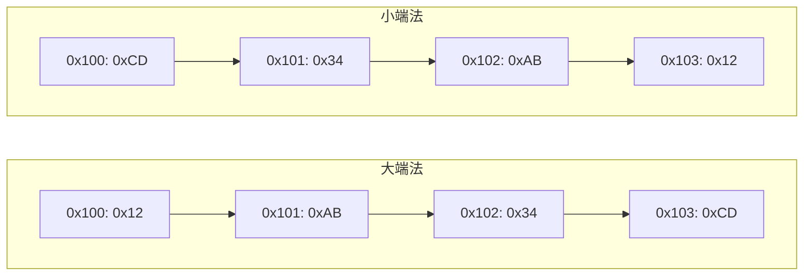
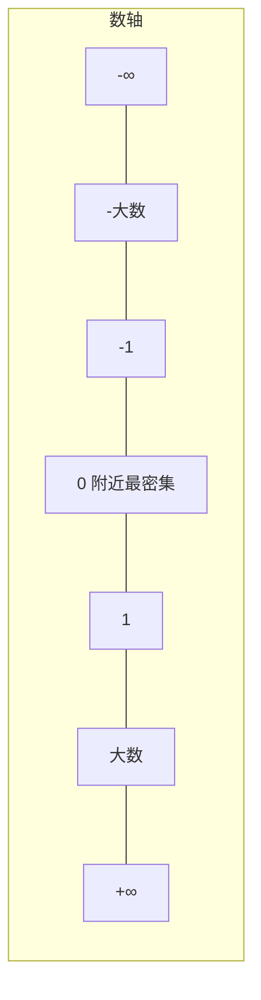

---
title: 深入理解计算机系统：信息的表示与存储
published: 2025-03-01
description: 以博客风格重新梳理 CSAPP 第 2 章的核心知识，从「位需要上下文才有意义」这一核心理念出发，讲解虚拟内存模型、十六进制表示、字长对 C 数据类型大小的影响，以及字节序等基础概念。
tags: [CSAPP, 计算机系统, 信息表示, 字节序, C语言, 位运算]
category: Computer Science
draft: false
---

> 本文是 **CSAPP 第 2 章**的学习笔记，主题为信息的表示与处理。
# 深入理解计算机系统：第二章——信息的表示与处理笔记

> 计算机唯一理解的东西就是位（bit），但位本身没有意义。给位赋予意义的是**上下文**——同样的 32 个 bit，可以是一个整数、一个浮点数、一条指令，甚至是一段音乐的采样。理解计算机如何表示和处理这些信息，是系统编程的基石。

本文基于 CSAPP 第 3 版第 2 章，用博客风格重新梳理信息存储、字节序、整数编码、浮点数及舍入等核心知识。

---

## 一、信息存储的基本模型

### 1.1 字节：最小的可寻址单元

计算机内存可以看作一个巨大的**字节数组**。每个字节由 8 个二进制位（bit）组成，拥有唯一的地址。在 C 语言中，我们通过指针来访问内存——指针的值就是某个字节的地址。

CSAPP 的开篇就强调一个关键认知：**机器级程序把内存视为一个非常巨大的、按地址存取字节的数组**，这称为「虚拟内存」。这个抽象的威力在于，它让每个进程都以为自己独占整个地址空间，而物理内存和磁盘交换对它完全透明。

### 1.2 为什么要用十六进制？

二进制位串太长——一个 32 位的整数写成二进制是 32 个 0 和 1，肉眼阅读几乎不可能。系统软件普遍采用**十六进制（hex）**：

- 1 个十六进制数字 = 4 个二进制位（称为一个 nibble）
- 1 个字节 = 2 个十六进制数字（`00` ~ `FF`）
- 1 个 32 位整数 = 8 个十六进制数字

C 语言中以 `0x` 或 `0X` 开头表示十六进制常量：

```c
int x = 0x12AB34CD;  // 4 字节整数
// 从高位到低位依次是: 0x12 → 0xAB → 0x34 → 0xCD
```

> **记忆技巧**：`A=10, B=11, C=12, D=13, E=14, F=15`，每 4 个二进制位对应 1 个十六进制位。比如 `1111` → `F`，`1010` → `A`。

### 1.3 字长与数据类型大小

C 语言的数据类型大小并不是绝对的，而是与**字长（word size）**——即指针的大小——相关：

| C 声明 | 32 位机器 | 64 位机器 (LP64) |
|--------|----------|------------------|
| `char` | 1 字节 | 1 字节 |
| `short` | 2 字节 | 2 字节 |
| `int` | 4 字节 | 4 字节 |
| `long` | 4 字节 | **8 字节** |
| `long long` | 8 字节 | 8 字节 |
| `float` | 4 字节 | 4 字节 |
| `double` | 8 字节 | 8 字节 |
| 指针（`char *`） | 4 字节 | 8 字节 |

三个要点：
- **`char` 永远是 1 字节**——这是 C 语言中度量内存的「原子单位」
- **指针大小 = 机器字长**，直接决定虚拟地址空间上限（32 位 → 4GB，64 位 → 16EB）
- **`long` 和指针在 32/64 位下大小不同**，这是跨平台移植最常遇到的坑

<details>
<summary>扩展：ILP32 vs LP64</summary>

两种主流数据模型：

| 模型 | int | long | 指针 | 典型系统 |
|------|-----|------|------|----------|
| ILP32 | 32 | 32 | 32 | 32 位 Windows/Linux |
| LP64 | 32 | 64 | 64 | 64 位 Linux/macOS |

注意 64 位 Windows 使用 **LLP64**（`long` 仍为 32 位，`long long` 为 64 位），这是另一个兼容性陷阱。

</details>

---

## 二、字节序：大端与小端

### 2.1 问题：一个整数在内存中怎么排？

对于多字节对象（如 `int`），我们需要决定各字节在内存中的排列顺序。假设 `int x = 0x12AB34CD`，存储在地址 `0x100` 开始的 4 个连续字节中：

| 字节位置 | 字节值 | 含义 |
|---------|--------|------|
| 最高有效字节 | `0x12` | 权值最大的字节 |
| — | `0xAB` | |
| — | `0x34` | |
| 最低有效字节 | `0xCD` | 权值最小的字节 |

核心问题：最高有效字节 `0x12` 应该放在最小地址 `0x100`，还是放在最大地址 `0x103`？

### 2.2 两种答案

**大端法（Big-endian）**：最高有效字节放在最小地址上。

```
地址:   0x100    0x101    0x102    0x103
内容:   0x12     0xAB     0x34     0xCD
```

和人类书写数字的习惯一致——从左到右高位在前。**网络字节序**就是大端。

**小端法（Little-endian）**：最低有效字节放在最小地址上。

```
地址:   0x100    0x101    0x102    0x103
内容:   0xCD     0x34     0xAB     0x12
```

绝大多数 Intel/AMD x86 架构采用小端法，这也是当今 PC 和服务器的绝对主流。



### 2.3 什么时候需要关心字节序？

| 场景 | 为什么重要 |
|------|-----------|
| 网络传输 | 网络字节序（大端）与本机字节序可能不同 |
| 强制类型转换 | `(unsigned char *)&x` 在不同字节序下打印顺序不同 |
| 跨平台二进制文件 | 大端机器写入的文件，小端读取需翻转 |
| 内存转储（dump） | 不知道字节序可能把高低位完全搞反 |

```c
// 检测本机字节序的经典代码
#include <stdio.h>

int main() {
    unsigned int x = 0x01020304;
    unsigned char *p = (unsigned char *)&x;
    
    printf("字节序: ");
    for (int i = 0; i < 4; i++)
        printf("%02x ", p[i]);
    
    // 小端机器输出: 04 03 02 01
    // 大端机器输出: 01 02 03 04
    return 0;
}
```

<details>
<summary>扩展：字节序命名的由来</summary>

「大端」和「小端」出自《格列佛游记》。书中有两个对立的派别：一派坚持从鸡蛋的大端（big end）敲开，另一派坚持从小端（little end）敲开。Danny Cohen 在 1980 年的论文中用这个典故比喻字节序之争——本质上两种选择都合理，但一旦选定就必须在所有通信中保持一致。

</details>

---

## 三、整数的二进制表示

这是 CSAPP 第 2.2 节的核心。同一个位模式，根据解释方式的不同，可能代表完全不同的值。

### 3.1 无符号数编码（B2U）

对 $w$ 位二进制向量 $\vec{x} = [x_{w-1}, x_{w-2}, \dots, x_0]$：

$$B2U_w(\vec{x}) = \sum_{i=0}^{w-1} x_i \cdot 2^i$$

每一位的权都是 2 的正幂。最高位 $x_{w-1}$ 的权是 $2^{w-1}$。简单直观。

### 3.2 补码编码（B2T）

$$B2T_w(\vec{x}) = -x_{w-1} \cdot 2^{w-1} + \sum_{i=0}^{w-2} x_i \cdot 2^i$$

**唯一的区别：最高位变成了负权 $-2^{w-1}$**，其余位完全不变。这就是「补码」命名的由来。

以 4 位为例（$w=4$），直观感受一下：

| 位向量 | 无符号 (B2U) | 补码 (B2T) |
|--------|-------------|-----------|
| `[0000]` | 0 | 0 |
| `[0111]` | 7 | 7 |
| `[1000]` | 8 | **-8** |
| `[1111]` | 15 | **-1** |

关键洞察：
- 最高位为 0 时，无符号和补码的值完全相同——因为 $0 \cdot (-2^{w-1}) = 0$
- 补码的「非对称性」：`[1000]` 只有 -8 没有 +8（4 位补码范围是 -8 ~ 7）
- `[1111]` = -1 非常精妙：$-8 + 4 + 2 + 1 = -1$

### 3.3 补码计算详解

以 `[0111]`（4 位）为例——这是理解补码公式最好的例子：

$$
\begin{aligned}
B2T &= -0 \cdot 2^{3} + 1 \cdot 2^{2} + 1 \cdot 2^{1} + 1 \cdot 2^{0} \\
    &= 0 + 4 + 2 + 1 = 7
\end{aligned}
$$

以 `[1111]`（4 位）为例——体会「负权」的威力：

$$
\begin{aligned}
B2T &= -1 \cdot 2^{3} + 1 \cdot 2^{2} + 1 \cdot 2^{1} + 1 \cdot 2^{0} \\
    &= -8 + 4 + 2 + 1 = -1
\end{aligned}
$$

> 如果把公式写成「$-x_{w-1} \cdot 2^{w-1} + \text{其余位之和}$」，就很好记了。最高位为 1 时，那一项就是 $-2^{w-1}$，正好把整个数拉回负数。

### 3.4 有符号与无符号的转换

C 语言中 `unsigned` 与 `int` 之间的强转遵循**位模式不变，只改变解释方式**的原则：

```c
unsigned u = 15;       // 位模式 [1111]（以 4 位示意）
int      t = (int) u;  // 补码解释为 -1
```

真正的陷阱在于**隐式转换**。C 语言中，当有符号数与无符号数混合运算时，会**隐式将有符号数转为无符号数**：

```c
int a = -1;
unsigned b = 0;
if (a < b)          
    printf("a < b");
else
    printf("a > b"); // 实际输出这个!
```

> 这是 CSAPP 最著名的「诡异比较」。`-1` 的补码是 32 个 1，无符号解释就是 $2^{32}-1 = 4294967295$，当然大于 0。

### 3.5 符号扩展与截断

**符号扩展（扩展位宽保留值）**：将 $w$ 位补码转为 $k$ 位（$k > w$）时，用**最高位（符号位）填充新增的高位**。

```
4 位 [1010] = -6   →   8 位 [1111 1010] = -6  ✓
4 位 [0110] = 6    →   8 位 [0000 0110] = 6   ✓
```

**截断（减少位宽）**：简单丢弃高位。对于补码，截断后再用新宽度解释即可。丢弃的高位中如果包含非符号位信息，值就会变化。

---

## 四、整数运算

### 4.1 无符号加法与溢出

$w$ 位无符号加法结果需要 $w+1$ 位，超出部分被丢弃——相当于对 $2^w$ 取模：

```c
unsigned char a = 200;  // 8 位, 最大值 255
unsigned char b = 100;
unsigned char c = a + b; // 300 mod 256 = 44 (发生了溢出!)
```

### 4.2 补码加法与溢出

补码加法同样面临溢出，但表现更隐蔽：

- **正溢出**：两个正数相加，结果变为负数（进位侵入符号位）
- **负溢出**：两个负数相加，结果变为正数

```c
char a = 100;   // 有符号 8 位
char b = 50;
char c = a + b; // 100 + 50 = 150, 但 8 位补码最大值是 127
                // 150 的二进制 = 10010110, 补码解释为 -106 (正溢出)
```

### 4.3 无符号与补码乘法

$w$ 位的乘法结果需要 $2w$ 位来精确表示。C 语言中，乘法结果被截断回 $w$ 位——不管无符号还是补码，**截断后的位模式完全相同**。

这意味着：**在二进制层面，无符号乘法和补码乘法产生相同的结果**——区别只在于你怎么解释它。

---

## 五、浮点数：IEEE 754 标准

### 5.1 核心公式

$$V = (-1)^s \times M \times 2^E$$

三个要素：
- **符号 $s$**：1 bit，0 正 1 负
- **尾数 $M$**（Mantissa / Significand）：二进制小数，范围 $[1.0, 2.0)$ 或 $[0, 1)$
- **阶码 $E$**（Exponent）：对尾数进行加权，决定小数点的位置——「浮点」之名由此而来

### 5.2 单精度浮点数（float）的位布局

```
31  30    23  22                    0
┌───┬────────┬───────────────────────┐
│ s │  exp   │         frac          │
└───┴────────┴───────────────────────┘
  1      8              23
```

| 字段 | 位数 | 作用 |
|------|------|------|
| 符号 s | 1 bit | 0 正 1 负 |
| 阶码 exp | 8 bits | 存 $E + \text{bias}$，$\text{bias}=127$ |
| 尾数 frac | 23 bits | 存 $M$ 的小数部分 |

### 5.3 三种编码情况

IEEE 754 用 `exp` 的值区分三种情况：

| exp | frac | 类型 | 尾数 M | 阶码 E |
|-----|------|------|--------|--------|
| 全 0 | 全 0 | $\pm 0$ | 0 | — |
| 全 0 | 非 0 | 非规格化数 | $0.f$ | $1 - \text{bias}$ |
| 非全 0 非全 1 | 任意 | 规格化数 | $1.f$ | $\text{exp} - \text{bias}$ |
| 全 1 | 全 0 | $\pm\infty$ | — | — |
| 全 1 | 非 0 | NaN | — | — |

其中 $\text{bias} = 2^{k-1} - 1$（单精度 $k=8$ 时 bias = 127，双精度 $k=11$ 时 bias = 1023）。

### 5.4 规格化数——为什么能「白赚一位精度」？

在二进制科学计数法中，任何一个非零二进制数的第一位**必定是 1**（就像十进制科学计数法第一位必定是 1~9）。IEEE 754 利用这个数学事实，**不存储这个显式的 1**，让 23 位的 `frac` 实现 $1.f$ 的 24 位有效精度。这个被隐藏的 1 称为「隐含的 1」（implied leading 1）。

```
实际值: 1.101101... × 2^E
         ↑
        这个 1 不存，省下一位给精度
```

### 5.5 非规格化数——逼近 0 的艺术

当 `exp = 0` 时，规则变为：
- $M = 0.f$（没有隐含的 1）
- $E = 1 - \text{bias}$（注意不是 $0 - \text{bias}$，这是刻意设计的）

这个设计让非规格化数和规格化数之间**平滑过渡**：最小的规格化数 `exp=1, frac=0` 的 $M=1.0$，而最大的非规格化数 `exp=0, frac=全1` 的 $M \approx 1.0$（仅差一个最低位），两者衔接得天衣无缝。

> 这就是为什么 float 可以表示 $1.18 \times 10^{-38}$ 这样极小的数字——非规格化数填满了 0 附近的「空白地带」。

### 5.6 单精度浮点数经典值速查

| 数值 | s | exp | frac | 说明 |
|------|---|-----|------|------|
| 0.0 | 0 | 全 0 | 全 0 | +0 |
| -0.0 | 1 | 全 0 | 全 0 | -0（IEEE 754 有正负零！） |
| 最小正非规格化 | 0 | 全 0 | 最低位 1 | $\approx 1.4 \times 10^{-45}$ |
| 最小正规格化 | 0 | `00000001` | 全 0 | $\approx 1.18 \times 10^{-38}$ |
| 1.0 | 0 | `01111111` | 全 0 | bias=127，exp=127 |
| 2.0 | 0 | `10000000` | 全 0 | exp=128，E=1 |
| 最大规格化 | 0 | `11111110` | 全 1 | $\approx 3.4 \times 10^{38}$ |
| $+\infty$ | 0 | 全 1 | 全 0 | 正无穷 |
| NaN | 任意 | 全 1 | 非 0 | 非数字 |

### 5.7 为什么 0.1 不能用 float 精确表示？

$0.1_{10}$ 转为二进制是**无限循环小数**：

$$0.1_{10} = 0.000110011001100110011..._2$$

单精度 `frac` 只有 23 位，必然截断：

```c
float f = 0.1f;
printf("%.10f\n", f);  // 输出 0.1000000015...
```

```go
var f float32 = 0.1
fmt.Printf("%.10f\n", f) // 输出 0.1000000015...
```

> **启示：不要用 `==` 直接比较浮点数。** 使用误差范围判断，例如 `fabs(a - b) < 1e-6`。

### 5.8 浮点数在数轴上的分布

浮点数在数轴上的分布不是均匀的——**0 附近最密集，向两端越来越稀疏**。



这个特性带来两个实际影响：
- 大数加法可能完全丢失精度（$10^{30} + 1 = 10^{30}$）
- 两个相近的大数相减可能产生灾难性抵消（catastrophic cancellation）

---

## 六、浮点数舍入

### 6.1 为什么需要舍入？

浮点数的 `frac` 位有限，而很多运算需要更多位来表达。舍入本质是**用一个最接近的可表示值来近似实际结果**。

### 6.2 四种舍入模式

| 模式 | 规则 | 例子（舍入到整数） |
|------|------|-------------------|
| **向偶数舍入** | 最近的值，中间值时选最低位为 0 的 | 2.5 → 2，3.5 → 4 |
| **向零舍入** | 朝 0 方向（截断） | 1.7 → 1，-1.7 → -1 |
| **向下舍入** | 朝 $-\infty$ 方向 | 1.7 → 1，-1.7 → -2 |
| **向上舍入** | 朝 $+\infty$ 方向 | 1.7 → 2，-1.7 → -1 |

**IEEE 754 默认模式：向偶数舍入（Round-to-Even）。**

### 6.3 为什么不用「四舍五入」？

十进制四舍五入存在**统计偏差**：1.5→2, 2.5→3, 3.5→4, 4.5→5——所有中间值全部向上偏，长期累积会产生系统性误差。

向偶数舍入的妙处在于：中间值一半向上、一半向下（取决于最低有效位是 0 还是 1）：

| 中间值 | 向偶数结果 | 方向 |
|--------|-----------|------|
| 1.5 | 2 | 向上 |
| 2.5 | 2 | 向下 |
| 3.5 | 4 | 向上 |
| 4.5 | 4 | 向下 |

**长期来看无统计偏差**——这是大量浮点运算中正确性的保证。

### 6.4 硬件实现：保护位、舍入位、粘贴位

IEEE 754 使用三个额外位来决定舍入方向：

| 位 | 名称 | 位置 | 含义 |
|----|------|------|------|
| G | 保护位（Guard） | `frac` 右边第 1 位 | 第一个被舍去的位 |
| R | 舍入位（Round） | `frac` 右边第 2 位 | 第二个被舍去的位 |
| S | 粘贴位（Sticky） | 剩余所有位的 OR | 只要后面有任何一个 1，S=1 |

判断规则：

| G | R | S | 情况 | 操作 |
|---|---|---|------|------|
| 0 | × | × | < 一半 | 截断 |
| 1 | 0 | 0 | **正好一半** | 最低位为 0 → 截断，为 1 → 进位 |
| 1 | 0 | 1 | > 一半 | 进位 |
| 1 | 1 | × | > 一半 | 进位 |

<details>
<summary>二进制中间值的判断细节</summary>

二进制中「正好一半」表现为 G=1, R=0, S=0——因为二进制的小数部分 `0.1` 恰好等于 1/2，`0.01` 恰好等于 1/4。所以 `...0.1000...` 才是正好一半，`...0.1001...` 已经超过一半了。

</details>