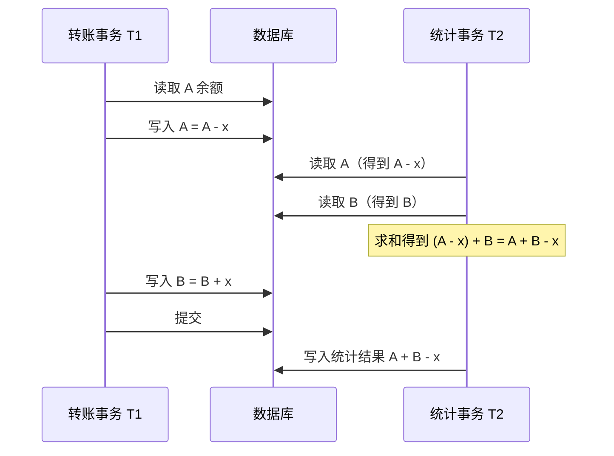
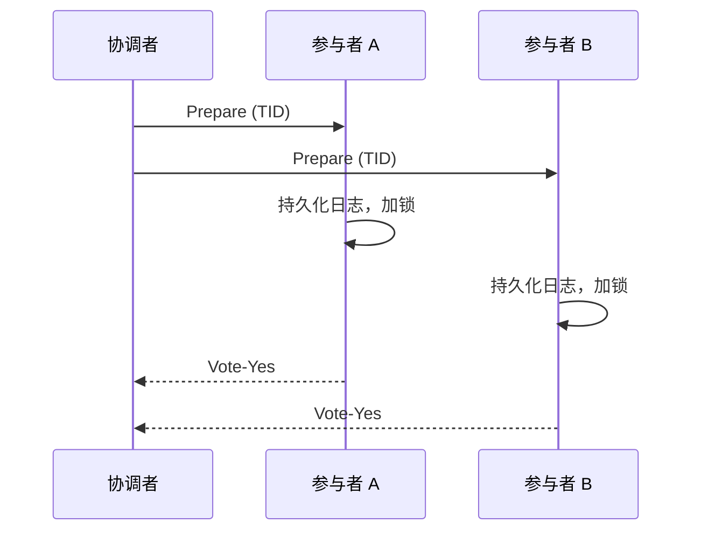
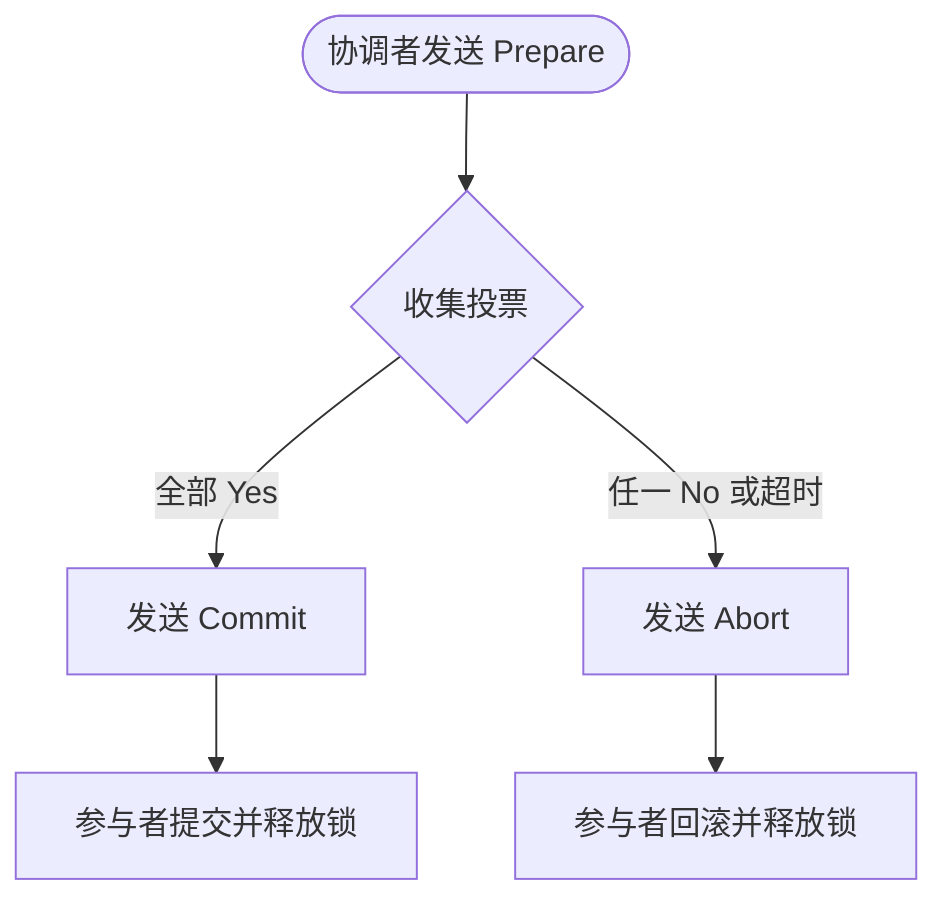
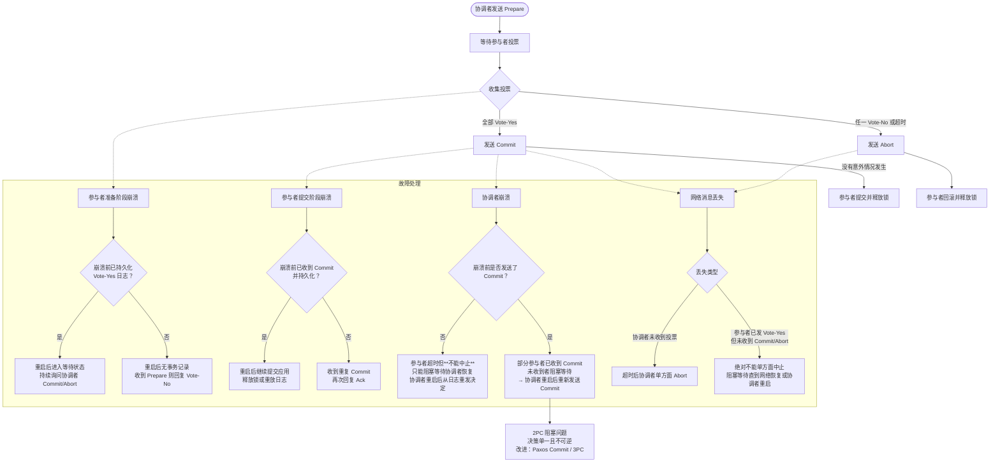

# 分布式事务：核心设计、并发控制与原子提交协议

构建跨多台服务器的数据库系统时，一个核心难题摆在面前：**如何在保证数据一致性的前提下，让多个事务并发执行，同时还能在节点故障、网络分区时做到“全有或全无”？** 分布式事务正是解决这一问题的经典方案。它从单机事务的 ACID 特性出发，逐步引入并发控制、死锁处理与两阶段提交，最终在分布式环境下撑起一片可靠的天空。

本文将以 Raft 那篇文章的风格，带你深入理解分布式事务的核心概念、并发控制策略以及最具代表性的原子提交协议——两阶段提交（2PC）。

---

## 一、分布式事务的核心特点：ACID

事务的 ACID 特性是分布式环境下一切设计的基石。

| 特性 | 含义 | 分布式挑战 |
|------|------|------------|
| **原子性（Atomicity）** | 事务要么全部执行成功，要么全部不执行，不允许部分生效。 | 节点可能崩溃、网络可能中断，必须确保所有参与者要么一起提交，要么一起回滚。 |
| **一致性（Consistency）** | 事务执行前后，数据满足用户定义的完整性约束（如账户总额不变）。在分布式复制场景下，还要求不同副本读取到的值相同。（*注：ACID 中的“一致性”专指业务完整性约束；分布式复制中的“副本一致”通常对应线性一致性或顺序一致性，是另一个维度。*） | 写并发、副本滞后、网络分区都会破坏一致性感知。 |
| **隔离性（Isolation）** | 并发事务不能看到彼此的中间状态，最终效果等价于某种串行执行顺序。 | 需要跨节点的锁或乐观检查，开销远大于单机。 |
| **持久性（Durability）** | 一旦事务提交，修改永久保存在非易失性存储（磁盘、SSD）中，即使系统崩溃也不丢失。 | 协调者必须持久化提交决定；若为提升可用性，可借助 Paxos 等协议将决策日志同步到多数派节点。<!-- 修正：明确协调者持久化为主，多数派为增强方案 --> |

在分布式事务中，**原子性**和**隔离性**是最难保证的两条，也是本文后续章节的重点。

---

## 二、可串行化：隔离性的黄金标准

### 1. 为什么需要可串行化？

如果允许事务看到其他事务的中间状态，就会产生各种异常：脏读、不可重复读、幻读……最严重的是，可能导致数据永久性错误。

我们来看一个具体例子。

假设有两个事务：

- **转账事务 T1**：把 A 账户的 x 元转入 B 账户  
  步骤①：A 余额减去 x  
  步骤②：B 余额加上 x

- **统计事务 T2**：计算 A、B 的总资产，并将结果写入数据库  
  操作：`Write( A + B )`

如果 T2 恰好安排在 T1 的步骤①和步骤②之间执行，会看到什么？

结果：T2 最终写入的总额比实际少了 **x**。如果这是银行系统的日终报表，就会造成对账错误。

**可串行化**（Serializability）要求：任何并发事务的执行效果，都必须等价于**某种顺序**的串行执行。在上面的例子中，唯一合理的串行顺序要么是 T1 完全执行完再执行 T2，要么是 T2 先执行再执行 T1。两种都不会产生错误的总和。

### 2. 如何实现可串行化？

最直接的思路就是**锁**。事务在读写数据前先获取锁，其他事务如果请求冲突的锁就必须等待。由此衍生出两种设计哲学：**悲观并发控制**与**乐观并发控制**。

---

## 三、并发控制策略

### 1. 悲观并发控制（Pessimistic Concurrency Control）

> 假设冲突会很频繁

- **核心机制**：每个事务在读写数据前，必须先获取该记录的锁。如果锁已被其他事务持有，则等待。
- **锁的粒度**：可以是一行、一个文档，也可以是一张表（粒度越细，并发越高，开销也越大）。
- **适用场景**：冲突率高的系统（例如热门商品库存扣减）。

**优点**：强隔离，不会产生脏数据，实现相对简单。  
**缺点**：可能引发死锁；锁等待会降低吞吐量。

### 2. 乐观并发控制（Optimistic Concurrency Control）

> 假设冲突是意外

- **核心机制**：事务无阻塞地执行所有读写，将修改暂存在本地。提交时检查是否与其他事务冲突（例如是否读取了被他人修改的数据）。
- **冲突时的处理**：如果检测到冲突，则回滚当前事务并重试。
- **适用场景**：冲突率低的系统（例如大部分是读操作，或者不同用户操作不同数据）。

**优点**：无锁等待，高并发下吞吐量高。  
**缺点**：冲突时重试成本高；需要记录读写集，检查开销也不小。

两种策略没有绝对的优劣，很多数据库会混合使用（比如在索引上采用悲观锁，在堆表数据上采用乐观检查）。

---

## 四、两阶段锁（2PL）：悲观锁的标准实现

在关系型数据库（例如MySQL）中，实现可串行化最经典的方法就是**两阶段锁（Two-Phase Locking, 2PL）**。

### 1. 两阶段锁的基本规则

一个事务的生命周期被划分为两个阶段：

- **扩张阶段（Growing Phase）**：事务可以获取新的锁，但不能释放任何锁。
- **收缩阶段（Shrinking Phase）**：事务可以释放锁，但不能获取任何新锁。

而在分布式事务中，使用**严格两阶段锁**（Strict 2PL）——实际系统中最常用的变体——规则更加严格：

> **事务在提交或中止之前，必须持有所有已经获取的锁。不允许在中间释放任何锁。**

也就是说，所有锁的释放都推迟到事务结束的那一刻。

### 2. 为什么必须等到最后才释放锁？

如果允许事务在使用数据后立即释放锁，就会破坏可串行化，甚至破坏原子性。

<!-- 修正：反例改为修改后释放写锁导致脏读 -->
**反例：提前释放锁导致的脏读**

- T1 获取 x 的写锁，将 x 修改为新值（尚未提交），然后立即释放写锁。
- T2 此时顺利获得 x 的读锁，读到了 T1 未提交的新值（脏读）。
- 若 T1 随后因故回滚，T2 已经基于这个“幽灵值”进行了计算或写入，一致性就被彻底破坏。

这就是经典的**脏读（Dirty Read）**问题。严格两阶段锁通过“所有锁保留到事务结束”来杜绝这种情况：T1 只要还没提交，就会一直持有写锁，T2 根本无法读到未提交的修改。

---

## 五、死锁与检测

锁机制虽然保证了可串行化，但也引入了一个新问题：**死锁**。

### 1. 死锁示例

两个事务互相等待对方持有的锁，导致都无法推进：

- T1 持有 A 的锁，请求 B 的锁。
- T2 持有 B 的锁，请求 A 的锁。

两者永远等不到对方释放，系统卡死。

扩展：死锁探测方法

常见死锁处理方法

| 方法 | 原理 | 优缺点 |
|------|------|--------|
| **超时机制** | 事务等待锁超过阈值（如 1 秒），就主动回滚自己。 | 实现简单，但可能误杀（高负载下误判）。 |
| **集中式死锁检测** | 选一个节点作为全局检测器，收集所有节点的等待图，发现环则中止某个事务。 | 逻辑简单，但中心节点可能成为瓶颈和单点故障。 |
| **分布式死锁检测（Obermarck 算法）** | 每个节点维护本地等待图，跨节点等待边通过“探针”消息传递。探针沿等待链传播，若回到发起点则说明有环。 | 无中心节点，但实现复杂，消息开销大。 |
| **边追逐法（Chandy-Misra-Haas）** | 每个事务发起探测消息 (detector, blocker, hop)，沿等待链传递。若消息回到 detector，则死锁。 | 经典算法，通过 ID 比较避免重复处理。 |

生产系统中，**超时机制**是最普遍的选择——它简单、可靠，且避免了复杂的跨节点协调。只有当超时机制导致过多误杀时，才会考虑引入主动检测。

---

## 六、原子提交：两阶段提交协议（2PC）

单机事务的原子性依靠预写日志（WAL）就能实现：崩溃后重放日志即可。但在分布式环境中，数据分布在多个独立节点上，**要么全部节点都提交，要么全部节点都中止**——这就是**原子提交问题**。

两阶段提交（Two-Phase Commit, 2PC）是最经典的原子提交协议。

### 1. 角色与前提

- **协调者（Coordinator）**：负责驱动整个事务的决策。通常选择一个可靠的节点（例如 Raft 集群的领导者）来承担。
- **参与者（Participants）**：真正持有数据并执行读写操作的服务节点（如 Server A, Server B）。
- **事务 ID（TID）**：每个事务消息都携带唯一的 TID，用于各节点跟踪状态和去重。

### 2. 第一阶段：准备阶段（Prepare Phase）

协调者向所有参与者发送 **Prepare** 消息，询问：“你们准备好提交这个事务了吗？”

每个参与者收到后：

1. 检查自身状态（是否有死锁、约束是否满足、资源是否充足）。
2. 将事务的所有修改写入预写日志（Write-Ahead Log）并强制刷盘。**这是最关键的一步**——参与者一旦回复“同意”，就必须承诺能够提交，即使之后自己崩溃重启，也能从日志中恢复并完成提交。
3. 根据检查结果回复 **Vote-Yes** 或 **Vote-No**。

### 3. 第二阶段：提交/中止阶段

#### 情况 A：所有参与者都回复 Vote-Yes

协调者决定**提交（Commit）**：

- 向所有参与者发送 **Commit** 消息。
- 参与者收到 Commit 后，将事务真正应用到状态机（或数据库），释放锁，然后回复 **Ack**。
- 协调者收到所有 Ack 后，可以安全地清理该事务的日志。

#### 情况 B：至少有一个参与者回复 Vote-No，或者超时

协调者决定**中止（Abort）**：

- 向所有参与者发送 **Abort** 消息。
- 参与者收到 Abort 后，回滚所有修改，释放锁，回复 Ack。
- 协调者清理事务状态。

### 4. 2PC 的故障处理

2PC 真正复杂的不是正常流程，而是各种故障场景下的恢复。

#### 场景 1：参与者在准备阶段崩溃

- **崩溃前已持久化日志并发送了 Vote-Yes**：重启后，参与者读取日志，发现自己已经承诺提交。它会进入**等待状态**，持续向协调者询问 Commit 或 Abort，直到收到明确指令。
- **崩溃前未发送 Vote-Yes**：重启后无该事务记录。若收到协调者的 Prepare，直接回复 Vote-No（因为无法确认之前的状态）。

#### 场景 2：参与者在提交阶段崩溃

- 如果已收到 Commit 并持久化了结果，重启后应继续完成应用并释放锁（或重放日志）。
- 如果收到重复的 Commit 消息，只需再次回复 Ack 即可。

#### 场景 3：协调者崩溃

这是 2PC 最棘手的故障点。

- **在发送 Commit 前崩溃**：若协调者在做出提交决定（例如持久化 Commit 日志）后、发送 Commit 消息前崩溃，所有投了 Vote-Yes 的参与者会因收不到最终决策而超时。**此时参与者绝对不能单方面中止**，因为协调者已经决定了提交，只是消息未发出。参与者只能进入阻塞状态，持续等待协调者恢复，并从其日志中读取提交决定，重新发送 Commit。这恰恰是两阶段提交“阻塞问题”的核心。

- **在发送 Commit 后崩溃**：此时可能部分参与者已经收到 Commit 并执行，部分尚未收到。已经收到的参与者不能回滚（因为协调者已经做出了提交决定）。尚未收到的参与者会一直**阻塞等待**，直到协调者重启并从日志中读取决策，重新发送 Commit 或 Abort。

> 这是 2PC 被诟病最多的**阻塞问题**：如果协调者在发送 Commit 后崩溃且长时间无法恢复，参与者会无限期持有锁，阻塞其他事务。这也是为什么 2PC 不适合跨数据中心、长事务或高可用性要求极高的场景。

#### 场景 4：网络消息丢失

- **协调者未收到某参与者的投票**：超时后协调者可以单方面决定中止（Abort），避免无限等待。
- **参与者已发送 Vote-Yes 但未收到 Commit/Abort**：**绝对不能单方面中止**，因为协调者可能已经向其他参与者发送了 Commit。此时只能阻塞等待，直到网络恢复或协调者重启。

2PC 阻塞问题的本质

2PC 的阻塞来源于“决策者单一且决策不可逆”：一旦协调者决定了 Commit，这个决定就不能撤销。如果协调者故障，参与者不知道这个决定，就只能等待。

这种设计在跨组织、跨地域的分布式系统中尤其危险——网络分区或协调者宕机几小时，整个系统就可能瘫痪。工业界后来的改进方案（如 **Paxos Commit**、**三阶段提交 3PC**）试图缓解阻塞问题，但要么增加复杂性，要么在分区下仍无法完全避免阻塞。

### 5. 2PC 的局限性总结

| 问题 | 描述 |
|------|------|
| **性能慢** | 至少两轮 RPC + 多次强制刷盘（fsync），机械硬盘时代延迟可达 10ms 级别，严重限制吞吐量。 |
| **阻塞问题** | 协调者故障时，参与者可能无限期持有锁，导致系统局部或整体不可用。 |
| **单点故障** | 协调者是关键节点，崩溃后恢复期间事务会挂起。 |
| **不适合长事务** | 锁持有时间长，冲突概率高，且协调者故障风险累积。 |
| **不适合跨数据中心** | 网络延迟大，且分区容忍性差（网络分区时多数参与者无法投票，协调者无法决策）。 |

尽管如此，2PC 仍然是很多分布式数据库（如 MySQL Cluster、PostgreSQL XC）和分布式协调系统（如 ZooKeeper 的多节点事务）的底层基石。对于短事务、可靠网络、低延迟要求不极致的场景，2PC 简单且正确。
