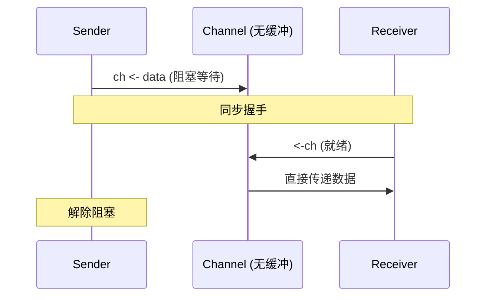
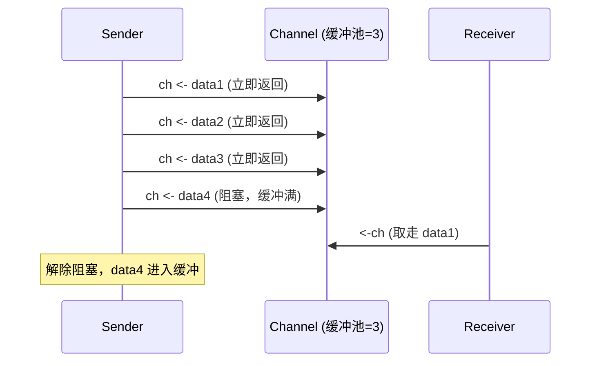
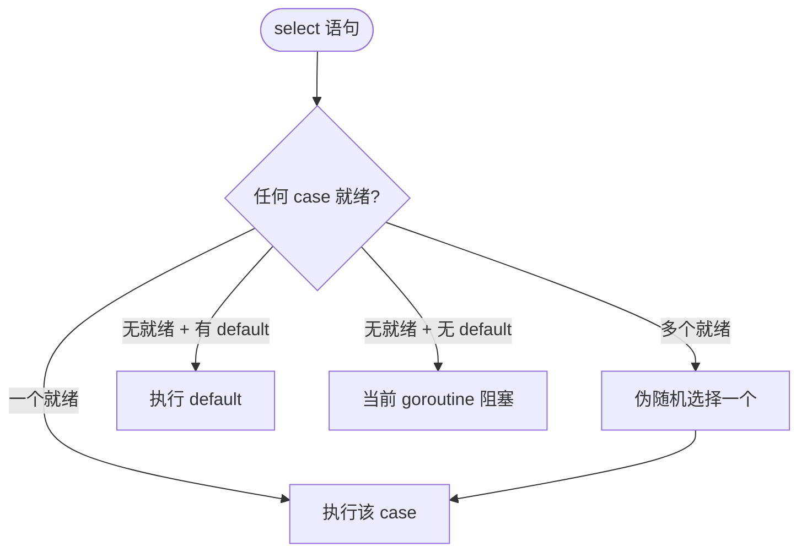

> Channel 是 Go 并发编程的「通信管道」，是 CSP 模型的核心实现。  
> 本文覆盖 Channel 的全部核心知识：创建、发送、接收、关闭、缓冲、select 多路复用。

## 一、为什么需要 Channel

| 问题                           | 说明                                   | Channel 方案                        |
|--------------------------------|----------------------------------------|-------------------------------------|
| **goroutine 间信息传递**       | 多并发单元需要交换数据，传统加锁方式易出错 | 类型化的通信管道，天然并发安全       |
| **缓冲区功能**                 | 生产/消费速度不匹配，需要临时存储平滑流量 | 有缓冲 channel 提供异步队列能力     |
| **生产者-消费者问题**          | 经典多线程同步问题                      | 有缓冲 channel 是此问题的更优解决方案 |

《CSAPP》的P704 12.5.4 中有关于生产者-消费者问题知识点的详细介绍,以及线程间信息传递也有详细的说明

### 1.1 goroutine 间信息传递

传统多线程编程通过共享内存 + 锁来传递数据，容易引发死锁、竞争、性能下降,并且会引入项目复杂度

```go
// 传统方式（易错）
var mu sync.Mutex
var data int

go func() {
    mu.Lock()
    data = 42
    mu.Unlock()
}()

mu.Lock()
v := data
mu.Unlock()
```

```go
// Channel 方式（安全清晰）
ch := make(chan int)
go func() { ch <- 42 }()
v := <-ch
```

### 1.2 缓冲区功能

缓冲区是一块临时存储区域，解决两个组件速度不匹配的问题

| 场景                   | 无缓冲       | 有缓冲       |
|------------------------|--------------|--------------|
| 网卡收包 → 应用处理    | 丢包或阻塞   | 暂存数据，平滑处理 |
| 日志写入 → 磁盘落盘    | 每笔都阻塞   | 批量刷盘     |
| 请求接收 → 业务处理    | 吞吐受限     | 削峰填谷     |

```go
// 有缓冲 channel 作为缓冲区
tasks := make(chan Task, 100)  // 缓冲 100 个任务

// 生产者（快速接收）
go func() {
    for req := range incoming {
        tasks <- req  // 缓冲未满时立即返回
    }
}()

// 消费者（慢速处理）
go func() {
    for task := range tasks {
        process(task)  // 不会阻塞生产者
    }
}()
```

### 1.3 解决生产者-消费者问题

Go channel 将此模式封装为语言的原语：

```go
// 有缓冲 channel = 信号量方案的泛化
N:=2
ch := make(chan int, N)   // N = 缓冲区大小

// 生产者
ch <- data   // P(empty) + 放数据 + V(full)

// 消费者
data := <-ch // P(full) + 取数据 + V(empty)
```

| 对比维度   | 信号量方案（C）                | Go Channel               |
|------------|--------------------------------|--------------------------|
| 代码量     | 显式管理 empty/full/mutex      | 单行 `make(chan T, N)`   |
| 错误风险   | 手动 P/V 顺序易死锁             | 内置语义，自动阻塞       |
| 类型安全   | 无（需强转 `void*`）           | 编译期类型检查           |

## 一、核心概念

| 概念               | 说明                                         |
|--------------------|----------------------------------------------|
| **类型化管道**     | 只能传输指定类型的值，编译期类型检查           |
| **goroutine 安全** | 多 goroutine 并发读写无需额外加锁              |
| **引用类型**       | 零值为 `nil`，必须用 `make` 创建              |
| **阻塞语义**       | 无缓冲 channel 的发送/接收会阻塞直到配对操作就绪 |

```go
// 创建 channel
ch := make(chan int)          // 无缓冲（同步）
ch := make(chan string, 10)   // 有缓冲（异步），容量 10

// 带方向的 channel（用于函数参数约束）
func producer(out chan<- int) { ... }  // 只能发送
func consumer(in <-chan int) { ... }   // 只能接收
```

<details>
<summary>知识补充:缓冲区</summary>

**缓冲区是一块临时存储数据的区域，用于在两个速度不匹配或数据传输单位不一致的组件之间，平滑数据流。**

想象一下水厂（数据生产者）和水龙头（数据消费者）。水厂出水是连续的，但你用水是断断续续的。中间的**水箱**就是缓冲区。

### 为什么需要缓冲区？（核心价值）

1.  **匹配速度差异**
    -   **场景**：CPU（极快） vs. 硬盘/网络（很慢）。
    -   **无缓冲**：CPU 写一个字节，就要等硬盘写完才能做下一件事，效率极低。
    -   **有缓冲**：CPU 把数据快速写入内存中的缓冲区，然后继续工作。操作系统在后台慢慢把缓冲区数据刷到硬盘。**写文件、网络传输的核心原理**。

2.  **减少系统调用**
    -   **场景**：`printf`、`println`、`console.log`。
    -   **无缓冲**：打印一行字符，立刻调用一次昂贵的系统调用去操作屏幕。
    -   **有缓冲**：先把要打印的内容放进缓冲区，等缓冲区满了，或者遇到换行符 `\n`，或者程序结束时，**一次性地**进行系统调用输出所有内容。性能天差地别。

3.  **解耦生产者和消费者**
    -   **场景**：音视频播放。
    -   **生产者**（网络下载线程）可能卡顿。
    -   **消费者**（解码播放线程）需要数据平滑。
    -   **有缓冲**：预先下载一部分数据到缓冲区。网络波动时，播放器从缓冲区读取，就不会卡顿。**这就是“预加载”或“缓冲中”的含义**。

### 缓冲区的三种类型

这是最常见的分类，与输入输出（I/O）流强相关：

| 类型       | 刷新（Flush）时机                                         | 典型场景                               | 特点                     |
|------------|-----------------------------------------------------------|----------------------------------------|--------------------------|
| **全缓冲** | 缓冲区**完全填满**时                                      | 读写普通文件（如 `fopen` 打开的磁盘文件） | 效率最高，但实时性最差   |
| **行缓冲** | 遇到**换行符 `\n`** 或缓冲区填满时                        | 标准输入输出流（`stdin` / `stdout`），如终端交互 | 平衡了效率和实时性，能看到逐行输出 |
| **无缓冲** | 数据**立即**输出，不等待                                  | 标准错误流（`stderr`），用于立即报告错误 | 实时性最好，保证错误信息能立刻看到 |

### 与缓冲区相关的核心操作

1.  **刷新（Flush）**
    -   强制将缓冲区中积压的数据“清空”并真正发送出去。
    -   **方法**：`fflush(FILE*)`（C）、`sys.stdout.flush()`（Python）、`console.log` 通常自带（Node.js 中 `stream.write` 后可能需要）。
    -   **为什么需要**：程序崩溃时，未刷新的缓冲区数据会丢失。关键日志后、长时间计算前，建议手动刷新。

2.  **清空（Clear）**
    -   直接丢弃缓冲区中的数据，不进行任何处理。
    -   **场景**：读取输入出错，需要清空输入缓冲区中的残存数据，避免影响下次读取。例如 `while(getchar() != ‘\n’);`（C）。

### 一个非常重要的安全概念：缓冲区溢出

这是缓冲区概念的另一面，非常重要，尤其对于系统编程和安全领域。

-   **定义**：向缓冲区写入的数据超过了它预先分配的大小，导致数据覆盖了相邻的内存区域。
-   **后果**：程序崩溃、数据错乱，甚至**成为黑客攻击的入口**。黑客可以精心构造数据，覆盖返回地址，让程序跳转到恶意代码执行。
-   **著名例子**：1988年莫里斯蠕虫、2003年SQL Slammer蠕虫，都利用了缓冲区溢出漏洞。
-   **如何防范**：现代语言（Java、Python、Go、Rust）会自动检查边界，不会发生溢出。但在C/C++中，必须使用安全函数（如`strncpy`、`snprintf`）替代不安全的（`strcpy`、`sprintf`），并小心处理。

### 不同场景下的“缓冲区”

这个词在编程中到处出现，语境不同，意思稍有区别：

| 语境               | 缓冲区含义                                                                 |
|--------------------|----------------------------------------------------------------------------|
| **网络编程**       | 内核为每个 Socket 维护的**发送缓冲区**和**接收缓冲区**。`write` 只是把数据写到发送缓冲区，`read` 是从接收缓冲区读。 |
| **输入流/输出流**  | Java、C#、Node.js 中的 `BufferedInputStream` / `BufferedOutputStream`，是对底层流的装饰器，提供缓冲功能。 |
| **图形/视频**      | 帧缓冲区（Frame Buffer），存放一帧画面数据的内存区域，显卡从中读取并发送到显示器。 |
| **Node.js 流**     | 可读流和可写流内部都有缓冲区，`stream.push(null)` 可以刷新。 |

在go语言中就是使用Chan来实现缓冲区的功能
</details>

## 二、基本原理：无缓冲 vs 有缓冲





| 特性       | 无缓冲 (`make(chan T)`)     | 有缓冲 (`make(chan T, N)`)                    |
|------------|-----------------------------|-----------------------------------------------|
| 容量       | 0                           | N > 0                                         |
| 发送行为   | 阻塞直到有接收者            | 缓冲未满 → 立即返回；满 → 阻塞                |
| 接收行为   | 阻塞直到有发送者            | 缓冲非空 → 立即返回；空 → 阻塞                |
| 典型用途   | 强同步、信号通知            | 解耦生产/消费速率、缓解峰值                   |

## 三、核心操作详解

### 发送与接收

```go
ch := make(chan int, 2)//创建int数据的管道,可以容纳两份数据

ch <- 42        // 发送
val := <-ch     // 接收（若缓冲为空则阻塞）

// 推荐：带 ok 的接收（判断 channel 是否关闭且无数据）
v, ok := <-ch     // ok==false 表示 channel 已关闭且无数据
```

## 使用示例

### 1. goroutine间通信

```go
// 生产者：向channel发送数据
func Producer(ch chan<- string, wg *sync.WaitGroup) {
    defer wg.Done() // 通知WaitGroup任务完成
    
    for i := 1; i <= 3; i++ {
        msg := fmt.Sprintf("消息 %d: hello from goroutine", i)
        ch <- msg
        fmt.Printf("生产了消息: %s\n", msg)
    }
    close(ch) // 生产完成后关闭channel
}

// 消费者：从channel接收数据
func Consumer(ch <-chan string, wg *sync.WaitGroup) {
    defer wg.Done() // 通知WaitGroup任务完成
    
    for msg := range ch {
        fmt.Printf("消费了数据: %s\n", msg)
    }
}

func main() {
    var wg sync.WaitGroup
    
    // 创建一个字符串类型的channel
    ch := make(chan string, 2) // 带缓冲，大小为2
    
    // 增加两个任务的计数
    wg.Add(2)
    
    // 启动生产者和消费者
    go Producer(ch, &wg)//传入chan和WaitGroup等待
    go Consumer(ch, &wg)
    
    // 等待所有goroutine完成
    wg.Wait()
    fmt.Println("所有goroutine执行完成")
}
```

## select 多路复用

`select` 是 Go 中处理多个 channel 操作的关键结构：

```go
select {
case v := <-ch1:
    fmt.Println("from ch1:", v)
case ch2 <- "hello":
    fmt.Println("sent to ch2")
case <-time.After(1 * time.Second):
    fmt.Println("timeout!")
default:
    fmt.Println("non-blocking")
}
```

### 2. 基于Select的简易goroutine控制(在下一篇中将会讲到更为专业的Context,此处做简单示例)

```go
stop := make(chan bool)

go func() {
    for {
        select {
        case <-stop:
            fmt.Println("收到停止信号，退出")
            return
        default:
            fmt.Println("工作中...")
            time.Sleep(500 * time.Millisecond)
        }
    }
}()

time.Sleep(2 * time.Second)
stop <- true      // 发送停止信号
close(stop)
time.Sleep(500 * time.Millisecond)
```

### 关闭 channel

```go
close(ch)  // 仅 sender 应调用，通知接收方"不再发送新数据"
```

关闭后的行为：
- **发送** → panic（`send on closed channel`）
- **接收** → 可读完剩余缓冲数据，之后返回零值 + `ok=false`
- **重复关闭** → panic（`close of closed channel`）

```go
// 配合 range 循环
ch := make(chan int, 3)
ch <- 1; ch <- 2; ch <- 3
close(ch)

for v := range ch { // 自动在 channel 关闭且无数据时退出
    fmt.Println(v) // 输出: 1 2 3
}
```

**核心原则：谁创建（或谁发送），谁关闭。接收方永不主动 close。**  
通常由唯一的发送方或通过额外的同步机制（如 sync.Once、专门的“通知者”goroutine）来关闭；接收方不应主动关闭 channel。



### 关键规则

| 规则                         | 说明                                                   |
|------------------------------|--------------------------------------------------------|
| **随机选择**                 | 多个 case 就绪时，Go 伪随机选择一个（避免饥饿）        |
| **nil channel 永远不就绪**   | 可用于动态启用/禁用分支                                |
| **default 实现非阻塞**       | 有 default 时 select 总是立即返回                      |

## 五、select 中安全判断 channel 关闭

**这是最容易出错的场景。** `select` 本身不直接暴露 channel 关闭状态，你必须在 `case` 体内用双返回值判断：

### 正确模式

```go
func worker(ch <-chan int) {
    for {
        select {
        case v, ok := <-ch:    // 关键：双返回值接收,一个是数据,一个是是否关闭的布尔值
            if !ok {
                fmt.Println("channel closed → exit")
                return
            }
            fmt.Printf("received: %d\n", v)
        }
    }
}
```

### 常见错误

```go
// 错误 1：单返回值接收，丢弃了 ok，无法检测 channel 关闭
// 语法合法，但当 channel 关闭后会无限收到零值
case v := <-ch:  // ok 值被隐式丢弃，无法判断关闭

// 错误 2：未检查 ok，channel 关闭后无限打印零值
ch := make(chan int)
close(ch)
for {
    select {
    case v := <-ch:     // channel 已关闭，每次都立即返回零值 0
        fmt.Println(v)  // 无限打印 0，goroutine 永不退出！
    }
}

// 错误 3：用值判断关闭（zero value 可能是合法数据）
case v, ok := <-ch:
    if v == 0 { return }  // 属于严重bug
```

## 六、nil channel 妙用

nil channel 的读写**永远阻塞**，可用于动态禁用 select 分支：

```go
tickCh := (<-chan time.Time)(nil) // 初始禁用
ticker := time.NewTicker(time.Second)
done := make(chan struct{})

go func() {
    for {
        select {
        case <-tickCh:
            fmt.Println("tick")
        case <-done:
            return
        }
    }
}()

// 动态启用/禁用定时器分支
tickCh = ticker.C    // 启用
// ... 一段时间后
tickCh = nil         // 禁用
```

## 七、信号量模式（限流）

```go
sem := make(chan struct{}, 3) // 最多 3 个并发

for i := 0; i < 10; i++ {
    go func(i int) {
        sem <- struct{}{}       // 获取令牌
        defer func() { <-sem }() // 归还令牌
        fmt.Printf("job %d running\n", i)
        time.Sleep(time.Second)
    }(i)
}
```

## 八、常见陷阱速查

| 陷阱                 | 原因                                       | 解决方案                                     |
|----------------------|--------------------------------------------|----------------------------------------------|
| 向已关闭 channel 发送 | `close(ch); ch <- v`                       | 仅 sender 关闭；用 sync.Once 保护           |
| goroutine 泄漏       | channel 未关闭 + receiver 不退出           | 显式 close()；用 context 控制               |
| 死锁                 | 所有 goroutine 都在 channel 上阻塞         | 加 timeout/default；检查是否遗漏 close       |
| 忘记缓冲导致阻塞     | 无缓冲 channel 在高吞吐场景成瓶颈          | 评估缓冲大小；避免过度缓冲                   |
| 循环变量捕获         | `go func(){ ch <- i }()`                   | `go func(v int){ ch <- v }(i)`               |


> **Channel 是通信媒介。通过通信来共享内存，而非通过共享内存来通信。**

在下一篇中将介绍基于Channel的goroutine控制工具:Context