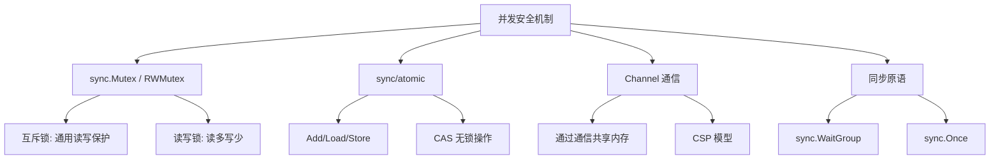
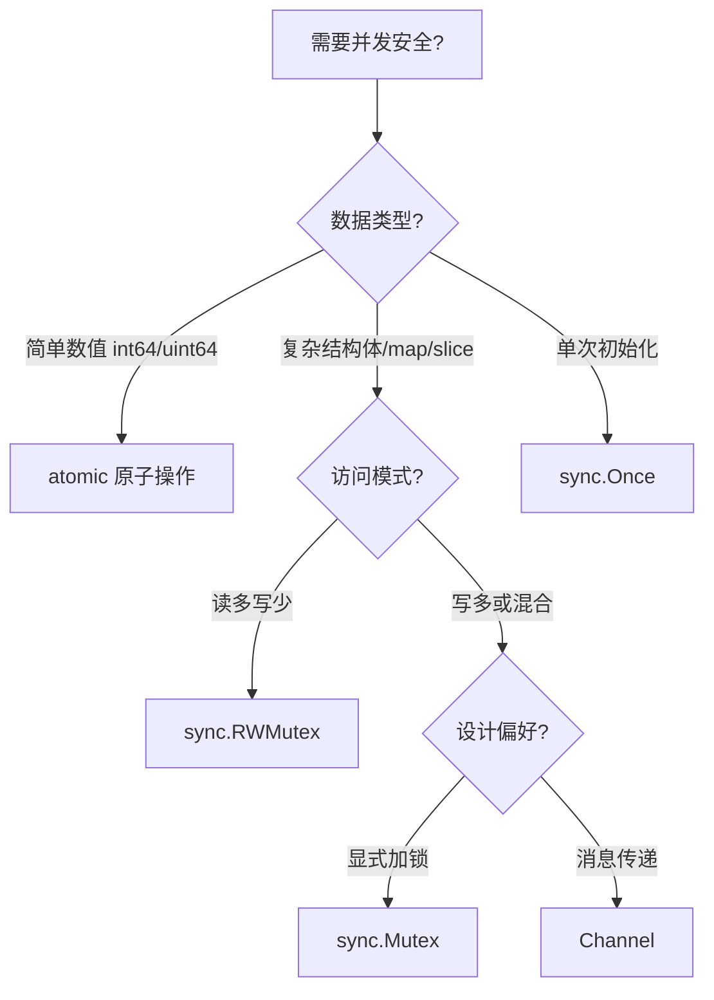

> 多个 goroutine 同时访问共享数据时，就会出现竞态条件。
> Go 提供了四种核心机制来保证并发安全。

---

## 一、为什么需要并发安全？

```go
// 资源竞态示例
var counter int

func increment(wg *sync.WaitGroup) {
    defer wg.Done()
    for i := 0; i < 1000; i++ {
        counter++ // 非原子操作时，读→改→写，这三步之间可被中断
    }
}

func main() {
    var wg sync.WaitGroup//对于sync.WaitGroup下文会讲到
    for i := 0; i < 10; i++ {
        wg.Add(1)
        go increment(&wg)//启动10个协程循环写
    }
    wg.Wait()//等待协程执行完成
    fmt.Println(counter) // 期望 10000，实际往往小于10000
}
```

用 `go run -race` 可自动检测竞态。

---

## 二、四大并发安全机制



---

## 三、方式一：sync.Mutex（互斥锁）

最常用、最直观的方式：

```go
type Counter struct {
    mu      sync.Mutex//原子锁
    counter int
}

func (c *Counter) Inc() {//让counter+=1
    c.mu.Lock()
    defer c.mu.Unlock() // defer 保证解锁
    c.counter++
}

func (c *Counter) Value() int {//获取counter的值
    c.mu.Lock()
    defer c.mu.Unlock()
    return c.counter
}
```

### RWMutex：读多写少场景

```go
type Cache struct {
    mu   sync.RWMutex
    data map[string]string
}

func (c *Cache) Get(key string) string {//获取key的value
    c.mu.RLock()         // 多个 reader 可并发
    defer c.mu.RUnlock()
    return c.data[key]
}

func (c *Cache) Set(key, val string) {//设置key的value
    c.mu.Lock()          // writer 独占
    defer c.mu.Unlock()
    c.data[key] = val
}
```
顺带一提官方提供了并发安全的map：sync.Map，适合读多写少且 key 稳定的场景，可以根据应用场景考虑

---

## 四、方式二：sync/atomic（原子操作）

无锁、高性能，仅适用于简单数值操作：

```go
var counter int64

func increment() {
    atomic.AddInt64(&counter, 1)  // 原子加 1
}

// 支持的操作
atomic.AddInt64(&v, delta)       // 原子加
atomic.LoadInt64(&v)             // 原子读
atomic.StoreInt64(&v, val)       // 原子写
atomic.SwapInt64(&v, new)        // 原子交换，返回旧值
atomic.CompareAndSwapInt64(&v, old, new) // CAS
```

CAS 示例（实现简单的自旋锁）：

```go
var flag int32
if atomic.CompareAndSwapInt32(&flag, 0, 1) {
    defer atomic.StoreInt32(&flag, 0)
    // 临界区
}
```

---

## 五、方式三：Channel 通信同步

Go 官方哲学 —— 「通过通信来共享内存」：

```go
// 用 channel 串行化所有写操作，使其顺序执行
updates := make(chan int, 100)
var counter int

// 唯一能修改 counter 的 goroutine
go func() {
    for inc := range updates {
        counter += inc
    }
}()

var wg sync.WaitGroup
for i := 0; i < 1000; i++ {
    wg.Add(1)
    go func() {
        defer wg.Done()
        updates <- 1 // 发送即同步
    }()
}
wg.Wait()
close(updates) // 等待处理完
```

以及更优雅的方式：状态管理器模式

```go
type command struct {
    op   string
    resp chan int
}

func counterManager(cmdCh <-chan command) {
    counter := 0
    for cmd := range cmdCh {
        switch cmd.op {
        case "inc":
            counter++
        case "get":
            cmd.resp <- counter
        }
    }
}
```

---

## 六、方式四：sync.Once 等同步原语

### sync.Once：单例安全初始化

```go
var (
    instance *Config
    once     sync.Once
)

func GetConfig() *Config {
    once.Do(func() {//即使有多个 goroutine 并发调用 Do，也只有一个会真正执行，其他 goroutine 会阻塞等待执行完成。
        instance = loadConfig() 
    })
    return instance
}
```

### sync.WaitGroup：等待一组 goroutine 完成

```go
var wg sync.WaitGroup
for i := 0; i < 5; i++ {
    wg.Add(1)
    go func(id int) {
        defer wg.Done()
        doWork(id)
    }(i)
}
wg.Wait() // 等待全部完成
```

---

## 七、对比与选型



| 方法 | 适用场景 | 特点 |
|------|---------|------|
| `sync.Mutex` | 通用临界区保护 | 简单，需防死锁 |
| `sync.RWMutex` | 读多写少 | 提升读性能 |
| `sync/atomic` | 简单数值操作 | 无锁，高性能 |
| Channel | 状态集中管理、消息传递 | Go 风格，更清晰 |
| `sync.Once` | 单次初始化 | 线程安全的懒加载 |

---

## 八、核心避坑指南

| 问题 | 正确做法 |
|------|----------|
| 锁粒度太大 | 细粒度锁、读写锁分离、无锁结构 |
| 死锁 | `Lock/Unlock` 成对；用 `defer` |
| 复制含锁结构 | 永远传指针：`func f(*MyStruct)` |
| channel 关闭 panic | 只由 sender 关闭，receiver 检查 `ok` |
| map 并发读写 | `sync.Mutex+map` 封装 或 `sync.Map` |

> 注：`sync.Mutex` 不能复制，`var b = a`这样的拷贝 mutex 会导致锁失效。（因为b的锁是独立的，两个 goroutine 分别持有时锁不互斥）
> ```go
> type S struct{ mu sync.Mutex }
> s1 := S{}
> s2 := s1 // 错误的方法，s2.mu 是副本
> ```

---

## 九、设计心法

| 原则 | 说明 |
|------|------|
| **有共享，必加锁（或原子/通道）** | 「只是读」也可能与写并发，编译器/CPU 重排序引发 UB |
| **信道传值，而非共享内存** | 把「谁来改数据」变成「谁来收消息」 |
| **小锁胜大锁，读写锁分家** | 减少争用 |
| **用封装隐藏并发细节** | Mutex 封进结构体方法 |
| **工具先行：-race + go vet** | 工具审查往往高效可靠得多 |

但是锁的使用也很有讲究，不然就会出现老生常谈的死锁问题
如果希望对锁有更多的了解，可以查阅书籍《深入理解计算机系统》的p719以及往后部分