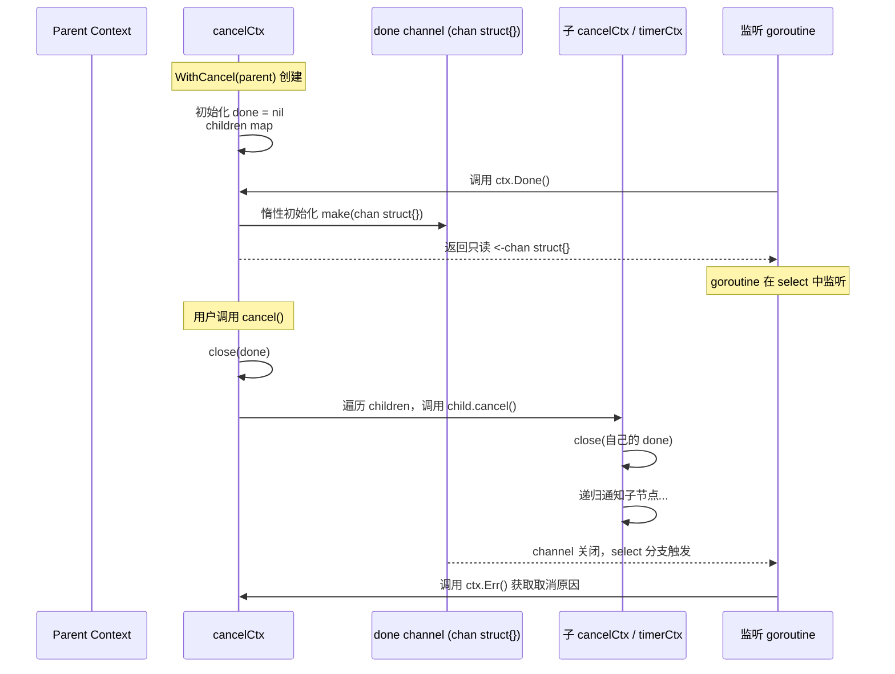
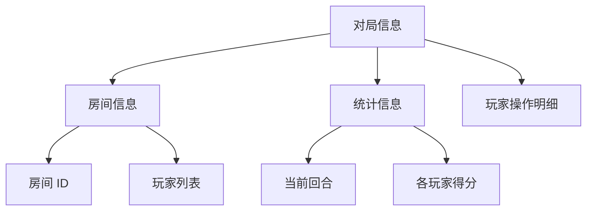
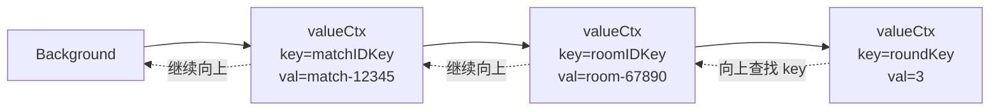
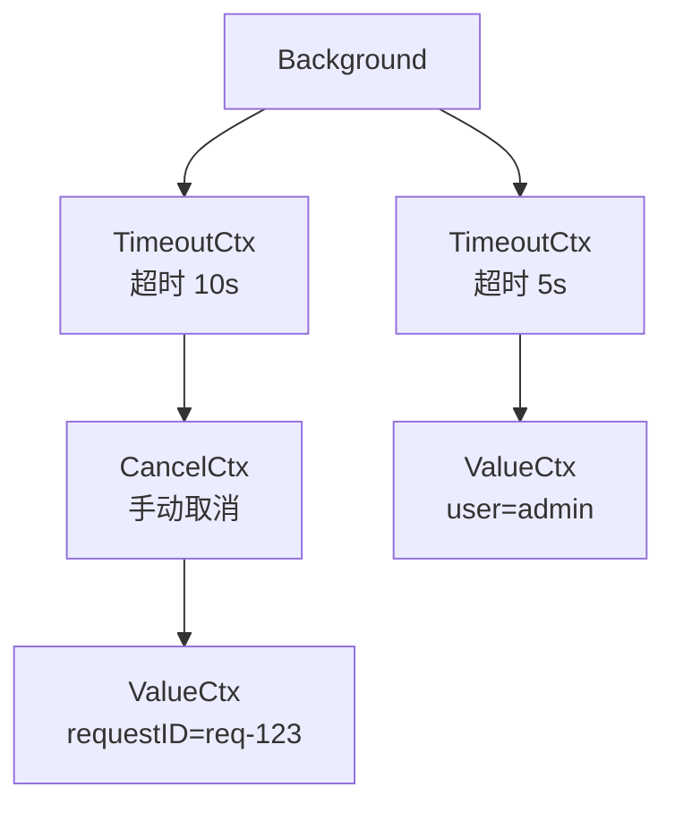
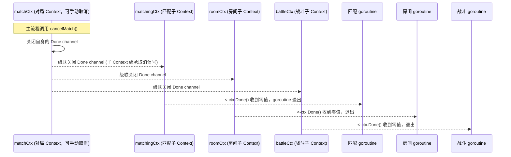

Context 是 goroutine 树状级联取消和超时管理的标准方案，本文覆盖其全部核心知识：创建、传递、取消、超时、值传递与最佳实践。

---

## 一、为什么需要 Context

Channel 可以实现 goroutine 间的通信和简单的逻辑控制：

```go
stop := make(chan bool)
go func() {
    for {
        select {
        case <-stop:
            return
        default:
            // 工作...
        }
    }
}()
stop <- true
```

但这种方式在面对稍复杂的流程控制和信息传递时，就需要编写更多、更复杂的代码，于是 Context 应运而生。

### 1.1 从 Channel 到 Context 的演进

```go
// Channel 方式（手动实现，每个 goroutine 都要重复）
type Worker struct {
    stop chan struct{}
}
func (w *Worker) Run() {
    select {
    case <-w.stop:
        return
    }
}

// Context 方式（统一标准，内置超时/截止/级联）
func worker(ctx context.Context) {
    select {
    case <-ctx.Done():
        return  // 自动支持取消、超时、截止
    }
}
```

---

## 二、Context 的本质

Context 是一个接口，定义了四个核心方法：

```go
type Context interface {
    Deadline() (deadline time.Time, ok bool)  // 返回截止时间
    Done() <-chan struct{}                     // 返回取消信号的 channel
    Err() error                                // 返回取消的err
    Value(key any) any                        // 获取存储在Context里的键值对
}
```

### 核心特性

| 概念 | 说明 |
|------|------|
| **接口类型** | 只有 4 个方法，所有实现都遵循同一契约 |
| **并发安全** | 多个 goroutine 可同时调用任意方法 |
| **不可变性** | Context 一旦创建就不可修改，只能派生新子 Context |
| **树状结构** | 在后面我们会了解到，Context 实际上是树状的 |
| **Done 返回 channel** | 与 Channel 无缝配合，可直接用于 select |

<details>
<summary>知识补充：为什么 Done 返回的是 <-chan struct{} 而不是 chan struct{}</summary>

**`<-chan struct{}` 是只读 channel，这是 Go 语言层面的访问控制最佳实践。**

```go
// 接口定义（只读，接收方只能监听，不能关闭）
Done() <-chan struct{}

// 内部实现（可写，只有 Context 自己可以关闭）
type cancelCtx struct {
    done chan struct{}  // 实际是可读可写的
}

func (c *cancelCtx) Done() <-chan struct{} {
    return c.done  // 返回时隐式转换为只读
}
```

**为什么这样设计？**

| 设计 | 原因 |
|------|------|
| **只有发送方应该关闭 channel** | Context 是 channel 的「所有者」，只有它知道何时该关闭 |
| **防止误关闭** | 调用方如果拿到 `chan struct{}` 可能错误调用 `close()`，导致 panic |
| **语义清晰** | `<-chan struct{}` 明确表达「我只能从中读取取消信号，不能往里面写」 |

这与 Channel 文章中的核心原则一致：**谁创建（谁发送），谁关闭。接收方永不主动 close。**

</details>

---

## 三、获取 Context

Go 提供了多种创建/派生 Context 的方式。

### 3.1 空白 Context

```go
ctx := context.Background()  // 返回一个空白context.Context对象,无取消能力,可以作为其他Context的根
```

```go
ctx := context.TODO()// 和Background一样返回一个空白context.Context对象,表示目前还不知道要做什么的时候占位
```

| 方法 | 返回值 | 用途 |
|------|--------|------|
| `Background()` | 空 Context | main 函数、初始化、测试的根 Context |
| `TODO()` | 空 Context | 占位符，表示「还不知道用什么 Context」 |

### 3.2 带主动取消的 Context

在实际开发中，我们经常需要并行启动多个任务（例如同时查询多个数据源、批量下载文件等）。假设在游戏服务器中，用户发起匹配，但如果中途失去耐心，点击了“取消匹配”按钮或关闭了页面，我们就必须立刻停止所有正在执行的后台操作，而不是任由它们继续消耗资源。

Go 语言的 `context` 包为此提供了优雅的解决方案：通过 `context.WithCancel` 派生出一个可以手动触发取消的上下文，当需要中止所有相关工作时，只需调用它返回的 `cancel` 函数，所有监听该上下文的 goroutine 就会立刻通过 `ctx.Done()` 通道收到信号，从而安全退出。

下面这个例子模拟了上述过程：主程序启动两个执行模拟工作的 goroutine，它们不断检查是否收到取消信号；5 秒后，主程序调用 `cancel()`，两个 worker 几乎同时停止运行。

```go
// 定义一个工作函数
func worker(ctx context.Context, name string) {
    var count = 1
    for {
        select {
        case <-ctx.Done():
            // 收到取消信号
            fmt.Printf("[%s] 收到取消信号，准备退出: %v\n", name, ctx.Err())
            return
        default:
            fmt.Printf("[%s] 正在匹配中,第%v秒\n", name, count)
            count++
            time.Sleep(1 * time.Second)
        }
    }
}

func main() {
    root := context.Background()
    ctx, cancel := context.WithCancel(root) // 返回子Context和一个用于取消的函数
    // 在另一个 goroutine 中主动取消

    // 启动工作 goroutine
    go worker(ctx, "玩家1")
    go worker(ctx, "玩家2")

    // 5秒后两个用户取消匹配
    time.Sleep(5 * time.Second)
    fmt.Println("\n[Main] 发送取消信号...")
    cancel() // 关闭所有 worker 的 ctx.Done() channel

    // 让主程序运行足够长时间看到效果
    time.Sleep(8 * time.Second)
    fmt.Println("[Main] 程序退出")
}
```



### 3.3 带超时的 Context

现实场景中还有一种更常见的需求：**我们并不指望用户手动取消，而是希望系统能在规定时间内自动放弃，避免无限等待**。比如发起网络请求、连接游戏服务器、执行数据库查询，这些操作都应该有一个最大等待时间。一旦超时，程序就要立刻停止尝试，释放资源，转而执行降级逻辑。

Go 的 `context` 包提供了 `WithTimeout` 和 `WithDeadline`，允许我们创建带有“截止时间”的上下文。当超时发生时，`ctx.Done()` 会被自动关闭，监听它的 goroutine 便能立即收到退出信号，完全不需要手动调用 `cancel`（但配套的 `cancel` 函数仍建议通过 `defer` 调用来避免资源泄漏）。

#### WithTimeout 示例

下面用一个游戏连接服务器的例子来演示：假设客户端在发起匹配后必须在 5 秒内成功连接游戏服务器，否则就放弃并返回大厅。

```go
// 创建一个 5 秒超时的 context
ctx, cancel := context.WithTimeout(context.Background(), 5*time.Second)
defer cancel() // 习惯性调用，防止资源泄漏
```

更完整的演示代码：

```go
// connectToServer 模拟反复尝试连接服务器，直到成功或超时。
func connectToServer(ctx context.Context, addr string) error {
    attempt := 1
    for {
        select {
        case <-ctx.Done():
            // 超时（或取消）触发
            fmt.Printf("连接 %s 超时，停止尝试，返回大厅\n", addr)
            return ctx.Err()
        default:
            fmt.Printf("正在尝试连接 %s (第 %d 次)...\n", addr, attempt)
            // 假设第 10 次尝试才会成功，但我们的超时只有 5 秒
            if attempt >= 10 {
                fmt.Printf("成功连接到 %s！\n", addr)
                return nil
            }
            attempt++
            time.Sleep(1 * time.Second) // 每次尝试间隔 1 秒
        }
    }
}

func main() {
    // 创建一个 5 秒超时的 context
    ctx, cancel := context.WithTimeout(context.Background(), 5*time.Second)
    defer cancel()

    fmt.Println("开始连接游戏服务器...")
    err := connectToServer(ctx, "game-server:8080")
    if err != nil {
        fmt.Printf("连接失败: %v\n", err)
    }
    fmt.Println("已返回大厅。")
}
```

- `connectToServer` 每 1 秒尝试一次连接，真正成功需要第 10 次尝试（10 秒）。
- `context.WithTimeout` 设定的超时是 5 秒，因此实际只会尝试约 5 次，之后 `ctx.Done()` 被关闭，函数立即收到信号并返回 `context.DeadlineExceeded` 错误。
- 主程序捕获到错误后，输出失败信息，模拟了“连接超时返回大厅”的效果。

#### WithDeadline 示例

有时我们需要一个**绝对的时间点**来触发取消，比如游戏公告提示“今晚 22:00 进行停机维护”，那么在 22:00 这一刻，所有进行中的匹配、交易、聊天等功能都应该立刻收到取消信号。`context.WithDeadline` 就是为这类场景量身打造的。

```go
deadline := time.Now().Add(3 * time.Second)          // 模拟 3 秒后停服
ctx, cancel := context.WithDeadline(parentCtx, deadline)
defer cancel()
```

更完整的演示代码：

```go
// 模拟一场战斗，直到收到取消信号或超时
func battle(ctx context.Context, player string) {
    round := 1
    for {
        select {
        case <-ctx.Done():
            fmt.Printf("[%s] 收到停服通知，战斗中止: %v\n", player, ctx.Err())
            return
        default:
            fmt.Printf("[%s] 第 %d 回合战斗中...\n", player, round)
            round++
            time.Sleep(1 * time.Second)
        }
    }
}

func main() {
    parentCtx := context.Background()
    // 假设当前时间是 20:00:00，停服时间在 3 秒后的 20:00:03
    deadline := time.Now().Add(3 * time.Second)
    ctx, cancel := context.WithDeadline(parentCtx, deadline)
    defer cancel()

    fmt.Printf("停服时间设定在: %s\n", deadline.Format("15:04:05"))
    go battle(ctx, "Player-1")
    go battle(ctx, "Player-2")

    // 等待足够长时间观察停服效果
    time.Sleep(5 * time.Second)
    fmt.Println("所有玩家已返回大厅。")
}
```

**运行效果分析：**  
设定停服的绝对时间为当前时间后的 3 秒，两个玩家的战斗 goroutine 在启动后每 1 秒执行一回合。3 秒后，`ctx.Done()` 被自动关闭，两个 goroutine 几乎同时收到信号并退出。主程序再等一会儿，观察到战斗全部中止。

<details>
<summary>WithTimeout 与 WithDeadline 的关系</summary>

两者在底层是同一套机制，`WithTimeout` 内部其实就是对 `WithDeadline` 的封装：

```go
func WithTimeout(parent Context, timeout time.Duration) (Context, CancelFunc) {
    return WithDeadline(parent, time.Now().Add(timeout))
}
```

</details>

### 3.4 带数据传递的 Context

想象你正在开发一个游戏后端，创建对局时通常需要执行一系列步骤：

1. 验证玩家身份与权限
2. 匹配对手并生成对局 ID
3. 分配房间，创建房间 ID
4. 初始化游戏状态（回合、积分等）
5. 加载地图或场景数据
6. 进入回合循环，处理玩家操作
7. 实时记录操作日志与统计信息……

每一步都可能是一个独立的函数。可问题是，**玩家 ID、房间 ID、请求追踪 ID** 这些信息，几乎每一步都会用到。如果按最朴素的写法，函数签名会变成：

```go
func processMatch(matchID, playerID string)
func processRoom(matchID, playerID, roomID string) 
func processStats(matchID, playerID, roomID string, round int) 
```

当函数层层调用、越传越深时，你会发现大部分函数其实只是“经手”这些 ID，并不真正关心它们，却不得不把这些参数全写上去。如果某天需要再多传一个“区服 ID”或“登录渠道”，所有签名都得改一遍。

**问题的本质**是：这些数据不是某个函数的“职责”，而是整个请求链路共享的**背景信息**。Go 的 `context.Context` 正是为此设计的。

回到场景：匹配成功后拿到对局信息，对局信息往下又会有房间信息、统计信息……这些数据天然就是一层层展开的，像一棵树：



如果我们把“对局”这个背景放进 Context，并在每一层把新的数据挂上去：

```go
// 将需要传递的数据放入 Context
ctx := context.Background()      // 示例用空白 Context
MatchID := "123456"
playerID := "player123"
// 为 ctx 加入一个键值对：key=MatchID，value=playerID
ctx = context.WithValue(ctx, MatchID, playerID)
```

所有下层逻辑（房间管理、统计计算、操作记录）就都可以从这个“背包”里取出自己需要的那份数据，而不必让中间函数事必躬亲地传递。取值也很简单：

```go
playerID, ok := ctx.Value(MatchID).(string) // 获取对应匹配 ID 的玩家信息
if !ok {                                    // 该键如果不存在
    fmt.Printf("键值对不存在!")
}
fmt.Printf("获取到了玩家ID:%s", playerID)
```

这样一来，**数据沿着调用链的“枝干”自动向下流淌**，每个节点只取自己关心的部分。这棵树该怎么长、新枝该挂在哪里，都可以在入口处统一配置，而不用沿途修改每一个函数签名。

下面是用 Context 实现整个创建对局流程的完整示例：

```go
// 实际开发中推荐定义自定义类型作为 context 中的 key，避免与其他包或第三方库的 key 冲突。
type contextKey string

const (
    matchIDKey contextKey = "matchID" // 存储对局 ID 的 key
    roomIDKey  contextKey = "roomID"  // 存储房间 ID 的 key
    roundKey   contextKey = "round"   // 存储当前回合数的 key
)

// 演示用 Context 传递链路信息
func main() {
    ctx := context.Background()

    matchID := "match-12345"
    // 每增加一层信息，通过 context.WithValue 派生新 Context，而不是修改父 Context，保证并发安全和不可变性。
    ctx = context.WithValue(ctx, matchIDKey, matchID) // 将 matchID 放入 Context 中

    // 调用对局处理函数，并把这个携带了对局 ID 的 ctx 传递下去
    processMatch(ctx)
}

// processMatch 处理对局逻辑，它从 ctx 中取出对局 ID，然后派生新的子 Context 给房间处理。
func processMatch(ctx context.Context) {
    matchID, ok := ctx.Value(matchIDKey).(string)
    if !ok {
        fmt.Println("matchID 不存在")
        return
    }
    fmt.Printf("[对局] 开始处理对局: %s\n", matchID)

    // 接下来需要进入房间处理，我们把房间 ID 也放进 Context
    roomID := "room-67890"
    roomCtx := context.WithValue(ctx, roomIDKey, roomID) // 父 ctx 中的 matchID 依然可用
    processRoom(roomCtx)
}

// processRoom 处理房间逻辑，它既能拿到对局 ID（来自父 Context），又能拿到房间 ID（当前 Context）。
func processRoom(ctx context.Context) {
    matchID, _ := ctx.Value(matchIDKey).(string)
    roomID, ok := ctx.Value(roomIDKey).(string)
    if !ok {
        fmt.Println("roomID 不存在")
        return
    }
    fmt.Printf("[房间] 对局: %s, 房间: %s\n", matchID, roomID)

    // 进一步派生统计信息 Context，放入当前回合数
    statsCtx := context.WithValue(ctx, roundKey, 3)
    processStats(statsCtx)
}

// processStats 处理统计逻辑，能拿到所有上层存入的信息：对局 ID、房间 ID、当前回合数。
func processStats(ctx context.Context) {
    matchID, _ := ctx.Value(matchIDKey).(string)
    roomID, _ := ctx.Value(roomIDKey).(string)
    round, ok := ctx.Value(roundKey).(int)
    if !ok {
        fmt.Println("round 不存在")
        return
    }
    fmt.Printf("[统计] 对局: %s, 房间: %s, 当前回合: %d\n", matchID, roomID, round)
}
```

运行上述代码，你会看到清晰的分层输出，每一层函数都能方便地获取到整条链路上累积的共享信息，而函数签名却始终保持简洁。

<details>
<summary>Value 的树状存储与线性查找机制</summary>

其结构是类似树状的，查找效率为 O(N)，会从当前层级往上级查找直到找到为止。

带数据的 Context 的源码实现：

```go
// 位于文件 src/context/context.go 中
type valueCtx struct {
    Context
    key, val any
}

func WithValue(parent Context, key, val any) Context {
    if parent == nil {
        panic("cannot create context from nil parent")
    }
    if key == nil {
        panic("nil key")
    }
    if !reflectlite.TypeOf(key).Comparable() {
        panic("key is not comparable")
    }
    return &valueCtx{parent, key, val}
}

func (c *valueCtx) Value(key any) any {
    if c.key == key {
        return c.val
    }
    return value(c.Context, key)
}

func value(c Context, key any) any {
    for {
        switch ctx := c.(type) {
        case *valueCtx:
            if key == ctx.key {
                return ctx.val
            }
            c = ctx.Context
        case *cancelCtx:
            if key == &cancelCtxKey {
                return c
            }
            c = ctx.Context
        case withoutCancelCtx:
            if key == &cancelCtxKey {
                return nil
            }
            c = ctx.c
        case *timerCtx:
            if key == &cancelCtxKey {
                return &ctx.cancelCtx
            }
            c = ctx.Context
        case backgroundCtx, todoCtx:
            return nil
        default:
            return c.Value(key)
        }
    }
}
```



</details>

<details>
<summary>context.WithoutCancel：让子 Context 脱离父 Context 的取消</summary>

还有一种特别的让子 Context 与父 Context 取消周期切割的 Context，但数据仍有继承。这种类型一般用得很少。

```go
ctx := context.Background()
noCancel := context.WithoutCancel(ctx)
```

`WithoutCancel` 返回一个派生的上下文，该上下文指向父上下文，但是当父上下文被取消时，此返回的上下文不会被取消。返回的上下文没有截止时间（Deadline）或错误（Err），其 Done 通道为 nil。在返回的上下文上调用 `Cause` 函数会返回 nil。

</details>

### 3.5 完整示例：多层派生

由此，我们就可以组合出多种多样的灵活用法：

```go
// 根 Context
bg := context.Background()

// 第一层：带超时
timeoutCtx, cancel1 := context.WithTimeout(bg, 10*time.Second)
defer cancel1()

// 第二层：带取消
cancelCtx, cancel2 := context.WithCancel(timeoutCtx)
defer cancel2()

// 第三层：带值
valueCtx := context.WithValue(cancelCtx, "requestID", "req-123")

// 当 cancel2() 被调用时，valueCtx 也会收到取消信号
// 当 10 秒超时到达时，cancel1 自动触发，cancelCtx 和 valueCtx 也都会收到信号
```

---

## 四、Context 的核心机制：树状层级与级联取消

Context 除了存储，取消机制实际上是树状的，所以取消是级联取消的。



### 4.1 级联取消的工作原理

级联取消意味着：当树中的任意一个节点被取消（无论是超时、截止时间到达，还是手动调用 `cancel`），**其下所有子孙节点都会同步收到取消信号**。例如一局游戏结束后，或者服务器崩溃时，所有相关的子任务（匹配、战斗、日志记录）都应该被一并终止。

```go
// 模拟一个可以在游戏主循环中随时被取消的子任务。
func worker(ctx context.Context, name string) {
    for {
        select {
        case <-ctx.Done():
            fmt.Printf("[%s] 收到取消信号，安全退出: %v\n", name, ctx.Err())
            return
        default:
            fmt.Printf("[%s] 工作中...\n", name)
            time.Sleep(500 * time.Millisecond)
        }
    }
}

func main() {
    // 1. 根 Context：整个游戏进程的起点
    bg := context.Background()

    // 2. 创建一场“对局”的 Context，可手动取消（例如玩家退出或对局结束）
    matchCtx, cancelMatch := context.WithCancel(bg)
    defer cancelMatch() // 确保即使提前 return 也能释放资源，防止 goroutine 泄漏

    // 3. 基于对局 Context 派生各个子模块的 Context
    matchingCtx, cancelMatching := context.WithCancel(matchCtx)
    defer cancelMatching()

    roomCtx, cancelRoom := context.WithCancel(matchCtx)
    defer cancelRoom()

    battleCtx, cancelBattle := context.WithCancel(matchCtx)
    defer cancelBattle()

    // 4. 启动多个 goroutine 代表不同的游戏子系统
    go worker(matchingCtx, "对局匹配")
    go worker(roomCtx, "房间管理")
    go worker(battleCtx, "战斗结算")

    // 5. 模拟对局持续 2 秒后结束
    time.Sleep(2 * time.Second)
    fmt.Println("\n>>> 对局结束，取消所有相关任务！")
    cancelMatch() // 关闭 matchCtx 的 Done channel，所有子 Context 级联取消

    // 6. 留一点时间让 goroutine 完成退出打印
    time.Sleep(1 * time.Second)
    fmt.Println("所有子系统已安全退出，资源已释放。")
}
```



### 4.2 类比理解：传统面向对象（OOP）的继承

| OOP概念 | Context 对应 |
|---------|-------------|
| 父类 | 父 Context |
| 子类派生 | `WithCancel(parent)` |
| 继承父类属性 | 子 Context 拥有父 Context 的 deadline 和取消信号 |
| 重写/覆盖 | 子 Context 可以有自己的超时（更严格的限制） |
| 父类销毁 | 父 Context 取消 → 所有子 Context 自动取消 |

**关键区别**：OOP 子类可以独立存在，但 Context 子节点永远无法脱离父节点存活。父 Context 取消，子 Context 亦然。

<details>
<summary>4.3 进阶：AfterFunc——当 Context 取消时自动执行回调</summary>

### 函数签名与基本行为

```go
func AfterFunc(ctx context.Context, f func()) (stop func() bool)
```

- **参数**  
  - `ctx`：需要监听取消事件的 Context。  
  - `f`：当 `ctx` 被取消时要执行的函数（无参数、无返回值）。  
- **返回值**  
  - `stop`：一个可以调用它来取消 `f` 调度的函数。`stop` 返回 `true` 表示成功取消了即将执行的回调；返回 `false` 表示回调已经执行或已经开始执行（无法取消）。

#### 关键特性

1. **异步执行**：`f` 会在一个独立的 goroutine 中运行，不会阻塞调用 `AfterFunc` 的 goroutine。  
2. **只执行一次**：无论 Context 被取消多少次（或通过 `stop` 取消调度），`f` 最多只会被调用一次。  
3. **即时生效**：如果调用 `AfterFunc` 时，`ctx` **已经被取消**，那么 `f` 会**立即**被调度执行。  
4. **可撤销**：通过 `stop` 函数，你可以在回调尚未发生时阻止它运行。

#### 为什么需要 AfterFunc？

在没有 `AfterFunc` 的时代，我们只能这样做：

```go
// 旧模式：手动启动一个 goroutine 监听取消
go func() {
    <-ctx.Done()
    doCleanup()
}()
```

这段代码虽然简单，但存在几个问题：

- 无法取消（如果后来发现不需要清理了，无法阻止 `doCleanup` 执行）。
- 容易产生 goroutine 泄漏（如果 `ctx` 永远不会取消，这个 goroutine 会永远等待）。
- 如果 `ctx` 已经被取消，虽然 `<-ctx.Done()` 会立即返回，但创建 goroutine 的动作本身仍有一点延迟和资源开销。

而 `AfterFunc` 提供了一种**声明式**、**可取消**、**更安全**的方式。

#### 核心用法示例

##### 基础示例：超时时的资源清理

模拟一个游戏服务器，如果超时则关闭连接。

```go
func main() {
    ctx, cancel := context.WithTimeout(context.Background(), 2*time.Second)
    defer cancel()

    stop := context.AfterFunc(ctx, func() {
        fmt.Println("[AfterFunc] 超时发生，执行清理逻辑（如关闭连接）")
    })

    time.Sleep(1 * time.Second)
    fmt.Println("查询完成，正常返回结果")

    if stop() {
        fmt.Println("成功取消了超时回调")
    } else {
        fmt.Println("回调已经执行或正在执行")
    }

    <-ctx.Done()
    fmt.Println("主程序退出")
}
```

##### 嵌套回调与级联取消

`AfterFunc` 不影响原有的 Context 取消链，你可以为树状 Context 的每一层独立注册回调。

```go
func main() {
    rootCtx, rootCancel := context.WithCancel(context.Background())
    defer rootCancel()

    rootStop := context.AfterFunc(rootCtx, func() {
        fmt.Println("根 Context 被取消，执行全局清理")
    })
    defer rootStop()

    childCtx, childCancel := context.WithCancel(rootCtx)

    childStop := context.AfterFunc(childCtx, func() {
        fmt.Println("子 Context 被取消，执行局部清理")
    })
    defer childStop()

    childCancel()
    time.Sleep(100 * time.Millisecond)

    rootCancel()
}
```

#### 注意事项

- 回调函数不能依赖 `ctx` 的状态（此时 `ctx` 已被取消），应提前取出需要的值。
- `stop` 只能阻止尚未开始的回调，无法终止正在运行中的回调。
- 如果 Context 永不取消（如 `context.Background()`），不要使用 `AfterFunc`，否则会导致 goroutine 泄漏。

</details>

---

## 五、Context 传递的规则与模式

### 5.1 函数签名规范

```go
// 正确：Context 作为第一个参数
func DoSomething(ctx context.Context, arg string) error

// 错误：Context 不在第一位
func DoSomething(arg string, ctx context.Context) error

// 错误：将 Context 存入结构体（除非是特殊框架）
type Worker struct {
    ctx context.Context  // 一般不推荐
}
```

### 5.2 传递规则速查

| 规则 | 说明 |
|------|------|
| **显式传递** | Context 要作为显式参数传递，不存入结构体 |
| **第一参数** | Context 永远是函数的第一个参数 |
| **参数命名** | 参数名统一叫 `ctx` |
| **不传 nil** | 不知道用什么 Context 时传 `context.TODO()` |
| **不包装成自定义类型** | 直接使用标准 Context 接口 |

### 5.3 与 Channel 协同：select 模式

```go
func worker(ctx context.Context, jobs <-chan Job, results chan<- Result) {
    for {
        select {
        case <-ctx.Done():
            fmt.Println("worker stopped:", ctx.Err())
            return
        case job, ok := <-jobs:
            if !ok {
                return  // jobs channel 关闭
            }
            result := process(job)
            select {
            case <-ctx.Done():
                return
            case results <- result:
            }
        }
    }
}
```

---

## 六、常见陷阱速查

| 陷阱 | 原因 | 解决方案 |
|------|------|----------|
| **goroutine 泄漏** | 创建了 WithCancel 但忘记调用 cancel | 始终 `defer cancel()` |
| **Context 值滥用** | 把可变对象塞进 Value | 只用 Value 传递不可变、请求作用域的数据 |
| **循环导入** | 在低层包中定义 key 类型 | key 类型定义在使用方包内 |
| **父 Context 取消后继续使用** | 未检查 ctx.Done() | 所有耗时操作前检查 `select { case <-ctx.Done(): ... }` |
| **类型断言 panic** | Value 返回的 any 类型断言失败 | 使用 `v, ok := ctx.Value(key).(string)` 双返回值 |
| **传递 nil Context** | 函数入参为 nil | 用 `context.TODO()` 代替 nil |
| **超时时间过短** | 忽略实际业务耗时 | 根据 P99 耗时设置合理超时 |
| **Value 链路过长** | 层层 WithValue | 控制在合理深度（< 10 层） |

---

## 七、性能考虑

| 操作 | 开销 | 建议 |
|------|------|------|
| `Background()` / `TODO()` | 几乎为零 | 随意使用 |
| `WithCancel()` | 创建 channel，微小 | 按需创建，及时 defer cancel |
| `WithTimeout()` / `WithDeadline()` | 创建 timer，有 GC 压力 | 避免同一时间创建大量（> 10w）超时 Context |
| `WithValue()` 和 `Value()` | O(N) 链式查找，N = 父 Context 数量 | 深度控制在 10 以内，不用于高频调用路径 |
| `Done()` 返回 channel | 无额外开销 | 放心使用 |


> 至此，我们从 **Channel** 到 **Context**，完成了 Go 并发编程中两块核心拼图的系统学习。Channel 负责 goroutine 之间的“通信”，而 Context 则管理 goroutine 树状生命周期的“控制”。两者相辅相成，共同支撑起 Go 语言高并发、高可用的工程实践。
>
> 如果您还没有读过上一篇关于 Channel 的详细解析，建议先补上这一课：
>
> 👉 [Go Channel 解析：原理与实践](https://juejin.cn/post/7639672225034518537)
>
> 掌握 Channel 的通信本质，再结合本文的 Context 控制艺术，你就能在 Go 并发世界里写出更清晰、更健壮、更可控的代码。
