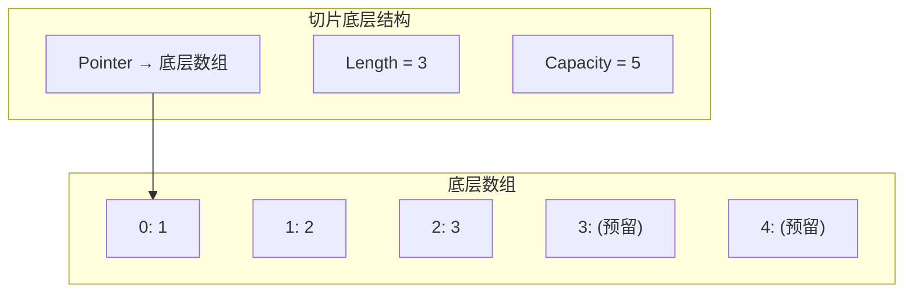
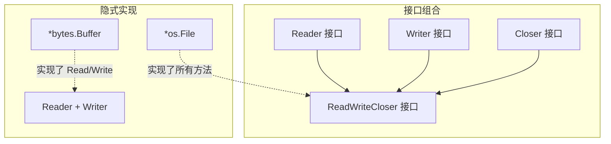

> Go 是 Google 于 2009 年发布的一门静态类型、编译型语言，以简洁、高效、并发友好著称。

---

## 一、为什么选择 Go？

Go 的设计哲学浓缩为三个关键词：**简洁、高效、工程化**。

| 特性 | 说明 |
|------|------|
| **静态编译** | 单文件二进制，无运行时依赖，`go build` 一条命令搞定 |
| **GC 自动内存管理** | 有垃圾回收，但没有虚拟机；介于 C 和 Java 之间 |
| **天然并发** | goroutine + channel，语言级并发原语 |
| **语法简单** | 25 个关键字|
| **工程化工具链** | 自带 `fmt`、`test`、`mod`、`pprof`、`trace` 等工具 |
| **快速编译** | 大型项目秒级编译，依赖管理清晰 |

---

## 二、环境安装与第一个程序

### 2.1 安装

从 [go.dev/dl](https://go.dev/dl/) 下载安装包。安装后验证：

```bash
go version
# go version go1.22.0 windows/amd64
```

### 2.2 工作区（Go Modules）

Go 1.16+ 默认使用 modules。创建一个项目：

```bash
mkdir hello-go && cd hello-go
go mod init hello-go   # 初始化模块，生成 go.mod
```

### 2.3 Hello World

```go
// main.go
package main

import "fmt"

func main() {
    fmt.Println("Hello, Go!")
}
```

```bash
go run main.go     # 编译并运行
go build           # 编译为可执行文件
```

**程序结构要点**：

| 要素 | 说明 |
|------|------|
| `package main` | 可执行程序的包必须为 `main` |
| `import "fmt"` | 导入标准库的格式化输出包 |
| `func main()` | 程序入口函数，无参数无返回值 |
| 分号 | 编译期自动插入，不需要写 `;` |

---

## 三、变量、常量与基本类型

### 3.1 变量声明

```go
// 方式一：完整声明
var name string = "Go"

// 方式二：类型推断
var version = 1.22

// 方式三：短变量声明（仅函数内可用）
count := 100

// 批量声明
var (
    a int    = 1
    b string = "hello"
    c bool   = true
)
```

<details>
<summary>点击展开：短变量声明的隐藏陷阱</summary>

`:=` 只能在函数内使用，包级别必须用 `var`。另外，`:=` 在与已声明变量混用时可能会**重新声明**（而非赋值）—— 只要左侧至少有一个新变量即可：

```go
f, err := os.Open("a.txt")   // err 首次声明
f2, err := os.Open("b.txt")  // err 被重新赋值（不是新声明），合法

// 但如果在同一作用域：
err := doSomething() // 编译错误：左侧无新变量
err = doSomething()  // 正确：赋值
```

</details>

### 3.2 基本类型

| 类别 | 类型 | 说明 |
|------|------|------|
| 布尔 | `bool` | `true` / `false` |
| 整数 | `int`, `int8`, `int16`, `int32`, `int64` | `int` 在 64 位系统上为 64 位 |
| 无符号 | `uint`, `uint8`(`byte`), `uint16`, `uint32`, `uint64` | `byte` 是 `uint8` 的别名 |
| 浮点 | `float32`, `float64` | 默认 `float64` |
| 复数 | `complex64`, `complex128` | 内置支持 |
| 字符串 | `string` | UTF-8 编码，不可变 |
| 别名 | `rune` | `int32` 的别名，表示 Unicode 码点 |

```go
var (
    isActive bool    = true
    age      int     = 25
    price    float64 = 19.99
    name     string  = "你好，世界"  // UTF-8 原生支持
    char     rune    = '中'         // 单引号为 rune
    raw      byte    = 'A'          // byte 是 uint8
)
```

### 3.3 零值

未初始化的变量会被赋予**零值**（zero value），没有 `undefined` 或 `null`：

```go
var i int       // 0
var f float64   // 0.0
var s string    // ""（空字符串，不是 nil）
var b bool      // false
var p *int      // nil
```

### 3.4 常量

```go
const Pi = 3.14159
const (
    StatusOK       = 200
    StatusNotFound = 404
)

// iota：枚举生成器
const (
    Monday = iota + 1  // 1
    Tuesday            // 2
    Wednesday          // 3
    Thursday           // 4
    Friday             // 5
)
```

---

## 四、控制流

### 4.1 if / else

```go
x := 10
if x > 5 {
    fmt.Println("大于5")
} else if x == 5 {
    fmt.Println("等于5")
} else {
    fmt.Println("小于5")
}

// 惯用写法：在 if 前执行简短语句
if err := doSomething(); err != nil {
    fmt.Println("出错:", err)
    return
}
// err 的作用域仅限于 if-else 块
```

### 4.2 for —— Go 唯一的循环关键字

Go 没有 `while`，所有循环都由 `for` 完成：

```go
// 标准 for
for i := 0; i < 5; i++ {
    fmt.Println(i)
}

// while 风格
sum := 1
for sum < 1000 {
    sum += sum
}

// 无限循环
for {
    // ...
    break
}

// range 遍历
arr := []int{1, 2, 3}
for idx, val := range arr {
    fmt.Printf("arr[%d] = %d\n", idx, val)
}
```

### 4.3 switch

```go
// 不需要 break，默认自带 fallthrough 禁用
switch day {
case "Mon":
    fmt.Println("周一")
case "Tue", "Wed":   // 多值匹配
    fmt.Println("周二或周三")
default:
    fmt.Println("其他")
}

// 无表达式的 switch = 简化 if-else 链
score := 85
switch {
case score >= 90:
    fmt.Println("优秀")
case score >= 60:
    fmt.Println("及格")
default:
    fmt.Println("不及格")
}
```

---

## 五、函数

### 5.1 基本语法

```go
// 函数声明
func add(a int, b int) int {
    return a + b
}

// 同类型参数可简写
func add(a, b int) int {
    return a + b
}
```

### 5.2 多返回值

Go 原生支持多返回值，这是它**区别于大多数语言的核心特性之一**：

```go
// 返回两个值：结果和错误
func divide(a, b float64) (float64, error) {
    if b == 0 {
        return 0, errors.New("除数不能为零")
    }
    return a / b, nil
}

// 调用
result, err := divide(10, 3)
if err != nil {
    fmt.Println("出错:", err)
    return
}
fmt.Println(result)  // 3.333...
```

### 5.3 命名返回值

```go
// 命名返回值，return 后可省略变量名（裸返回）
func split(sum int) (x, y int) {
    x = sum * 4 / 9
    y = sum - x
    return  // 等价于 return x, y
}
```

> **慎用裸返回**：在小函数中可读性好，但在 10 行以上的函数中会降低可读性。

### 5.4 defer —— 延迟执行

`defer` 在函数返回前执行，参数在 `defer` 语句处求值：

```go
func readFile(path string) error {
    f, err := os.Open(path)
    if err != nil {
        return err
    }
    defer f.Close()  // 函数返回时自动关闭文件,无论过程如何(包括程序崩溃)都一定会在末尾执行

    // 读取文件...
    return nil
}
```

**执行顺序**：多个 `defer` 按**后进先出**（LIFO）顺序执行，像摞盘子：

```go
defer fmt.Println("1")
defer fmt.Println("2")
defer fmt.Println("3")
// 输出: 3 2 1
```

| defer 用途 | 示例 |
|------------|------|
| 关闭资源 | `defer f.Close()` |
| 释放锁 | `defer mu.Unlock()` |
| 记录耗时 | `defer timeTrack(time.Now())` |
| 捕获 panic | `defer func() { if r := recover(); r != nil { ... } }()` |

---

## 六、复合类型：数组、切片、Map

### 6.1 数组（固定长度）

```go
var arr [3]int = [3]int{1, 2, 3}
arr2 := [...]int{1, 2, 3}  // 编译器推断长度
fmt.Println(arr[0])         // 1
fmt.Println(len(arr))       // 3
```

| 特性 | 说明 |
|------|------|
| 长度是类型的一部分 | `[3]int` 和 `[4]int` 是不同类型 |
| 值类型 | 赋值会**复制整个数组** |
| 实际很少用 | 日常编程用切片（slice） |

### 6.2 切片（Slice）—— 动态数组

切片是 Go 中使用最频繁的数据结构，底层是对数组的引用：

```go
// 创建切片
s1 := []int{1, 2, 3}           // 字面量
s2 := make([]int, 3, 5)        // make(type, len, cap)，len=3, cap=5,创建一个初始大小为3,最大上限为5的[]int类型的切片
s3 := arr[1:3]                 // 从数组切片，左闭右开 [1,3)

// 追加元素
s1 = append(s1, 4, 5)          // 返回新切片（可能重新分配底层数组）

// 遍历
for i, v := range s1 {
    fmt.Printf("s1[%d] = %d\n", i, v)
}
```



| 操作 | 行为 |
|------|------|
| `len(s)` | 切片当前元素个数 |
| `cap(s)` | 切片容量（底层数组大小） |
| `append(s, v)` | 追加元素，超出 cap 时自动扩容（通常翻倍） |
| `s[i:j]` | 截取子切片，共享底层数组 |

<details>
<summary>点击展开：切片的扩容机制（Go 1.18+）</summary>

当 `append` 超出容量时：
- 原容量 < 256：新容量 ≈ 原容量 × 2
- 原容量 ≥ 256：增长因子逐步从 2 降低到约 1.25

扩容时**可能**会分配新数组并复制数据，原有切片不受影响，但子切片可能指向旧数组。因此：
```go
s := make([]int, 2, 2)
s2 := s[:]              // s2 与 s 共享底层数组
s = append(s, 3)        // 可能触发扩容 → s 指向新数组
s2[0] = 999             // 若 s 已扩容，s2 仍指向旧数组，s[0] 不变
```

**关键教训**：`append` 后应始终使用返回值，不要假设原切片指向同一个底层数组。

</details>

### 6.3 Map（映射）

```go
// 创建
m := make(map[string]int)
m["foo"] = 42
m["bar"] = 100

// 字面量创建
m2 := map[string]int{
    "foo": 42,
    "bar": 100,  // 注意尾随逗号
}

// 安全读取
v, ok := m["baz"]  // ok == false，v == 0（零值）
if ok {
    fmt.Println("存在:", v)
}

// 删除
delete(m, "foo")

// 遍历（顺序不确定）
for key, val := range m {
    fmt.Printf("%s → %d\n", key, val)
}
```

> **Map 不是并发安全的**。多 goroutine 同时读写会触发 fatal error，需要用 `sync.Mutex` 或 `sync.Map` 保护。

---

## 七、指针与引用语义

理解“值传递”与“引用语义”的区别是写出正确、高效 Go 代码的关键。Go 既有 C 式的指针，又提供 slice、map、channel 这样的“引用类型”。

### 7.1 指针基础

指针存储变量的内存地址，用 `*T` 表示指向 `T` 的指针，`&` 取地址，`*` 解引用：

```go
x := 42
ptr := &x      // ptr 是 *int 类型，指向 x 的内存地址
fmt.Println(ptr)   // 0xc0000140a8（十六进制地址）
fmt.Println(*ptr)  // 42，解引用

*ptr = 100         // 通过指针修改 x
fmt.Println(x)     // 100
```

#### 指针的零值与比较

```go
var p *int          // nil 指针
fmt.Println(p == nil)  // true

a := 1
b := 1
p1, p2 := &a, &b
fmt.Println(p1 == p2)  // false（不同变量的地址）
fmt.Println(*p1 == *p2) // true（值相等）
```

### 7.2 函数类型与函数值

Go 中函数是一等公民，可以像变量一样被传递、赋值、作为参数和返回值。这比 C 的函数指针更安全、更易用。

#### 函数类型声明

```go
// 定义一个函数类型
type MathFunc func(int, int) int

// 具体实现
func add(a, b int) int { return a + b }
func sub(a, b int) int { return a - b }

// 函数作为值
var op MathFunc = add
result := op(10, 5)  // 15

// 直接赋值：只要签名匹配即可
var fn func(int, int) int = sub
fmt.Println(fn(10, 5))  // 5
```

#### 函数作为参数

```go
// 高阶函数：接收函数作为参数
func apply(a, b int, fn func(int, int) int) int {
    return fn(a, b)
}

result := apply(10, 5, add)  // 15
result = apply(10, 5, func(a, b int) int { return a * b })  // 50（匿名函数）

// 典型应用：切片排序
nums := []int{3, 1, 4, 1, 5}
sort.Slice(nums, func(i, j int) bool { return nums[i] < nums[j] })
```

#### 函数作为返回值（闭包）

```go
// 闭包：函数捕获外部变量
func makeCounter() func() int {
    count := 0
    return func() int {
        count++
        return count
    }
}

counter := makeCounter()
fmt.Println(counter())  // 1
fmt.Println(counter())  // 2
fmt.Println(counter())  // 3

// 另一个示例：创建不同的加法器
func makeAdder(x int) func(int) int {
    return func(y int) int {
        return x + y
    }
}

add5 := makeAdder(5)
fmt.Println(add5(10))  // 15
fmt.Println(add5(20))  // 25
```

#### 函数类型的零值与比较

```go
var fn func(int) int  // nil
if fn == nil {
    fmt.Println("函数是 nil")
}

// 函数只能与 nil 比较，不能与其他函数比较
func add(a, b int) int { return a + b }
func add2(a, b int) int { return a + b }

f1 := add
f2 := add2
// fmt.Println(f1 == f2)  // 编译错误！func 只能与 nil 比较
```

#### 方法也是函数值

```go
type Calculator struct{ value int }

func (c *Calculator) Add(x int) {
    c.value += x
}

func (c Calculator) Value() int {
    return c.value
}

calc := &Calculator{value: 10}

// 方法值（method value）：已绑定接收者
addFn := calc.Add   // 已绑定 calc
addFn(5)            // 相当于 calc.Add(5)
fmt.Println(calc.Value())  // 15

// 方法表达式（method expression）：未绑定接收者
addMethod := (*Calculator).Add  // 类型方法，接收者作为第一个参数
addMethod(calc, 10)             // 显式传入接收者
fmt.Println(calc.Value())  // 25
```

#### 实战示例：策略模式

```go
// 计算器：根据传入的策略函数执行不同算法
type PriceCalculator struct {
    strategy func(price float64) float64
}

func (c *PriceCalculator) SetStrategy(strategy func(float64) float64) {
    c.strategy = strategy
}

func (c PriceCalculator) Calculate(price float64) float64 {
    if c.strategy == nil {
        return price  // 无策略，原价
    }
    return c.strategy(price)
}

// 不同策略
func normalPrice(p float64) float64 { return p }
func discountPrice(p float64) float64 { return p * 0.8 }
func memberPrice(p float64) float64 { return p * 0.7 }

// 使用
calc := PriceCalculator{}
calc.SetStrategy(discountPrice)
fmt.Println(calc.Calculate(100))  // 80

calc.SetStrategy(memberPrice)
fmt.Println(calc.Calculate(100))  // 70
```

#### 函数类型与接口的对比

| 特性 | 函数类型 | 接口 |
|------|----------|------|
| 单一行为 | 天然适合 | 可封装多个方法 |
| 代码简洁度 | 更简洁 | 需要定义类型和方法 |
| 运行时性 | 可动态替换 | 同样支持 |
| 状态存储 | 通过闭包捕获 | 通过结构体字段 |
| 适用场景 | 单一策略、回调、中间件 | 复杂抽象、多方法组合 |

**选择建议**：只需要一个方法的行为 → 函数类型；需要多个方法或有状态 → 接口。

### 7.3 Go 的参数传递：一切皆值拷贝

**Go 所有参数传递都是值拷贝**——无论是普通变量、指针还是“引用类型”，函数内拿到的是副本。

这句话看似简单，但不同类型“值拷贝”的含义截然不同：

```go
// 值类型：拷贝整个数据
func modifyInt(x int) { x = 100 }        // 外部不变
// 指针：拷贝指针本身（复制 8 字节地址），但指向同一块内存
func modifyPtr(p *int) { *p = 100 }      // 外部改变
// slice：拷贝 slice 头（ptr+len+cap，共 24 字节），底层数组共享
func modifySlice(s []int) { s[0] = 999 } // 外部改变（共享底层数组）
```

**记住**：没有“引用传递”，只有“值传递”。所谓的“引用类型”不过是传递了一个结构体头部的副本，而该头部指向共享的底层数据。

### 7.4 引用类型：slice、map、channel

这三种类型的行为类似“引用”，但本质上是**轻量级的头部结构体**：

```go
// slice 底层结构（运行时表示）
type sliceHeader struct {
    Data uintptr   // 指向底层数组的指针
    Len  int
    Cap  int
}

// map 底层结构（简化）
type mapHeader struct {
    Count int      // 键值对数量
    // ... 哈希表内部字段（桶、hash种子等）
}

// channel 底层结构（简化）
type channelHeader struct {
    // ... 队列、等待队列等字段
}
```

#### 为什么它们看起来像“引用”？

```go
// 直接赋值：复制 slice 头部，但共享底层数组
s1 := []int{1, 2, 3}
s2 := s1          // s2 与 s1 共享底层数组
s2[0] = 999
fmt.Println(s1[0]) // 999！看起来像“引用”

// 函数传递：同样共享底层数组
func modify(s []int) {
    s[0] = 999
}
s := []int{1, 2, 3}
modify(s)
fmt.Println(s[0]) // 999
```

#### 关键陷阱：引用的“指针语义”不适用于赋值

虽然共享底层数据，但**重新赋值头部**（如 `append` 触发扩容、直接赋值为另一个 slice）不会影响原变量：

```go
s1 := []int{1, 2, 3}
s2 := s1
s2 = []int{4, 5, 6}   // 重新赋值 s2 的头部，s1 不受影响
fmt.Println(s1)       // [1 2 3]（s1 不变）

// append 返回新头部，必须接收
s1 = append(s1, 4)    // 正确
// s2 := append(s1, 4)  // 错误：丢掉了返回值，扩容后的数据丢失
```

### 7.5 值类型 vs 引用类型对比

| 类型 | 赋值/传参行为 | 修改内部元素影响原变量 | 重新赋值原变量 |
|------|--------------|----------------------|---------------|
| `int`, `float`, `bool`, `string` | 完整复制 | 不适用 | 不影响 |
| 数组 `[n]T` | 完整复制 | 不适用 | 不影响 |
| 指针 `*T` | 复制指针（8字节） | 通过 `*p` 修改影响 | 不影响原指针 |
| **切片 `[]T`** | 复制头部（24字节），共享底层数组 | 影响 | 不影响 |
| **map** | 复制内部指针 |  影响 |  不影响 |
| **channel** | 复制内部指针 | 发送/接收操作影响 |  不影响 |
| 结构体 `struct` | 复制所有字段 | 字段为引用类型时影响 | 影响取决于字段 |

```go
// 演示：切片修改内部元素会影响原变量
s1 := []int{1, 2, 3}
s2 := s1
s2[0] = 100
fmt.Println(s1[0])  // 100（受影响了！）

// 但重新赋值 s2 不影响 s1
s2 = []int{7, 8, 9}
fmt.Println(s1)     // [100 2 3]（s1 不受影响）
```

### 7.6 new 与 make 的区别

| 函数 | 适用类型 | 行为 | 返回值 |
|------|----------|------|--------|
| `new(T)` | 任意类型 | 分配内存，填充零值 | `*T`（指针） |
| `make(T)` | slice、map、channel | 初始化内部数据结构 | `T`（引用类型本身） |

```go
// new：返回指针
p := new(int)      // p 是 *int，*p = 0
user := new(User)  // user 是 *User，字段为零值

// make：返回初始化后的引用类型本身
s := make([]int, 3, 5)   // 已分配底层数组
m := make(map[string]int) // 已初始化哈希表
ch := make(chan int, 10)  // 已初始化环形队列

// 错误示范：new 的 slice 不能用
s := new([]int)   // s 是 *[]int，指向 nil slice
*s = append(*s, 1) // 可以，但繁琐且不惯用
```

### 7.7 何时用指针 vs 值

| 场景 | 推荐 | 原因 |
|------|------|------|
| 需要修改原值 | **指针** | 值拷贝无法影响外部 |
| 大型结构体（>64字节） | **指针** | 避免大内存拷贝开销 |
| 包含互斥锁等不可复制字段 | **指针** | `sync.Mutex` 不能被复制 |
| 保持方法集一致性 | **指针** | 指针接收者可实现所有接口 |
| 小型不可变类型 | **值** | 简单、安全、无逃逸 |
| 基础类型、字符串 | **值** | 语义清晰，无意外共享 |

**黄金法则**：当不确定时，优先考虑值类型。遇到性能问题或需要修改时再改为指针。

---

## 八、结构体与方法

### 8.1 定义与初始化

Go 没有类，用结构体组织数据：

```go
type User struct {
    Name  string
    Age   int
    Email string
}

// 创建实例
u1 := User{Name: "张三", Age: 25}
u2 := User{"李四", 30, "lisi@example.com"}  // 按顺序，不推荐
u3 := new(User)  // 返回 *User，字段为零值
u3.Name = "王五"

fmt.Println(u1.Name)  // 字段名导出（大写开头 = 公开）
```

### 8.2 方法 —— 给类型绑定行为

方法 = 带**接收者**（receiver）的函数：

```go
// 值接收者：不会修改原值
func (u User) Greet() string {
    return "Hello, I'm " + u.Name
}

// 指针接收者：可以修改原值
func (u *User) SetEmail(email string) {
    u.Email = email
}

u := User{Name: "张三"}
u.SetEmail("zhangsan@example.com")  // Go 自动转换：(&u).SetEmail(...)
fmt.Println(u.Greet())
```

| 接收者类型 | 何时使用 |
|------------|----------|
| **值接收者** `(u User)` | 不需要修改、小型结构体、调用时复制一份数据 |
| **指针接收者** `(u *User)` | 需要修改原值、大型结构体避免复制开销 |

---

## 九、接口（Interface）

接口是 Go 类型系统的核心抽象机制，采用**隐式实现** —— 只要类型拥有接口定义的所有方法，它就自动实现了该接口。

```go
// 定义接口
type Writer interface {
    Write([]byte) (int, error)
}

type Closer interface {
    Close() error
}

// 组合接口
type ReadWriteCloser interface {
    Reader
    Writer
    Closer
}
```

```go
// 隐式实现：无需显式声明 implements
type MyWriter struct{}

func (m MyWriter) Write(data []byte) (int, error) {
    fmt.Print(string(data))
    return len(data), nil
}

// MyWriter 自动实现了 Writer 接口
var w Writer = MyWriter{}  // 可以直接赋值
w.Write([]byte("hello"))
```



### 空接口与类型断言

```go
// 因此所有的类型都实现了interface{},interface{}可接受任何类型的值（Go 1.18+ 推荐用 any，二者等价）
var x any = "hello"

// 类型断言（安全写法）
s, ok := x.(string)
if ok {
    fmt.Println("是字符串:", s)
}

// 类型断言（不安全写法，失败会 panic）
s := x.(string)

// 类型 switch
switch v := x.(type) {
case string:
    fmt.Println("string:", v)
case int:
    fmt.Println("int:", v)
default:
    fmt.Printf("未知类型: %T\n", v)
}
```

---

## 十、包与模块

### 10.1 包（Package）

每个 Go 文件都必须属于一个包：

```go
package user  // 定义包名（通常与目录名一致）

// 大写开头 → 导出（public）
var DefaultAge int = 18

// 小写开头 → 包内私有（private）
func validateEmail(s string) bool {
    // ...
}
```

```
myproject/
├── go.mod              # 模块定义
├── main.go             # package main
├── user/
│   ├── user.go         # package user
│   └── user_test.go    # package user_test（外部测试）
└── db/
    └── db.go           # package db
```

### 10.2 导入

```go
import (
    "fmt"                     // 标准库
    "myproject/user"          // 本项目模块
    "github.com/gin-gonic/gin" // 第三方依赖
    
    _ "net/http/pprof"        // 匿名导入（仅执行 init 函数）
    f "fmt"                   // 别名导入：f.Println(...)
    . "math"                  // 慎用：所有导出符号直接可用
)
```

### 10.3 init 函数

```go
// 每个包可以有多个 init，在 main 之前自动执行
func init() {
    fmt.Println("初始化数据库连接")
}
```

执行顺序：依赖包 init → 当前包 init → main 函数。

---

## 十一、错误处理

Go 不使用异常机制，错误通过返回值传递：

```go
// 标准模式：函数返回 (result, error)
func readFile(path string) ([]byte, error) {
    data, err := os.ReadFile(path)
    if err != nil {
        return nil, fmt.Errorf("读取文件 %s 失败: %w", path, err)
    }
    return data, nil
}

// 调用方检查错误
data, err := readFile("config.json")
if err != nil {
    log.Fatal(err)
}
```

错误实际上是一个实现了 `type error interface { Error() string }` 的类型

| 关键字 | 用途 |
|--------|------|
| `errors.New("msg")` | 创建简单错误 |
| `fmt.Errorf("...: %w", err)` | 包装错误，保留原始错误链 |
| `errors.Is(err, target)` | 判断错误链中是否包含指定错误 |
| `errors.As(err, &target)` | 提取错误链中指定类型的错误 |

### 自定义错误

```go
type ValidationError struct {
    Field string
    Value any
}

func (e *ValidationError) Error() string {
    return fmt.Sprintf("字段 %s 的值 %v 无效", e.Field, e.Value)
}

// 使用
if age < 0 {
    return &ValidationError{Field: "age", Value: age}
}
```

### panic 与 recover

```go
// panic：程序级致命错误，一般不应主动调用
// recover：只能在 defer 中使用，捕获 panic

func safeCall() {
    defer func() {
        if r := recover(); r != nil {
            fmt.Println("捕获到 panic:", r)
        }
    }()
    panic("程序崩溃")
}

// 原则：能返回 error 就返回 error，panic 留给真正的不可恢复错误
```

---

## 十二、常用标准库速览

| 包 | 用途 | 常用函数 |
|----|------|----------|
| `fmt` | 格式化输入输出 | `Printf`, `Sprintf`, `Scanf`, `Errorf` |
| `os` | 操作系统接口 | `Open`, `ReadFile`, `WriteFile`, `Mkdir`, `Getenv` |
| `io` | 基础 I/O 接口 | `Copy`, `ReadAll`, `WriteString` |
| `strings` | 字符串操作 | `Contains`, `Split`, `Join`, `Replace`, `Trim` |
| `strconv` | 字符串与数值互转 | `Itoa`, `Atoi`, `ParseInt`, `FormatFloat` |
| `time` | 时间处理 | `Now`, `Sleep`, `Since`, `Parse`, `Format` |
| `encoding/json` | JSON 编解码 | `Marshal`, `Unmarshal`, `NewEncoder` |
| `net/http` | HTTP 客户端/服务端 | `Get`, `Post`, `ListenAndServe` |
| `sync` | 并发原语 | `Mutex`, `WaitGroup`, `Once`, `Map` |
| `context` | 上下文传递与超时 | `WithCancel`, `WithTimeout`, `WithValue` |
| `log` | 日志 | `Println`, `Fatal`, `SetFlags` |
| `errors` | 错误处理 | `New`, `Is`, `As`, `Unwrap` |

---

<details>
<summary>点击展开：interface nil 判断的坑</summary>

interface 内部由 `(type, value)` 两个指针组成。当一个 `(*int)(nil)` 赋值给 `interface{}` 时，类型指针非空，值指针为空，所以 `i != nil` 返回 `true`：

```go
var p *int = nil
var i interface{} = p
fmt.Println(i == nil)  // false！

// 正确判断：
if p == nil {
    // ...
}
```

</details>

---
进阶学习参考资源
[Go语言圣经（中文版）](https://gopl-zh.github.io/index.html)
[中文Golang标准库文档](http://www.golang.ltd/)

作者的其他文章
（建议顺序阅读）
1. **GO语言 理解 Goroutine：使用与原理**  
   [https://juejin.cn/post/7639549109074182186](https://juejin.cn/post/7639549109074182186)
2. **Go语言并发安全入门指南**  
   [https://juejin.cn/post/7639208988976758799](https://juejin.cn/post/7639208988976758799)
3. **Go Channel 解析：原理与实践**  
   [https://juejin.cn/post/7639672225034518537](https://juejin.cn/post/7639672225034518537)
4. **Go Context 完全指南：树状级联、超时控制、值传递与最佳实践**  
   [https://juejin.cn/post/7640319593521299482](https://juejin.cn/post/7640319593521299482)
5. **Go 网络编程：从 TCP 字节流到自定义协议设计**  
   [https://juejin.cn/post/7640253449739304969](https://juejin.cn/post/7640253449739304969)
6. **Go Web 从标准库到Gin框架的源码级解析**  
   [https://juejin.cn/post/7646002025646653455](https://juejin.cn/post/7646002025646653455)
