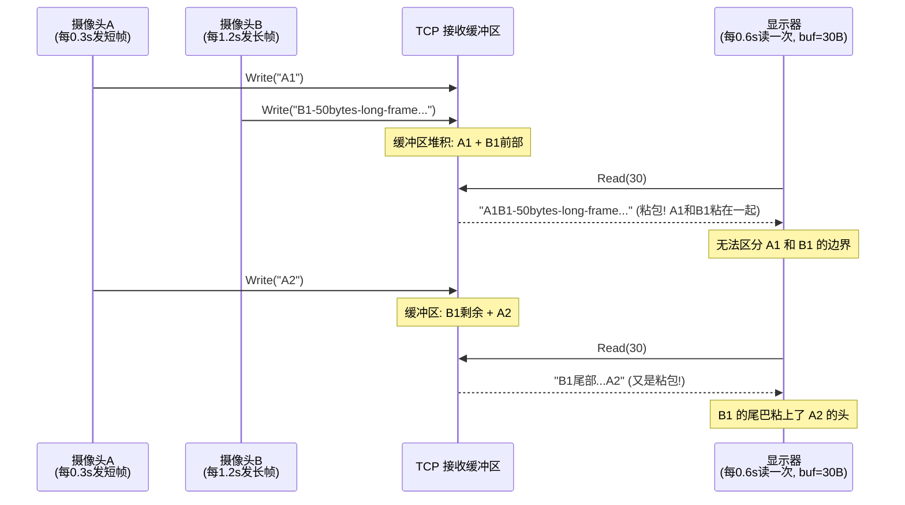
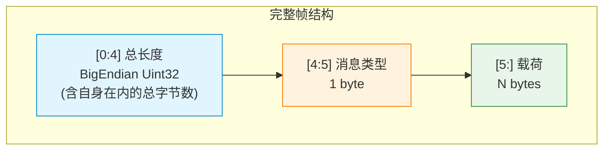
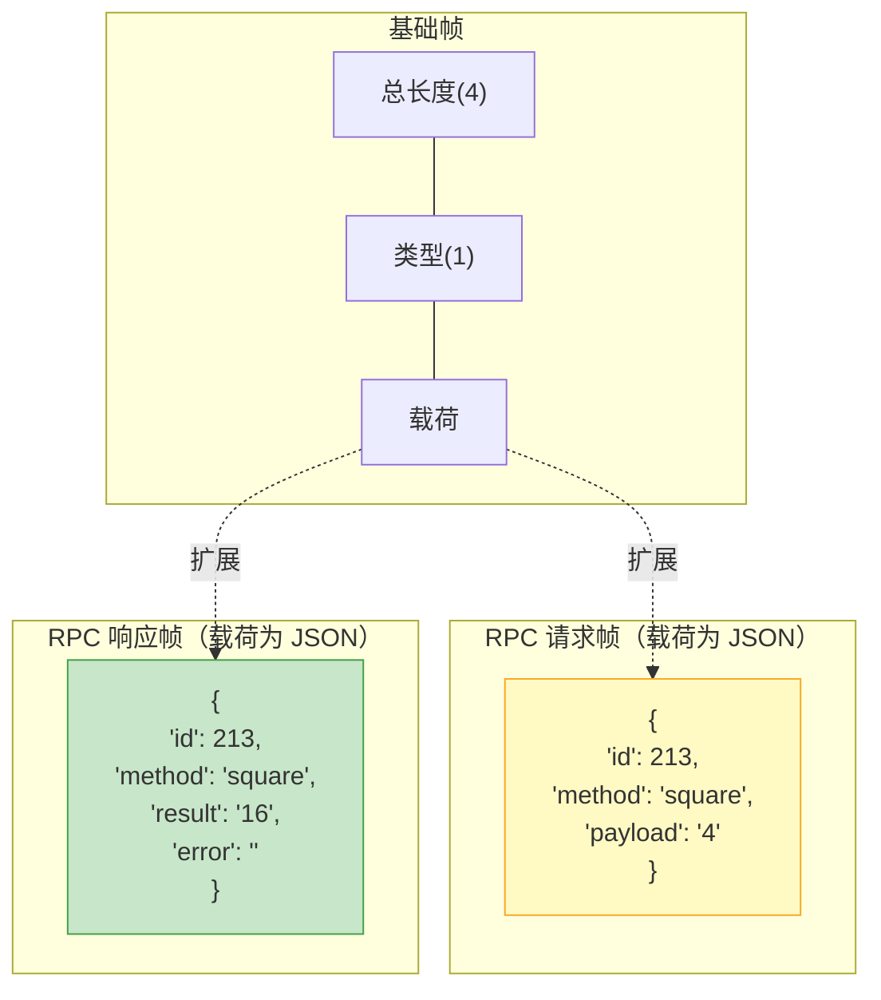
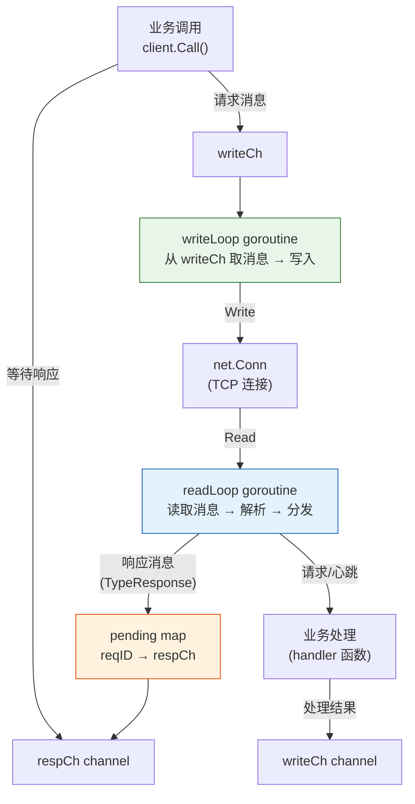
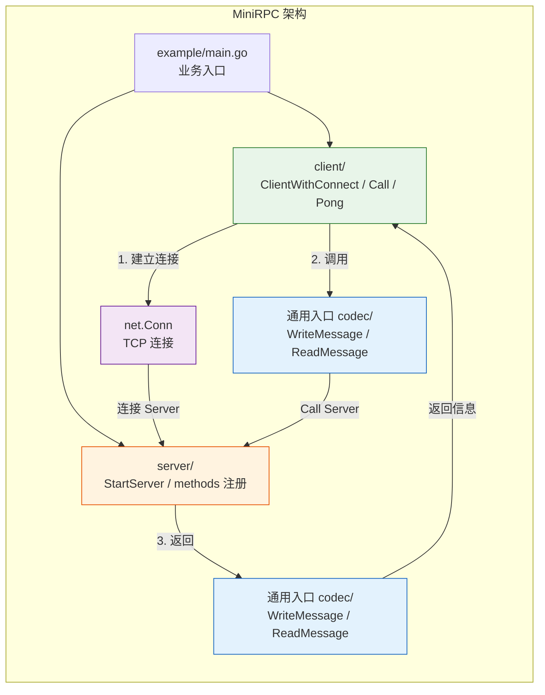
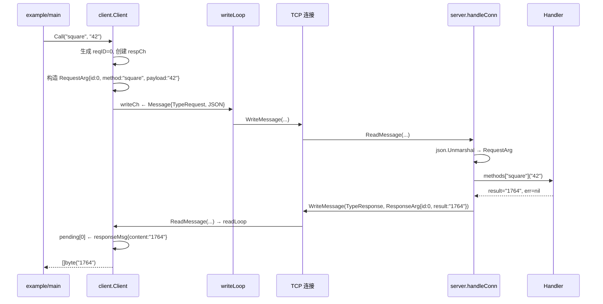

> 在 Go 中构建网络应用时，我们往往从 `net.Listen` 和 `net.Dial` 开始，写一个 Echo 服务器似乎只需要几行代码。但当真实场景涌入——视频帧、RPC 调用、心跳保活、高并发——我们会猛然发现：TCP 只是运载字节的"管道"，真正决定通信质量的，是管道之上那一层精心设计的协议。本文将带你从最基础的 TCP 示例出发，一步步理解消息边界、成帧、协议语义，最终亲手实现一个简化的 RPC 协议，揭开 WebSocket、gRPC 等上层协议的神秘面纱。

***

## 一、引言：我们为什么需要"上层协议"

让我们从最经典的 TCP Echo 服务器说起：

```go
// 服务端：监听 -> Accept -> 读一行 -> 写回
listener, _ := net.Listen("tcp", ":9988")
conn, _ := listener.Accept()
reader := bufio.NewReader(conn)
for {
    line, _ := reader.ReadString('\n')
    conn.Write([]byte("echo: " + line))
}
```

<details>
<summary>TCP连接的基本实现及相关过程</summary>

**服务端 (server.go):**

```go
package main

import (
	"bufio"
	"fmt"
	"log"
	"net"
)

func main() {
	// 监听指定的 TCP 地址和端口
	listener, err := net.Listen("tcp", ":9988")
	if err != nil {
		log.Fatalf("监听失败: %v", err)
	}
	defer listener.Close()
	fmt.Println("TCP 服务器已启动，监听端口 :9988")

	for {
		// 接受新的客户端连接
		conn, err := listener.Accept()
		if err != nil {
			log.Printf("接受连接失败: %v", err)
			continue
		}

		// 为每个新连接启动一个 goroutine 来处理
		// 这样可以实现并发处理多个客户端
		go handleConnection(conn)
	}
}

func handleConnection(conn net.Conn) {
	defer conn.Close()
	fmt.Printf("新客户端连接: %s\n", conn.RemoteAddr().String())

	reader := bufio.NewReader(conn)
	for {
		// 读取客户端发送的一行数据 (以换行符 '\n' 结尾)
		line, err := reader.ReadString('\n')
		if err != nil { // 如果读取出错 (例如客户端断开连接)，则退出循环
			fmt.Printf("读取数据失败: %s, 客户端 %s 已断开\n", err, conn.RemoteAddr().String())
			break
		}

		// 格式化回声消息
		echoMessage := "echo: " + line

		// 将回声消息写回客户端
		_, err = conn.Write([]byte(echoMessage))
		if err != nil {
			fmt.Printf("写入数据失败: %s, 客户端 %s 已断开\n", err, conn.RemoteAddr().String())
			break
		}
	}
}
```

**客户端 (client.go):**

```go
package main

import (
	"bufio"
	"fmt"
	"log"
	"net"
	"os"
)

func main() {
	// 连接到服务器
	conn, err := net.Dial("tcp", "localhost:9988") // 或者 "127.0.0.1:9988"
	if err != nil {
		log.Fatalf("连接服务器失败: %v", err)
	}
	defer conn.Close()

	fmt.Println("已连接到服务器 localhost:9988")
	fmt.Println("请输入消息 (按 Enter 发送, 输入 'exit' 退出):")

	scanner := bufio.NewScanner(os.Stdin)
	for scanner.Scan() {
		text := scanner.Text()

		// 如果输入 'exit'，则断开连接并退出
		if text == "exit" {
			fmt.Println("正在断开连接...")
			break
		}

		// 在消息末尾添加换行符，因为服务端是按行读取的
		message := text + "\n"

		// 将消息发送给服务器
		_, err := conn.Write([]byte(message))
		if err != nil {
			log.Printf("发送消息失败: %v", err)
			return
		}

		// 读取服务器的回声响应
		response, err := bufio.NewReader(conn).ReadString('\n')
		if err != nil {
			log.Printf("读取服务器响应失败: %v", err)
			return
		}

		// 打印服务器的回声
		fmt.Printf("服务器响应: %s", response)
	}

	if err := scanner.Err(); err != nil {
		log.Printf("读取用户输入时发生错误: %v", err)
	}
}
```

TCP连接的背后发生了什么:


</details>
这段代码能跑，也能处理简单的聊天室。但当你试图用它传输一张图片、一段视频流，或者并发调用一个远程函数时，问题就来了：

*   **没有消息边界**：客户端发送 `"hello"` 和 `"world"`，服务端可能一次读到 `"helloworld"`，也可能读到 `"hel"` 和 `"loworld"`。
*   **没有语义**：服务端不知道这条消息是请求还是心跳，是调用 `add` 方法还是查询用户信息，TCP只负责传输数据。
*   **没有流量控制**：如果客户端发送速度远大于服务端处理速度，内核缓冲区会积压，延迟飙升。
*   **没有连接状态**：服务端无法区分"一个长时间没发消息的合法客户端"和"一个已经死掉的连接"。

这正是 WebSocket、gRPC、MQTT 等上层协议要解决的问题。它们并不是对 TCP 的替代，而是**在 TCP 字节流之上，定义了一套消息格式和交互规则**。本文的目标就是让你理解这一套规则的每个环节，并最终有能力设计属于自己的应用层协议。

***

## 二、TCP 基石：Go 语言中的连接与 IO 模型

### 2.1 `net.Conn` 与 `net.Listener`

回顾 Echo 示例中的两个核心类型：

```go
// 源代码位置: src/net/net.go

// Conn 是网络连接的接口，同时实现了 io.Reader 和 io.Writer
type Conn interface {
	// Read 从连接中读取数据
	Read(b []byte) (n int, err error)
	// Write 向连接中写入数据
	Write(b []byte) (n int, err error)
    // Read和Write让它变成了一个可读写的IO对象

	// Close 关闭连接
	// 任何被阻塞的读写操作都会被取消并返回错误
	Close() error
	// LocalAddr 返回本地网络地址
	LocalAddr() Addr
	// RemoteAddr 返回远程网络地址
	RemoteAddr() Addr

	// SetDeadline 设置读写操作的截止时间
    SetDeadline(t time.Time) error
	// SetReadDeadline 设置读操作的截止时间
	SetReadDeadline(t time.Time) error
	// SetWriteDeadline 设置写操作的截止时间
	SetWriteDeadline(t time.Time) error
    //上面三个设置截止时间用于设置超时设置,也可用于防止恶意的连接(为了占用服务器资源迟迟不断开)
}
```

```go
// Listener 是面向流协议的通用网络监听器
// 多个 goroutine 可以同时调用 Listener 的方法
type Listener interface {
	// Accept 等待并返回下一个连接
	Accept() (Conn, error)
	// Close 关闭监听器
	// 任何被阻塞的 Accept 操作都会被取消并返回错误
	Close() error
	// Addr 返回监听器的网络地址
	Addr() Addr
}
```

`SetDeadline` 系列方法用于设置超时，也是防御"慢客户端"占用服务器资源的关键手段。

<details>
<summary>知识补充：Go IO 体系基础——为什么 TCP 编程需要理解 IO 接口？</summary>

你可能注意到了，无论是网络读写、终端输入还是错误判断，都离不开两个核心接口：`io.Reader` 和 `io.Writer`，Go 把**所有"慢速设备"（磁盘、网络、SSD、标准输入输出）都抽象成了 IO 流**。

```go
type Reader interface {
    Read(p []byte) (n int, err error)
}

type Writer interface {
    Write(p []byte) (n int, err error)
}
```

**Read 方法的行为约定（这些细节很重要）：**

*   读取最多 `len(p)` 字节到 `p` 中
*   返回实际读取的字节数 `n`（0 ≤ n ≤ len(p)）
*   **即使返回 n < len(p)，也可能同时返回 err == nil**（数据还没到齐）
*   **当 n == 0 且 err == nil 时，不代表数据结束，只是本次没有数据可读**（会阻塞等待）
*   读到数据结束时返回 `io.EOF`

> 这就是为什么服务端代码里要判断 `err == io.EOF` 来检测客户端断开连接。

**Write 方法的行为约定：**

*   写入 `p` 的所有数据到目标
*   **必须写入 n 个字节后才返回错误**（部分写入会重试）

**同样的接口，不同的底层：**

```go
// 这些全都可以赋给 io.Reader 变量
var r io.Reader
r = conn              // 网络连接
r = file              // 磁盘文件
r = os.Stdin          // 标准输入
r = strings.NewReader("hello")  // 内存字符串
r = body              // HTTP 响应体

// 这些全都可以赋给 io.Writer 变量
var w io.Writer
w = conn              // 网络连接
w = file              // 磁盘文件
w = os.Stdout         // 标准输出
w = &bytes.Buffer{}   // 内存缓冲区
```

这种抽象带来的好处是：**你的协议处理代码不需要知道数据来自网络还是文件，也不需要关心数据最终流向标准输出还是内存缓冲区**。它只和 `Reader/Writer` 接口对话。这就是为什么 `io.Copy` 能直接在文件和网络连接之间拷贝数据：

```go
file, _ := os.Open("data.bin")
io.Copy(conn, file)   // 从 io.Reader 拷贝到 io.Writer
```

正是 `Read` 和 `Write` 方法让 `net.Conn` 天然融入 Go 庞大的 IO 生态。

</details>

### 2.2 最简单的"协议"：换行符分隔

我们的 Echo 示例使用 `bufio.Reader.ReadString('\n')` 来读取一整行，这本质上就是一种最简单的**定界符协议**。它以 `\n` 作为消息结束标志：
特点：

*   简单、人类可读、适合调试
*   消息内容不能包含换行符
*   二进制数据（如图片、视频帧）无法使用
*   接收方需要逐字节扫描，效率低

这就是为什么我们需要更通用的成帧方案。

***

## 三、字节流的困局：粘包、拆包与消息成帧

TCP 是流式协议，它只保证字节顺序和可靠性，不保留应用层的消息边界。这意味着发送方两次独立的 `Write`，接收方可能一次 `Read` 就全部收到（**粘包**），也可能分多次才收完（**拆包**）。

### 3.1 模拟场景：当两个摄像头发送视频帧

想象两个摄像头向同一台显示器发送视频帧：



下面是模拟代码：

```go
// CameraA 每 0.3 秒发送一帧短消息
func cameraA(conn net.Conn, stopCh <-chan struct{}) {
    for i := 1; ; i++ {
        select {
        case <-stopCh://收到停止信号时停止
            return
        default:
        }
        msg := fmt.Sprintf("A%d", i)
        conn.Write([]byte(msg))//往连接里写数据
        time.Sleep(300 * time.Millisecond)
    }
}

// CameraB 每 1.2 秒发送一帧长消息（50 字节），模拟大数据帧
func cameraB(conn net.Conn, stopCh <-chan struct{}) {
    for i := 1; ; i++ {
        select {
        case <-stopCh://收到停止信号时停止
            return
        default:
        }
        payload := fmt.Sprintf("B%-2d", i)
        msg := payload + strings.Repeat("x", 50-len(payload))
        conn.Write([]byte(msg))//往连接里写数据
        time.Sleep(1200 * time.Millisecond)
    }
}

// 显示器：每 0.6 秒读取一次，缓冲区 30 字节
func displayServer() {
    listener, _ := net.Listen("tcp", "localhost:8888")
    conn, _ := listener.Accept()
    defer conn.Close()

    buf := make([]byte, 30)
    for {
        n, err := conn.Read(buf)//读取堆积在缓冲区的信息
        if err != nil {
            break
        }
        fmt.Printf("读到 %d 字节: %q\n", n, string(buf[:n]))
        time.Sleep(600 * time.Millisecond)
    }
}

func main() {
    go displayServer()
    time.Sleep(100 * time.Millisecond)

    conn, _ := net.Dial("tcp", "localhost:8888")
    stopCh := make(chan struct{})

    go cameraA(conn, stopCh)
    go cameraB(conn, stopCh)

    time.Sleep(10 * time.Second)
    close(stopCh)
}
```

运行后你会发现，显示器读到的数据可能是：

    读到 30 字节: "A1B1xxxxxxxxxxxxxxxxxxxxxxxxxxx"
    读到 30 字节: "xxxxxxxxxxA2B2xxxxxxxxxxxxxxxxxxxx"
    读到 13 字节: "xxxxA3A4"

这就是典型的"没有消息边界"问题——根源在于 TCP 只负责字节传输，不保存消息边界。

### 3.2 三种成帧方案

为解决这个问题，我们需要**消息成帧**——让接收方能够无损地从字节流中切分出一个个独立的消息：

| 方案       | 原理                  | 优点          | 缺点            | 典型应用                 |
| -------- | ------------------- | ----------- | ------------- | -------------------- |
| **定界符**  | 以特殊字符（如 `\n`）标记消息结束 | 简单、人类可读     | 消息体不能含定界符，需转义 | Redis 协议、HTTP/1.1 行  |
| **固定长度** | 每条消息长度固定            | 解析极简        | 浪费带宽，尺寸不灵活    | 某些传感器协议              |
| **长度前缀** | 消息头携带长度字段           | 通用、高效、支持二进制 | 需要处理字节序       | gRPC、WebSocket、自定义协议 |

**长度前缀协议是最通用的方案**，本文后续将以此为基础展开设计。

***

## 四、协议设计核心：消息格式

### 4.1 设计一个简单的长度前缀协议

我们的消息格式如下：



*   **总长度（4 字节）**：大端序 uint32，包含自身 + 类型字段 + 载荷的总字节数。接收方先读这 4 字节，就知道后面还要读多少。
*   **消息类型（1 字节）**：标识这条消息的用途（请求、响应、心跳等）。
*   **载荷（N 字节）**：实际携带的数据，可以是文本、JSON 或二进制。

<details>
<summary>为什么选择大端序（Big-Endian）？</summary>

网络协议通常使用大端序（也叫网络字节序），因为这是 TCP/IP 协议栈的标准。`encoding/binary.BigEndian` 是标准做法，保证跨平台兼容。

</details>

> 说明：这里采用总长度包含自身的设计，优点是接收方解析简单——读完 4 字节长度字段后，直接用 `总长度 - 4` 就是剩余需要读取的字节数。

### 4.2 编解码器实现

```go
// 消息类型常量
const (
    TypeRequest   = 0x01 // 请求消息
    TypeResponse  = 0x02 // 响应消息
    TypeHeartbeat = 0x03 // 心跳消息
)

// 最大消息长度限制：10MB，防止恶意数据导致内存耗尽
const MaxMessageSize = 10 * 1024 * 1024

// WriteMessage 将一条消息按协议帧格式编码后写入 io.Writer
func WriteMessage(w io.Writer, msgType byte, body []byte) error {
    // 总长度 = 4(长度字段) + 1(类型) + len(body)
    totalLen := uint32(4 + 1 + len(body))

    // 写入总长度（大端序）
    header := make([]byte, 4)
    binary.BigEndian.PutUint32(header, totalLen)
    if _, err := w.Write(header); err != nil {
        return fmt.Errorf("写入长度字段失败: %w", err)
    }

    // 写入消息类型
    if _, err := w.Write([]byte{msgType}); err != nil {
        return fmt.Errorf("写入类型字段失败: %w", err)
    }

    // 写入载荷
    if _, err := w.Write(body); err != nil {
        return fmt.Errorf("写入载荷失败: %w", err)
    }

    return nil
}

// ReadMessage 从 io.Reader 中读取一条完整的消息
// 返回消息类型、消息体以及可能的错误
func ReadMessage(r io.Reader) (msgType byte, body []byte, err error) {
    // 阶段一：读取总长度字段
    header := make([]byte, 4)
    if _, err := io.ReadFull(r, header); err != nil {
        //注:在实际开发中读取逻辑要比这个复杂得多,因为这里只是对于下层调用可以保证帧有序,依旧不能保证到达时没有出现粘包和拆包,所以头部不一定在前四个字节,可以通过给帧加入固定的起始标识符并通过某些匹配算法来保证准确性
        return 0, nil, fmt.Errorf("读取长度字段失败: %w", err)
    }
    totalLen := binary.BigEndian.Uint32(header)

    // 阶段二：校验长度合法性
    if totalLen < 5 {
        return 0, nil, fmt.Errorf("消息长度异常: %d (最少需要5字节)", totalLen)
    }
    if totalLen > MaxMessageSize {
        return 0, nil, fmt.Errorf("消息长度超限: %d > %d", totalLen, MaxMessageSize)
    }

    // 阶段三：读取剩余数据（类型 + 载荷）
    remaining := totalLen - 4
    data := make([]byte, remaining)
    if _, err := io.ReadFull(r, data); err != nil {
        return 0, nil, fmt.Errorf("读取消息体失败: %w", err)
    }

    // 阶段四：拆解类型与载荷
    msgType = data[0]
    body = data[1:]

    return msgType, body, nil
}
```

`io.ReadFull` 是关键——它保证读满指定字节数才返回，这正是长度前缀协议需要的语义：知道了长度，就一次性全部读完。

***

## 五、协议语义：从 Echo 到"远程调用"

有了消息格式，下一步是赋予消息**语义**。我们设计一个极简的 RPC 协议，客户端可以调用服务端的方法，并等待响应。

### 5.1 扩展消息格式

基础帧只告诉我们"这是一条消息"，但 RPC 还需要知道"调用哪个方法、请求 ID 是多少"。这些信息被编码在载荷中：



*   **请求帧**：类型 = `TypeRequest`，载荷为 JSON，包含 `id`、`method`、`payload`
*   **响应帧**：类型 = `TypeResponse`，载荷为 JSON，包含 `id`、`method`、`result`、`error`
*   **心跳帧**：类型 = `TypeHeartbeat`，载荷为空

> 注意：这里的"总长度"仍然是包括自身在内整个帧的字节数，与基础格式保持一致。

### 5.2 服务端路由分发

服务端解析请求后，根据方法名找到对应的处理函数：

```go
// Handler 通用 RPC 处理函数签名
type Handler func([]byte) ([]byte, error)

// methods 注册表：方法名 → 处理函数
var methods = map[string]Handler{
    "print": func(data []byte) ([]byte, error) {
        fmt.Printf("[服务端] 收到 print 调用: %s\n", string(data))
        return []byte("打印成功"), nil
    },
    "square": func(data []byte) ([]byte, error) {
        var n int
        fmt.Sscanf(string(data), "%d", &n)
        result := n * n
        return []byte(fmt.Sprintf("%d", result)), nil
    },
}

// RequestArg 客户端发来的 RPC 调用参数
type RequestArg struct {
    ID      uint8  `json:"id"`
    Method  string `json:"method"`
    Payload []byte `json:"payload"`
}

// ResponseArg 服务端返回的 RPC 响应
type ResponseArg struct {
    ID     uint8  `json:"id"`
    Method string `json:"method"`
    Result string `json:"result"`
    Error  string `json:"error"`
}

// handleConnection 处理单个客户端连接
func handleConnection(conn net.Conn) {
    defer conn.Close()

    for {
        msgType, body, err := ReadMessage(conn)
        if err != nil {
            if err == io.EOF {
                fmt.Println("客户端断开连接")
            } else {
                fmt.Printf("读取消息失败: %v\n", err)
            }
            return
        }

        // 只处理请求消息
        if msgType != TypeRequest {
            continue
        }

        // 解析请求参数
        var req RequestArg
        if err := json.Unmarshal(body, &req); err != nil {
            fmt.Printf("解析请求失败: %v\n", err)
            continue
        }

        // 查找并调用处理函数
        handler, ok := methods[req.Method]
        var resp ResponseArg
        resp.ID = req.ID
        resp.Method = req.Method

        if !ok {
            resp.Error = fmt.Sprintf("未知方法: %s", req.Method)
        } else {
            result, err := handler(req.Payload)
            if err != nil {
                resp.Error = err.Error()
            } else {
                resp.Result = string(result)
            }
        }

        // 编码并发送响应
        respData, _ := json.Marshal(resp)
        WriteMessage(conn, TypeResponse, respData)
    }
}

// StartServer 启动 RPC 服务端
func StartServer(addr string) error {
    listener, err := net.Listen("tcp", addr)
    if err != nil {
        return err
    }
    defer listener.Close()
    fmt.Printf("服务端已启动，监听地址: %s\n", addr)

    for {
        conn, err := listener.Accept()
        if err != nil {
            fmt.Printf("接受连接失败: %v\n", err)
            continue
        }
        go handleConnection(conn)
    }
}
```

### 5.3 客户端调用封装

客户端需要封装消息的发送、响应的接收和匹配：

```go
// Client 客户端结构体
type Client struct {
    conn net.Conn
}

// ClientWithConnect 创建并连接一个客户端
func ClientWithConnect(addr string) *Client {
    conn, err := net.Dial("tcp", addr)
    if err != nil {
        panic(fmt.Sprintf("连接服务器失败: %v", err))
    }
    return &Client{conn: conn}
}

// Call 发起一次远程调用并等待响应（简化版，同步阻塞）
func (c *Client) Call(ID uint8, method string, payload []byte) ([]byte, error) {
    // 构造并发送请求
    req := RequestArg{
        ID:      ID,
        Method:  method,
        Payload: payload,
    }
    reqData, err := json.Marshal(req)
    if err != nil {
        return nil, fmt.Errorf("编码请求失败: %w", err)
    }
    if err := WriteMessage(c.conn, TypeRequest, reqData); err != nil {
        return nil, fmt.Errorf("发送请求失败: %w", err)
    }

    // 读取并验证响应
    msgType, body, err := ReadMessage(c.conn)
    if err != nil {
        return nil, fmt.Errorf("读取响应失败: %w", err)
    }
    if msgType != TypeResponse {
        return nil, fmt.Errorf("收到非响应消息，类型: %d", msgType)
    }

    // 解析响应
    var resp ResponseArg
    if err := json.Unmarshal(body, &resp); err != nil {
        return nil, fmt.Errorf("解析响应失败: %w", err)
    }
    if resp.Error != "" {
        return nil, fmt.Errorf("远程调用失败: %s", resp.Error)
    }

    return []byte(resp.Result), nil
}

// Pong 发送一次心跳消息（异步，不等待响应）
func (c *Client) Pong() error {
    return WriteMessage(c.conn, TypeHeartbeat, nil)
}
```

> 这个简化版 Client 的 `Call` 方法是同步阻塞的——发送请求后原地等待响应。这在单次调用场景下足够使用，但当需要并发调用多个方法时就会暴露出问题。第六章将展示生产级的双协程模型。

***

## 六、连接管理与并发：让协议跑起来

一个健壮的协议不光要有消息格式，还要处理好连接的生命周期和并发。

### 6.1 双协程读写模型

实际项目中，通常会为每个连接启动两个 goroutine——一个负责读取消息并分发（读循环），另一个负责发送消息（写循环），两者通过 channel 通信：



以下是服务端双协程版本的实现：

```go
// Message 在管道间传递的内部消息
type Message struct {
    Type byte   // 消息类型
    Body []byte // 消息体
}

// ServerConn 封装一个服务端连接的双协程模型
type ServerConn struct {
    conn    net.Conn
    writeCh chan Message   // 写协程消费的消息队列
    done    chan struct{}  // 关闭信号
}

func NewServerConn(conn net.Conn) *ServerConn {
    sc := &ServerConn{
        conn:    conn,
        writeCh: make(chan Message, 64),
        done:    make(chan struct{}),
    }
    go sc.readLoop()
    go sc.writeLoop()
    return sc
}

// readLoop 读协程：不断从连接读取消息并处理
func (sc *ServerConn) readLoop() {
    defer close(sc.done)

    for {
        msgType, body, err := ReadMessage(sc.conn)
        if err != nil {
            return // 连接断开，退出
        }

        switch msgType {
        case TypeRequest:
            // 解析并调用 handler
            var req RequestArg
            if err := json.Unmarshal(body, &req); err != nil {
                continue
            }
            handler, ok := methods[req.Method]
            var resp ResponseArg
            resp.ID = req.ID
            resp.Method = req.Method
            if !ok {
                resp.Error = fmt.Sprintf("未知方法: %s", req.Method)
            } else if result, err := handler(req.Payload); err != nil {
                resp.Error = err.Error()
            } else {
                resp.Result = string(result)
            }
            respData, _ := json.Marshal(resp)

            // 将响应放入写管道
            select {
            case sc.writeCh <- Message{Type: TypeResponse, Body: respData}:
            case <-sc.done:
                return
            }

        case TypeHeartbeat:
            // 收到心跳，原样返回响应
            select {
            case sc.writeCh <- Message{Type: TypeResponse, Body: []byte(`{"result":"pong"}`)}:
            case <-sc.done:
                return
            }
        }
    }
}

// writeLoop 写协程：从管道取消息并写入连接
func (sc *ServerConn) writeLoop() {
    for msg := range sc.writeCh {
        if err := WriteMessage(sc.conn, msg.Type, msg.Body); err != nil {
            return
        }
    }
}
```

客户端同样采用双协程——在收到响应时通过 `reqID` 匹配到对应的等待者：

```go
type responseMsg struct {
    content string
    err     error
}

// Client 客户端
type Client struct {
    conn      net.Conn
    writeCh   chan Message
    pending   map[uint8]chan responseMsg // reqID → 响应通道
    pendingMu sync.Mutex
    reqID     uint8
    done      chan struct{}
}

func ClientWithConnect(addr string) *Client {
    conn, err := net.Dial("tcp", addr)
    if err != nil {
        panic(err)
    }
    c := &Client{
        conn:    conn,
        writeCh: make(chan Message, 64),
        pending: make(map[uint8]chan responseMsg),
        done:    make(chan struct{}),
    }
    go c.readLoop()
    go c.writeLoop()
    return c
}

// readLoop 读协程：读取响应并匹配到等待的 Call
func (c *Client) readLoop() {
    defer close(c.done)

    for {
        msgType, body, err := ReadMessage(c.conn)
        if err != nil {
            c.failAllPending(err)
            return
        }

        var resp ResponseArg
        if msgType == TypeResponse {
            if err := json.Unmarshal(body, &resp); err != nil {
                continue
            }
            // 按 reqID 匹配等待者
            c.pendingMu.Lock()
            ch, ok := c.pending[resp.ID]
            if ok {
                delete(c.pending, resp.ID)
            }
            c.pendingMu.Unlock()

            if ok {
                select {
                case ch <- responseMsg{
                    content: resp.Result,
                    err:     nil,
                }:
                default:
                }
            }
        }
    }
}

// writeLoop 写协程：将消息写入连接
func (c *Client) writeLoop() {
    for msg := range c.writeCh {
        if err := WriteMessage(c.conn, msg.Type, msg.Body); err != nil {
            return
        }
    }
}

// Call 发起一次远程调用
func (c *Client) Call(method string, payload []byte) ([]byte, error) {
    c.pendingMu.Lock()
    id := c.reqID
    c.reqID++
    respCh := make(chan responseMsg, 1)
    c.pending[id] = respCh
    c.pendingMu.Unlock()

    // 构造并发送请求
    req := RequestArg{ID: id, Method: method, Payload: payload}
    reqData, _ := json.Marshal(req)

    select {
    case c.writeCh <- Message{Type: TypeRequest, Body: reqData}:
    case <-c.done:
        return nil, fmt.Errorf("客户端已关闭")
    }

    // 等待响应（带超时保护）
    select {
    case resp := <-respCh:
        if resp.err != nil {
            return nil, resp.err
        }
        return []byte(resp.content), nil
    case <-time.After(5 * time.Second):
        return nil, fmt.Errorf("请求超时 (ID=%d)", id)
    case <-c.done:
        return nil, fmt.Errorf("客户端已关闭")
    }
}

// Pong 发送一次心跳消息
func (c *Client) Pong() {
    select {
    case c.writeCh <- Message{Type: TypeHeartbeat, Body: nil}:
    case <-c.done:
    }
}

// failAllPending 通知所有等待中的 Call 连接已断开
func (c *Client) failAllPending(err error) {
    c.pendingMu.Lock()
    defer c.pendingMu.Unlock()

    for id, ch := range c.pending {
        select {
        case ch <- responseMsg{err: err}:
        default:
        }
        delete(c.pending, id)
    }
}
```

这种分离设计让读写互不阻塞——即使某个业务处理较慢，也不会影响接收新消息。

### 6.2 应用层心跳机制

TCP 自带的 `KeepAlive` 只能检测连接是否"物理断开"（网线拔了、进程崩溃），无法感知应用层是否死锁或阻塞。因此需要应用层心跳：

**心跳的核心策略：**

*   **定期发送**：客户端每隔固定时间（如 1 秒）发送一次心跳消息
*   **超时判定**：服务端若在 N 倍心跳间隔内未收到任何消息（包括心跳），判定连接失效
*   **与业务消息复用**：如果已有业务消息收发，心跳间隔可以适当拉长

在我们上面的实现中，`Client.Pong()` 和 `readLoop` 对 `TypeHeartbeat` 的处理就构成了一个完整的心跳回路。客户端可以启动一个定时器协程来周期性发送心跳：

```go
// AutoPing 定时心跳协程：每 1 秒发送一次 Pong
func (c *Client) AutoPing() {
    ticker := time.NewTicker(1 * time.Second)
    defer ticker.Stop()
    for {
        select {
        case <-ticker.C:
            c.Pong()
        case <-c.done:
            return
        }
    }
}
```

服务端可以在 `readLoop` 中记录最后一次收到消息的时间，若超过阈值则主动关闭连接。

### 6.3 超时与截止时间

使用 `SetDeadline` 防止一个慢客户端长期占用连接：

```go
// 设置整个连接的绝对截止时间
conn.SetDeadline(time.Now().Add(30 * time.Second))

// 或分开设置读写
conn.SetReadDeadline(time.Now().Add(10 * time.Second))
conn.SetWriteDeadline(time.Now().Add(5 * time.Second))
```

每次成功读取后可以延长截止时间——这是"滑动超时"模式：

```go
for {
    conn.SetReadDeadline(time.Now().Add(10 * time.Second))
    _, err := ReadMessage(conn)
    if err != nil {
        break
    }
}
```

***

## 七、生产级优化

### 7.1 缓冲与批量发送

使用 `bufio.Writer` 为连接增加写缓冲，减少系统调用：

```go
conn, _ := net.Dial("tcp", addr)
bufConn := bufio.NewWriter(conn)
// 多次 Write 最终调用 Flush 一次性发送
WriteMessage(bufConn, TypeRequest, payload)
bufConn.Flush()
```

**Nagle 算法**：TCP 默认启用了 Nagle 算法，会将小的数据包合并后再发送，减少网络拥塞。但这对实时性要求高的应用（如游戏）不友好，可以通过 `SetNoDelay(true)` 关闭：

```go
tcpConn := conn.(*net.TCPConn)
tcpConn.SetNoDelay(true)
```

### 7.2 多路复用

我们之前实现的 RPC 客户端中，所有请求都跑在**一条 TCP 连接**上，通过 `reqID` 匹配请求与响应——这就是多路复用的雏形。

如果要支持更复杂的"流"或"优先级"，可以在头部增加 **Stream ID** 字段，这样一条连接可以承载多个独立的逻辑会话，类似 HTTP/2 的设计。

### 7.3 安全层：从 TCP 到 TLS

Go 的 `crypto/tls` 包提供了 `tls.Listener` 和 `tls.Dial`，它们返回的连接仍然实现了 `net.Conn` 接口，因此**上层协议代码一行都不用改**：

```go
// 服务端 TLS
cert, _ := tls.LoadX509KeyPair("server.crt", "server.key")
config := &tls.Config{Certificates: []tls.Certificate{cert}}
listener, _ := tls.Listen("tcp", ":443", config)

// 客户端 TLS
conn, _ := tls.Dial("tcp", "example.com:443", &tls.Config{InsecureSkipVerify: true})
```

### 7.4 让协议实现 `net.Listener` 接口

如果你的自定义协议想无缝接入标准库的 HTTP 服务或测试工具，可以实现一个 `net.Listener` 的包装，将 `Accept` 返回的 `net.Conn` 替换为能理解你协议的特殊连接。不过大多数情况下，我们更倾向于将协议实现为一个独立的库，而不是伪装成 TCP 层。

***

## 八、实战：从 0 到 1 实现一个 MiniRPC

让我们将所有概念整合，实现一个可工作的 MiniRPC。项目结构如下：

    minirpc/
    ├── codec/          # 编解码层（长度前缀成帧）
    ├── server/         # 服务端：方法注册、连接管理
    ├── client/         # 客户端：连接池、Call 调用
    └── example/        # 示例：远程计算平方



### 8.1 编解码层：长度前缀成帧

编解码层是整个协议的基石，直接复用第四章的实现。核心约定：

*   前 4 字节：大端序 uint32，表示整个帧的总长度
*   第 5 字节：消息类型（Req/Resp/Heartbeat）
*   剩余字节：载荷（JSON 编码的 RPC 参数或结果）

```go
// codec/codec.go
package codec

import (
    "encoding/binary"
    "fmt"
    "io"
)

const (
    TypeRequest   = 0x01
    TypeResponse  = 0x02
    TypeHeartbeat = 0x03

    MaxMessageSize = 10 * 1024 * 1024
)

func WriteMessage(w io.Writer, msgType byte, body []byte) error {
    totalLen := uint32(4 + 1 + len(body))
    header := make([]byte, 4)
    binary.BigEndian.PutUint32(header, totalLen)
    if _, err := w.Write(header); err != nil {
        return err
    }
    if _, err := w.Write([]byte{msgType}); err != nil {
        return err
    }
    if _, err := w.Write(body); err != nil {
        return err
    }
    return nil
}

func ReadMessage(r io.Reader) (msgType byte, body []byte, err error) {
    header := make([]byte, 4)
    if _, err := io.ReadFull(r, header); err != nil {
        return 0, nil, err
    }
    totalLen := binary.BigEndian.Uint32(header)
    if totalLen < 5 || totalLen > MaxMessageSize {
        return 0, nil, fmt.Errorf("消息长度异常: %d", totalLen)
    }
    remaining := totalLen - 4
    data := make([]byte, remaining)
    if _, err := io.ReadFull(r, data); err != nil {
        return 0, nil, err
    }
    return data[0], data[1:], nil
}
```

### 8.2 服务端实现

```go
// server/server.go
package server

import (
    "encoding/json"
    "fmt"
    "io"
    "net"

    "minirpc/codec"
)

type Handler func([]byte) ([]byte, error)
type Methods map[string]Handler

type RequestArg struct {
    ID      uint8  `json:"id"`
    Method  string `json:"method"`
    Payload []byte `json:"payload"`
}

type ResponseArg struct {
    ID     uint8  `json:"id"`
    Method string `json:"method"`
    Result string `json:"result"`
    Error  string `json:"error"`
}

// StartServer 启动 RPC 服务端
func StartServer(addr string, methods Methods) error {
    listener, err := net.Listen("tcp", addr)
    if err != nil {
        return err
    }
    defer listener.Close()
    fmt.Printf("[服务端] 监听 %s\n", addr)

    for {
        conn, err := listener.Accept()
        if err != nil {
            continue
        }
        go handleConn(conn, methods)
    }
}

//处理连接
func handleConn(conn net.Conn, methods Methods) {
    defer conn.Close()
    fmt.Printf("[服务端] 新连接: %s\n", conn.RemoteAddr())

    for {
        msgType, body, err := codec.ReadMessage(conn)
        if err != nil {
            if err != io.EOF {
                fmt.Printf("[服务端] 读取错误: %v\n", err)
            }
            return
        }

        switch msgType {
        case codec.TypeRequest:
            var req RequestArg
            if err := json.Unmarshal(body, &req); err != nil {
                continue
            }

            handler, ok := methods[req.Method]
            var resp ResponseArg
            resp.ID = req.ID
            resp.Method = req.Method

            if !ok {
                resp.Error = fmt.Sprintf("未知方法: %s", req.Method)
            } else if result, err := handler(req.Payload); err != nil {
                resp.Error = err.Error()
            } else {
                resp.Result = string(result)
            }

            respData, _ := json.Marshal(resp)
            codec.WriteMessage(conn, codec.TypeResponse, respData)

        case codec.TypeHeartbeat:
            codec.WriteMessage(conn, codec.TypeResponse,
                []byte(`{"result":"pong"}`))
        }
    }
}
```

### 8.3 客户端实现

```go
// client/client.go
package client

import (
    "encoding/json"
    "fmt"
    "net"
    "sync"
    "time"

    "minirpc/codec"
    "minirpc/server"
)

type responseMsg struct {
    content string
    err     error
}

type Client struct {
    conn      net.Conn
    writeCh   chan Message
    pending   map[uint8]chan responseMsg
    pendingMu sync.Mutex
    reqID     uint8
    done      chan struct{}
}

type Message struct {
    Type byte
    Body []byte
}

func Connect(addr string) (*Client, error) {
    conn, err := net.Dial("tcp", addr)
    if err != nil {
        return nil, err
    }
    c := &Client{
        conn:    conn,
        writeCh: make(chan Message, 64),
        pending: make(map[uint8]chan responseMsg),
        done:    make(chan struct{}),
    }
    go c.readLoop()
    go c.writeLoop()
    return c, nil
}

func (c *Client) readLoop() {
    defer close(c.done)
    for {
        msgType, body, err := codec.ReadMessage(c.conn)
        if err != nil {
            c.failAllPending(err)
            return
        }
        if msgType != codec.TypeResponse {
            continue
        }
        var resp server.ResponseArg
        if err := json.Unmarshal(body, &resp); err != nil {
            continue
        }
        c.pendingMu.Lock()
        ch, ok := c.pending[resp.ID]
        if ok {
            delete(c.pending, resp.ID)
        }
        c.pendingMu.Unlock()
        if ok {
            select {
            case ch <- responseMsg{content: resp.Result, err: nil}:
            default:
            }
        }
    }
}

func (c *Client) writeLoop() {
    for msg := range c.writeCh {
        codec.WriteMessage(c.conn, msg.Type, msg.Body)
    }
}

func (c *Client) Call(method string, payload []byte) ([]byte, error) {
    c.pendingMu.Lock()
    id := c.reqID
    c.reqID++
    respCh := make(chan responseMsg, 1)
    c.pending[id] = respCh
    c.pendingMu.Unlock()

    req := server.RequestArg{ID: id, Method: method, Payload: payload}
    reqData, _ := json.Marshal(req)

    select {
    case c.writeCh <- Message{Type: codec.TypeRequest, Body: reqData}:
    case <-c.done:
        return nil, fmt.Errorf("客户端已关闭")
    }

    select {
    case resp := <-respCh:
        return []byte(resp.content), resp.err
    case <-time.After(5 * time.Second):
        return nil, fmt.Errorf("请求超时")
    case <-c.done:
        return nil, fmt.Errorf("客户端已关闭")
    }
}

func (c *Client) Pong() {
    select {
    case c.writeCh <- Message{Type: codec.TypeHeartbeat, Body: nil}:
    case <-c.done:
    }
}

func (c *Client) failAllPending(err error) {
    c.pendingMu.Lock()
    defer c.pendingMu.Unlock()
    for id, ch := range c.pending {
        ch <- responseMsg{err: err}
        delete(c.pending, id)
    }
}
```

### 8.4 运行示例：远程计算平方

```go
// example/main.go
package main

import (
    "fmt"
    "time"

    "minirpc/client"
    "minirpc/server"
)

func main() {
    // 注册方法
    methods := server.Methods{
        "square": func(data []byte) ([]byte, error) {
            var n int
            fmt.Sscanf(string(data), "%d", &n)
            return []byte(fmt.Sprintf("%d", n*n)), nil
        },
        "print": func(data []byte) ([]byte, error) {
            fmt.Printf("[服务端] 收到消息: %s\n", string(data))
            return []byte("ok"), nil
        },
    }

    // 启动服务端（后台）
    go func() {
        if err := server.StartServer(":8080", methods); err != nil {
            fmt.Printf("服务端启动失败: %v\n", err)
        }
    }()
    time.Sleep(200 * time.Millisecond)

    // 创建客户端
    c, err := client.Connect(":8080")
    if err != nil {
        panic(err)
    }

    // 远程调用
    result, err := c.Call("square", []byte("42"))
    if err != nil {
        fmt.Printf("调用失败: %v\n", err)
    } else {
        fmt.Printf("square(42) = %s\n", result)
    }

    c.Call("print", []byte("Hello from client!"))
    c.Pong()

    time.Sleep(3 * time.Second)
}
```

运行结果：

    [服务端] 监听 :8080
    [服务端] 新连接: 127.0.0.1:xxxxx
    square(42) = 1764
    [服务端] 收到消息: Hello from client!

### 8.5 完整的 RPC 调用流程



### 8.6 压力测试与性能观察

使用 Go 的基准测试框架评估性能：

```go
func BenchmarkRPCCall(b *testing.B) {
    // 启动服务端...
    c, _ := client.Connect(":8080")
    b.ResetTimer()
    for i := 0; i < b.N; i++ {
        c.Call("square", []byte("42"))
    }
}
```

运行 `go test -bench=. -benchmem`，观察每次调用的内存分配次数和延迟。也可以使用 `pprof` 分析 CPU 和内存热点。

**常见瓶颈：**

*   `json.Marshal/Unmarshal` 的反射开销 → 可换成 Protobuf 或 MessagePack
*   `io.ReadFull` 的系统调用 → 可增加读缓冲或使用 `bufio.Reader`
*   大量小消息的内存分配 → 可使用 `sync.Pool` 消息池复用

***

> 至此，你已经掌握了从 TCP 字节流到自定义协议设计的完整路径。Channel 解决了 goroutine 之间的通信，Context 管理着树状的生命周期，而这里我们学会了如何用 `net.Conn` 和 `io.Reader/Writer` 构建跨网络的通信协议。这三者共同构成了 Go 并发网络编程的基石。下一步，就可以放心地设计属于你自己的微服务通信协议了。

完整可运行代码已托管在 [GitHub](https://github.com/Bury-Lee/minirpc)，
欢迎 clone 运行和提 issue。
