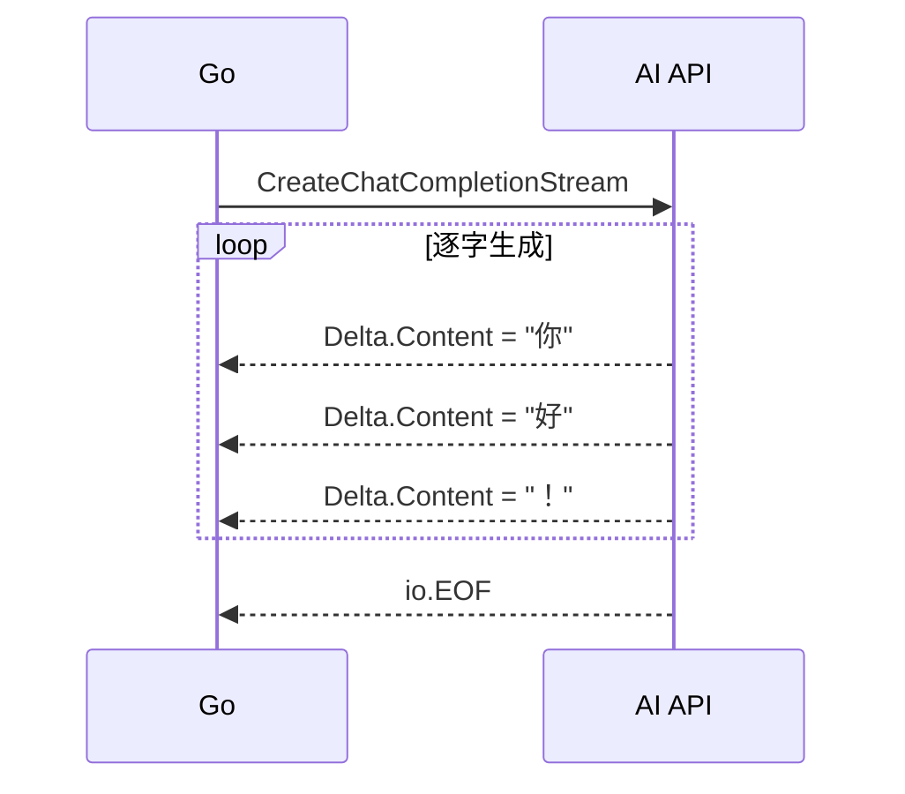

> 摘要：用 Go 调用兼容 OpenAI API 的模型（LM Studio / Ollama），覆盖非流式对话、流式打字机效果、多轮上下文和图片交互。

---

## 一、环境准备

```bash
go get github.com/sashabaranov/go-openai
```

LM Studio / Ollama 提供与 OpenAI 兼容的 API 端点（默认 `http://localhost:1234/v1`）。

---

## 二、非流式对话

```go
package main

import (
    "context"
    "fmt"
    openai "github.com/sashabaranov/go-openai"
)

func main() {
    config := openai.DefaultConfig("api")//填入ApiKey,得到一个"客户端默认配置"
    config.BaseURL = "http://localhost:1234/v1"//服务器地址

    client := openai.NewClientWithConfig(config)

    resp, err := client.CreateChatCompletion(
        context.Background(),
        openai.ChatCompletionRequest{
            Model: "local-model",  // 本地模型可任意命名
            Messages: []openai.ChatCompletionMessage{
                {Role: openai.ChatMessageRoleUser, Content: "你好，世界！"},
            },
        },
    )
    if err != nil {
        fmt.Printf("错误: %v\n", err)
        return
    }
    fmt.Println(resp.Choices[0].Message.Content)
}
```

**特点**：请求发出去后**等待全部生成完**才返回，适合短回复。

---

## 三、流式响应（打字机效果）



```go
func main() {
    client := openai.NewClientWithConfig(config)

    stream, err := client.CreateChatCompletionStream(
        context.Background(),
        openai.ChatCompletionRequest{
            Model: "local-model",
            Messages: []openai.ChatCompletionMessage{
                {Role: openai.ChatMessageRoleUser, Content: "写一首诗"},
            },
            Stream: true,  // 核心开关
        },
    )
    if err != nil {
        fmt.Printf("错误: %v\n", err)
        return
    }
    defer stream.Close()

    fmt.Print("AI: ")
    for {
        response, err := stream.Recv()
        if err != nil {
            break  // io.EOF 表示流结束
        }
        fmt.Print(response.Choices[0].Delta.Content)
    }
    fmt.Println()
}
```

---

## 四、多轮上下文对话

```go
func main() {
    client := openai.NewClientWithConfig(config)
    messages := []openai.ChatCompletionMessage{}
    reader := bufio.NewReader(os.Stdin)

    fmt.Println("聊天开始（输入 quit 退出，new 新对话）")

    for {
        fmt.Print("\n你: ")
        input, _ := reader.ReadString('\n')
        input = strings.TrimSpace(input)

        if input == "quit" { break }
        if input == "new" {
            messages = []openai.ChatCompletionMessage{}
            fmt.Println("已开始新对话")
            continue
        }

        // 追加用户消息
        messages = append(messages, openai.ChatCompletionMessage{
            Role:    openai.ChatMessageRoleUser,
            Content: input,
        })

        // 发送完整历史
        stream, err := client.CreateChatCompletionStream(
            context.Background(),
            openai.ChatCompletionRequest{
                Model:    "local-model",
                Messages: messages,
                Stream:   true,
            },
        )
        if err != nil {
            fmt.Printf("错误: %v\n", err)
            continue
        }

        fmt.Print("AI: ")
        var full strings.Builder
        for {
            resp, err := stream.Recv()
            if err != nil { break }
            chunk := resp.Choices[0].Delta.Content
            fmt.Print(chunk)
            full.WriteString(chunk)
        }
        fmt.Println()
        stream.Close()

        // 追加 AI 回复到历史
        messages = append(messages, openai.ChatCompletionMessage{
            Role:    openai.ChatMessageRoleAssistant,
            Content: full.String(),
        })

        // 可选：清理过长历史
        // if len(messages) > 20 { messages = messages[len(messages)-20:] }
    }
}
```

**核心要点**：
- 每次请求把**完整 `messages` 历史**发给 API
- AI 的回复也要加入历史
- 注意 token 上限，旧消息要定期裁剪

---

## 五、图片交互

```go
package main

import (
	"context"
	"encoding/base64"
	"fmt"
	"io"
	"os"

	"github.com/sashabaranov/go-openai"
)

// 编码本地图片为Base64字符串
func encodeImage(path string) (string, error) {
	data, err := os.ReadFile(path)
	if err != nil {
		return "", err
	}
	return base64.StdEncoding.EncodeToString(data), nil
}

func main() {
	// 配置OpenAI兼容客户端（适配本地模型如Ollama、LocalAI等）
	config := openai.DefaultConfig("api")   //填入ApiKey
	config.BaseURL = "http://localhost:1234/v1" // 示例：Ollama的OpenAI兼容端点，请根据实际修改
	client := openai.NewClientWithConfig(config)

	// 图像描述（视觉模型）
	b64Img, err := encodeImage("path")//输入图片的路径
	if err != nil {
		fmt.Printf("读取/编码图片失败: %v\n", err)
		return
	}

	messages := []openai.ChatCompletionMessage{
		{
			Role: openai.ChatMessageRoleUser,
			MultiContent: []openai.ChatMessagePart{
				{Type: openai.ChatMessagePartTypeText, Text: "描述这张图片"},
				{Type: openai.ChatMessagePartTypeImageURL,
					ImageURL: &openai.ChatMessageImageURL{
						URL: "data:image/jpeg;base64," + b64Img, // Data URI scheme 的标准格式以及图片的Base64编码,如果格式不正确会导致无法被正确识别
					},
				},
			},
		},
	}
	/*// 常见格式
	  // JPEG 格式
	  url := "data:image/jpeg;base64," + jpegBase64

	  // PNG 格式
	  url := "data:image/png;base64," + pngBase64

	  // GIF 格式
	  url := "data:image/gif;base64," + gifBase64

	  // WebP 格式
	  url := "data:image/webp;base64," + webpBase64

	  // 通用方式（让模型自动检测）
	  url := "data:image/*;base64," + base64Data
	*/
	// 发起视觉流式请求
	stream, err := client.CreateChatCompletionStream(
		context.Background(),
		openai.ChatCompletionRequest{
			Model:    "qwen/qwen3.5-9b", // 替换为你实际部署的视觉模型名称，如 llava, bakllava
			Messages: messages,
			Stream:   true,
		},
	)
	if err != nil {
		fmt.Printf("创建流式请求失败: %v\n", err)
		return
	}
	defer stream.Close()

	fmt.Println("=== 图像描述结果 ===")
	for {
		response, err := stream.Recv()
		if err == io.EOF {
			fmt.Println("\n[流式响应结束]")
			break
		}
		if err != nil {
			fmt.Printf("\n流式接收错误: %v\n", err)
			break
		}
		// 打印增量内容
		fmt.Print(response.Choices[0].Delta.Content)
	}
}
```

---

## 六、总结

| 场景 | 方法 |
|------|------|
| 简单问答 | `CreateChatCompletion`（非流式） |
| 打字机效果 | `CreateChatCompletionStream`（`Stream: true`） |
| 多轮对话 | 维护 `messages` 切片，每次全量发送 |
| 图片分析 | `MultiContent` + base64 编码 |
| 上下文管理 | 超过 token 限制时裁剪旧消息 |

> Go 调用 AI 模型的核心就是三件事：构建 message 列表、选择流式/非流式、管理对话历史。`go-openai` 库让这一切变得简单。

---