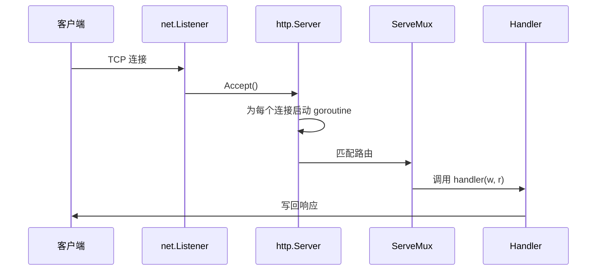
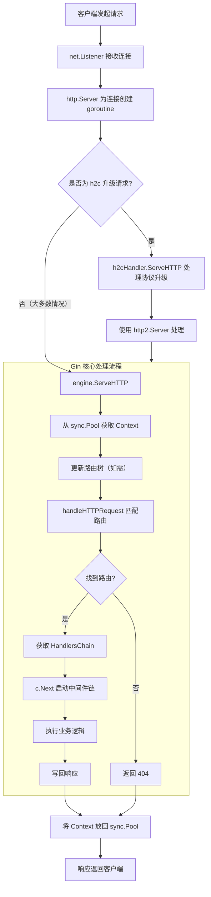
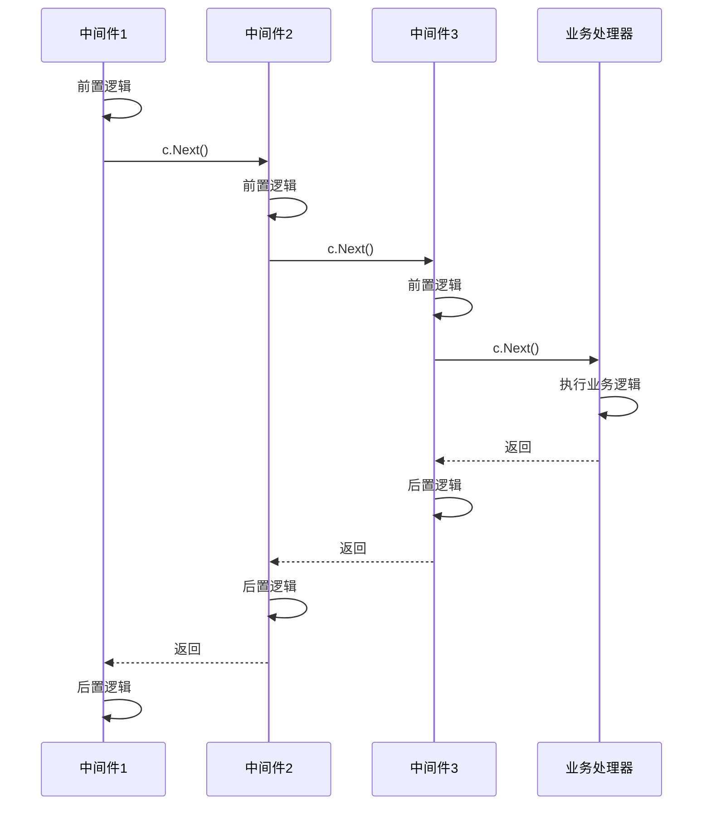
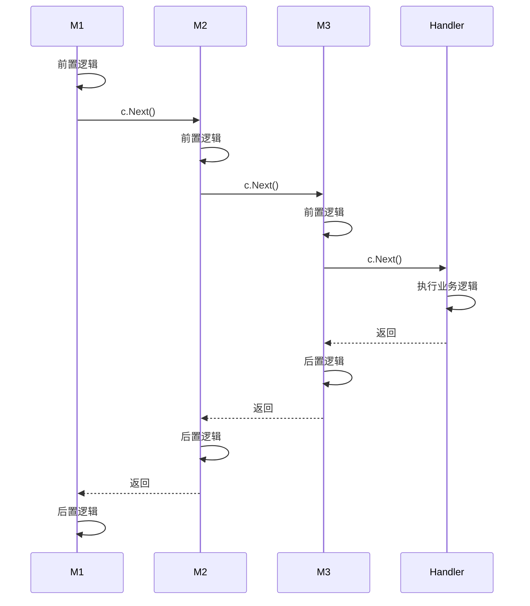

> Go 的 `net/http` 包提供了构建 HTTP 服务的全部基础能力。Gin 在此基础上通过压缩字典树、中间件洋葱模型和 Context 一体化设计，将其提炼为高性能的 Web 框架。
> 本文从标准库出发，逐步过渡到 Gin 源码，覆盖路由注册、请求解析、JSON 交互、文件传输、中间件设计、错误恢复与路由树算法，为后续框架选型和二次开发建立完整的知识链。

---

## 开始之前：API 测试工具推荐

本文涉及大量 HTTP 请求示例，建议配合 API 客户端工具边看边试。

推荐使用 **[Bruno](https://www.usebruno.com/)**——一款开源的 API 客户端。相比 Postman，Bruno 将请求集合保存为本地纯文本文件（Bru 格式），天然支持 Git 版本管理，无需注册账号即可使用。主要特点：

- **本地优先**：请求数据保存在本地文件系统，不上传到云端
- **Git 友好**：请求配置是纯文本，可以直接纳入版本控制
- **零注册**：下载即用，不强制登录
- **支持脚本**：内置断言和前置/后置脚本能力

> 你也可以使用 `curl`、Postman 或其他熟悉的工具，不影响正文理解。

---

## 一、快速开始：标准库的 Hello World

```go
package main

import (
    "fmt"
    "net/http"
)

func helloHandler(w http.ResponseWriter, r *http.Request) {
    fmt.Print("收到了请求")
    fmt.Fprintf(w, "Hello, World!")
}

func main() {
    http.HandleFunc("/", helloHandler)        // 注册路由：路径 → 处理函数
    http.ListenAndServe("127.0.0.1:8080", nil) // 启动服务，阻塞监听
}
```

流程很直观：**注册路由 → 匹配请求路径 → 调用对应的处理函数**。

每个路径对应一个路由处理函数，签名固定为 `func(ResponseWriter, *Request)`。`ResponseWriter` 负责往请求方写回数据，`*Request` 记录请求头、请求体、方法、IP 等信息。

---

## 二、核心流程：路由注册 → 请求匹配 → 服务监听

### 2.1 请求生命周期



每个请求在独立的 goroutine 中处理，这也是 Go HTTP 服务天然支持高并发的根本原因。

### 2.2 `http.HandleFunc` 与默认路由

`http.HandleFunc` 将路径模式与处理函数注册到包级默认路由器 `DefaultServeMux` 中。`ListenAndServe` 的第二个参数传 `nil` 时即使用该默认路由器。

| 概念 | 说明 |
|------|------|
| `DefaultServeMux` | 标准库包级默认路由器，全局单例 |
| `HandleFunc` | 便捷注册方法，内部将 `func` 适配为 `HandlerFunc` 类型 |
| 路由匹配 | 基于前缀的最长匹配，底层是一棵树而非哈希表 |
| 局限性 | 不支持路径参数（`:id`）、不支持路由组 |

### 2.3 `ListenAndServe` 源码解读

```go
// 源代码,位于 src/net/http/server.go
func ListenAndServe(addr string, handler Handler) error {
    server := &Server{Addr: addr, Handler: handler}
    return server.ListenAndServe() // 使用该函数开始监听与服务
}
```

等效于手动构造 `http.Server`：

```go
func main() {
    http.HandleFunc("/", helloHandler)
    server := http.Server{
        Addr:    "127.0.0.1:8080",
        Handler: nil, // nil = DefaultServeMux
    }
    server.ListenAndServe()
}
```

深入 `Server.ListenAndServe()` 源码：

```go
// 源代码,位于 src/net/http/server.go
func (s *Server) ListenAndServe() error {
    if s.shuttingDown() {
        return ErrServerClosed
    }
    addr := s.Addr
    if addr == "" {
        addr = ":http" // 空地址默认监听 80 端口
    }
    ln, err := net.Listen("tcp", addr) // 复用 TCP 网络编程能力
    if err != nil {
        return err
    }
    return s.Serve(ln) // 进入 Accept 循环
}
```

<details>
<summary>关键步骤拆解</summary>

| 步骤 | 代码 | 说明 |
|------|------|------|
| 关闭检查 | `s.shuttingDown()` | 服务器已关闭则直接返回 `ErrServerClosed` |
| 地址默认值 | `addr = ":http"` | 空地址默认监听 80 端口 |
| TCP 监听 | `net.Listen("tcp", addr)` | 底层复用 TCP 网络编程能力 |
| 服务循环 | `s.Serve(ln)` | 进入 Accept 循环，为每个连接启动 goroutine 处理 |

> 前置知识：[Go 网络编程：从 TCP 字节流到自定义协议设计](https://juejin.cn/post/7640253449739304969)

</details>

传入 `nil` 的 `Handler` 实际上是 `DefaultServeMux`——标准库的默认路由复用器。

### 2.4 自定义 ServeMux

```go
mux := http.NewServeMux()          // 返回 *http.ServeMux 对象
mux.HandleFunc("/", helloHandler)
mux.HandleFunc("/user", userHandler)
http.ListenAndServe(":8080", mux)  // 传入自定义 mux
```

完整示例：

```go
package main

import (
    "fmt"
    "net/http"
)

func helloHandler(w http.ResponseWriter, r *http.Request) {
    fmt.Print("收到了请求")
    fmt.Fprintf(w, "Hello, World!")
}

func main() {
    mux := http.NewServeMux()
    mux.HandleFunc("/", helloHandler)
    http.ListenAndServe("127.0.0.1:8080", mux)
}
```

而实际上路由器也是一个接口，表示"所有连接的通用入口"：

```go
type Handler interface {
    ServeHTTP(ResponseWriter, *Request)
}
```

> 日常开发中除少数需要包级路由隔离的场景外，直接使用 `http` 包自带的路由函数就足够了。

---

## 三、深入 `*http.Request`：请求信息提取

`*http.Request` 封装了一次 HTTP 请求的全部元数据。以下示例展示如何从中提取所有关键信息：

```go
package main

import (
    "encoding/json"
    "fmt"
    "io"
    "net/http"
)

// Echo 回显所有请求信息
func Echo(w http.ResponseWriter, r *http.Request) {
    result := ""

    // 请求方法
    result += "请求方法是: " + r.Method + "\n\n"

    // 请求 URL
    result += "请求 URL: " + r.URL.String() + "\n"
    result += "请求路径: " + r.URL.Path + "\n"
    result += "请求查询参数: " + r.URL.RawQuery + "\n\n"

    // 协议版本
    result += "协议版本: " + r.Proto + "\n\n"

    // 请求头
    result += "请求头:\n"
    for key, values := range r.Header {
        for _, value := range values {
            result += fmt.Sprintf("  %s: %s\n", key, value)
        }
    }
    result += "\n"

    // Host 与内容长度
    result += "Host: " + r.Host + "\n\n"
    result += fmt.Sprintf("Content-Length: %d\n\n", r.ContentLength)

    // 客户端地址
    result += "RemoteAddr: " + r.RemoteAddr + "\n\n"
    result += "RequestURI: " + r.RequestURI + "\n\n"

    // 读取请求体
    if r.Body != nil {
        bodyBytes, err := io.ReadAll(r.Body)
        if err == nil && len(bodyBytes) > 0 {
            result += "请求体:\n"
            var jsonData interface{}
            if json.Unmarshal(bodyBytes, &jsonData) == nil {
                prettyJSON, _ := json.MarshalIndent(jsonData, "", "  ")
                result += string(prettyJSON) + "\n"
            } else {
                result += string(bodyBytes) + "\n"
            }
        }
        r.Body.Close()
    }

    w.Header().Set("Content-Type", "text/plain; charset=utf-8")
    fmt.Fprint(w, result)
}

func main() {
    http.HandleFunc("/echo", Echo)
    http.ListenAndServe("127.0.0.1:8080", nil)
}
```

`http.Request` 常用字段速查：

| 字段 | 类型 | 说明 |
|------|------|------|
| `Method` | `string` | 请求方法（GET / POST / PUT / DELETE） |
| `URL` | `*url.URL` | 完整的请求 URL（含路径、查询参数） |
| `Proto` | `string` | 协议版本（如 "HTTP/1.1"） |
| `Header` | `http.Header` | 请求头键值对 |
| `Host` | `string` | 请求的目标主机 |
| `Body` | `io.ReadCloser` | 请求体流，读完需关闭 |
| `ContentLength` | `int64` | 请求体长度（字节） |
| `RemoteAddr` | `string` | 客户端 IP 地址 |
| `RequestURI` | `string` | 原始请求行中的 URI |

> HTTP 请求的主要方法有 4 种：GET、POST、PUT、DELETE。此外还有 PATCH、HEAD、OPTIONS 等但不常用。

---

## 四、GET 实战：查询参数与 JSON 响应

模拟一个查询数据库的接口——通过 URL 查询参数传 `id`，返回对应的用户数据：

```go
package main

import (
    "encoding/json"
    "net/http"
    "strconv"
)

type User struct {
    ID   int    `json:"id"`
    Name string `json:"name"`
    Age  int    `json:"age"`
}

// 统一响应格式
type Response struct {
    Success bool        `json:"success"`
    Message string      `json:"message"`
    Data    interface{} `json:"data"`
}

// 模拟数据库
var users = map[int]User{
    1: {ID: 1, Name: "张三", Age: 20},
    2: {ID: 2, Name: "李四", Age: 25},
    3: {ID: 3, Name: "王五", Age: 30},
}

// Query 处理查询请求：/Query?id=1
func Query(w http.ResponseWriter, r *http.Request) {
    // 1. 从 URL 查询参数获取 id
    idStr := r.URL.Query().Get("id")

    // 2. 校验参数存在
    if idStr == "" {
        w.Header().Set("Content-Type", "application/json")
        json.NewEncoder(w).Encode(Response{
            Success: false,
            Message: "请提供 id 参数",
        })
        return
    }

    // 3. 类型转换
    id, err := strconv.Atoi(idStr)
    if err != nil {
        w.Header().Set("Content-Type", "application/json")
        json.NewEncoder(w).Encode(Response{
            Success: false,
            Message: "id 必须是数字",
        })
        return
    }

    // 4. 查询数据
    user, exists := users[id]
    if !exists {
        w.Header().Set("Content-Type", "application/json")
        json.NewEncoder(w).Encode(Response{
            Success: false,
            Message: "用户不存在",
        })
        return
    }

    // 5. 返回成功结果
    w.Header().Set("Content-Type", "application/json")
    json.NewEncoder(w).Encode(Response{
        Success: true,
        Message: "查询成功",
        Data:    user,
    })
}

func main() {
    http.HandleFunc("/Query", Query)
    http.ListenAndServe("127.0.0.1:8080", nil)
}
```

---

## 五、POST 实战：请求体解析与结构体映射

对于上传数据，Go 通过结构体序列化/反序列化方便地转换 HTTP 传入的 JSON 数据。流程为：**定义接收结构体 → 从 `r.Body` 解码 JSON → 校验字段 → 存储并响应**。

```go
package main

import (
    "encoding/json"
    "net/http"
)

type User struct {
    Name  string `json:"name"`
    Age   int    `json:"age"`
    Email string `json:"email"`
}

type Response struct {
    Success bool        `json:"success"`
    Message string      `json:"message"`
    Data    interface{} `json:"data"`
}

var users []User // 模拟数据库

// CreateUser 处理 POST /user —— 创建用户
func CreateUser(w http.ResponseWriter, r *http.Request) {
    // 1. 仅接受 POST
    if r.Method != http.MethodPost {
        w.Header().Set("Content-Type", "application/json")
        json.NewEncoder(w).Encode(Response{
            Success: false,
            Message: "只支持 POST 方法",
        })
        return
    }

    // 2. 从请求体解析 JSON 到结构体
    var newUser User
    err := json.NewDecoder(r.Body).Decode(&newUser)

    // 3. 检查解析结果
    if err != nil {
        w.Header().Set("Content-Type", "application/json")
        json.NewEncoder(w).Encode(Response{
            Success: false,
            Message: "JSON 解析失败: " + err.Error(),
        })
        return
    }

    // 4. 验证必填字段
    if newUser.Name == "" {
        w.Header().Set("Content-Type", "application/json")
        json.NewEncoder(w).Encode(Response{
            Success: false,
            Message: "name 字段不能为空",
        })
        return
    }

    // 5. 存储并响应
    users = append(users, newUser)
    w.Header().Set("Content-Type", "application/json")
    json.NewEncoder(w).Encode(Response{
        Success: true,
        Message: "用户创建成功",
        Data:    newUser,
    })
}

// GetAllUsers 处理 GET /users —— 返回全部用户
func GetAllUsers(w http.ResponseWriter, r *http.Request) {
    w.Header().Set("Content-Type", "application/json")
    json.NewEncoder(w).Encode(Response{
        Success: true,
        Message: "获取成功",
        Data:    users,
    })
}

func main() {
    http.HandleFunc("/user", CreateUser)   // POST 创建用户
    http.HandleFunc("/users", GetAllUsers) // GET 获取所有用户
    http.ListenAndServe("127.0.0.1:8080", nil)
}
```

GET 与 POST 对比：

| 维度 | GET | POST |
|------|-----|------|
| 数据位置 | URL 查询参数（`?key=value`） | 请求体（Body） |
| 数据大小 | 受 URL 长度限制（约 2KB） | 无硬性限制 |
| 语义 | 获取资源（幂等） | 创建/修改资源 |
| Go 解析方式 | `r.URL.Query().Get("key")` | `json.NewDecoder(r.Body).Decode(&obj)` |

> GET 请求一般不携带请求体。

---

## 六、文件上传与下载：multipart/form-data

HTTP 中所有传输本质都是字节流。文件上传下载依赖 `multipart/form-data` 编码和流式拷贝：

```go
package main

import (
    "fmt"
    "io"
    "net/http"
    "os"
    "path/filepath"
)

// UploadFile 处理 POST /upload —— 接收文件上传
func UploadFile(w http.ResponseWriter, r *http.Request) {
    if r.Method != http.MethodPost {
        w.WriteHeader(http.StatusMethodNotAllowed)
        fmt.Fprintf(w, "只支持 POST 方法")
        return
    }

    // 解析表单，限制内存占用 10MB
    err := r.ParseMultipartForm(10 << 20)
    if err != nil {
        fmt.Fprintf(w, "解析表单失败: %v", err)
        return
    }

    // 获取上传的文件（表单字段名为 "file"）
    file, handler, err := r.FormFile("file")
    if err != nil {
        fmt.Fprintf(w, "获取文件失败: %v", err)
        return
    }
    defer file.Close()

    // 创建目标目录
    os.MkdirAll("uploads", 0755)

    // 创建目标文件
    dst, err := os.Create(filepath.Join("uploads", handler.Filename))
    if err != nil {
        fmt.Fprintf(w, "创建文件失败: %v", err)
        return
    }
    defer dst.Close()

    // 流式复制：固定 32KB 缓冲区，不占满内存
    written, err := io.Copy(dst, file)
    if err != nil {
        fmt.Fprintf(w, "保存文件失败: %v", err)
        return
    }

    fmt.Fprintf(w, "文件上传成功！\n文件名: %s\n大小: %d 字节", handler.Filename, written)
}

// DownloadFile 处理 GET /download?filename=xxx —— 下载文件
func DownloadFile(w http.ResponseWriter, r *http.Request) {
    if r.Method != http.MethodGet {
        w.WriteHeader(http.StatusMethodNotAllowed)
        fmt.Fprintf(w, "只支持 GET 方法")
        return
    }

    // 获取文件名参数
    filename := r.URL.Query().Get("filename")
    if filename == "" {
        fmt.Fprintf(w, "请提供 filename 参数")
        return
    }

    // 安全检查：防止路径遍历攻击
    filename = filepath.Base(filename)

    filePath := filepath.Join("uploads", filename)
    file, err := os.Open(filePath)
    if err != nil {
        if os.IsNotExist(err) {
            w.WriteHeader(http.StatusNotFound)
            fmt.Fprintf(w, "文件不存在")
        } else {
            w.WriteHeader(http.StatusInternalServerError)
            fmt.Fprintf(w, "打开文件失败: %v", err)
        }
        return
    }
    defer file.Close()

    fileInfo, _ := file.Stat()

    // 设置下载响应头
    w.Header().Set("Content-Disposition", fmt.Sprintf("attachment; filename=%s", filename))
    w.Header().Set("Content-Type", "application/octet-stream")
    w.Header().Set("Content-Length", fmt.Sprintf("%d", fileInfo.Size()))

    io.Copy(w, file) // 流式发送文件内容
}

// ListFiles 处理 GET /list —— 列出所有可下载文件
func ListFiles(w http.ResponseWriter, r *http.Request) {
    files, err := os.ReadDir("uploads")
    if err != nil {
        fmt.Fprintf(w, "读取目录失败: %v", err)
        return
    }

    fmt.Fprintf(w, "可用文件列表:\n")
    for i, file := range files {
        if !file.IsDir() {
            info, _ := file.Info()
            fmt.Fprintf(w, "%d. %s (大小: %d 字节)\n", i+1, file.Name(), info.Size())
        }
    }
    fmt.Fprintf(w, "\n下载命令: curl -O 'http://127.0.0.1:8080/download?filename=文件名'")
}

func main() {
    os.MkdirAll("uploads", 0755)

    http.HandleFunc("/upload", UploadFile)
    http.HandleFunc("/download", DownloadFile)
    http.HandleFunc("/list", ListFiles)

    http.ListenAndServe("127.0.0.1:8080", nil)
}
```

`io.Copy` 为什么比 `io.ReadAll` + `Write` 更好？

| 方式 | 内存占用 | 适用场景 |
|------|----------|----------|
| `io.ReadAll` + `Write` | 整个文件读入内存 | 小文件（< 几 MB） |
| `io.Copy` | 固定 32KB 缓冲区，边读边写 | 任意大小文件 |

`io.Copy` 内部使用 `io.CopyBuffer`，默认 32KB 缓冲区循环复用——处理 GB 级文件也只占用 32KB 内存。

---

## 七、标准库的局限与常见陷阱

### 7.1 标准库的局限

| 局限 | 说明 | 影响 |
|------|------|------|
| 无路径参数 | 无法直接定义 `/user/:id` | 需要手动从 `r.URL.Path` 中切割解析 |
| 路由匹配方式 | 前缀最长匹配，非精确匹配 | `/` 会匹配所有未被精确注册的路径 |
| 无中间件机制 | 无内置中间件链 | 需要手动包装 `http.Handler` |
| 无内置校验 | 请求参数校验需手写 if-else | 代码冗长，容易遗漏边界情况 |

### 7.2 常见陷阱速查

| 陷阱 | 原因 | 解决方案 |
|------|------|----------|
| 忘记关闭 Body | `r.Body` 是 `io.ReadCloser`，不关闭会泄漏连接 | `defer r.Body.Close()` |
| 多次读取 Body | Body 是流，读完就没了 | 先 `io.ReadAll` 到 `[]byte`，再多次使用 |
| 路径遍历攻击 | 用户传入 `../../etc/passwd` 作为文件名 | `filepath.Base(filename)` 截断路径 |
| 大文件 OOM | `io.ReadAll` 把整个文件读入内存 | 使用 `io.Copy` 流式传输 |
| 未设置 Content-Type | 浏览器可能误判响应格式 | JSON 接口设置 `application/json`；下载设置 `application/octet-stream` |

---

## 八、Gin 入门：为什么需要框架

标准库 `net/http` 已经提供了完整的 HTTP 服务能力，但日常业务开发中广泛使用 Gin 这类框架，原因在于：

| 能力 | net/http | Gin |
|------|----------|-----|
| 路由性能 | 线性匹配，路径多时退化 | Radix Tree 基数树，O(log n) |
| 参数提取 | 手动 `r.URL.Query().Get()` | `/user/:id` 自动绑定 |
| 中间件 | 手动包装 | `gin.Default()` 内置 Logger + Recovery |
| JSON 校验 | 手写 if 判断 | `binding:"required"` 标签驱动 |
| 错误处理 | 手动 `w.WriteHeader(500)` | `c.AbortWithStatusJSON()` |
| 路由组 | 不支持 | `r.Group("/prefix")` 天然支持 |

### 8.1 Gin 快速开始

```go
package main

import "github.com/gin-gonic/gin"

func HelloWorld(c *gin.Context) {
    c.String(200, "Hello World") // 向客户端响应字符串和 200 状态码
}

func main() {
    r := gin.Default()         // 创建带默认中间件的引擎
    r.GET("/", HelloWorld)     // 注册 GET 路由
    r.Run("127.0.0.1:8080")    // 启动服务
}
```

### 8.2 Engine 结构体与配置项

<details>
<summary>Gin 引擎的可配置项详解</summary>

```go
func Default(opts ...OptionFunc) *Engine {
    debugPrintWARNINGDefault()              // Debug 模式下检查 Go 版本
    engine := New()
    engine.Use(Logger(), Recovery())       // 默认中间件：日志 + 错误恢复
    return engine.With(opts...)
}

func New(opts ...OptionFunc) *Engine {
    debugPrintWARNINGNew()
    engine := &Engine{
        RouterGroup: RouterGroup{
            Handlers: nil,
            basePath: "/",
            root:     true,
        },
        FuncMap:                template.FuncMap{},
        RedirectTrailingSlash:  true,
        RedirectFixedPath:      false,
        HandleMethodNotAllowed: false,
        ForwardedByClientIP:    true,
        RemoteIPHeaders:        []string{"X-Forwarded-For", "X-Real-IP"},
        TrustedPlatform:        defaultPlatform,
        UseRawPath:             false,
        UseEscapedPath:         false,
        RemoveExtraSlash:       false,
        UnescapePathValues:     true,
        MaxMultipartMemory:     defaultMultipartMemory, // 默认 32MB
        trees:                  make(methodTrees, 0, 9), // 路由树，每种 HTTP 方法独立一棵
        delims:                 render.Delims{Left: "{{", Right: "}}"},
        secureJSONPrefix:       "while(1);",
        trustedProxies:         []string{"0.0.0.0/0", "::/0"},
        trustedCIDRs:           defaultTrustedCIDRs,
    }
    engine.engine = engine
    engine.pool.New = func() any {
        return engine.allocateContext(engine.maxParams)
    }
    return engine.With(opts...)
}
```

**关键配置项速查：**

| 配置 | 默认值 | 说明 |
|------|--------|------|
| `RedirectTrailingSlash` | `true` | 请求 `/foo/` 自动 301 重定向到 `/foo` |
| `RedirectFixedPath` | `false` | 尝试修复路径中多余的 `../` 或 `//` |
| `HandleMethodNotAllowed` | `false` | 方法不匹配但路径存在时返回 405 |
| `ForwardedByClientIP` | `true` | 从代理头解析客户端真实 IP |
| `RemoteIPHeaders` | `["X-Forwarded-For", "X-Real-IP"]` | 用于获取客户端 IP 的请求头列表 |
| `MaxMultipartMemory` | 32MB | 文件上传时的内存使用上限 |

</details>

### 8.3 `Run` 源码：从 Gin 到标准库

Gin 的 `Run` 方法最终仍然通过标准库的 `http.Server` 来启动服务：

```go
func (engine *Engine) Run(addr ...string) (err error) {
    defer func() { debugPrintError(err) }()

    if engine.isUnsafeTrustedProxies() {
        debugPrint("[WARNING] You trusted all proxies, this is NOT safe.")
    }

    engine.updateRouteTrees()          // 构建路由树
    address := resolveAddress(addr)     // 解析监听地址，默认 ":8080"
    debugPrint("Listening and serving HTTP on %s\n", address)

    server := &http.Server{
        Addr:    address,
        Handler: engine.Handler(),      // 将 Gin 引擎适配为标准库 Handler
    }
    err = server.ListenAndServe()       // 阻塞监听
    return
}
```

核心流程：**校验配置 → 更新路由树 → 解析监听地址 → 创建 `http.Server` → 调用 `ListenAndServe` 开始阻塞监听**。`engine.Handler()` 将 Gin 引擎适配为标准库的 `http.Handler` 接口。

---

## 九、Gin 路由系统

### 9.1 路由注册流程

从 `r.GET("/", HelloWorld)` 开始，看路由如何注册到引擎中：

```go
// 源代码,位于 gin@v1.12.0/routergroup.go
func (group *RouterGroup) GET(relativePath string, handlers ...HandlerFunc) IRoutes {
    return group.handle(http.MethodGet, relativePath, handlers)
}

func (group *RouterGroup) handle(httpMethod, relativePath string, handlers HandlersChain) IRoutes {
    absolutePath := group.calculateAbsolutePath(relativePath) // 拼接基础路径
    handlers = group.combineHandlers(handlers)                // 合并路由组方法链
    group.engine.addRoute(httpMethod, absolutePath, handlers) // 注册到路由树
    return group.returnObj()                                   // 返回路由组,支持链式调用
}
```

每个路由注册时，Gin 会将路由组的中间件与当前路由的处理函数拼接成一条 `HandlersChain`，然后按 HTTP 方法写入对应的方法树。

### 9.2 路径参数

Gin 支持 RESTful 风格的路径参数：

```go
r.GET("/user/:id", func(c *gin.Context) {
    id := c.Param("id") // 提取路径中的 id 值
    c.String(200, "用户ID: %s", id)
})
```

- `:param`：匹配到下一个 `/` 或路径末尾
- `*catchall`：匹配剩余所有路径（必须在末尾，如 `/static/*filepath`）

### 9.3 路由树：压缩字典树算法

Gin 的路由核心是一棵 **压缩字典树（Radix Tree）**，每个 HTTP 方法对应一棵独立的路由树。

```go
// 方法树
type methodTree struct {
    method string
    root   *node
}

// 路由节点
type node struct {
    path      string         // 当前节点的压缩路径
    indices   string         // 子节点首字符索引，O(1) 定位
    wildChild bool           // 是否存在通配子节点
    nType     nodeType       // 节点类型：static / root / param / catchAll
    priority  uint32         // 优先级，高频路由自动前置
    children  []*node        // 子节点数组，通配子节点始终在末尾
    handlers  HandlersChain  // 路由对应的处理器链
    fullPath  string         // 完整路由路径
}
```

<details>
<summary>进阶扩展：路由树的技术细节</summary>

这个树是**压缩前缀树（Radix Tree / Patricia Trie）**，是 Gin 框架的核心路由匹配引擎。它的设计目标是高效存储和匹配动态路由（如 `/user/:id`、`/files/*path`）。

全部的源码实现位于 `gin@v1.12.0/tree.go`，核心数据结构与函数如下：

```go
// 核心数据结构
type node struct {
    path      string        // 当前节点的压缩路径
    indices   string        // 子节点首字符索引，用于 O(1) 定位
    wildChild bool          // 是否存在通配子节点
    nType     nodeType      // 节点类型：static/root/param/catchAll
    priority  uint32        // 优先级，高频路由自动前置
    children  []*node       // 子节点数组，通配子节点始终在末尾
    handlers  HandlersChain // 路由对应的处理器链
    fullPath  string        // 完整路由路径
}

const (
    static nodeType = iota // 普通字符串节点
    root                   // 根节点
    param                  // 参数节点（:开头）
    catchAll               // 全匹配节点（*开头）
)
```

### 为什么选择 Radix Tree 而不是哈希表？

**哈希表的局限：**
- 不支持路径参数（`/user/:id`）
- 不支持动态路由匹配
- 路由顺序无关，无法处理优先级

**Radix Tree 的优势：**
- 共享公共前缀，节省内存
- 自然支持参数提取
- 保持路由顺序

---

## 算法思路详解

### 1. 核心思想：路径压缩

传统 Trie 树的每个节点只存一个字符：

```
/user/info
/user/list

传统 Trie:
u -> s -> e -> r -> / -> i -> n -> f -> o
                     -> l -> i -> s -> t
```

Radix Tree 压缩公共前缀：

```
Radix Tree:
/user/ -> info
       -> list
```

**压缩的好处：**
- 减少节点数量
- 在匹配路由时提升查找速度（一次比较多个字符）

**对应源码函数：**

```go
// longestCommonPrefix 计算两个字符串的最大公共前缀长度
// 参数 a, b: 要比较的两个字符串
// 返回值: 两个字符串从开头开始相同字符的个数
func longestCommonPrefix(a, b string) int {
    i := 0 // i 记录当前已匹配的相同字符个数，同时作为索引使用
    max_ := min(len(a), len(b)) // 最大可能匹配长度不超过两个字符串中较短者的长度
    for i < max_ && a[i] == b[i] { // 循环条件：索引未越界 且 当前字符相等
        i++ // 匹配成功，继续比较下一个字符
    }
    return i // 返回最终匹配到的公共前缀长度
}
```

该函数在 `addRoute` 的循环中被调用，用于计算新路径与已有节点路径的最长公共前缀，从而实现路径压缩：

```go
func (n *node) addRoute(path string, handlers HandlersChain) {
    // ...
walk:
    for {
        // 寻找最长公共前缀
        i := longestCommonPrefix(path, n.path)
        // ...
    }
}
```

### 2. 节点分裂策略

插入新路由 `/user/profile` 时，现有节点是 `/user/info`：

```
步骤1: 找到公共前缀 "/user/"
步骤2: 原节点分裂：
       - 父节点: "/user/"
       - 子节点1: "info"
       - 子节点2: "profile"
```

这种分裂是原地进行的，通过修改现有节点实现。

**对应源码实现：** 在 `addRoute` 函数中，当 `i < len(n.path)` 时触发分裂：

```go
func (n *node) addRoute(path string, handlers HandlersChain) {
    // ...
    // 分裂节点：当公共前缀长度小于当前节点路径长度时
    if i < len(n.path) {
        child := node{
            path:      n.path[i:],      // 原路径的后半部分
            wildChild: n.wildChild,
            nType:     static,
            indices:   n.indices,
            children:  n.children,
            handlers:  n.handlers,
            priority:  n.priority - 1,
            fullPath:  n.fullPath,
        }

        n.children = []*node{&child}     // 原节点降级为子节点
        n.indices = bytesconv.BytesToString([]byte{n.path[i]})
        n.path = path[:i]               // 当前节点保留公共前缀
        n.handlers = nil
        n.wildChild = false
        n.fullPath = fullPath[:parentFullPathIndex+i]
    }
    // ...
}
```

### 3. 通配符处理算法

#### 参数路由（`:param`）

```
模式：/user/:id/posts
           ^^^^
           参数占位符
```

**匹配规则：**
- 参数匹配到下一个 `/` 或路径结束
- 提取的值存储到 Params 数组
- 参数名用于后续检索

**对应源码实现：** 通配符的查找与验证由 `findWildcard` 函数完成：

```go
// findWildcard 在路径字符串中查找通配符（路由参数或匹配路径）
// 支持的两种通配符类型：
//   - ':' 表示路径参数，匹配到下一个 '/' 或结尾（例如 /user/:id）
//   - '*' 表示贪婪匹配，匹配剩余所有路径（例如 /static/*filepath）
// 参数 path: 待解析的路径字符串，例如 "/user/:id/profile"
// 返回值 wildcard: 通配符及其后续内容组成的字符串，例如 ":id"
// 返回值 i: 通配符在原始路径中的起始位置索引
// 返回值 valid: 通配符语法是否合法（无重复通配符）
func findWildcard(path string) (wildcard string, i int, valid bool) {
    // 遍历路径中的每个字符，寻找通配符起始符号 ':' 或 '*'
    for start, c := range []byte(path) {
        // 跳过普通字符，只关注可能的通配符起始符
        if c != ':' && c != '*' {
            continue
        }
        
        // 找到一个通配符起始位置，先假设它是合法的
        valid = true
        
        // 从 start+1 开始查找通配符的结束位置
        // 通配符的结束标志是 '/' 或者路径结束
        for end, c := range []byte(path[start+1:]) {
            switch c {
            case '/': // 遇到路径分隔符，通配符结束
                // 返回从 start 到 start+1+end 的子串（包含通配符符号）
                // start+1+end 实际上是 '/' 的位置，但不包含 '/' 本身
                return path[start : start+1+end], start, valid
                
            case ':', '*': 
                // 通配符内部不能再次出现 ':' 或 '*'
                // 例如 /user/:id:name 或 /user/:id*file 都是非法的
                valid = false
                // 注意：不立即返回，继续扫描完整个通配符范围
                // 但最终会返回 valid = false 表示语法错误
            }
        }
        
        // 通配符一直持续到路径结尾（没有遇到 '/'）
        // 例如 /user/:id 中的 :id 或 /static/*filepath 中的 *filepath
        return path[start:], start, valid
    }
    
    // 整个路径中没有找到任何通配符
    return "", -1, false
}
```

通配符子节点的插入逻辑在 `insertChild` 函数中：

```go
func (n *node) insertChild(path string, fullPath string, handlers HandlersChain) {
    for {
        wildcard, i, valid := findWildcard(path)
        if i < 0 { // 没有通配符，退出循环
            break
        }

        if wildcard[0] == ':' { // param 类型
           // 插入并设置子节点
            child := &node{
                nType:    param,
                path:     wildcard,
                fullPath: fullPath,
            }
            n.addChild(child)
            n.wildChild = true
            n = child
            n.priority++
            // ...
        }
        // ...
    }
    // 没有通配符，直接插入
    n.path = path
    n.handlers = handlers
    n.fullPath = fullPath
}
```

#### 全匹配路由（`*catchall`）

```
模式：/static/*filepath
```

**特殊规则：**
- 必须在路径末尾
- 匹配剩余所有字符（包括 `/`）
- 一个路由树只能有一个全匹配节点

**对应源码实现：** 在 `insertChild` 函数中，catchAll 节点的插入有严格的约束检查：

```go
func (n *node) insertChild(path string, fullPath string, handlers HandlersChain) {
    for {
        wildcard, i, valid := findWildcard(path)
        // ...
        
        // catchAll 必须在路径末尾
        if i+len(wildcard) != len(path) {
            panic("catch-all routes are only allowed at the end of the path in path '" + fullPath + "'")
        }

        // catchAll 前必须有 '/'
        i--
        if i < 0 || path[i] != '/' {
            panic("no / before catch-all in path '" + fullPath + "'")
        }

        n.path = path[:i]

        // 创建两级节点：第一层是 '/' 标记，第二层存变量
        child := &node{
            wildChild: true,
            nType:     catchAll,
            fullPath:  fullPath,
        }
        n.addChild(child)
        n.indices = "/"
        n = child
        n.priority++

        child = &node{
            path:     path[i:],
            nType:    catchAll,
            handlers: handlers,
            priority: 1,
            fullPath: fullPath,
        }
        n.children = []*node{child}
        return
    }
}
```

### 4. 优先级调度算法

**问题：** 多个路由匹配同一路径时如何选择？

例如：
```
/api/user/:id
/api/user/me
```
请求 `/api/user/me` 应该匹配第二个（静态路由优先）

**解决方案：**
- 静态路由优先级 > 参数路由
- 通过 `priority` 字段实现动态调整
- 高频路由自动前置

**对应源码实现：** `incrementChildPrio` 函数负责在每次路由命中时增加子节点优先级，并将其前置：

```go
// incrementChildPrio 增加指定位置子节点的优先级，并通过冒泡排序将其向前移动到合适位置
// 参数 pos: 子节点在 children 切片中的当前位置
// 返回值: 移动后该子节点的新位置索引
func (n *node) incrementChildPrio(pos int) int {
    cs := n.children // 获取子节点切片
    
    // 增加指定子节点的优先级计数
    cs[pos].priority++
    prio := cs[pos].priority // 记录增加后的优先级值

    // 将高优先级节点向前冒泡
    newPos := pos // 记录节点移动后的最终位置，初始为当前位置
    // 循环条件：还未移动到最前面（newPos > 0）且 前一个节点的优先级小于当前节点优先级
    // 注意：这里 prio 是固定值，而前面节点优先级可能也刚被移动过（左滑过程中遇到相等优先级则停止）
    for ; newPos > 0 && cs[newPos-1].priority < prio; newPos-- {
        // 交换相邻的两个节点：将当前节点与前一个节点互换位置
        cs[newPos-1], cs[newPos] = cs[newPos], cs[newPos-1]
    }

    // 同步更新 indices 字符串，保持与 children 切片顺序一致
    //    indices 存储每个子节点对应的第一个字符（用于快速路由匹配）
    if newPos != pos { // 只有位置发生变化时才需要更新 indices
        // 将 indices 中对应位置的字符进行相同顺序的重排
        // 操作逻辑：
        // - n.indices[:newPos]                 : 新位置之前的字符保持不变
        // - n.indices[pos:pos+1]               : 被移动节点的字符（原 pos 位置）
        // - n.indices[newPos:pos]              : 被移动节点原位置之前的字符向后移动
        // - n.indices[pos+1:]                  : 被移动节点原位置之后的字符保持不变
        // 实际构造：保持 indices 与 children 的排列顺序完全一致
        n.indices = n.indices[:newPos] +
            n.indices[pos:pos+1] +
            n.indices[newPos:pos] + n.indices[pos+1:]
    }
    return newPos // 返回移动后的新位置索引
}
```

该函数在 `addRoute` 的遍历循环中被调用：

```go
// addRoute 向路由树中添加一条路由路径及其对应的处理函数链
// 参数 path: 路由路径，例如 "/user/profile"
// 参数 handlers: 该路由对应的处理函数链
func (n *node) addRoute(path string, handlers HandlersChain) {
    // ...
    // 遍历当前节点的所有子节点索引字符，寻找与当前路径首字符匹配的子节点
    for i, max_ := 0, len(n.indices); i < max_; i++ {
        // c 是当前待添加路径的第一个字符（例如 "/user" 中的 'u'）
        // n.indices[i] 是当前节点第 i 个子节点的首字符
        if c == n.indices[i] {
            // 找到匹配的子节点（路径首字符相同）
            
            // 更新父路径的索引长度：累加当前节点的路径长度
            // parentFullPathIndex 记录完整路径已匹配部分的字符索引位置
            parentFullPathIndex += len(n.path)
            
            // 提升命中子节点的优先级
            // incrementChildPrio 会将第 i 个子节点向前移动（如果它的优先级足够高）
            // 这样下次查找相同路由时，能更快地匹配到这个高频使用的子节点
            // 返回值 i 是移动后该子节点的新位置索引
            i = n.incrementChildPrio(i)
            
            // 切换到匹配到的子节点，继续下一层路径的匹配
            n = n.children[i]
            
            // 跳转到标签 walk 处，继续外层循环的处理逻辑
            // 注意：这是 Go 中的标签跳转，通常用于跳出多层循环或继续外循环
            continue walk
        }
    }
    // ... 
}
```

### 5. 查找算法流程

```
输入：/user/123/posts

步骤1: 从根开始，比较节点路径
      根节点路径 "" → 匹配，进入

步骤2: 匹配节点 "/user/"
      剩余路径: "123/posts"

步骤3: 查找子节点
      静态子节点 "info" 不匹配
      参数子节点 ":id" 匹配 ✓

步骤4: 提取参数 id=123
      剩余路径: "/posts"

步骤5: 继续匹配子节点 "/posts"
      找到处理器，返回
```

**对应源码实现：** 查找算法由 `getValue` 函数实现，返回值包含处理器、参数和重定向建议：

```go
type nodeValue struct {
    handlers HandlersChain
    params   *Params
    tsr      bool      // 是否需要尾随斜杠重定向
    fullPath string
}

func (n *node) getValue(path string, params *Params, skippedNodes *[]skippedNode, unescape bool) (value nodeValue) {
    var globalParamsCount int16

walk:
    for {
        prefix := n.path
        if len(path) > len(prefix) {
            if path[:len(prefix)] == prefix {
                path = path[len(prefix):]

                // 优先匹配静态子节点（通过 indices 快速定位）
                idxc := path[0]
                for i, c := range []byte(n.indices) {
                    if c == idxc {
                        // 如果有通配子节点，记录当前状态用于回溯
                        if n.wildChild {
                            // 保存回溯点...
                        }
                        n = n.children[i]
                        continue walk
                    }
                }
                // 静态子节点不匹配，尝试通配子节点...
            }
        }
        // ...
    }
}
```

参数提取逻辑（param 类型节点）：

```go
case param:
    // 找到参数值结束位置（'/' 或路径末尾）
    end := 0
    for end < len(path) && path[end] != '/' {
        end++
    }

    // 保存参数值
    if params != nil {
        (*value.params)[i] = Param{
            Key:   n.path[1:],   // 去掉前缀 ':'
            Value: val,
        }
    }

    // 如果路径未结束，继续深入子节点
    if end < len(path) {
        if len(n.children) > 0 {
            path = path[end:]
            n = n.children[0]
            continue walk
        }
    }
```

### 6. 回溯机制（Backtracking）

**为什么需要回溯？**

考虑路由：
```
/a/:b/c
/a/b/c
```

请求 `/a/b/c` 可能先匹配到参数路由 `/:b`，但后续无法匹配 `/c`，需要回退重新尝试静态路由。

**回溯策略：**
- 在进入通配符前，记录当前状态（skippedNode）
- 匹配失败时，回退到上一个记录点
- 尝试其他分支

**对应源码实现：** 回溯通过 `skippedNodes` 栈实现。进入通配子节点前保存状态：

```go
type skippedNode struct {
    path        string
    node        *node
    paramsCount int16
}

// 在 getValue 函数中，遍历静态子节点时保存回溯点
if n.wildChild {
    index := len(*skippedNodes)
    *skippedNodes = (*skippedNodes)[:index+1]
    (*skippedNodes)[index] = skippedNode{
        path: prefix + path,
        node: &node{
            path:      n.path,
            wildChild: n.wildChild,
            nType:     n.nType,
            priority:  n.priority,
            children:  n.children,
            handlers:  n.handlers,
            fullPath:  n.fullPath,
        },
        paramsCount: globalParamsCount,
    }
}
```

匹配失败时回退：

```go
// 从栈中取出最近的回溯点
for length := len(*skippedNodes); length > 0; length-- {
    skippedNode := (*skippedNodes)[length-1]
    *skippedNodes = (*skippedNodes)[:length-1]
    if strings.HasSuffix(skippedNode.path, path) {
        path = skippedNode.path
        n = skippedNode.node
        if value.params != nil {
            *value.params = (*value.params)[:skippedNode.paramsCount]
        }
        globalParamsCount = skippedNode.paramsCount
        continue walk  // 重新尝试匹配
    }
}
```

### 7. 尾随斜杠处理（TSR）

**问题：**
- 注册：`/user`
- 请求：`/user/`

**TSR 算法：**
1. 优先精确匹配
2. 失败时检测是否有带/不带斜杠的路由
3. 返回重定向建议（301/302）

**对应源码实现：** 在 `getValue` 函数中，多个位置会设置 `value.tsr = true`：

```go
// 场景1：完全匹配但路径以 '/' 结尾，且有通配子节点
if path == "/" && n.wildChild && n.nType != root {
    value.tsr = true
    return value
}

// 场景2：路径不匹配，但叶子节点存在
value.tsr = path == "/" ||
    (len(prefix) == len(path)+1 && prefix[len(path)] == '/' &&
        path == prefix[:len(prefix)-1] && n.handlers != nil)

// 场景3：检查 indices 中是否有 '/' 子节点
for i, c := range []byte(n.indices) {
    if c == '/' {
        n = n.children[i]
        value.tsr = (len(n.path) == 1 && n.handlers != nil) ||
            (n.nType == catchAll && n.children[0].handlers != nil)
        return value
    }
}
```

### 8. 大小写不敏感查找

**挑战：**
- HTTP URL 通常大小写不敏感
- 但保留原始大小写用于重定向

**算法：**
1. 将路径转为小写进行匹配
2. 记录原始路径的字符
3. 找到匹配后返回原始大小写路径
4. 处理 Unicode 字符（多字节）

**对应源码实现：** `findCaseInsensitivePathRec` 函数实现递归的大小写不敏感查找，核心逻辑是同时尝试大小写匹配：

```go
func (n *node) findCaseInsensitivePathRec(path string, ciPath []byte, rb [4]byte, fixTrailingSlash bool) []byte {
    npLen := len(n.path)

walk:
    for len(path) >= npLen && (npLen == 0 || strings.EqualFold(path[1:npLen], n.path[1:])) {
        // ...
        
        // 处理 Unicode 字符的大小写
        var rv rune
        for max_ := min(npLen, 3); off < max_; off++ {
            if i := npLen - off; utf8.RuneStart(oldPath[i]) {
                rv, _ = utf8.DecodeRuneInString(oldPath[i:])
                break
            }
        }

        // 先尝试小写匹配
        lo := unicode.ToLower(rv)
        utf8.EncodeRune(rb[:], lo)
        for i, c := range []byte(n.indices) {
            if c == idxc {
                if out := n.children[i].findCaseInsensitivePathRec(...); out != nil {
                    return out
                }
                break
            }
        }

        // 如果小写不匹配且大小写不同，再尝试大写匹配
        if up := unicode.ToUpper(rv); up != lo {
            utf8.EncodeRune(rb[:], up)
            for i, c := range []byte(n.indices) {
                if c == idxc {
                    n = n.children[i]
                    npLen = len(n.path)
                    continue walk
                }
            }
        }
    }
    // ...
}
```

### 9. 索引加速技术

每个节点维护 `indices` 字符串：

```
节点 "/user/" 有三个子节点：
- "info"    (首字符 'i')
- "list"    (首字符 'l')
- ":id"     (首字符 ':')

indices = "il:"
```

查找时 O(1) 定位子节点，无需遍历。

**对应源码实现：** indices 的构建和维护分散在多个函数中。

添加新子节点时追加首字符：

```go
// addRoute 函数中
n.indices += bytesconv.BytesToString([]byte{c})
child := &node{fullPath: fullPath}
n.addChild(child)
n.incrementChildPrio(len(n.indices) - 1)
```

`incrementChildPrio` 中同步调整 indices 顺序：

```go
if newPos != pos {
    n.indices = n.indices[:newPos] +          // 不变的前缀
        n.indices[pos:pos+1] +                 // 被移动字符
        n.indices[newPos:pos] + n.indices[pos+1:] // 其余字符
}
```

节点分裂时重置 indices：

```go
// addRoute 分裂逻辑中
n.indices = bytesconv.BytesToString([]byte{n.path[i]})
```

查找时通过 indices 快速定位：

```go
// getValue 函数中
idxc := path[0]
for i, c := range []byte(n.indices) {
    if c == idxc {
        n = n.children[i]
        continue walk
    }
}
```

### 10. 节点类型设计

```
static   - 普通字符串节点
param    - 参数节点（:开头）
catchAll - 全匹配节点（*开头）
root     - 根节点（特殊标识）
```

**组合规则：**
- 每个节点最多一个 param 或 catchAll 子节点
- param/catchAll 必须在 children 末尾
- catchAll 不能有其他兄弟节点

**对应源码实现：** `addChild` 函数保证了通配子节点始终在数组末尾：

```go
func (n *node) addChild(child *node) {
    if n.wildChild && len(n.children) > 0 {
        // 通配子节点已经在末尾，新节点插入到它前面
        wildcardChild := n.children[len(n.children)-1]
        n.children = append(n.children[:len(n.children)-1], child, wildcardChild)
    } else {
        n.children = append(n.children, child)
    }
}
```

节点类型通过 `nType` 字段标识，在 `insertChild` 中赋值：

```go
// 参数节点
child := &node{
    nType:    param,
    path:     wildcard,
    fullPath: fullPath,
}

// 全匹配节点
child := &node{
    wildChild: true,
    nType:     catchAll,
    fullPath:  fullPath,
}
```

在 `getValue` 中通过 switch 分支处理不同类型的节点匹配逻辑：

```go
switch n.nType {
case param:
    // 提取参数值到下一个 '/'
case catchAll:
    // 提取剩余全部路径
default:
    panic("invalid node type")
}
```

---

## 性能特性分析

### 时间复杂度
- **插入**：O(m)，m 为路径长度 —— `addRoute` 函数的 walk 循环每次消费路径前缀
- **查找**：O(m)，最坏情况 —— `getValue` 函数的 walk 循环类似
- **实际表现**：接近 O(log n)，因路径压缩和 indices 索引加速

### 空间复杂度
- **最坏**：O(n * m)，n 为路由数
- **实际**：远小于 Trie 树，因路径压缩

### 优化点
1. **无锁设计**：构建时一次性完成（`addRoute`），运行时只读（`getValue`）
2. **内存局部性**：`node` 结构体字段紧凑排列，连续内存访问
3. **分支预测友好**：优先匹配静态路由（先遍历 indices 中的非通配字符）

---

## 与正则路由的对比

| 特性 | Radix Tree | 正则路由 |
|------|------------|----------|
| 匹配速度 | 极快（O(m)） | 较慢（O(2^n)） |
| 参数提取 | 自然支持（param/catchAll 节点） | 需要捕获组 |
| 路由顺序 | 自然排序（priority 机制） | 需要手动排序 |
| 内存占用 | 较小（路径压缩） | 较大（存储完整正则） |
| 灵活性 | 中等（仅支持 :param 和 *catchAll） | 很高（任意正则表达式） |

---

## 核心函数速查表

| 函数 | 职责 | 算法对应 |
|------|------|----------|
| `longestCommonPrefix` | 计算两路径的最长公共前缀 | 路径压缩 |
| `addRoute` | 注册新路由的主入口 | 节点分裂、优先级 |
| `insertChild` | 处理带通配符的路径插入 | 通配符处理 |
| `findWildcard` | 查找并验证路径中的通配符 | 参数路由解析 |
| `incrementChildPrio` | 提升子节点优先级并重排序 | 优先级调度 |
| `getValue` | 根据请求路径查找处理器 | 查找算法、回溯、TSR |
| `findCaseInsensitivePathRec` | 大小写不敏感递归查找 | 大小写不敏感 |
| `addChild` | 添加子节点，保持通配符在末尾 | 节点类型约束 |

---

这种设计在工程实践中证明了其价值，Gin 框架基于此支撑了大量高并发生产环境。整套路由算法的精妙之处在于：**用简单的数据结构（压缩前缀树 + indices 索引 + priority 排序）实现了高性能的动态路由匹配，在 O(m) 的时间复杂度内同时完成了路径匹配和参数提取。**

</details>

整套路由算法的精妙之处在于：**用简单的数据结构（压缩前缀树 + indices 索引 + priority 排序）实现了高性能的动态路由匹配，在 O(m) 的时间复杂度内同时完成了路径匹配和参数提取。**

---

## 十、Gin 中间件与服务流程

Gin 框架通过精巧的设计，将自己完全适配进了 Go 标准库的 `http.Handler` 接口体系中。这意味着，Gin 既可以利用标准库的强大能力，又能通过自己的路由树和中间件机制实现高性能请求处理。

### 10.1 从 `http.Handler` 到 Gin 引擎

任何一个 HTTP 服务库的核心，都是实现 `http.Handler` 接口。Gin 的 `Engine` 正是这个接口的实现者。

```go
// 源代码位于 gin@v1.12.0/gin.go
// Engine 实现了 http.Handler 接口
func (engine *Engine) ServeHTTP(w http.ResponseWriter, req *http.Request) {
    // ... Gin 的核心处理逻辑
}
```

为了让 Gin 能够处理 HTTP/2 明文协议（h2c），`Engine.Handler()` 方法提供了适配层：

```go
// 将 Gin 引擎适配为标准库的 http.Handler
func (engine *Engine) Handler() http.Handler {
    if !engine.UseH2C {
        return engine // 默认情况，直接返回引擎自身
    }

    // 若启用 h2c，则返回一个包装了 Gin 引擎的 h2cHandler
    h2s := &http2.Server{}
    return h2c.NewHandler(engine, h2s)
}
```

这个适配过程的核心是 `h2cHandler` 结构体：

```go
// 源代码位于 golang.org/x/net/http2/h2c/h2c.go
type h2cHandler struct {
    Handler http.Handler // 这里的 Handler 就是 Gin 引擎
    s       *http2.Server
}
```

### 10.2 完整的请求处理链路

一个 HTTP 请求从进入到返回，在 Gin 中的完整处理流程如下图所示：



#### 10.2.1 入口：`h2cHandler.ServeHTTP`

这个函数是所有请求进入 Gin 的第一道门，它负责判断是否需要 HTTP/2 升级。

```go
// 源代码位于 golang.org/x/net/http2/h2c/h2c.go
func (s h2cHandler) ServeHTTP(w http.ResponseWriter, r *http.Request) {
    // 1. 处理“预先知道”的 h2c 连接（RFC 7540 3.4 节）
    if r.Method == "PRI" && len(r.Header) == 0 && r.URL.Path == "*" && r.Proto == "HTTP/2.0" {
        // ... 初始化 h2c 连接，并通过 s.s.ServeConn 处理
        return
    }

    // 2. 处理通过 Upgrade 机制升级的 h2c 请求（RFC 7540 3.2 节）
    if isH2CUpgrade(r.Header) {
        // ... 执行升级流程，并通过 s.s.ServeConn 处理
        return
    }

    // 3. 绝大多数情况：回退到普通的 HTTP/1.1 处理器
    // 这里的 s.Handler 就是 Gin 引擎，最终会调用 engine.ServeHTTP
    s.Handler.ServeHTTP(w, r)
}
```

> 在日常开发中，我们的请求几乎都走第三个分支，即直接调用 `engine.ServeHTTP`。

#### 10.2.2 核心：`engine.ServeHTTP`

这是 Gin 处理请求的主函数，体现了 Gin 的核心设计哲学。

```go
// 源代码位于 gin@v1.12.0/gin.go
func (engine *Engine) ServeHTTP(w http.ResponseWriter, req *http.Request) {
    // 1. 确保路由树是最新状态（只在第一次请求时执行）
    engine.routeTreesUpdated.Do(func() {
        engine.updateRouteTrees()
    })

    // 2. 从对象池获取一个 Context（避免频繁内存分配）
    c := engine.pool.Get().(*Context)
    
    // 3. 重置并初始化 Context
    c.writermem.reset(w)
    c.Request = req
    c.reset()

    // 4. 核心：处理 HTTP 请求（路由匹配 + 执行中间件链）
    engine.handleHTTPRequest(c)

    // 5. 处理完毕后，将 Context 归还对象池
    engine.pool.Put(c)
}
```

#### 10.2.3 路由匹配与执行：`engine.handleHTTPRequest`

这个函数负责查找匹配的路由，并启动中间件/业务逻辑的执行链。

```go
func (engine *Engine) handleHTTPRequest(c *Context) {
    httpMethod := c.Request.Method
    rPath := c.Request.URL.Path

    // ... 路径预处理（Unescape、RemoveExtraSlash 等）

    // 1. 根据 HTTP 方法找到对应的路由树
    t := engine.trees
    for i, tl := 0, len(t); i < tl; i++ {
        if t[i].method != httpMethod {
            continue
        }
        root := t[i].root
        
        // 2. 在路由树中查找匹配的节点
        value := root.getValue(rPath, c.params, c.skippedNodes, unescape)
        
        if value.params != nil {
            c.Params = *value.params
        }
        
        // 3. 找到匹配的路由处理器
        if value.handlers != nil {
            c.handlers = value.handlers
            c.fullPath = value.fullPath
            c.Next() // 【关键】启动处理器链的执行
            c.writermem.WriteHeaderNow()
            return
        }
        
        // ... 处理尾随斜杠、路径修复等情况
        break
    }

    // 4. 未找到路由：返回 404 或 405
    c.handlers = engine.allNoRoute
    serveError(c, http.StatusNotFound, default404Body)
}
```

### 10.3 中间件洋葱模型

Gin 的中间件模型被称为“洋葱模型”，因为请求会像剥洋葱一样，依次穿过中间件的前置部分，到达核心业务逻辑后，再逐层返回。



#### 10.3.1 `c.Next()` 与 `c.Abort()` 源码

理解中间件模型的关键在于 `c.Next()` 的实现：

```go
func (c *Context) Next() {
    c.index++
    for c.index < int8(len(c.handlers)) {
        c.handlers[c.index](c) // 依次调用处理器链中的每一个函数
        c.index++
    }
}

func (c *Context) Abort() {
    c.index = abortIndex // abortIndex 是一个很大的数，使 Next 的循环条件永远为假
}
```

### 10.4 中间件执行流程

在 Gin 中，每个路由匹配后得到一组 `HandlersChain`（`[]HandlerFunc`），包含全局中间件、路由组中间件和最终处理函数。框架通过 `c.Next()` 与 `c.Abort()` 控制调用链，实现洋葱模型。



> 框架入口已经调用了一次 `c.Next()`，其内部是一个 `for` 循环，会依次执行链中所有处理器。

### 10.5 `c.Next()` 与 `c.Abort()` 源码详解

```go
func (c *Context) Next() {
    c.index++
    for c.index < int8(len(c.handlers)) {
        c.handlers[c.index](c) // 依次执行后续处理器
        c.index++
    }
}

func (c *Context) Abort() {
    c.index = abortIndex // 设为极大值，使 Next 循环条件为假
}
```

<details>
<summary>Next 与 Abort 的执行行为对比</summary>

| 行为 | 后续处理器是否执行 | 能否添加后置逻辑 |
|------|-------------------|------------------|
| 无 `c.Next()` 无 `c.Abort()` | 执行（框架自动推进） | 无法 |
| 有 `c.Next()` | 执行 | 可以（洋葱模型） |
| 有 `c.Abort()` + `return` | 跳过 | 无法（且必须 return） |

**关键理解：**

- `c.Next()` 不是"是否执行后续"的开关，它只决定**你在哪里插入后置代码**。
- 只有 `c.Abort()` 能阻止后续处理器，但调用后务必记得 `return`，否则当前函数继续执行可能造成多次响应等错误。
- 一旦 `Abort()`，后续任何 `c.Next()` 都无效。

通过 `c.index` 的标记，每个处理器只会被调用一次，控制流精准而简洁。

</details>

完整示例：

```go
package main

import (
    "fmt"
    "github.com/gin-gonic/gin"
)

func middlewareNext(c *gin.Context) {
    fmt.Println("[middlewareNext] 前置 - 即将调用 Next")
    c.Next()
    fmt.Println("[middlewareNext] 后置 - Next 返回后执行")
}

func middlewareAbort(c *gin.Context) {
    fmt.Println("[middlewareAbort] 前置 - 即将调用 Abort")
    c.Abort()
    fmt.Println("[middlewareAbort] Abort 之后 - 当前函数继续执行")
    // 注意：Abort 后若未 return，后续代码仍会执行
}

func HelloWorld(c *gin.Context) {
    fmt.Println("[HelloWorld] 最终处理函数执行")
    c.String(200, "Hello World")
}

func main() {
    r := gin.Default()
    r.GET("/next", middlewareNext, HelloWorld)   // 洋葱模型
    r.GET("/abort", middlewareAbort, HelloWorld) // 后续处理器被跳过
    r.Run("127.0.0.1:8080")
}
```

### 10.6 执行流程总结

从代码层面，一个请求从发出到执行完成的完整链路是：

```
客户端请求
    ↓
net.Listener Accept
    ↓
http.Server 为每个连接创建 goroutine
    ↓
h2cHandler.ServeHTTP 判断协议（h2c 升级 or 普通 HTTP/1.1）
    ↓
engine.ServeHTTP（从 sync.Pool 获取 Context）
    ↓
handleHTTPRequest（匹配路由树，获取 HandlersChain）
    ↓
c.Next()（启动中间件/业务逻辑链）
    ├── 中间件1 前置逻辑
    │   └── c.Next()
    │       ├── 中间件2 前置逻辑
    │       │   └── c.Next()
    │       │       └── 业务处理器
    │       └── 中间件2 后置逻辑
    └── 中间件1 后置逻辑
    ↓
写回 HTTP 响应
    ↓
Context 归还 sync.Pool
```

### 10.7 路由组

利用路由组，可以为不同 URL 前缀绑定不同的中间件：

```go
package main

import (
    "fmt"
    "github.com/gin-gonic/gin"
)

func LoginMiddleware(c *gin.Context) {
    fmt.Print("验证登录")
    c.Next()
}

func AdminMiddleware(c *gin.Context) {
    fmt.Print("验证管理员权限")
    c.Next()
}

func main() {
    r := gin.Default()

    // 公开路由：无中间件    r.GET("/home", func(c *gin.Context) {
        c.String(200, "首页-公开访问")
    })

    // 需要登录的路由组
    logined := r.Group("/user")
    logined.Use(LoginMiddleware)
    {
        logined.GET("/profile", func(c *gin.Context) {
            c.String(200, "个人资料")
        })
        logined.GET("/orders", func(c *gin.Context) {
            c.String(200, "订单列表")
        })
    }
    // 注册了 /user/profile，/user/orders 两个路由，都使用 LoginMiddleware 中间件

    // 需要管理员权限的路由组
    admin := r.Group("/admin")
    admin.Use(AdminMiddleware)
    {
        admin.GET("/users", func(c *gin.Context) {
            c.String(200, "用户管理")
        })
        admin.GET("/system", func(c *gin.Context) {
            c.String(200, "系统设置")
        })
    }
    // 注册了 /admin/users，/admin/system 两个路由，都使用 AdminMiddleware 中间件

    r.Run(":8080")
}
```

路由组通过拼接基础路径与相对路径实现层级组织，中间件链在 `combineHandlers` 阶段完成合并。

---

## 十一、Gin Context 详解

`gin.Context` 是 Gin 框架的核心数据结构，贯穿整个请求生命周期。Gin 自己实现了 `Context`，除了内嵌 Go 标准库的 `context.Context` 之外，还提供了请求信息读取、参数绑定、值传递和文件操作等丰富功能。

> 前置知识：[Go Context 完全指南：树状级联、超时控制、值传递与最佳实践](https://juejin.cn/post/7640319593521299482)

### 11.1 请求信息获取

```go
func RequestInfoDemo(c *gin.Context) {
    method := c.Request.Method
    url := c.Request.URL.String()
    userAgent := c.GetHeader("User-Agent")
    contentType := c.GetHeader("Content-Type")
    clientIP := c.ClientIP()

    c.JSON(200, gin.H{
        "method":       method,
        "url":          url,
        "user_agent":   userAgent,
        "content_type": contentType,
        "client_ip":    clientIP,
    })
}
```

| 获取方式 | 说明 |
|----------|------|
| `c.Request.Method` | 请求方法（GET / POST 等） |
| `c.Request.URL.String()` | 完整请求 URL |
| `c.GetHeader("key")` | 获取指定请求头 |
| `c.ClientIP()` | 获取客户端真实 IP |

### 11.2 参数绑定与校验

```go
type RequestArg struct {
    Type    string `json:"type" form:"type"`
    Content int    `json:"content" form:"content"`
    Name    string `json:"name" form:"name" binding:"required"`
}

func BindDemo(c *gin.Context) {
    var reqArg RequestArg

    // 根据 Content-Type 自动选择绑定方式（推荐）
    if err := c.ShouldBind(&reqArg); err != nil {
        c.JSON(400, gin.H{
            "error":   "参数绑定失败",
            "message": err.Error(),
        })
        return
    }

    c.JSON(200, gin.H{
        "type":    reqArg.Type,
        "content": reqArg.Content,
        "name":    reqArg.Name,
    })
}
```

> 借助结构体 tag（`json`、`form`、`binding`），一个结构体就能同时处理 JSON 与表单，同时实现必填校验。

### 11.3 查询参数与路径参数

```go
func QueryDemo(c *gin.Context) {
    search := c.Query("search")            // /demo?search=keyword
    page := c.DefaultQuery("page", "1")     // 未传时默认为 "1"
    tags := c.QueryArray("tags[]")          // /demo?tags[]=a&tags[]=b
    filter := c.QueryMap("filter")          // /demo?filter[a]=1&filter[b]=2

    c.JSON(200, gin.H{"search": search, "page": page, "tags": tags, "filter": filter})
}

func ParamDemo(c *gin.Context) {
    userID := c.Param("id")      // 路由定义：/user/:id/:action
    action := c.Param("action")
    c.JSON(200, gin.H{"user_id": userID, "action": action})
}
```

| 方法 | 用途 | 示例 |
|------|------|------|
| `c.Query("key")` | 获取查询参数 | `/demo?key=value` |
| `c.DefaultQuery("key", "d")` | 带默认值的查询参数 | 未传时返回默认值 |
| `c.QueryArray("key")` | 获取数组查询参数 | `?tags[]=a&tags[]=b` |
| `c.QueryMap("key")` | 获取 Map 查询参数 | `?filter[a]=1&filter[b]=2` |
| `c.Param("name")` | 获取路径参数 | `/user/:name` → `/user/123` |

### 11.4 值传递与链式处理

Gin 的 Context 实现了在一次请求生命周期内的数据传递，无需在每个函数签名中显式传参：

```go
// 中间件：设置认证信息
func AuthMiddleware() gin.HandlerFunc {
    return func(c *gin.Context) {
        c.Set("user_id", 12345)
        c.Set("user_name", "张三")
        c.Next()
    }
}

// HandlerA：获取中间件设置的值，并传递新值
func HandlerA(c *gin.Context) {
    userID, _ := c.Get("user_id")
    c.Set("process_step", "HandlerA")
    c.Set("processed_data", "some data")
    c.Next()
}

// HandlerB：获取上一个处理器设置的值
func HandlerB(c *gin.Context) {
    step, _ := c.Get("process_step")
    data, _ := c.Get("processed_data")
    c.JSON(200, gin.H{"step": "HandlerB", "previous": step, "data": data})
}

// 链式注册
// r.GET("/chain", HandlerA, HandlerB)
```

| 方法 | 说明 |
|------|------|
| `c.Set(key, value)` | 在 Context 中存储键值对 |
| `c.Get(key)` | 从 Context 中获取值 |
| `c.Next()` | 执行后续处理器（实现链式调用） |
| `c.Abort()` | 终止后续处理器的执行 |

### 11.5 Cookie 与文件上传

```go
func CookieDemo(c *gin.Context) {
    cookie, err := c.Cookie("session_id")
    if err != nil {
        c.SetCookie("session_id", "abc123def456", 3600, "/", "localhost", false, true)
    }
    c.JSON(200, gin.H{"message": "Cookie 操作完成"})
}

func UploadDemo(c *gin.Context) {
    file, err := c.FormFile("file") // "file" 是表单字段名
    if err != nil {
        c.JSON(400, gin.H{"error": err.Error()})
        return
    }
    dst := "./uploads/" + file.Filename
    if err := c.SaveUploadedFile(file, dst); err != nil {
        c.JSON(500, gin.H{"error": err.Error()})
        return
    }
    c.JSON(200, gin.H{
        "message":  "文件上传成功",
        "filename": file.Filename,
        "size":     file.Size,
    })
}
```

| 方法 | 说明 |
|------|------|
| `c.Cookie(name)` | 读取指定名称的 Cookie |
| `c.SetCookie(...)` | 设置 Cookie |
| `c.FormFile(name)` | 获取上传的文件 |
| `c.SaveUploadedFile(file, dst)` | 保存上传文件到磁盘 |

### 11.6 完整示例整合

```go
func main() {
    r := gin.Default()
    r.Use(AuthMiddleware())

    r.GET("/info", RequestInfoDemo)                   // 请求信息
    r.POST("/bind", BindDemo)                          // 参数绑定
    r.GET("/query", QueryDemo)                         // 查询参数
    r.GET("/user/:id/:action", ParamDemo)              // 路径参数
    r.GET("/chain", HandlerA, HandlerB)                // 链式处理
    r.GET("/cookie", CookieDemo)                       // Cookie
    r.POST("/upload", UploadDemo)                      // 文件上传

    r.Run("127.0.0.1:8080")
}
```

Gin 的 Context 是一个集方法与数据为一身的设计——通过一个 Context 即可完成数据获取、校验、传递与响应。

---

## 十二、错误恢复机制

现实中无法保证每个路由函数都稳定运行。如果因为代码缺陷导致 panic，我们不希望服务直接宕机，而是捕获错误、记录日志并返回 500 状态码。Gin 默认内置了 `Recovery` 中间件。

### 12.1 panic 恢复基础
一般的Go程序内的panic恢复是这样的：
```go
func Recovery() {
    defer func() {
        if r := recover(); r != nil { // recover 是编译器魔法函数，用于捕获 panic
            fmt.Println("程序恢复了，错误:", r)
        }
    }()
    fmt.Println("执行中...")
    panic("崩溃了")
    fmt.Println("这行不会执行") // 即使恢复，崩溃之后的代码不会执行
}
```

注意：`recover` 只能捕获当前 goroutine 的 panic，且必须在 `defer` 中调用才有效。

### 12.2 Gin 的 Recovery 中间件

```go
r := gin.Default() // 创建默认路由引擎时已内置
```

`Default` 函数中通过 `engine.Use(Logger(), Recovery())` 注册了 Recovery 中间件。当路由处理函数发生 panic 时：

```go
//源代码位于gin@v1.12.0\recovery.go
func Recovery() HandlerFunc {
	return RecoveryWithWriter(DefaultErrorWriter)
}

func RecoveryWithWriter(out io.Writer, recovery ...RecoveryFunc) HandlerFunc {
    if len(recovery) > 0 {
        return CustomRecoveryWithWriter(out, recovery[0])
    }
    return CustomRecoveryWithWriter(out, defaultHandleRecovery)
}

func CustomRecoveryWithWriter(out io.Writer, handle RecoveryFunc) HandlerFunc {
    var logger *log.Logger
    if out != nil {
        logger = log.New(out, "\n\n\x1b[31m", log.LstdFlags) // 红色 ANSI 输出
    }

    return func(c *Context) {
        defer func() {
            if rec := recover(); rec != nil {
                // 区分断连错误与普通 panic
                var isBrokenPipe bool
                err, ok := rec.(error)
                if ok {
                    isBrokenPipe = errors.Is(err, syscall.EPIPE) ||
                        errors.Is(err, syscall.ECONNRESET) ||
                        errors.Is(err, http.ErrAbortHandler)
                }

                if logger != nil {
                    if isBrokenPipe {
                        logger.Printf("%s\n%s%s", rec, secureRequestDump(c.Request), reset)
                    } else if IsDebugging() {
                        logger.Printf("[Recovery] %s panic recovered:\n%s\n%s\n%s%s",
                            timeFormat(time.Now()), secureRequestDump(c.Request), rec, stack(stackSkip), reset)
                    } else {
                        logger.Printf("[Recovery] %s panic recovered:\n%s\n%s%s",
                            timeFormat(time.Now()), rec, stack(stackSkip), reset)
                    }
                }

                if isBrokenPipe {
                    c.Error(err)
                    c.Abort()
                } else {
                    handle(c, rec) // 默认返回 500 状态码
                }
            }
        }()
        c.Next()
    }
}
```

**三层日志策略：**

| 场景 | 日志内容 | 目的 |
|------|----------|------|
| 断连（EPIPE/ECONNRESET） | 错误摘要 + 请求信息 | 客户端断开不是服务端 bug，无需堆栈 |
| 调试模式（普通 panic） | 时间 + 请求详情 + panic 值 + 完整堆栈 | 帮助开发者定位问题 |
| 生产模式（普通 panic） | 时间 + panic 值 + 堆栈 | 记录足够信息但不泄露请求敏感数据 |

### 12.3 堆栈打印实现

```go
//源代码位于gin@v1.12.0\recovery.go
func stack(skip int) []byte {
    buf := new(bytes.Buffer)
    var (
        nLine    string
        lastFile string
        err      error
    )

    for i := skip; ; i++ {
        pc, file, line, ok := runtime.Caller(i) // 获取调用栈信息
        if !ok {
            break
        }
        fmt.Fprintf(buf, "%s:%d (0x%x)\n", file, line, pc)

        // 避免重复打开同一文件，读取对应行的源代码
        if file != lastFile {
            nLine, err = readNthLine(file, line-1)
            if err != nil {
                continue
            }
            lastFile = file
        }
        fmt.Fprintf(buf, "\t%s: %s\n", function(pc), cmp.Or(nLine, dunno))
    }
    return buf.Bytes()
}
```

`stack` 函数利用 `runtime.Caller` 遍历调用栈，读取每个栈帧对应的源文件行号与函数名，拼成可读的堆栈字符串。`skip` 参数跳过 Recovery 自身的 3 个栈帧，从业务代码开始展示。

---

> **本文覆盖了 Go HTTP 服务的完整知识链**：从 `net/http` 标准库的路由注册、请求解析、文件传输，到 Gin 框架的 Engine 初始化、路由树算法、中间件洋葱模型和错误恢复机制。Gin 在封装良好的同时保持了精准的控制流——路由函数只需传入 `*gin.Context`，链式调用自然流畅，这正是优秀框架设计的范本。Gin 通过这套精妙的设计，在完全兼容标准库的前提下，实现了高效的路由匹配和灵活的中间件模型——这正是它成为 Go 生态最流行 Web 框架的原因之一。
