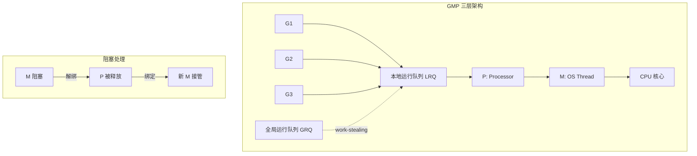
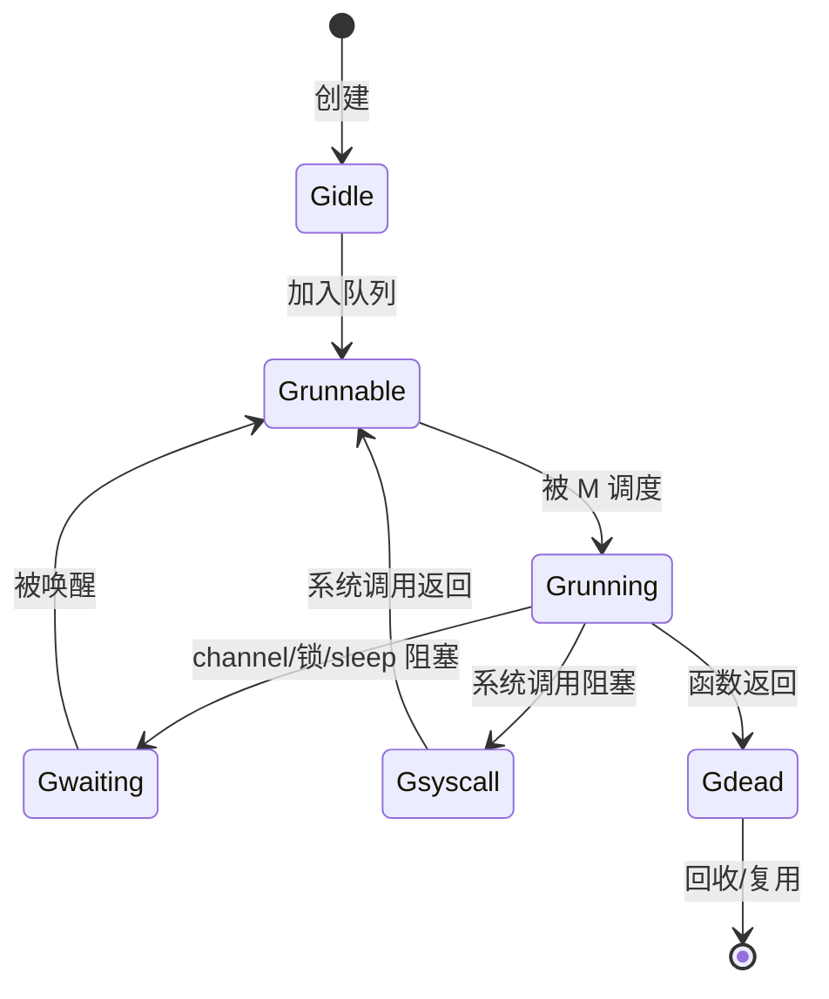
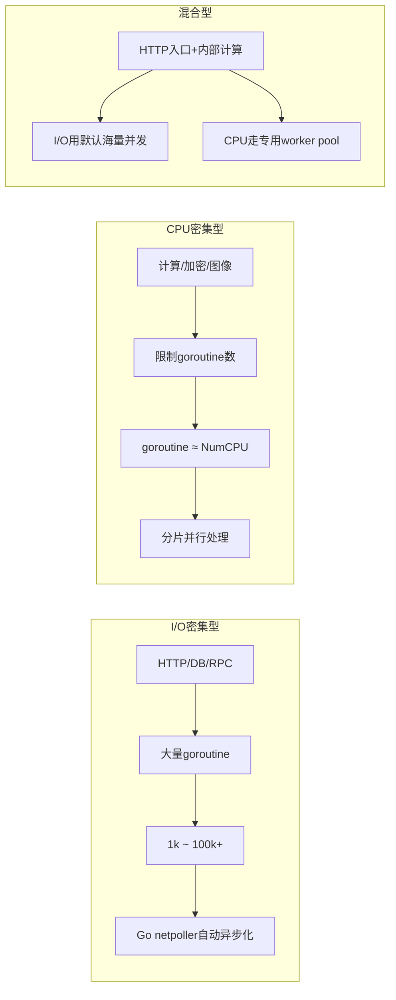

> goroutine 是 Go 并发编程的核心抽象。

---

## 一、什么是 goroutine？

goroutine 是 Go 运行时管理的**用户态轻量级线程**，由 Go 自己的调度器调度，**不是操作系统线程**（但在并发执行单元的角色上与线程一致）。

| 特性 | goroutine | OS 线程 |
|------|-----------|---------|
| 初始栈大小 | ~2-4 KiB（可动态增长） | 通常 1-2 MiB |
| 创建开销 | 极小（微秒级） | 较大（毫秒级） |
| 数量上限 | 数十万甚至百万 | 受限于内核资源（通常数千） |
| 调度器 | Go runtime（用户态） | 内核调度器 |
| 上下文切换 | 用户态，极快 | 内核态，较慢 |

> **本质**：用户态协程 + M:N 调度（多个 goroutine 复用少量 OS 线程）

<details>
<summary>点击展开：举个通俗的例子</summary>

想象你有一间设备精密的实验室（CPU 核心），正在进行一项重要的实验（OS 线程执行任务）。这时候来了个同事，只想借水龙头简单洗个手（执行一个轻量级任务）。

如果用传统线程模型，你得把整套实验设备搬走，他洗完手你再搬回来——这就是操作系统线程切换的开销：保存/恢复寄存器、切换内存映射、内核态与用户态来回切换，成本极高。

而 goroutine 的调度就像：你在实验台旁边专门留了一个公共洗手台（用户态调度器），同事洗完手直接走人，你甚至不需要中断实验。

- **OS 线程切换** = 搬走整间实验室 → 别人用 → 再搬回来  
- **goroutine 切换** = 转身让出洗手台 → 别人用 → 转身继续实验  

这就是为什么 goroutine 能轻松创建数十万个，而线程到几千个系统就已经不堪重负。

</details>

---

## 二、GMP 调度模型

Go 的调度器由三个核心组件构成：

| 缩写 | 全称 | 角色 |
|------|------|------|
| **G** | Goroutine | 用户代码执行的"线程"单元，含栈、寄存器上下文 |
| **M** | Machine (OS Thread) | 操作系统线程，真正执行代码的载体 |
| **P** | Processor (逻辑处理器) | 调度上下文，持有本地运行队列、缓存等 |



### 调度流程

1. `go function()` → 新建 G，加入当前 P 的本地队列（LRQ）
2. M 从绑定的 P 的 LRQ 取 G 执行
3. 若 LRQ 空 → 尝试从全局队列（GRQ）或其他 P 的 LRQ **偷取**（work-stealing）
4. 当 M 因系统调用阻塞 → P 解绑，由其他空闲 M 接管
5. GC、sysmon 等后台任务也作为特殊 G 运行

**关键参数 `GOMAXPROCS`**：决定 P 的数量（默认 = CPU 核心数），即**最多能有几个 OS 线程（M）同时执行用户代码**。注意，goroutine 的数量可以远大于这个数值。

```go
fmt.Println("CPU cores:", runtime.NumCPU())        // 例: 8
fmt.Println("GOMAXPROCS:", runtime.GOMAXPROCS(-1)) // 例: 8
```

---

## 三、goroutine 的生命周期



---

## 四、如何启动 goroutine

```go
// 正确：函数调用前加 go 关键字
go f()
go func() { fmt.Println("hello") }()
```

**注**：主 goroutine（`main()`）退出时，整个程序立即终止，**其他 goroutine 不会等待**。

```go
// 错误示例：来不及执行
func main() {
    go fmt.Println("hello")
}

// 正确示例：使用 sync.WaitGroup 等待
func main() {
    var wg sync.WaitGroup
    wg.Add(1)

    go func() {
        defer wg.Done()
        fmt.Println("hello")
    }()

    wg.Wait()
}
```

---

## 五、常见陷阱：循环变量捕获

```go
// 这种捕获的是循环变量的指针（地址），所有 goroutine 共享同一个变量(go1.22+之前)
for i := 0; i < 3; i++ {
    go func() { fmt.Println(i) }() // 输出不确定，常见为 3,3,3
}

// 通过函数参数传值
for i := 0; i < 3; i++ {
    go func(i int) { fmt.Println(i) }(i) // 可以捕获副本
}

// 循环体内创建副本
for i := 0; i < 3; i++ {
    i := i // 显式声明副本
    go func() { fmt.Println(i) }() // 同样获得副本
}
```

---

## 六、goroutine 的调度时机

goroutine 在以下情况会主动或被动让出 CPU：

| 类型 | 触发条件 | 说明 |
|------|----------|------|
| **主动让出** | `runtime.Gosched()` | 手动让出当前 goroutine 的执行权 |
| **阻塞等待** | channel 读写 | 读写无缓冲 channel 或满/空的有缓冲 channel 时阻塞 |
| **阻塞等待** | 锁操作（`sync.Mutex`） | 尝试获取已被占用的锁 |
| **阻塞等待** | `time.Sleep()` | 定时睡眠 |
| **系统调用** | 文件读写、网络操作 | 进入阻塞式系统调用，M 会解绑 P |
| **抢占调度** | 长时间运行（>10ms） | Go 1.14+ 基于信号的异步抢占，防止饿死 |
| **运行时活动** | GC 的 stop-the-world | 垃圾回收时需要暂停所有 goroutine |

> **注意**：纯 CPU 计算且无函数调用的循环不会自动让出，可能阻塞调度器。

---

## 七、实战策略：按场景选择并发模式



---

## 八、何时需要 LockOSThread？

极少数场景下需要将 goroutine 绑定到特定 OS 线程：

- 调用单线程 C 库（OpenGL、某些硬件 SDK）
- 使用线程局部存储（TLS）的 C 代码

```go
runtime.LockOSThread()
defer runtime.UnlockOSThread()
// 该 goroutine 永远在此 M 上执行
```

---

## 九、调试与观测

| 工具 | 用途 |
|------|------|
| `go tool pprof` | CPU 热点、goroutine 阻塞、内存分配 |
| `go tool trace` | 可视化 goroutine 生命周期、GC、调度延迟 |
| `runtime.NumGoroutine()` | 程序内监控 goroutine 数量 |
| `GODEBUG=schedtrace=1000` | 每秒输出调度快照 |

```go
// 快速启用 pprof
import _ "net/http/pprof"
go func() { log.Println(http.ListenAndServe("localhost:6060", nil)) }()
```

---

## 十、与其它语言协程对比

| 特性 | Go goroutine | Python asyncio | Rust async | Java Virtual Thread |
|------|-------------|----------------|------------|---------------------|
| 启动语法 | `go f()` | `await f()` | `tokio::spawn(…)` | `Thread.ofVirtual().start(…)` |
| 调度器 | Go runtime (M:N) | 单线程 event loop | Runtime (M:N) | JVM (M:N) |
| 阻塞行为 | 自动让出 | `await` 显式让出 | 非阻塞 sleep | 不阻塞 carrier thread |
| 抢占性 | 准抢占式（1.14+） | 协作式 | 协作式 + 抢占点 | 抢占式 |

---

## 十一、一句话总结

> **goroutine 是 Go 运行时提供的、基于 M:N 调度模型的、带自动栈管理与准抢占调度的轻量级并发执行单元。它通过 channel 实现安全通信，以极低开销支撑海量并发。**

---

## 十二、协程泄漏问题

### 协程泄漏（Goroutine Leak）

goroutine 本应完成任务后正常退出，但如果其执行路径**永远无法到达返回点**，它就会一直存活，持续占用内存和 CPU 资源。这就是 **goroutine 泄漏**。

#### 典型泄漏场景

| 场景 | 示例 | 后果 |
|------|------|------|
| **无法退出的循环** | `for { ... }` 内没有退出条件或 `break` | 永久运行，CPU 持续升高 |
| **阻塞的 channel 操作** | 向无人接收的 channel 发送 / 从无人发送的 channel 接收 | 永久阻塞，无法返回 |
| **未释放的锁** | 获取锁后忘记 `Unlock()`，或死锁 | 等待该锁的 goroutine 全部阻塞 |
| **无限递归** | 递归函数缺少终止条件 | 栈溢出前持续运行 |

#### 错误示例

```go
// 泄漏1：无限循环无退出条件
go func() {
    for {
        time.Sleep(1 * time.Second)
        // 没有任何 break/return，永远不结束
    }
}()
```

#### 如何检测 goroutine 泄漏

```go
// 方法1：运行时监控
go func() {
    ticker := time.NewTicker(10 * time.Second)
    for range ticker.C {
        fmt.Printf("goroutine count: %d\n", runtime.NumGoroutine())
    }
}()

// 方法2：pprof 分析
import _ "net/http/pprof"
// 访问 http://localhost:6060/debug/pprof/goroutine
```

---

## 十三、如何接收 goroutine 的返回值？

细心的读者可能已经发现：使用 `go func()` 启动 goroutine 后，似乎无法直接获取它的返回值。

```go
// 编译错误：不能接收 go func 的返回值
result := go compute()  // 语法错误
```

那么如何解决上述的两个问题？**答案是：channel（通道）**。

channel 是 goroutine 之间通信的主要方式，遵循 **"不要通过共享内存来通信，而要通过通信来共享内存"** 的 Go 并发哲学。

通过通道和 Context 上下文，可以更好地实现协程之间的协作，这个将在下一章介绍。

