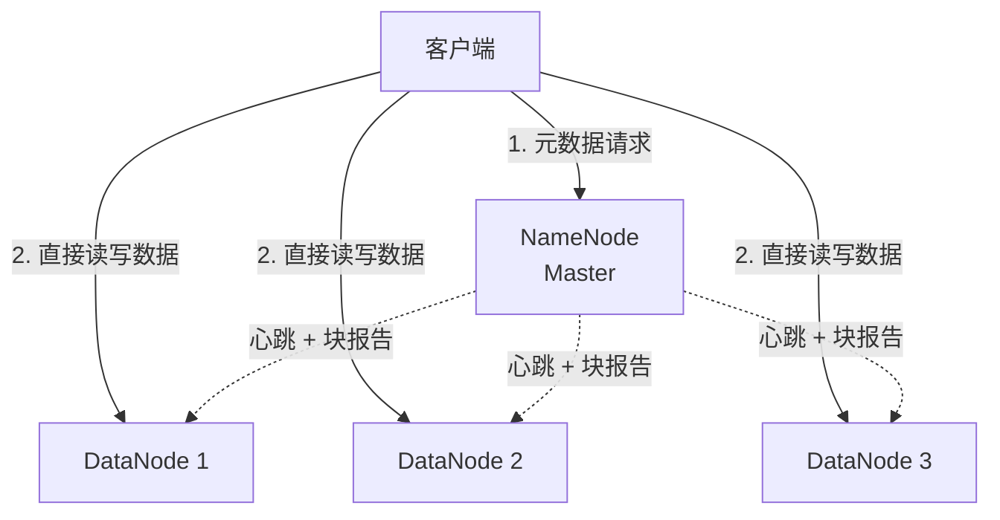
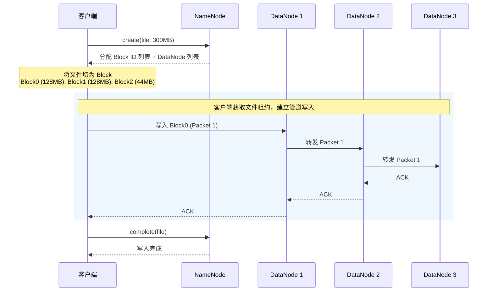
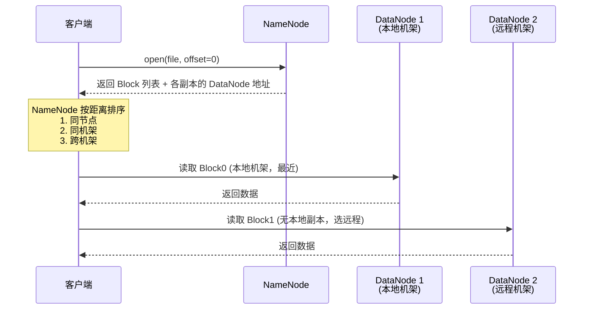
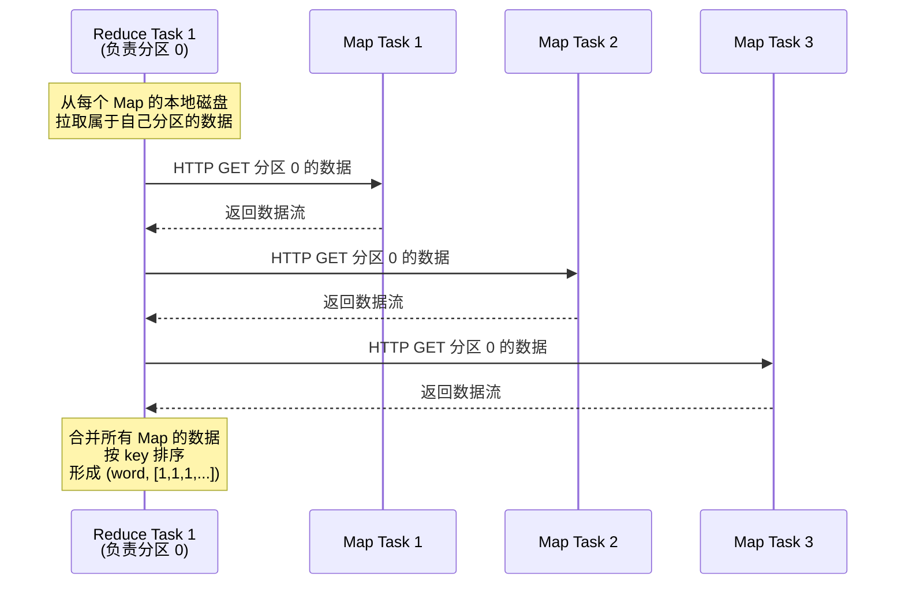
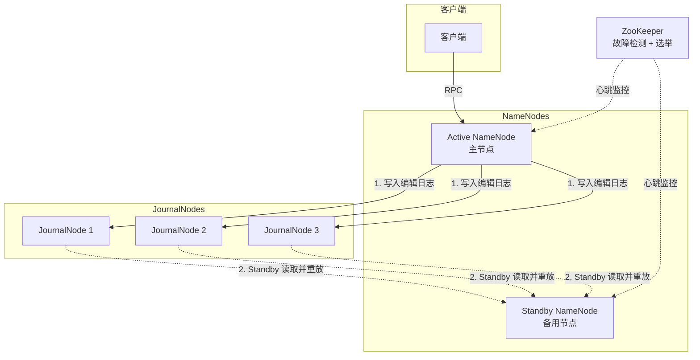
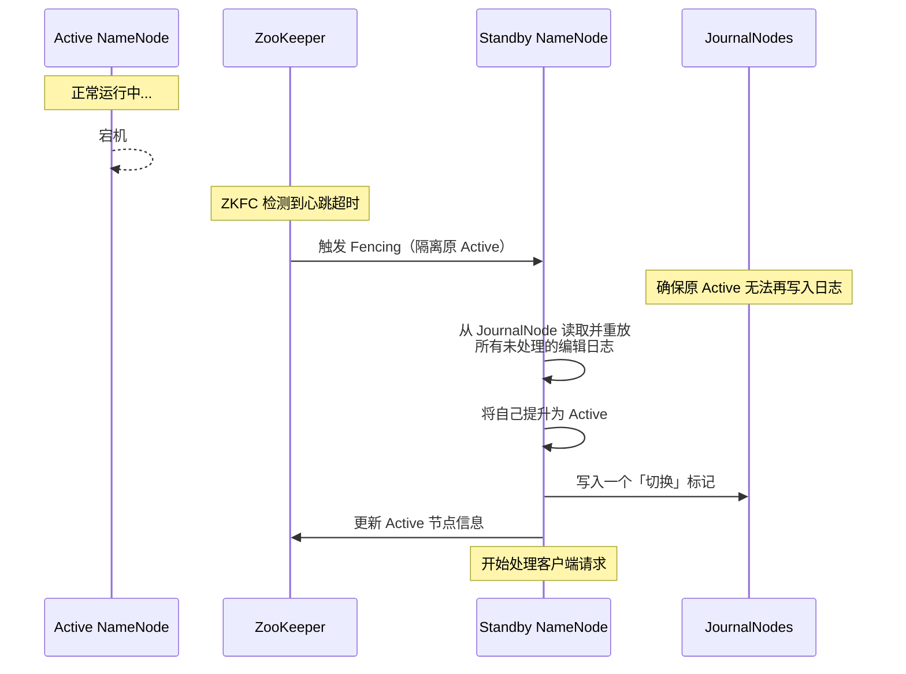

# 以 Hadoop 为例，深入理解分布式系统的核心设计

2003 年到 2004 年间，Google 连续发表了三篇论文——**GFS**（分布式文件系统）、**MapReduce**（分布式计算框架）、**Bigtable**（分布式结构化存储）——直接奠定了一个时代的基础设施蓝图。Hadoop 正是这三篇论文的开源实现，至今仍是大数据领域的基石。

本文以 Hadoop 为例，用「写文件」「读文件」「跑一个 MapReduce 作业」「NameNode 故障切换」这四个真实操作，解读背后运转着哪些分布式系统的核心设计——租约机制、管道复制、数据局部性、Shuffle、状态转移、复制状态机、脑裂仲裁——全部串起来。

***

## 一、HDFS 架构：GFS 的开源实现

在 Hadoop 生态中，**HDFS**（Hadoop Distributed File System）负责存储，**MapReduce / YARN** 负责计算。先看存储层。

### 1. 核心组件

| 组件                     | 角色                                       | 对应 GFS 概念        |
| ---------------------- | ---------------------------------------- | ---------------- |
| **NameNode**           | 管理元数据（文件→Block 的映射、Block 所在 DataNode 列表） | GFS Master       |
| **DataNode**           | 存储实际数据块，定期向 NameNode 汇报心跳和块信息            | GFS Chunk Server |
| **Secondary NameNode** | 定期合并编辑日志和文件系统镜像，**不是热备**（早期版本）           | —                |



> 注意：NameNode 不存储实际数据，也不参与数据读写。客户端向 NameNode 获取 Block 位置后，**直接**与 DataNode 通信。

### 2. 文件分块与副本

*   **Block 大小**：HDFS 默认 **128MB**（自 Hadoop 2.0 起，GFS 是 64MB）。大块意味着更少的元数据、更少的寻址开销。
*   **副本数**：默认 **3 个副本**。NameNode 根据机架感知策略决定副本放置位置——当客户端运行在 DataNode 上时，第一个副本直接写入本地节点；否则随机选择一个同机架节点。第二个副本必放在与第一个**不同机架**的节点上，第三个副本则放在与第二个副本**同一机架**的另一个节点上。这种分层策略在写入开销和可靠性间取得了良好平衡：尽快将一个副本送到远程机架以防止机架级故障，同时在远程机架内部再做一次冗余。

为什么不是 5 个或 10 个副本？三个副本是一个经典的平衡点：既能容忍两个节点同时故障，又不至于让存储成本失控。

***

## 二、写文件：租约、管道与副本一致性

这是第一个真实操作。假设客户端要向 HDFS 写入一个 300MB 的文件。我们来看背后发生了什么。

### 1. 整体流程



### 2. 租约机制（Lease）

在 HDFS 中，**租约是 NameNode 授予客户端的一种临时锁**，用于保证同一个文件在同一时刻只有一个客户端能够写入。客户端在打开文件进行写入时获得租约（通常 60 秒），并通过定期心跳来续租。若租约过期，NameNode 将收回写入权限并将其授予其他客户端，从而防止客户端崩溃导致的“死锁写入”。

> **GFS 的传统做法**：GFS 论文中的租约机制略有不同。在 GFS 中，Master 将租约授予某个 Chunk 的一个副本，将其指定为“**主副本**（Primary）”。主副本负责确定该 Chunk 所有副本的写入顺序，其他副本则听从主副本的协调。这种“指定一个主副本来序列化突变”的设计，保证了即使有多个客户端并发追加，所有副本也能以相同的顺序执行操作。HDFS 没有沿用这种“主副本”租约，而是采用了更简洁的客户端锁方案，将写入控制权完全交给客户端，由客户端根据 NameNode 返回的 DataNode 列表直接建立管道。

### 3. 管道复制（Pipeline Replication）

数据不是由客户端分别发送给三个 DataNode，而是由客户端按 NameNode 返回的列表顺序建立管道：

    客户端 → DataNode 1 → DataNode 2 → DataNode 3

这意味着：

*   客户端只消耗一份上行带宽，由 DataNode 之间完成剩余的复制工作。
*   每个 DataNode 收到一个 **Packet**（默认 64KB），先写入本地，再转发给管道中的下一个节点。
*   **ACK 沿管道反向回流**：DataNode 3 → DataNode 2 → DataNode 1 → 客户端。

这种设计的优势在于：**客户端不需要知道副本拓扑**，NameNode 在背后做了这些工作；网络负载可以被分散到各 DataNode 之间，而非全部集中在客户端。

### 4. 一致性问题：部分写入

考虑一种故障场景：Block 正在写入，管道中的 DataNode 3 突然宕机。

*   客户端收到的 ACK 链断裂，感知到写入失败。
*   DataNode 1 和 DataNode 2 上已经有了部分数据（可能不完整）。
*   客户端向 NameNode 报告写入失败，NameNode 会：
    1.  将未完成的 Block 标记为无效。
    2.  重新分配新的 DataNode 列表（替换掉故障的 DataNode 3）。
    3.  客户端从新的管道重新写入。

> 这里有一个设计权衡：保证强一致性的成本过于高昂，**HDFS 并不保证副本的强一致性写入，依赖失败重试来最终达到一致**。在故障之后的一段时间内，不同 DataNode 上可能存在不一致的数据。

<details>
<summary>为什么 HDFS 不实现强一致性写入？</summary>

要实现所有副本原子的「要么全写入、要么全不写入」，需要更多的通信和IO来保障，例如二阶段提交：

*   一轮 Prepare RPC（询问所有 DataNode 是否就绪）
*   一轮 Commit RPC（确认写入）
*   每次写入至少 2 次网络往返和多次刷盘

对于 HDFS 的典型负载（批量大文件写入、追加写），这种开销是不合理的。HDFS 的假设是：写操作失败的概率很低，重试成本可以接受；并且上层应用（如 MapReduce）的框架本身就在输出阶段做了幂等保证。

</details>

***

## 三、读文件：数据局部性与机架感知

读文件是 HDFS 最常见的操作。以读取一个 300MB 文件为例：

### 1. 读取流程



### 2. 机架感知（Rack Awareness）

NameNode 维护了每个 DataNode 的机架位置信息（通过管理员配置或拓扑脚本获取）。当客户端请求读取某个 Block 时，NameNode 返回的 DataNode 列表**按网络距离排序**：

| 距离 | 位置关系 | 说明            |
| -- | ---- | ------------- |
| 0  | 同一节点 | 客户端和副本在同一台机器上 |
| 2  | 同一机架 | 跨节点但不跨交换机     |
| 4  | 不同机架 | 跨交换机，延迟最高     |

客户端总是优先访问距离最近的副本，从而**最大限度减少跨机架的网络流量**。

### 3. 数据局部性（Data Locality）与 MapReduce 的关联

> **MapReduce 框架会主动利用数据局部性来消除读取**。

当 YARN 调度一个 Map 任务时，它会优先将该任务分配到**输入数据所在的节点**上执行：

*   如果需要处理的数据在 DataNode A 上，调度器就将 Map 任务发到 DataNode A 所在的机器。
*   **Map 任务直接读取本地磁盘**，完全不需要网络传输。

这意味着：**「移动计算，而非移动数据」**——代码被送到数据所在的位置，而不是把数据搬到代码所在的位置。Google 在设计 MapReduce 时就发现这是提升性能最有效的手段：一个 Map 任务处理一个 128MB 的本地 Block，磁盘顺序读取可达 100+ MB/s，而如果通过网络读取，受限于交换机带宽，整体吞吐量会急剧下降。

这就是为什么 HDFS 的分块大小（128MB）不是随意设定的——它要足够大，使得 Map 任务的本地计算量足够「值得」调度开销，同时不能太大导致单任务执行时间过长、容错粒度过粗。

***

## 四、MapReduce 作业：从提交到完成的全流程

现在进入计算层。以一个经典的 **WordCount** 作业为例——统计一个 1GB 文本文件中每个单词的出现次数。让我们追踪它从提交到完成的每一步。

### 1. 作业提交


> Hadoop 1.x 时代由 JobTracker 统一管理，存在严重的单点瓶颈。Hadoop 2.x 引入 **YARN**，将资源管理和作业调度分离为 ResourceManager 和 ApplicationMaster，大幅提升了可扩展性。

### 2. Map 阶段

WordCount 的输入文件（1GB）被 HDFS 自动切分为 8 个 128MB 的 Block（假设没有恰好对齐，最后一个 Block 略小），对应 **8 个 Map 任务**。

每个 Map 任务：

1.  **读取本地 Block**（利用数据局部性，避免网络传输）。
2.  按行解析文本，提取每个单词。
3.  输出中间键值对：`("hello", 1)`, `("world", 1)`, `("hello", 1)`...
4.  中间结果先缓存在**内存缓冲区**（默认由 `mapreduce.task.io.sort.mb` 控制，典型值 100MB），缓冲区达到阈值（80%）后，启动一个后台线程 **Spill 到本地磁盘**。
5.  在 Spill 过程中对数据进行**分区**（Partition）和**排序**（Sort）——按 Reduce 任务数量（假设为 3）取哈希模，将数据切为 3 个分区分别对应 3 个 Reduce 任务。


### 3. Shuffle 阶段（数据重分布）

Map 任务全部完成后，Reduce 任务进入 Shuffle 阶段——这是整个 MapReduce 流程中**最耗网络带宽**的环节。



每个 Reduce 任务要从**所有** Map 任务的本地磁盘上拉取属于自己的分区数据。假设有 8 个 Map 任务和 3 个 Reduce 任务：

*   每个 Reduce 任务发起 8 次 HTTP 请求。
*   总共 24 次网络传输。
*   如果某个 Map 任务所在的节点宕机，Reduce 任务会感知到连接断开，等待 Map 任务在其他节点上重新执行完成后再拉取。

> **Shuffle 是 MapReduce 的主要性能瓶颈**。一个 Map 任务可能产生数百 MB 的中间数据，8 个 Map 就是 GB 级别，全部通过网络传输并被 Reduce 端排序、合并。这也是为什么后续的计算框架（如 Spark）试图通过**内存缓存中间结果**来避免 Shuffle 的磁盘 IO 和网络开销。

### 4. Reduce 阶段

Reduce 任务将来自所有 Map 的、属于同一 key 的数据合并后执行用户定义的 `reduce()` 函数：

```java
// WordCount 的 Reduce 函数
void reduce(Text key, Iterable<IntWritable> values, Context ctx) {
    int sum = 0;
    for (IntWritable val : values) {
        sum += val.get();  // 对每个单词的 [1,1,1,...] 求和
    }
    ctx.write(key, new IntWritable(sum));  // ("hello", 156)
}
```

每个 Reduce 任务将最终结果写入 HDFS（生成 `part-r-00000`、`part-r-00001` 等文件）。所有这些输出文件的合集就是完整的词频统计结果。

### 5. 容错：推测执行（Speculative Execution）

如果某个 Map 或 Reduce 任务运行得异常缓慢（可能是所在机器负载高、磁盘故障、网络抖动），由 ApplicationMaster 负责监控任务进度，当检测到明显落后于平均进度的任务时，会在另一个节点上启动一个**推测执行**副本：在另一个节点上同时运行相同的任务，谁先完成就用谁的结果。

> 这是一种「宁可浪费计算资源，也不让一个慢节点拖垮整个作业」的**乐观冗余策略**。它与 GFS/HDFS「依赖重试而非回滚」的设计思路是一样的——在分布式环境下，时间成本被认为是高昂的

***

## 五、NameNode 高可用：从状态转移到复制状态机

到目前为止，我们讲的都是「Happy Path」。但分布式系统真正的难点在异常场景——尤其是 **NameNode 挂了怎么办**。

### 1. 单点故障的后果

在 Hadoop 1.x 时代，NameNode 是整个集群的**单点故障**（Single Point of Failure）。一旦 NameNode 宕机：

*   所有客户端无法定位 Block，读写全部中断。
*   所有 DataNode 的心跳和块报告无处可去。
*   恢复方式通常是**人工介入**——从 Secondary NameNode 合并最新的元数据镜像和编辑日志，耗时数十分钟。

对于一个承载着 PB 级数据、数千台机器的生产集群来说，数十分钟的不可用是不可接受的。

### 2. NameNode HA 的两种思路

解决单点故障的通用思路是引入**备用节点（Standby）**。但备用节点如何保持与主节点的状态同步？这就回到了分布式系统中两个最基础的同步范式：

| 范式                                  | 同步什么                             | 网络开销           | 优点         | 缺点               |
| ----------------------------------- | -------------------------------- | -------------- | ---------- | ---------------- |
| **状态转移**（State Transfer）            | 主节点定期将完整的内存状态（整个命名空间镜像）拷贝给备用节点   | 大（状态可达几十 GB）   | 实现简单       | 拷贝间隔内的增量丢失、网络负担重 |
| **复制状态机**（Replicated State Machine） | 主节点将所有「操作」（编辑日志条目）转发给备用节点，备用节点重放 | 小（操作日志远小于完整状态） | 实时性好、网络开销小 | 需要处理非确定性操作       |

> 就像做操：状态转移是「我拍一张照片发给你，你照着摆姿势」（完整状态快照）；复制状态机是「我做一节你模仿一节」（操作序列），只要我们起点相同、动作相同，最终姿态必然相同。

Hadoop 2.x 的 NameNode HA 方案采用的是**复制状态机思想**——但并非原封不动照搬，而是在此基础上做了工程化改进。

### 3. NameNode HA 架构：JournalNode 仲裁



核心组件：

*   **Active NameNode**：唯一处理客户端请求的主节点。将所有命名空间操作（创建文件、删除文件、追加写）记录为**编辑日志（Edit Log）**，写入一组 **JournalNode**。
*   **Standby NameNode**：从 JournalNode 持续读取编辑日志，在自己的内存中重放相同的操作，从而保持与 Active NameNode **几乎完全一致**的命名空间状态。注意，Standby 与 Active 之间**没有直接的网络通信**，所有状态同步都通过 JournalNode 集群中转完成。
*   **JournalNode**（一组奇数个节点）：充当编辑日志的可靠存储。Active 写入、Standby 读取。
*   **ZooKeeper + ZKFC**：负责故障检测和自动切换。

### 4. 为什么是 JournalNode 仲裁而不是 1:1 直连？

如果 Active NameNode 直接向 Standby NameNode 推送日志，存在一个严重问题：

*   如果 Active 发出一条日志后立即崩溃，Standby 可能没有收到。此时发生切换，**这条操作就永久丢失了**。
*   同时，Active 可能在日志未复制完成时就向客户端返回了成功——一旦崩溃，客户端会认为操作已完成，但 Standby 接管后无法重现该操作。

这就是 VMware FT 论文中讨论的 **Output Rule 问题**。Hadoop 的解决方案是引入 Quorum（多数派）机制：

> **Active NameNode 必须将编辑日志写入大多数 JournalNode（Quorum），才认为该操作已提交，才能向客户端返回成功。**

假设有 3 个 JournalNode，Quorum 为 2。只要 2 个 JournalNode 存活并记录了日志，即使 Active NameNode 崩溃，Standby NameNode 也能从 Quorum 中读到该日志并重放，不会丢失。

这实质上是将**复制状态机**与 **Paxos/Raft 的多数派提交**做了组合——Active NameNode 是「操作发出者」，JournalNode 集群是「日志的可靠存储」，Standby NameNode 是「状态机副本」。

### 5. 故障切换（Failover）流程



关键步骤 **Fencing（隔离）**：切换前必须确保原 Active NameNode **不可能再向 JournalNode 写入日志**。这通过在 JournalNode 上设置一个 **epoch number**（递增的版本号）来实现：

*   新的 Active 写入时附带更高的 epoch。
*   JournalNode 拒绝任何使用旧 epoch 的写入请求。
*   即使原 Active 只是网络隔离而非真的宕机（**脑裂**场景），它也无法继续写入——保证只有一个写入者。

> 这与 VMware FT 中的 **Test-and-Set（TAS）仲裁** 殊途同归。VMware FT 用共享存储上的原子操作来防止脑裂，Hadoop 用 JournalNode 上的 epoch 递增来同理——「谁拿到更新的版本号，谁就是合法的主节点」。本质上都是通过一个**外部仲裁者**来打破对称性。

***

## 六、CAP 在 Hadoop 中的体现

CAP 定理告诉我们，**一致性（Consistency）、可用性（Availability）、分区容忍性（Partition Tolerance）三者不可兼得**。Hadoop 各组件在这三者之间做出了不同的取舍：

| 组件              | 一致性                  | 可用性         | 分区容忍性                | 取舍策略                                |
| --------------- | -------------------- | ----------- | -------------------- | ----------------------------------- |
| **HDFS 读写**     | 弱（最终一致，依赖重试）         | 高（多副本确保可读）  | （默认 3 副本跨机架）         | 牺牲强一致性换取写入吞吐量和可用性                   |
| **NameNode HA** | 强（JournalNode 多数派提交） | 高（自动切换）     | （JournalNode Quorum） | 用 Quorum 机制保证元数据一致性，以 Quorum 节点数为代价 |
| **MapReduce**   | 最终一致（输出在作业完成时可见）     | 相对高（推测执行兜底） | （任务可在任意节点重跑）         | 计算无状态，容错靠重跑                         |

Hadoop 对数据层（HDFS 文件内容）选择了**最终一致性**——写失败就重试，副本暂时不一致的代价是可以接受的，因为MapReduce 的输出是幂等的。但是**元数据层**（NameNode 状态）要求强一致——因为元数据一旦损坏或分裂，整个文件系统将不可用。

***

## 七、总结

回顾本文覆盖的四个操作及其背后的分布式知识：

| 操作                | 核心流程                                          | 背后的分布式设计                                 |
| ----------------- | --------------------------------------------- | ---------------------------------------- |
| **写文件**           | 客户端获租约→建立管道→ACK 回流                            | 客户端租约（防并发写）、管道复制（减客户端压力）、最终一致性（牺牲强一致换吞吐） |
| **读文件**           | NameNode 按机架距离排序返回副本列表                        | 机架感知（拓扑感知调度）、数据局部性（移动计算而非数据）             |
| **MapReduce**     | Map→Shuffle→Reduce，容器由 YARN 调度                | 分而治之、数据局部性、推测执行（乐观冗余）、Shuffle 全互联        |
| **NameNode 故障切换** | JournalNode 多数派提交 → Standby 重放 → Fencing → 接管 | 复制状态机、Quorum（多数派）、Fencing（epoch 隔离）、脑裂预防 |

> 分布式系统的设计，本质上是在**故障不可避免**的前提下，做出一系列关于「什么该强一致、什么可以最终一致、什么该牺牲来换取什么」的权衡。Hadoop / GFS / MapReduce 这套体系选择了「简单优先、重试兜底」的路径——事实证明，这条路径在批量数据分析领域极为成功。

***

### 延伸阅读

*   Google：《The Google File System》（2003）—— GFS 论文，HDFS 的设计原型
*   Google：《MapReduce: Simplified Data Processing on Large Clusters》（2004）—— MapReduce 论文
*   VMware FT：《The Design of a Practical System for Fault-Tolerant Virtual Machines》（2010）—— 状态转移与复制状态机的工程实践
*   Hadoop 官方文档：[HDFS Architecture](https://hadoop.apache.org/docs/stable/hadoop-project-dist/hadoop-hdfs/HdfsDesign.html)、[YARN](https://hadoop.apache.org/docs/stable/hadoop-yarn/hadoop-yarn-site/YARN.html)
