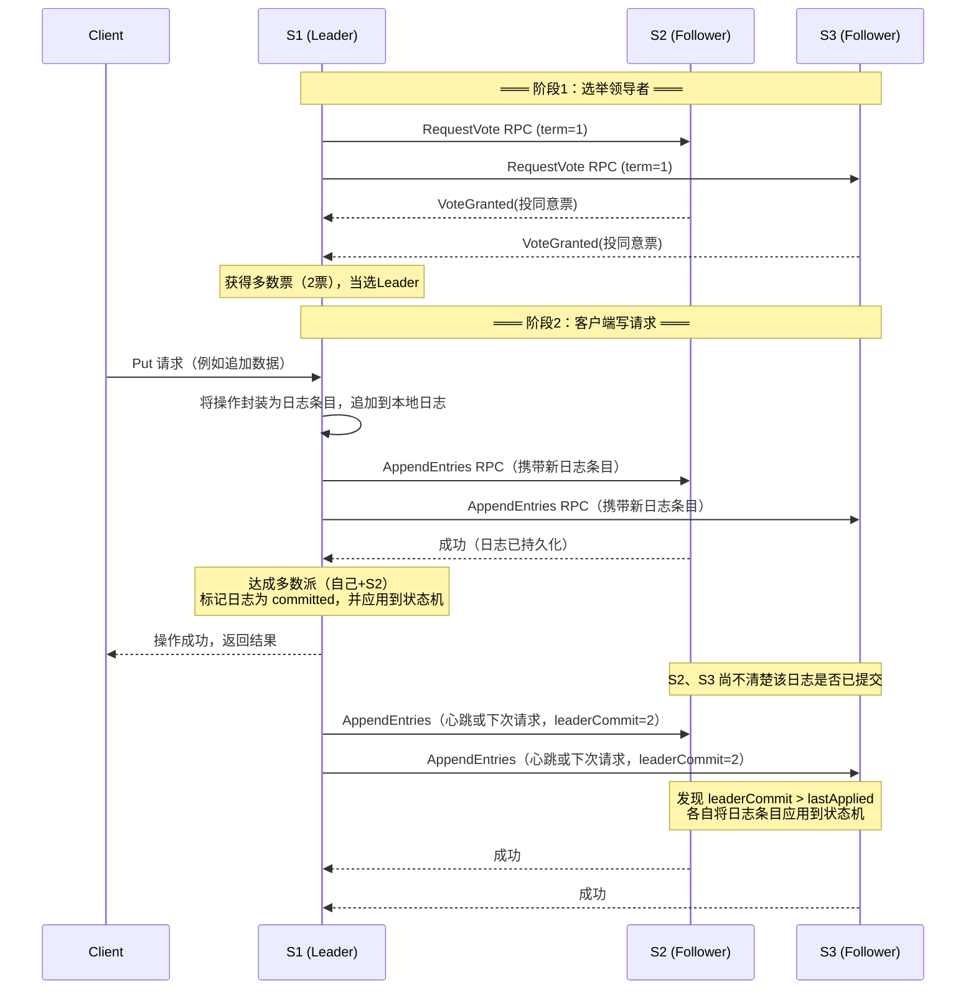
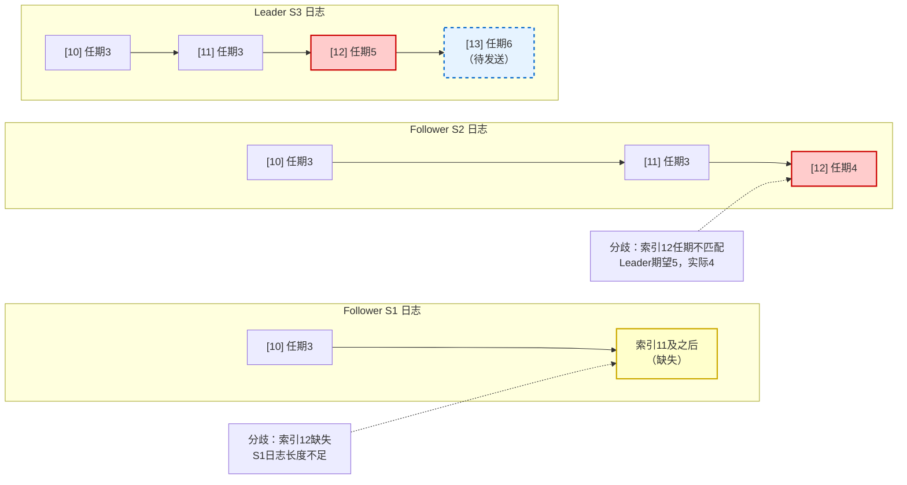
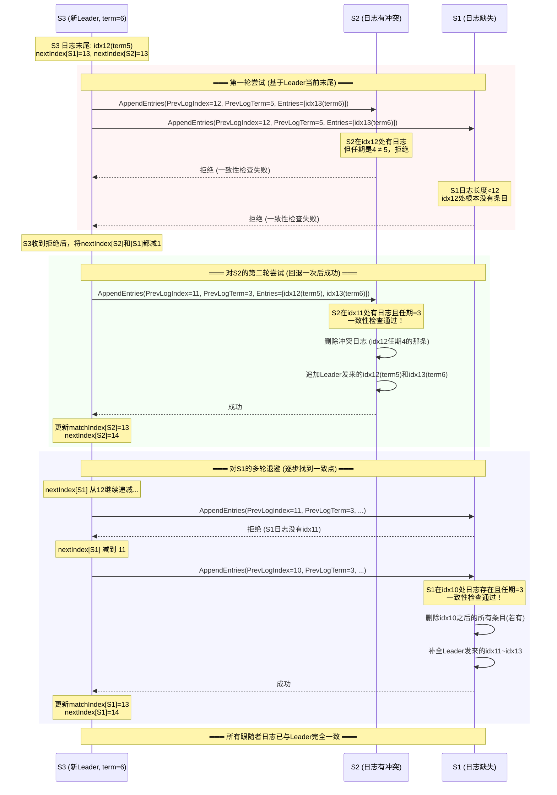
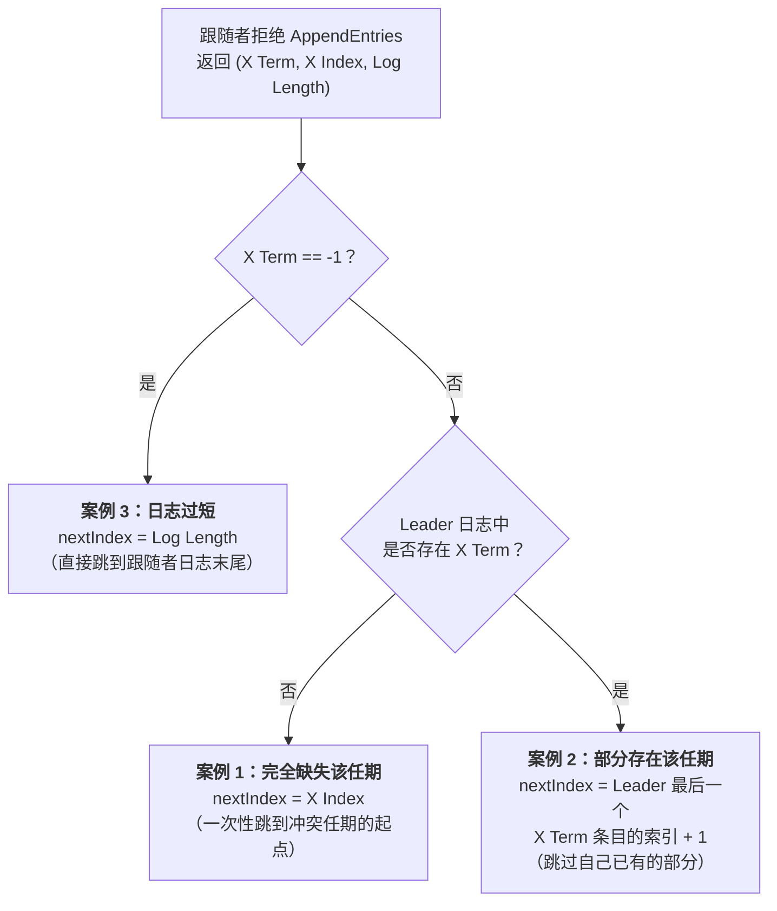
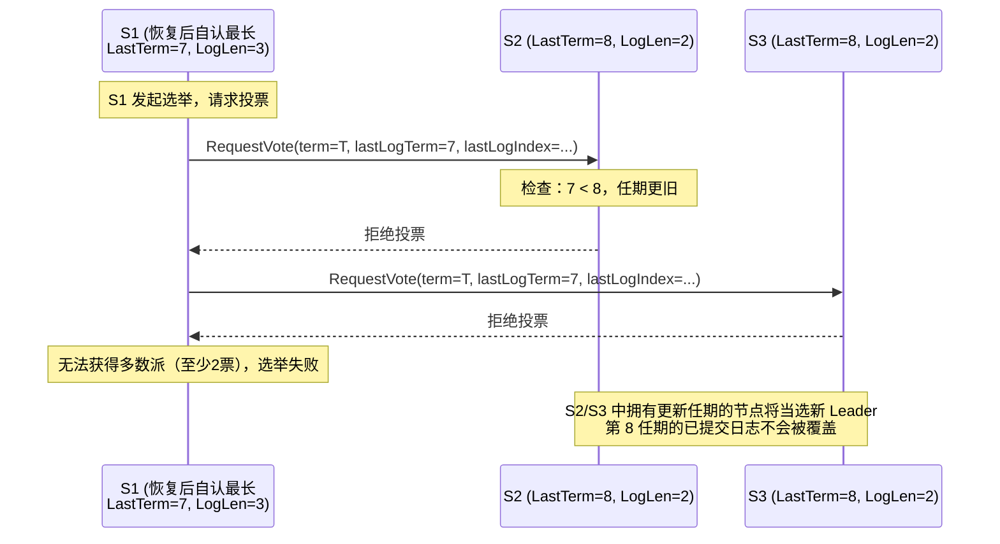
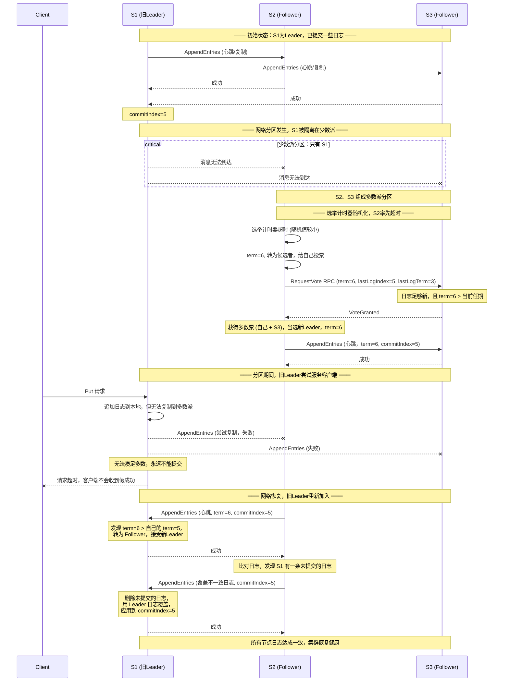
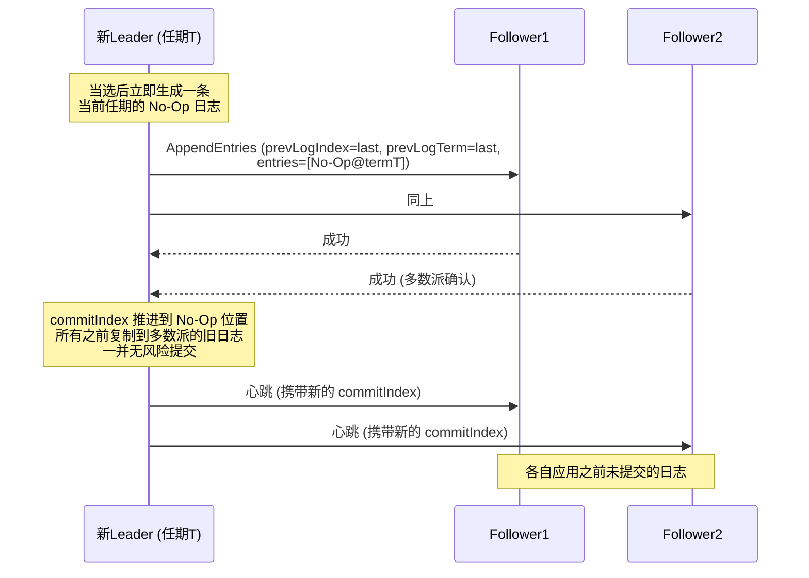

### 为什么需要 Raft：在容错、性能与一致性之间找到平衡

构建高可用的复制系统（比如电话交换机控制系统、银行核心系统）时，人们愿意投入巨大成本来保证服务不中断。在很长一段时间里，为了避免“脑裂”（split‑brain，即两个副本都认为自己是主，各自独立提供服务），主要依赖两种方案：

1. **构建“永不失效”的网络**  
   通过极致的硬件和物理环境设计（比如像计算机内部连接 CPU 和内存的总线一样可靠），让网络故障几乎不可能发生。这样，当客户端连不上某台服务器时，就可以断定是那台服务器自己宕机了，而不会是网络问题。这种假设能排除脑裂，但成本极其高昂。

2. **人工介入**  
   另一种方式是让人来做判断。系统可以默认要求客户端必须等两个副本都响应才认为操作成功；一旦发生故障，就触发警报，由管理员到机房现场检查机器状态，决定哪台可以继续服务，哪台需要关闭。这里，人类实际上扮演了“仲裁者”的角色。但人本身响应慢，而且如果把人看作系统的一部分，也算是一个单点故障。

这两种方案虽然可行，但要么太贵，要么太慢。后来人们意识到，可以构建一套**自动故障转移**系统，即使网络不稳定、出现“网络分区”（网络被一分为二，两边无法通信），也能正确工作。Raft 就是在这样的背景下产生的——它能在容错、性能、一致性之间取得很好的平衡。

---

## 一、Raft 核心设计理念

### 1. 日志与复制状态机

Raft 实现的基础是**复制状态机**（Replicated State Machine）。简单来说，就是把一个单机服务的所有状态变化都抽象成一条条日志记录，然后让多台服务器按照相同的顺序执行相同的日志序列，这样它们的最终状态就能保持一致。

因此，在 Raft 中，服务器所有的增删改查操作都需要先转化为日志条目，经过集群确认（提交）后，再应用到状态机。这是整个系统可靠复制的前提。

### 2. 领导者、多数派与法定人数系统

为了让一个分布式集群“看起来像”一台单一的逻辑计算机，Raft 会选出一个**领导者**。所有客户端请求都先发给领导者，由它来管理日志的复制和提交。

在 Raft 中，任何关键操作——无论是选举领导者，还是提交日志条目——都必须获得**多数派（Majority）**的支持，也就是**超过一半的服务器**同意。例如：
- 候选人需要获得多数派的选票才能成为新领导者；
- 一条日志只有被复制到多数派节点后才算“已提交”。

**为什么应该使用奇数个服务器**  
这是为了让多数派机制能够稳定工作。
- 如果集群有**偶数**（例如 2N 台）节点，网络一旦发生对等分裂，两边可能各有 N 台。两边运行的软件完全相同，谁都无法凑出“超过一半”的多数派，整个系统就可能僵死。
- 如果集群有**奇数**（2N+1 台）节点，极端情况下分裂成 N 台和 N+1 台，两边就不再对称。只有拥有 N+1 台的那一侧能组成多数派，可以继续推进；而另一侧则无法完成任何操作。这样，同一时刻最多只有一个分区能取得进展，**从根本上避免了脑裂**。

**多数派重叠：Raft 正确性的核心**  
更巧妙的是，任意两次操作所组成的多数派，**在服务器集合上必然有重叠**。比如旧领导者的多数派和新领导者的多数派，至少会共享一台服务器。正是这个重叠，使得新领导者能够“知道”前任使用的任期号、已提交的日志等信息，保证了整个系统的安全性和一致性。

通常，这类依赖多数派的系统被称为**法定人数系统（Quorum System）**。通用公式是：如果有 **2F+1** 台服务器，最多可以容忍 **F** 台发生故障（例如 3 台可容忍 1 台故障，5 台可容忍 2 台故障）。即使出现网络分区，只要还能形成多数派，集群就能继续对外服务。

**为什么需要领导者**  
理论上可以构建无领导者的共识系统（如原始的 Paxos），但 Raft 刻意引入了领导者，主要目的是**提升效率**：
- **有领导者时**：客户端只需向领导者发送请求，领导者通过一轮 `AppendEntries` RPC 即可完成日志复制和提交。
- **无领导者时**：通常需要两轮消息：第一轮选出临时协调者，第二轮再实际执行请求。

引入领导者使常见操作快约一倍，同时让整个协议的理解和实现都更简单。

 
“法定人数”的起源：从英国议会到分布式共识

“法定人数”这个说法源自拉丁语 quorum，原意是“of whom”（由谁构成）。它的历史可以追溯到英国的治安法庭和议会制度。过去，法官或议员的任命状中会列出所有成员的名字，末尾会附上一句拉丁短语 quorum vos … unum esse volumus（“我们希望你们中的某某人是其中的一员”），用来指定哪些人是构成合法议事程序所必须出席的最低成员。后来，“quorum”一词就专指举行有效会议或做出正式决议所需的最少出席人数。

在分布式系统领域，这个概念被直接借用过来。一个共识算法（如 Raft、Paxos）中的“法定人数”就是指完成某项操作（例如领导者选举、日志提交）所需要的最小节点数量。Raft 中常用的“超过半数（majority）”正是法定人数的一种具体形式——它确保任意两个法定人数集合必有交集，从而避免了脑裂和数据不一致。因此，“法定人数”这个术语完美地体现了从政治议事规则到计算机科学中的“表决门槛”的跨领域迁移。

### 3. 任期号与选举规则

Raft 使用**任期号（Term）** 作为逻辑时钟，来区分不同的领导者任期。

**关键属性：**
- 每个任期号在集群中最多对应一个领导者。
- 某个任期可能没有领导者（选举失败），但绝不可能有两个。

**选举触发与过程：**
1. 每个服务器维护一个**选举计时器**，如果在一段时间内没有收到当前领导者的心跳，计时器超时，服务器就会假定领导者已死，自己转变为**候选者**。
2. 候选者将自己的任期号加 1，然后向所有其他服务器发送 `RequestVote` RPC（发起选举），同时投自己一票。
3. 如果候选者获得**多数派**的投票，就当选为新领导者，并立即开始发送心跳，宣告自己的权威。

---

## 二、Raft 工作流程示例：从启动到处理客户端请求

假设一个三节点的 Raft 集群（S1、S2、S3），启动后先选举产生领导者，再由领导者处理外部请求。

#### 1. 选举出领导者
- 三台服务器启动后，Raft 协议自动发起选举。
- 假设 S1 获得多数派（至少 2 票）选票，当选为**领导者**，成为整个集群与外部交互的唯一入口。

#### 2. 客户端发起写请求
- 客户端向领导者 S1 发送一个 **Put 请求**（例如向文件末尾追加数据）。
- S1 的 Raft 层将此操作封装为一条日志条目，首先**追加到自己的日志**中。

#### 3. 复制日志到跟随者
- 领导者 S1 向另外两个副本（S2、S3）发送 **AppendEntries RPC**，这条 RPC 中携带着新的日志条目。
- 此时 S1 开始等待副本的回复。

#### 4. 确认多数派并提交
- 在这个 3 节点集群中，多数派指 **至少 2 台服务器**（N = 3，多数为 2）。领导者自己算一票，因此**只需再收到任意一个跟随者（如 S2）的成功回复，即可凑足多数**。
- 一旦 S1 收到包含自己在内的多数派确认：
  - 该日志条目标记为**已提交（committed）**。
  - 领导者**立刻执行**该命令（将操作应用到状态机），计算出结果，并**向客户端返回成功**。
- 注意：此时 S3 可能也回复了，但不影响提交的完成；领导者不必等待 S3，除非是为了日志完全同步。

#### 5. 通知跟随者“已提交”
- S2 虽然收到了 AppendEntries 并回复了成功，但它**并不清楚这条日志是否已被提交**。它只知道自己存下了日志，但不知道领导者是否凑齐了多数派。
- Raft **没有显式的“提交消息”**。相反，提交信息会 **捎带（piggyback）** 在下一次发送的 `AppendEntries` RPC 中。
  - 该 RPC 有一个字段 `commitIndex`，表示领导者已经提交到哪个日志位置。
- 当 S1 下一次向 S2、S3 发送 AppendEntries（可能是心跳，也可能是下一个客户端请求的复制），就会带上最新的 `commitIndex`。
- 跟随者收到后，发现 `commitIndex` 比自己当前应用的索引大，就会将相应的日志条目**应用到状态机**，完成真正的“执行”。

#### 6. 心跳与性能考量
- 如果客户端请求**很密集**（例如每秒上千次），下一条 AppendEntries 会很快被新的请求触发，`commitIndex` 能几乎实时地被捎带过去。此时无需额外消息。
- 如果客户端请求**很稀疏**，领导者可能需要**主动发送心跳**（空的 AppendEntries），来尽快将提交信息通知给跟随者，避免跟随者长时间不知日志是否已提交。
- 不过，这种延迟对客户端是**不可见的**，因为客户端只等待领导者执行并回复。跟随者稍晚一些应用日志，并不会影响客户端感知到的延迟。

笔记：Raft提交通知的捎带机制详解

#### 什么是“提交通知的捎带机制”

想象你在和朋友玩一个“同步做动作”的游戏：

**传统上可能会以为机制是**（实际上是错误理解）：
- 领导者说：“大家注意，我要让大家记住‘苹果’这个词”
- 其他服务器回复：“收到”
- 领导者说：“好，现在我正式宣布‘苹果’生效了！”
- 所有服务器一起说：“我们把‘苹果’记下来了！”

**Raft实际机制**（正确理解）：
- 领导者说：“大家注意，记住‘苹果’这个词，顺便告诉你们，之前的所有词都生效了”
- 其他服务器想：“哦，之前那些词现在可以正式记下来了”
- 然后才真正把之前的词记录下来

#### 具体场景举例

假设我们有三个服务器：S1(领导者)、S2、S3

1. **收到请求**：客户端问 S1：“请存储 key=value”。S1 对 S2、S3 说：“请暂时记下：key=value (但先别正式保存)”
2. **获得多数同意**：S2 回复：“我记下了，等你确认”，S3 回复：“我也记下了，等你确认”。S1 看到 2 个回复（超过一半），知道安全了
3. **客户端得到回复**：S1 对客户端说：“好了，存储成功！”
4. **通知其他服务器正式生效**：S1 对 S2、S3 说：“大家好，顺便告诉你们，之前那个 key=value 现在可以正式生效了”。S2、S3 听到后：“哦，原来如此，我们现在正式保存这个值”

#### 为什么叫“捎带”(Piggyback)？

就像你去超市买东西，本来只是想买牛奶，但看到有优惠顺便买了面包——这就是“捎带”。
Raft 也是这样：
- 领导者本来要发送心跳包或新的日志项
- 顺便在包里加一句：“对了，之前那些都可以生效了”
- 这样就不需要专门发一条“现在生效吧”的消息

#### S2什么时候执行？

S2 不会立即执行刚收到的操作，而是等待：
1. 领导者确认该操作安全（收到多数派确认）
2. 领导者通过下一次通信告诉 S2：“可以正式生效了”
3. S2 这时才把操作应用到自己的数据库中

这样做是为了确保所有服务器按照完全相同的顺序执行操作，即使领导者挂了，新的领导者也能确保所有服务器状态一致。

---

## 三、日志：Raft 的脊梁

### 1. 日志在 Raft 中的核心作用

日志在 Raft 中绝不是简单的操作记录，它承担着多个关键职责：

- **操作排序，保证所有副本顺序一致**  
  复制状态机要求所有副本不仅执行相同的命令，还必须以**完全相同的顺序**执行。领导者通过日志为并发到达的客户端请求分配一个全局唯一的顺序（例如按槽位编号），所有跟随者随后按此顺序应用，从而确保各副本状态机最终一致。

- **暂存未提交的操作**  
  跟随者收到 AppendEntries 后先将日志条目持久化，但此时并不知道这些条目是否已被集群多数派确认提交。这些“暂定”的日志可能最终被提交，也可能因领导者故障而被后续新领导者覆盖丢弃。日志为这些未生效的操作提供了暂存空间，直到提交信息传来再真正执行。

- **支持重传，保证跟随者最终一致**  
  领导者将客户端请求存入自己的日志，即使已经执行并回复了客户端，仍然需要保留这些日志条目。一旦某个跟随者因网络中断或离线而落后，领导者就可以从日志中找到对应的条目，重新发送给落后的跟随者，直到所有副本日志达成一致。

- **持久化与崩溃恢复**  
  Raft 要求服务器将日志写入非易失性存储（磁盘）。当一台服务器崩溃后重启时，会从磁盘中读取日志，从日志开头依次**重放**所有命令，以恢复到崩溃前的状态机状态。之后它就能重新加入集群，继续正常服务。日志在这里就是“状态重建的命令序列”。

执行速率不匹配的潜在内存问题

一个需要注意的细节：在 Raft 中，跟随者**在应用（执行）日志条目之前就会对其确认**。也就是说，只要日志成功写入跟随者的磁盘，它就可以回复 AppendEntries 成功。这意味着跟随者的**确认速率**可以远高于它的**执行速率**。

举例来说，如果领导者每秒产生 1000 条日志，跟随者可能只需几百微秒就持久化并确认，但实际执行状态机（比如更新数据库）可能每秒只能处理 100 条。长此以往，跟随者上暂存的已确认但未执行的日志会不断堆积，最终可能导致内存或磁盘耗尽。

Raft 协议本身**没有内置流控机制**来应对这种速度差异。在生产系统中，往往需要引入额外的通信机制（例如领导者定期询问跟随者的执行进度），在领导者超前太多时主动**降速（节流）**，避免跟随者被“压垮”。

### 2. 日志的短暂不一致与最终一致

在 Raft 中，日志可能会在短时间内出现不一致。例如：
- 领导者向部分副本发送了 `AppendEntries`，但随后崩溃，导致有的副本收到了新日志，有的没收到。
- 网络分区或消息乱序也会造成各副本日志出现差异。

但 Raft 的机制设计保证了**最终所有副本的日志都会强制达成一致**。后续的领导者会通过比对日志，找到与各跟随者最后一致的位置，然后用自己的日志覆盖跟随者上分歧的部分。这是通过**领导者选举**和**日志修复流程**共同完成的。

### 3. 服务器重启后的状态恢复与日志一致性

#### 单个服务器重启
一台服务器崩溃后重启，它能从磁盘读回持久化的日志和任期号，但**它不知道这些日志中有哪些是已提交的**。可能它的日志有 1000 条，其中 800 条已提交，200 条未提交，仅凭日志本身无法区分。因此，刚重启的服务器不能擅自应用任何日志，必须等待与新的领导者交互。

它会作为跟随者重新加入集群，接收领导者发来的 AppendEntries RPC。领导者通过比对日志，找出两者一致的最新位置，然后覆盖或补全该跟随者日志中不一致的部分，并告知其最新的 `commitIndex`。跟随者根据这个提交索引安全地将日志应用到状态机，完成恢复。

#### 全集群崩溃

如果所有服务器同时崩溃并重启，大家都只有磁盘上持久化的日志和最新的任期号，但**无法区分哪些日志是已提交的、哪些只是暂存的**。此时集群会重新进行**领导者选举**。

当选的新领导者不会立即根据“某条日志是否已在多数派上存在”来提交之前任期的条目——这样做可能导致已提交日志被覆盖。正确的做法是：新领导者首先向自己的日志中追加一条**当前任期**的空操作日志（No‑Op），并通过 `AppendEntries` 将其复制到多数派。一旦这条当前任期的 No‑Op 被多数派确认，领导者就将 `commitIndex` 推进到该 No‑Op 的索引位置。根据日志的连续性，此时**所有位于 No‑Op 之前、且已复制到多数派的日志（无论属于哪个任期）都会随之被隐式提交**，不会有任何已提交条目丢失。

随后，领导者通过心跳或后续 `AppendEntries` 将新的 `commitIndex` 告知跟随者，所有副本据此将日志条目应用到状态机，逐步重建整个状态机。尽管从第一条日志开始全部重放可能很耗时，但这保证了崩溃恢复的正确性。实际 Raft 实现中，通常会使用**快照（Checkpointing）**技术来压缩日志前缀，避免每次重启都重放过长的历史。

### 4. 日志恢复机制详解

#### 场景设定
一个三节点集群，当前状态：
- **S3** 当选为任期 6 的新领导者。其日志如下（括号内为任期号）：  
  `[ ... , (3, idx10), (3, idx11), (5, idx12) ]`（假设索引 10、11 为任期 3，索引 12 为任期 5）
- **S2** 的日志：`[ ... , (3, idx11), (4, idx12) ]`（索引 11 为任期 3，索引 12 却是一条来自任期 4 的旧日志）
- **S1** 的日志较短，在索引 12 处没有任何条目（可能日志只到索引 10，或为空）。

S3 准备发送自己任期内的第一条日志（索引 13，任期 6），为此需要先确保所有跟随者的日志与自己的日志在索引 12 及之前完全一致。

#### AppendEntries 的一致性检查
Raft 通过 `AppendEntries` RPC 携带的 `PrevLogIndex` 和 `PrevLogTerm` 进行强一致性校验。跟随者收到后，会检查自己日志中在 `PrevLogIndex` 位置的条目是否存在且任期号等于 `PrevLogTerm`，只有两者都满足才接受本次追加。

#### 第一轮尝试：基于 Leader 当前日志末尾
S3 刚成为 Leader，对于每个跟随者，它维护一个 `nextIndex` 字段，初始值为 **自身日志末尾索引 + 1**，即 **13**。这意味着 S3 认为跟随者的日志至少和自己一样新，需要从索引 13 开始发送新条目。

它向 S1 和 S2 发送 `AppendEntries`，参数为：
- `PrevLogIndex = 12`，`PrevLogTerm = 5`（S3 日志中索引 12 的任期）
- `Entries` 中包含索引 13 的新命令。

**S2 的检查与拒绝**：
- S2 在索引 12 处有一条日志，但它的任期是 **4**，与收到的 `PrevLogTerm = 5` 不匹配。
- 因此 S2 拒绝该 RPC，返回失败。

**S1 的检查与拒绝**：
- S1 的日志长度小于 12，索引 12 处根本没有条目。
- 同样拒绝该 RPC。

#### 传统退避机制：逐步寻找一致点
收到拒绝后，S3 不会放弃同步，而是将对应跟随者的 `nextIndex` **减 1**，然后重试。这是 Raft 日志修复的核心——通过逐条回退，找到双方日志最后一次完全一致的位置。

对 S2：`nextIndex` 从 13 降到 **12**。  
对 S1：`nextIndex` 从 13 降到 **12**。

第二次发送时，S3 对每个跟随者使用更新后的参数（此时 `PrevLogIndex = 11`，因为 `nextIndex` 现在是 12，上一条索引为 11；`PrevLogTerm` 改为 S3 在索引 11 的任期，即 **3**）。

**S2 第二次响应**：
- S2 检查索引 11，发现确实存在一条任期 3 的日志，与 `PrevLogTerm = 3` 匹配。
- **成功匹配**！S2 接受本次请求。
- S2 会执行以下操作：
  - **截断冲突日志**：删除索引 11 之后的所有条目（即原索引 12 任期 4 的那条日志），因为它们与 Leader 不一致。
  - **追加新条目**：将从 Leader 收到的索引 12（任期 5）以及后续索引 13 的条目追加到自己日志中。
- 回复成功。

**S1 第二次响应**：
- S1 在索引 11 处仍然没有日志（或长度不够），再次拒绝。
- S3 再次将 S1 的 `nextIndex` 减 1（变为 11），进行第三次发送，此时 `PrevLogIndex = 10`，`PrevLogTerm` 对应 S3 的索引 10 任期……如此继续，直到找到一个 S1 能匹配的索引（甚至可能一直退到索引 0，表示从头开始）。最终，当 `nextIndex` 下降到 S1 日志的末尾 +1 的位置时（例如 S1 日志最大索引为 10，`nextIndex = 11`，`PrevLogIndex = 10`，S1 发现索引 10 任期匹配），成功匹配。
- 然后 S1 接受后续所有缺失的日志条目，从冲突点开始将自己的日志补全到与 Leader 一致。

#### 最终同步完成
对于每个跟随者，Leader 都会维护一个 `nextIndex` 和一个 `matchIndex`：
- `nextIndex` 不断回退直到找到一致点，然后随着每次成功的 `AppendEntries`，它会递增。
- 当 Leader 成功将一批日志复制给跟随者后，`nextIndex` 更新为这批日志的最后索引 +1（例如先发送了索引 11～13，成功后 `nextIndex = 14`）。

通过这种**逐条回退—重试—截断—补齐**的机制，Raft 能够在不引入额外复杂协议的情况下，自动修复因崩溃、网络分区造成的任意日志分歧，使所有副本最终达成完全一致的状态。

### 5. 快速日志回滚 (Fast Log Backoff)

#### 问题背景
标准的退避机制是每次只回滚一条日志条目（一次 RPC 处理一个索引）。如果跟随者宕机时间过长，错过了大量条目（例如 1000 条），Leader 重启后需要发送 1000 次 RPC 才能同步，这将导致极长的延迟。

#### 优化方案：批量回滚
Raft 论文提出了一种加速机制，允许跟随者在回复中提供更多信息，使 Leader 能够一次性跳过多个条目。

**跟随者回复中的额外信息**：
当 `AppendEntries` 被拒绝时，跟随者返回：
1. **X Term**：冲突条目的任期号（如果该位置为空，则返回 -1）。
2. **X Index**：冲突条目的索引号（即第一个具有 X Term 的条目索引）。
3. **Log Length**：跟随者当前日志的总长度（如果 X Index 处的条目不存在）。

**三种回滚策略**：
| 案例 | 条件 | Leader 行动 | 效果 |
|------|------|-----------|------|
| **案例 1** | Leader 完全没有 `X Term` | `nextIndex = X Index` | 一次性跳到冲突任期的起点 |
| **案例 2** | Leader 有部分 `X Term` | `nextIndex = Leader 最后一个 X Term 的 Index + 1` | 跳到 Leader 有的部分之后 |
| **案例 3** | `X Term = -1`（位置为空） | `nextIndex = Log Length` | 直接跳到跟随者末尾 |

快速回滚与标准回滚的对比示例

**场景**  
Leader (S1) 宕机前日志：`[1,1] [2,1] [3,1] [4,2] [5,2] [6,2] [7,3] [8,3] ... [1000,3]`  
跟随者 (S2) 在 Leader 宕机期间：只同步到 `[1,1] [2,1] [3,1]`，然后也宕机了，之后独自运行，追加了 `[4,5] [5,5] [6,5]`。

**标准回滚（逐条尝试）**  
S1 需要从 1000 一直回退到索引 3 才成功，期间经历大量失败 RPC。

**快速回滚（三次 RPC）**  
- 第 1 次：S1 发 `prevLogIndex=1000`，S2 返回 `X Term=-1, Log Length=6`（案例 3），S1 直接跳到 6。  
- 第 2 次：S1 发 `prevLogIndex=6`，S2 返回 `X Term=5, X Index=4`。S1 发现自己没有任期 5（案例 1），直接跳到 4。  
- 第 3 次：S1 发 `prevLogIndex=3`，成功，然后开始覆盖。

**核心思想总结**  
从“盲目猜测”到“精准定位”：跟随者通过 `X Term` 和 `X Index` 告诉 Leader **“我这段日志属于哪个任期”**，Leader 据此快速对齐，而不是逐个试探。

---

## 四、领导者选举与安全性

### 1. 选举计时器的随机化

如果所有服务器的选举计时器同时到期，它们会同时变为候选者并各自给自己投票，由于每个服务器在一个任期内只能投一票，很可能谁都无法拿到多数票，形成**分裂投票**，导致选举失败并循环重试。

**解决方案：随机化选举超时时间。**
- 每个服务器在重置计时器时，从一个区间内随机选择一个超时时长（例如 150ms～300ms）。
- 当领导者崩溃后，跟随者们的计时器会在不同的时刻到期。最先到期的候选者有足够时间完成投票并当选，随后发出的心跳会重置其他服务器的计时器，阻止它们发起新的选举。

**参数调优要点：**
- **最小值**：必须显著大于心跳间隔，以容忍偶尔的网络丢包。通常设为心跳间隔的 2～3 倍。例如心跳 100ms，最小选举超时可设为 300ms。
- **最大值**：需要在故障恢复速度和避免因网络抖动引起的不必要选举之间取得平衡。太大会使故障恢复变慢，太小则容易频繁选举。实际中通常设置一个几秒内能完成选举的上限。
- **重要细节**：每次重置计时器都必须生成**全新的随机数**。如果重复使用同一个随机数，可能不幸地导致某两台服务器总是同时超时，引发永久性分裂投票。

### 2. 选举限制：谁能成为 Leader？

Raft 协议不允许任意节点成为 Leader。如果允许任期时间到期的第一个节点（无论其日志状态如何）成为 Leader，系统可能无法保证正确性。

**反例：最长日志优先策略的失败**  
假设我们尝试修改规则：**“拥有最长日志的服务器自动成为 Leader”**。

1. **初始状态**：S1 拥有第 5、6、7 任期的日志；S2 拥有第 5、8 任期的日志；S3 拥有第 5、8 任期的日志。（例如 S1 在第 6、7 任期频繁崩溃重启，而 S2/S3 在第 8 任期成功选举并处理了请求）
2. **灾难性恢复**：S1 恢复后认为自己日志最长（3 条 vs 2 条），发起选举并获胜。随后 S1 会用旧日志覆盖 S2、S3，强制删除第 8 任期的条目。而第 8 任期的命令很可能已经被多数派提交并执行，甚至已回复给客户端，这将违反安全性保证。

**Raft 的实际选举规则**  
在 `RequestVote` RPC 中，节点只有在满足以下条件时才会对候选者投赞成票：
1. **任期检查**：候选者的最后一条日志的任期号必须 **大于** 接收者的最后一条日志的任期号。  
2. **长度检查**：如果最后一条日志的任期号 **相同**，则候选者的日志长度必须 **大于或等于** 接收者的日志长度。

这两条规则叠加，形成了一个严格的“日志新旧比较”：**只有日志至少和自己一样新的候选者，才有可能拿到自己这一票。**

应用回上述场景：S1 (Last Term: 7) 向 S2 (Last Term: 8) 请求投票，S2 检查 7 < 8，拒绝。S1 无法获得多数票，选举失败。

为什么这套规则可以防止不必要的领导人变更？

当一个网络孤岛中的少数派节点（日志通常较旧）因为收不到心跳而发起选举时：
- 它能成功吗？不能。
- 原因在于：健康的多数派节点一直与当前 Leader 保持通信，其日志与 Leader 完全同步，选举定时器从未触发。当少数派候选人前来拉票时，多数派节点执行日志比较，会立刻判定候选人的日志比自己旧，从而断然拒绝。

因此，只要当前 Leader 仍然存活并且与多数派节点保持通信，任何日志状态落后的“挑战者”都不可能从多数派手里拿到足够的票数。这既保护了已提交的数据安全，也避免了 Leader 依然健康时发生无谓的权力更迭。

| 比较维度 | 优先级 | 原因 |
|---------|--------|------|
| **最后日志任期号** | 第一优先级 | 确保候选者知道最新的日志，防止旧 Leader 覆盖新 Leader 的数据 |
| **日志长度** | 第二优先级 | 仅在任期相同时，选择日志更完整的节点 |

### 3. 网络分区下的安全性

当网络分区发生时，旧领导者可能被隔离在少数派分区中，而多数派分区选举出了新领导者。这种场景下，Raft 通过多条机制保证安全性，不会出现两个领导者同时执行冲突操作。

**情况 A：旧领导者无法提交任何新操作**  
- 旧领导者试图向跟随者发送 `AppendEntries`，但由于它处于少数派，永远无法收集到多数派的确认。
- 因此，它**不能提交任何新的日志条目**，也就不会错误地执行并向客户端返回成功。客户端请求只会超时，不会损坏一致性。

**情况 B：旧领导者已提交的操作不会丢失**  
- 在分区发生前，旧领导者可能已经将某些日志复制到多数派并**提交**了，自己也在状态机中执行了。随后发生分区，旧领导者被隔离，多数派选举新领导者。
- 新领导者必须保证这些已被旧领导者提交的日志**不会丢失**。Raft 通过**选举限制**实现：候选者在投票请求中带上自己日志的最后一条索引和任期号，投票者只会投票给日志至少和自己一样新的候选者。因此，当选的新领导者的日志一定包含了所有已提交的条目。即使旧领导者后来重新加入集群，其落后的日志也会被新领导者强制覆盖。

---

## 五、新旧 Leader 交接：安全提交与日志对齐

新 Leader 当选后，一个关键问题摆在眼前：**它必须尽快让整个集群的日志与自己的日志达成一致**，同时还要保证已经在旧任期内提交的日志，一条都不会被覆盖或回滚。Raft 为此设计了一套精巧的“间接提交”机制。

### 1. 新 Leader 面临的处境

新 Leader 的日志可能并不是当时集群里最新的。但能当选的新 Leader，其日志**一定包含了所有已提交的条目**（得益于选举限制）。不过，它可能缺少某些只在旧 Leader 上存在但未提交的条目。

因此新 Leader 的第一要务，就是：**用“自己任期内的提交”来触发之前所有悬而未决条目的最终提交。**

### 2. 为什么不能直接提交之前任期的日志？

这是 Raft 安全性的精髓所在。如果新 Leader 一上台，就通过“该日志已在多数派上”来判断并提交一条**之前任期**的日志，会发生**已提交日志被覆盖**的灾难。

经典反例（图 8 场景）：
1. S1 是任期 2 的 Leader，将 [index 2, term 2] 复制到 S1 和 S2（多数派），但还没提交就崩溃了。
2. S3 在任期 3 当选 Leader（此时 S1 和 S2 已崩溃），它会把自己的日志复制给所有人。
3. 如果 S3 此时计算“[index 2, term 2] 已经在 S1 和 S2 上”，就擅自提交它，那么一旦 S3 又崩溃，S1 或 S2 重新当选，新 Leader 很可能没有这条条目，就会强制覆盖，导致已提交的 [index 2, term 2] 丢失。

为了避免这种情况，**Raft 规定：Leader 只能通过计算“当前任期”日志在多数派的复制情况，来推进 `commitIndex`。之前任期的日志，只能被当前任期提交的日志“捎带”提交。**

### 3. 交接第一步：发送 No‑Op 日志

因此，新 Leader 当选后，会立即向所有跟随者发送一条**当前任期**的空日志（No‑Op 条目，不携带任何状态机命令）。这条日志的作用是：
- 尽快在多数派上确立一个属于当前任期的日志条目。
- 一旦这条 No‑Op 被安全提交（多数派确认），`commitIndex` 推进到该位置。
- 此时，所有位于 No‑Op 之前的、属于更早任期的日志条目，只要已经复制到多数派，就一并被**隐式提交**了——因为日志的连续性保证了它们不可能再被覆盖。

整个过程就像用一根“当前任期”的锚，将前面所有漂浮的日志牢牢钉死。

### 4. 交接时的日志冲突解决

新 Leader 发送 AppendEntries（包括那条 No‑Op）时，会携带自己的 `prevLogIndex` 和 `prevLogTerm`。如果跟随者的日志在对应位置不一致，就会触发前面介绍的**快速回滚机制**。新 Leader 会根据跟随者返回的冲突信息，迅速跳过冲突的任期，让自己的日志强制覆盖跟随者中那些未提交的脏数据。

这一过程确保了：
- 所有未提交且与 Leader 冲突的条目都会被清除。
- 所有已提交的条目（已包含在新 Leader 日志中）都会被保留。
- 最终整个集群的日志完全以新 Leader 的日志为准。

### 5. 完整流程示意

### 6. 新旧交接的安全保证总结

| 机制 | 作用 |
|------|------|
| 只提交当前任期的日志 | 杜绝“幽灵提交”导致已提交数据丢失 |
| No‑Op 日志 | 快速确立领导权并隐式提交旧日志 |
| 快速回滚 | 高效清除跟随者上未提交的冲突日志 |
| 心跳携带 commitIndex | 通知跟随者哪些日志可以安全应用 |

这样使得 Raft 在 Leader 切换时，既能保证**已提交日志的绝对安全**，又能用极低的延迟和网络开销完成集群日志的一致性对齐。

---

## 六、日志压缩：快照机制

### 问题：日志膨胀
对于长期运行的系统，日志可能会无限增长（例如数百万条 `put`/`get` 操作），占用大量磁盘空间并增加同步开销。

### 解决方案：快照机制
Raft 引入了**快照 (Snapshot)** 来压缩日志：
1. **触发**：当日志大小超过阈值（如 10MB）时，Leader 请求应用生成快照。
2. **内容**：快照包含应用状态在某个特定日志索引点之后的副本（例如数据库的内存表）。
3. **持久化**：快照被写入磁盘，并标记对应的日志索引。
4. **清理**：Leader 可以安全地删除快照之前的所有日志条目。

快照的作用与注意事项

当应用状态机执行了一系列日志命令后，它的状态会演进到一个新的值。快照就是将这个当前时刻的应用状态完整地保存下来。保存之后，那些已经应用到状态机并用于生成这个快照的日志条目就可以被安全地删除了。

**主要好处**：
- 节省存储空间，避免日志文件无限增长。
- 加快新节点加入或恢复速度：新节点可以直接下载最新的快照，然后只需要应用快照之后的日志即可快速追上最新状态。

**RPC 交互**：Leader 向落后的跟随者发送 `InstallSnapshot` RPC，包含快照数据和对应的日志索引。

**复杂性**：
- 跟随者可能已经比快照更新（例如它收到了部分新条目），此时应忽略该快照。
- 由于网络延迟和乱序，Leader 可能同时发送旧的 `AppendEntries` 和新的 `InstallSnapshot`，跟随者必须仔细处理这些并发消息，确保不会覆盖已提交的日志。

Raft 用一整套精巧的设计，让分布式共识从晦涩难懂变得清晰可解。希望这篇《深入浅出 Raft》能帮你真正看懂日志提交、领导者选举与网络分区背后的优雅逻辑。

如果您还想深入了解，推荐阅读 Raft 的[博士论文](https://raft.github.io/raft.pdf)。
