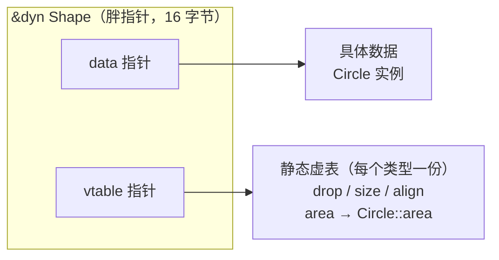

# 深入浅出 Trait 与 Trait 对象

## 一、Trait 是什么：一份"能力契约"

Rust 里没有"类继承"，把不同类型统一起来的方式是 **trait**。你可以把它理解成一份**能力契约**：

> 谁实现（`impl`）了这个 trait，谁就承诺提供这些能力。

如果有其他语言背景，可以这样对号入座：

| 语言 | 对应概念 | 像在哪 | 关键差异 |
|------|----------|--------|----------|
| Go | `interface` | 都是"行为集合"；`dyn Trait` 和 Go 的 interface 值一样，都是"数据 + 行为表"的动态对象 | Go 是隐式实现（方法齐了就算），Rust 必须显式 `impl`；Go 的接口调用天然是动态的 |
| Java | `interface` | 都显式声明"我实现它"；都支持默认方法（Java 8+ 的 `default` ↔ Rust 的默认实现）| Java 接口方法默认动态分派（虚方法），Rust 默认静态分派（泛型），写 `dyn` 才动态 |
| C++ | 抽象基类 + 纯虚函数 | `dyn Trait` 和 C++ 的虚函数表是同一套机制 | C++ 要靠继承；且虚表指针藏在对象里，Rust 藏在胖指针里（对象本身零开销）|
| Swift | `protocol` | 显式遵循（conformance）+ 可以有默认实现（protocol extension）；`any Protocol` ↔ `dyn Trait` | 大体相同，主要是语法和运行时细节 |
| Python / JS | 鸭子类型（duck typing）| 理念一致：看行为，不看身份 | 鸭子类型是运行时试探（"能叫就能当鸭子"），Rust 在编译期检查，且必须显式实现 |
| Haskell | typeclass（类型类）| 精神最接近：给类型"附加能力"，默认编译期静态展开（单态化）| Rust 的 trait 设计确实借鉴了 typeclass |

一句话：**它是 Go / Java 的 interface、Swift 的 protocol、Haskell 的 typeclass 的结合体——行为契约的形态，但必须显式实现，且默认走编译期静态分发。**

```rust
// 声明一个名叫 Shape 的 trait
trait Shape {
    // 想要成为 Shape，必须实现下面这个方法

    //定义一个计算面积功能的函数签名
    fn area(&self) -> f64;
}

//定义一个数据类型,表示圆形
struct Circle { r: f64 }

//定义一个数据类型,表示方形
struct Square { side: f64 }

// Circle实现Shape的函数签名,提供area方法
impl Shape for Circle {
    //规定圆形的面积计算方式
    fn area(&self) -> f64 {
        std::f64::consts::PI * self.r * self.r
    }
}

// Square 也实现Shape的函数签名
impl Shape for Square {
    //规定方形的面积计算方式
    fn area(&self) -> f64 {
        self.side * self.side
    }
}

fn main() {
    let circle = Circle { r: 1.0 };     // 先有一个具体类型的值
    // 再把它"借"成 trait 对象：变量类型是 &dyn Shape，可以指向任何实现了 Shape 的类型
    let shape: &dyn Shape = &circle;
    println!("{:.3}", shape.area()); // 3.142
}
```

几点说明：

- **trait 本身不是类型**，它是"要求"；实现了该要求的数据类型可以作为trait类型/对象;`Circle`、`Square` 才是类型；
- 一个类型可以实现任意多个 trait；trait 之间也可以有"父 trait"（supertrait）约束。具体看两个例子：

<details>
<summary>例子一：一个类型实现多个 trait</summary>

```rust
trait Shape {
    fn area(&self) -> f64;
}

trait Named {
    fn name(&self) -> &str;
}

struct Circle { r: f64 }

// 一个类型可以实现任意多个 trait
impl Shape for Circle {
    fn area(&self) -> f64 { std::f64::consts::PI * self.r * self.r }
}

impl Named for Circle {
    fn name(&self) -> &str { "圆形" }
}

fn main() {
    let c = Circle { r: 1.0 };
    println!("{} 面积 = {:.3}", c.name(), c.area()); // 圆形 面积 = 3.142
}
```

```text
圆形 面积 = 3.142
```

</details>

<details>
<summary>例子二：父 trait（supertrait）</summary>

```rust
trait Shape {
    fn area(&self) -> f64;
}

// 想实现 NamedShape，必须先实现 Shape
trait NamedShape: Shape {
    fn name(&self) -> &str;
}

struct Circle { r: f64 }

impl Shape for Circle {
    fn area(&self) -> f64 { std::f64::consts::PI * self.r * self.r }
}

impl NamedShape for Circle {
    fn name(&self) -> &str { "圆形" }
}

fn main() {
    let c = Circle { r: 1.0 };
    // 因为 NamedShape: Shape，既能调 name()，也能调 area()
    println!("{} 面积 = {:.3}", c.name(), c.area()); // 圆形 面积 = 3.142
}
```

```text
圆形 面积 = 3.142
```

</details>

小结：**trait 描述"能做什么"，具体类型决定"怎么做"**——像 Go 的 interface、Java 的 interface，但规则更严格：显式实现、默认静态分发。

---

## 二、默认实现：不写就用兜底

trait 里的方法可以**带默认实现**——直接在 trait 里写方法体。实现类型不写就用默认的，相当于兜底；也可以自己重写覆盖。

```rust
trait Shape {
    fn area(&self) -> f64;

    // 默认实现：实现类型不写这个方法时，自动用它兜底
    fn describe(&self) -> String {
        format!("面积 = {:.3}", self.area())
    }
}

struct Circle { r: f64 }
struct Square { side: f64 }

impl Shape for Circle {
    fn area(&self) -> f64 { std::f64::consts::PI * self.r * self.r }
    // describe 不写 → 用默认的
}

impl Shape for Square {
    fn area(&self) -> f64 { self.side * self.side }

    // 自己重写 → 覆盖默认实现
    fn describe(&self) -> String { format!("正方形，边长 {}", self.side) }
}

fn main() {
    let circle = Circle { r: 1.0 };
    let square = Square { side: 2.0 };

    // 同一个 trait 对象变量，先后"借"两种不同的数据类型
    let mut shape: &dyn Shape = &circle;
    println!("{}", shape.describe()); // 走默认 → 面积 = 3.142

    shape = &square; // 换成借用另一种数据类型
    println!("{}", shape.describe()); // 走重写 → 正方形，边长 2
}
```

```text
面积 = 3.142
正方形，边长 2
```

几个细节：

- 默认实现里可以调用同一个 trait 的其他方法（上面的 `describe` 就调用了 `area`）；
- 如果 trait 里**只有默认方法**，实现类型可以写成空 impl：


```rust
trait Greet {
    fn hi(&self) -> String { String::from("hi") }
}

struct A;
impl Greet for A {} // 什么都不用写，全部用默认

fn main() {
    println!("{}", A.hi()); // hi
}
```

- 默认实现还有个实际好处：给 trait 新增一个带默认实现的方法，不会破坏已有的实现代码——这是很多库做**向后兼容扩展**的常用手法。

小结：**默认实现是契约里的"可选项"**，是给实现者减负的兜底。

---

## 三、泛型 + Trait：静态分发

Trait 最常见的用法是当**约束**：要求泛型参数必须实现某个 trait。

```rust
fn print_area<T: Shape>(s: &T) {
    println!("{}", s.describe());
}

// 等价的简写
// fn print_area(s: &impl Shape) { ... }
```

编译器会为每个具体类型生成一份 `print_area`（这叫**单态化**），调用是直接调用，甚至能内联：

- 优点：零开销，快；
- 缺点一：类型多的时候会生成多份代码，编译产物膨胀；
- 缺点二：`Vec<T>` 里只能装同一种类型——`Circle` 和 `Square` 混不进同一个泛型容器。

想要"一个容器装各种类型"，就需要 trait 对象。

---

## 四、函数指针：能"动态"，但带不了状态

在讲 trait 对象之前，先看看另一条"动态调用"的路线——函数指针：

```rust
fn add_one(x: i32) -> i32 { x + 1 }
fn double(x: i32) -> i32 { x * 2 }

fn main() {
    let mut f: fn(i32) -> i32 = add_one;
    println!("{}", f(3)); // 4
    f = double;           // 运行时切换目标
    println!("{}", f(3)); // 6
}
```

`fn(i32) -> i32` 占 8 个字节，内容就是一个代码地址；类型可以写出来，所以还能直接返回：

```rust
fn pick(flag: bool) -> fn(i32) -> i32 {
    if flag { add_one } else { double }
}
```

但它有两条硬限制。

**限制一：装不下数据。** 捕获了环境的闭包想赋给它，编译器直接拒绝：

```rust
fn main() {
    let n = 1;
    let g: fn(i32) -> i32 = |x| x + n;
}
```

```text
error[E0308]: mismatched types
 --> src/main.rs:3:29
  |
3 |     let g: fn(i32) -> i32 = |x| x + n;
  |            --------------   ^^^^^^^^^ expected fn pointer, found closure
  |
  = note: closures can only be coerced to `fn` types if they do not capture any variables
```

**限制二：描述不了"对象"。** 函数指针只有"代码"，没有 `self`，没法表达"对某个具体对象调用它的方法"：

```rust
trait Shape {
    fn area(&self) -> f64;
}

struct Circle { r: f64 }
struct Square { side: f64 }
```

- `Vec<Circle>` 只能装一种类型；
- `Vec<fn(?) -> f64>` 也不行——函数指针不知道该把哪个数据传进去。

---

## 五、Trait 对象：把类型擦掉，让运行时决定调度

`dyn` 是一个关键字，表示"这是一个 Trait 对象"——这既不是具体类型，也不是宏。

```rust
let circle = Circle { r: 1.0 };
let square = Square { side: 2.0 };

// 两个具体值，装进同一个 Vec：类型统一成"Shape 的 trait 对象"
// 如果你熟悉 Go，可以类比 interface 值：都是"数据 + 行为表"的组合
let shapes: Vec<Box<dyn Shape>> = vec![Box::new(circle), Box::new(square)];
```

`Circle` 和 `Square` 毫不相干，为什么能装进同一个 `Vec`？跑起来看看，顺便看看它占多大：

```rust
use std::mem::size_of; // 标准库：计算内存占用

// 定义一份契约：Shape 要求实现 area 方法
trait Shape {
    fn area(&self) -> f64;

    // 默认实现：实现类型不写就自动用它兜底
    fn describe(&self) -> String {
        format!("面积 = {:.3}", self.area())
    }
}

struct Circle { r: f64 }
struct Square { side: f64 }

impl Shape for Circle {
    fn area(&self) -> f64 { std::f64::consts::PI * self.r * self.r }
    // describe 不写 → 用默认的
}

impl Shape for Square {
    fn area(&self) -> f64 { self.side * self.side }

    // 自己重写 → 覆盖默认实现
    fn describe(&self) -> String { format!("正方形，边长 {}", self.side) }
}

fn main() {
    let circle = Circle { r: 1.0 };
    let square = Square { side: 2.0 };

    // 两个具体值，装进同一个 trait 对象容器
    let shapes: Vec<Box<dyn Shape>> = vec![Box::new(circle), Box::new(square)];

    // 统一按 Shape 调用，不关心具体类型
    let total: f64 = shapes.iter().map(|s| s.area()).sum();
    println!("total = {:.3}", total);

    for s in &shapes {
        println!("{}", s.describe());
    }

    // 看看几个类型的大小
    println!("&dyn Shape     = {} bytes", size_of::<&dyn Shape>());//借用的 trait 对象
    println!("Box<dyn Shape> = {} bytes", size_of::<Box<dyn Shape>>());//拥有所有权的 trait 对象
    println!("fn(f64)->f64   = {} bytes", size_of::<fn(f64) -> f64>());//函数指针
    println!("&f64           = {} bytes", size_of::<&f64>());//对于浮点数的引用
}
```

```text
total = 7.142
面积 = 3.142
正方形，边长 2
&dyn Shape     = 16 bytes
Box<dyn Shape> = 16 bytes
fn(f64)->f64   = 8 bytes
&f64           = 8 bytes
```

关键差别：

- 普通引用 `&f64`、函数指针 `fn(...)`：**8 字节，一个指针**；
- `&dyn Shape` / `Box<dyn Shape>`：**16 字节，显然是两个指针长度**。

（注意：这里量的是**胖指针本身**，`Circle` 本体只有 8 字节；数据指针指向栈、堆还是静态区，和指针大小无关——`&dyn` 也能指向堆上的数据，比如 `&*Box<dyn Shape>`。）

多出来的那个指针，就是答案。`&dyn Trait` 是一个**胖指针**：



- **data 指针**：指向真正的数据。具体是什么类型程序并不关心，也不需要知道——类型信息已经被擦除了；
- **vtable 指针**：指向一张**编译期生成的静态表**，里面按固定顺序放着该类型的 `drop`、大小、对齐，以及各个 trait 方法的函数指针。

概念上，`Circle` 的虚表大概长这样：

```rust
// 概念示意：真实虚表是一串指针，方法项的 self 已被擦除成瘦指针
// 源码位置（rustc 1.100.0）：
//   compiler/rustc_middle/src/ty/vtable.rs   —— VtblEntry / COMMON_VTABLE_ENTRIES
//   compiler/rustc_ty_utils/src/abi.rs       —— make_thin_self_ptr（虚拟调用擦除 self）
struct VTableOfCircle {
    drop_in_place: fn(*mut ()),      // 析构胶水（无需析构时为空指针）—— vtable.rs: VtblEntry::MetadataDropInPlace
    size: usize,                     // 大小 —— vtable.rs: VtblEntry::MetadataSize
    align: usize,                    // 对齐 —— vtable.rs: VtblEntry::MetadataAlign
    area: fn(*const ()) -> f64,      // 方法实现（真实函数是 Circle::area(&Circle)）—— vtable.rs: VtblEntry::Method；self 擦除见 abi.rs
}
```

调用 `shape.area()` 时，编译器生成的代码是：

1. 从胖指针里取出 vtable 指针；
2. 从虚表里取出 `area` 的函数指针；
3. 把 data 指针当作 `self` 传进去，跳过去执行。

所以答案是：**数据指针可以指向任意类型，行为表按类型单独生成；调用时"调谁"由运行时的虚表决定。** 同一个 `area()` 调用点，可以命中完全不同的实现——这就叫**动态分发**。

<details>
<summary>展开：虚表到底是什么？从 C++ 的虚函数表说起</summary>

这套机制在 C++ 里叫**虚函数表**（virtual method table，vtable）：类里藏一个指针（vptr），指向本类的虚函数表；调用虚函数时，通过 vptr 查表，找到真正要执行的函数。

**Rust 和 C++ 最大的区别：虚表指针放在哪。**

- C++：vptr 放在**对象内部**（通常在对象头部），对象天然带一个指针；
- Rust：对象内部**不放**任何东西，虚表指针放在**胖指针**（`&dyn` / `Box<dyn>`）里。所以同一个类型，普通使用时就是普通结构体，零额外开销；只有装进 `dyn` 时才多出一个指针。

**行为特点：**

- 每个"具体类型 + trait"组合一份虚表，编译期生成，放在只读数据段；
- 表项顺序编译期固定：先是 `drop` / `size` / `align`，然后按 trait 里方法的声明顺序排（带父 trait 时还会插入父 trait 的虚表指针，供 upcasting 用）；
- 同一个类型实现多个 trait，就会有多张虚表；
- 调用要先查表再跳转，通常无法内联——这是动态分发的性能代价；
- Rust 是**显式 opt-in**：不写 `dyn` 就走静态分发；C++ 的虚函数则是隐式的默认行为。

</details>

### 5.1 验证：虚表按类型生成，一个类型只有一份

用 `transmute` 把 `&dyn Shape` 拆成两个指针看一眼（仅作观察，实际代码不要依赖 trait 对象的内存布局）：

```rust
fn vtable_of(t: &dyn Shape) -> (*const (), *const ()) {
    unsafe { std::mem::transmute(t) }
}

fn main() {
    let c1 = Circle { r: 1.0 };
    let c2 = Circle { r: 2.0 };

    let (d1, v1) = vtable_of(&c1);
    let (d2, v2) = vtable_of(&c2);

    println!("data1   = {:p}", d1);
    println!("data2   = {:p}", d2);
    println!("vtable1 = {:p}", v1);
    println!("vtable2 = {:p}", v2);
    println!("same vtable: {}", v1 == v2);
}
```

```text
data1   = 0x6e5ccff750
data2   = 0x6e5ccff758
vtable1 = 0x7ff69aa483d8
vtable2 = 0x7ff69aa483d8
same vtable: true
```

两个 `Circle` 的数据地址不同，但**虚表地址完全相同**（地址每次运行都不同，关键是"数据不同、虚表相同"）。虚表是"每个类型一份"，与实例无关；实例只负责带好自己的数据。这也解释了动态分发的代价——每次调用多一次查表和一次间接跳转，通常也无法内联。

<details>
<summary>附：相关实现源码（rustc 1.100.0，commit 98fd715ed 摘录）</summary>

以下摘自 [rust-lang/rust](https://github.com/rust-lang/rust)，路径相对仓库根目录；有删节，中文注释为笔者所加。

**虚表项的种类与顺序** —— `compiler/rustc_middle/src/ty/vtable.rs`：

```rust
#[derive(Clone, Copy, PartialEq, StableHash)]
pub enum VtblEntry<'tcx> {
    /// destructor of this type (used in vtable header)
    MetadataDropInPlace,
    /// layout size of this type (used in vtable header)
    MetadataSize,
    /// layout align of this type (used in vtable header)
    MetadataAlign,
    /// non-dispatchable associated function that is excluded from trait object
    Vacant,
    /// dispatchable associated function
    Method(Instance<'tcx>),
    /// pointer to a separate supertrait vtable, can be used by trait upcasting coercion
    TraitVPtr(TraitRef<'tcx>),
}

// 表头三项固定
impl<'tcx> TyCtxt<'tcx> {
    pub const COMMON_VTABLE_ENTRIES: &'tcx [VtblEntry<'tcx>] =
        &[VtblEntry::MetadataDropInPlace, VtblEntry::MetadataSize, VtblEntry::MetadataAlign];
}
```

**虚表本质是一串指针**（同文件，构建虚表分配的核心循环）：

```rust
let vtable_size = ptr_size * u64::try_from(vtable_entries.len()).unwrap();
let mut vtable = Allocation::new(vtable_size, ptr_align, AllocInit::Uninit, ());

for (idx, entry) in vtable_entries.iter().enumerate() {
    let scalar = match *entry {
        VtblEntry::MetadataDropInPlace => {
            if ty.needs_drop(tcx, ty::TypingEnv::fully_monomorphized()) {
                let instance = ty::Instance::resolve_drop_glue(tcx, ty);
                let fn_alloc_id = tcx.reserve_and_set_fn_alloc(instance, CTFE_ALLOC_SALT);
                let fn_ptr = Pointer::from(fn_alloc_id);
                Scalar::from_pointer(fn_ptr, &tcx)
            } else {
                Scalar::from_maybe_pointer(Pointer::null(), &tcx) // 不需要析构 → 空指针
            }
        }
        VtblEntry::MetadataSize => Scalar::from_uint(size, ptr_size),
        VtblEntry::MetadataAlign => Scalar::from_uint(align, ptr_size),
        VtblEntry::Vacant => continue,
        VtblEntry::Method(instance) => {
            // Prepare the fn ptr we write into the vtable.
            let fn_alloc_id = tcx.reserve_and_set_fn_alloc(instance, CTFE_ALLOC_SALT);
            let fn_ptr = Pointer::from(fn_alloc_id);
            Scalar::from_pointer(fn_ptr, &tcx)
        }
        VtblEntry::TraitVPtr(trait_ref) => {
            let super_trait_ref = ty::ExistentialTraitRef::erase_self_ty(tcx, trait_ref);
            let supertrait_alloc_id = tcx.vtable_allocation((ty, Some(super_trait_ref)));
            let vptr = Pointer::from(supertrait_alloc_id);
            Scalar::from_pointer(vptr, &tcx)
        }
    };
    vtable
        .write_scalar(&tcx, alloc_range(ptr_size * idx, ptr_size), scalar)
        .expect("failed to build vtable representation");
}
```

**方法按声明顺序排** —— `compiler/rustc_trait_selection/src/traits/vtable.rs`：

```rust
fn own_existential_vtable_entries_iter(
    tcx: TyCtxt<'_>,
    trait_def_id: DefId,
) -> impl Iterator<Item = DefId> {
    let trait_methods =
        tcx.associated_items(trait_def_id).in_definition_order().filter(|item| item.is_fn());

    // Now list each method's DefId (for within its trait).
    let own_entries = trait_methods.filter_map(move |&trait_method| {
        debug!("own_existential_vtable_entry: trait_method={:?}", trait_method);
        let def_id = trait_method.def_id;

        // Final methods should not be included in the vtable.
        if trait_method.defaultness(tcx).is_final() {
            return None;
        }

        // Some methods cannot be called on an object; skip those.
        if !is_vtable_safe_method(tcx, trait_def_id, trait_method) {
            debug!("own_existential_vtable_entry: not vtable safe");
            return None;
        }

        Some(def_id)
    });

    own_entries
}
```

父 trait 的排布规则（同文件注释，`DSA` 即 drop/size/align 表头，A、B、C、D 是继承链上的 trait）：

```text
// The following constraints holds for the final arrangement.
// 1. The whole virtual table of the first direct super trait is included as the
//    the prefix. If this trait doesn't have any super traits, then this step
//    consists of the dsa metadata.
// 2. Then comes the proper pointer metadata(vptr) and all own methods for all
//    other super traits except those already included as part of the first
//    direct super trait virtual table.
// 3. finally, the own methods of this trait.

// For a single inheritance relationship like this,
//   D --> C --> B --> A
// The resulting vtable will consists of these segments:
//  DSA, A, B, C, D
```

**虚拟调用时 self 被擦除成瘦指针** —— `compiler/rustc_ty_utils/src/abi.rs`：

```rust
let layout = cx.layout_of(ty).map_err(|err| &*tcx.arena.alloc(FnAbiError::Layout(*err)))?;
let layout = if is_virtual_call && arg_idx == Some(0) {
    // Don't pass the vtable, it's not an argument of the virtual fn.
    // Instead, pass just the data pointer, but give it the type `*const/mut dyn Trait`
    // or `&/&mut dyn Trait` because this is special-cased elsewhere in codegen
    make_thin_self_ptr(cx, layout)
} else {
    layout
};
```

`make_thin_self_ptr` 的结尾（同文件）——把宽指针的布局换成瘦指针：

```rust
// we now have a type like `*mut RcInner<dyn Trait>`
// change its layout to that of `*mut ()`, a thin pointer, but keep the same type
// this is understood as a special case elsewhere in the compiler
let unit_ptr_ty = Ty::new_mut_ptr(tcx, tcx.types.unit);

TyAndLayout {
    ty: wide_pointer_ty,

    // NOTE(eddyb) using an empty `ParamEnv`, and `unwrap`-ing the `Result`
    // should always work because the type is always `*mut ()`.
    ..tcx.layout_of(ty::TypingEnv::fully_monomorphized().as_query_input(unit_ptr_ty)).unwrap()
}
```

</details>

---

## 六、和指针的区别：一张表说清

| | `&T`（普通引用）| `fn(...)`（函数指针）| `&dyn Trait`（Trait 对象）|
|---|---|---|---|
| 大小 | 8 字节 | 8 字节 | 16 字节 |
| 指向 | 数据 | 代码 | 数据 + 行为表 |
| 携带状态 | 数据本身 | 不能 | 能（data 指针）|
| 类型信息 | 编译期确定 | 无，只有签名 | 运行时擦除 |
| 调用方式 | 直接访问 | 直接跳转 | 查虚表 + 间接跳转 |
| 能装多种类型 | 否 | 否 | 能 |

具体到 `fn` 和 `dyn`，最关键的是两条：

1. **能不能装状态**：`fn` 只有 8 字节，捕获环境的闭包塞不进去；`&dyn Fn` 多一个 data 指针，正好用来装环境。
2. **调用怎么找到实现**：`fn` 的实现地址编译期就写在指针里，直接调用、可内联；`dyn` 运行时才从虚表里查，多一次间接跳转，通常无法内联。

补一句：`&dyn Trait` 和 `Box<dyn Trait>` 的区别是"借用"与"拥有"，胖指针结构完全一样。

---

## 七、`dyn` 还是泛型？

Trait 对象不是唯一的多态手段，Rust 还有泛型（静态分发），两者对比：

| | 泛型 / `impl Trait`（静态分发）| `dyn Trait`（动态分发）|
|---|---|---|
| 代码生成 | 每个具体类型一份（单态化）| 一份代码 + 每类型一张虚表 |
| 调用 | 直接调用，可内联 | 查虚表，间接调用 |
| 编译时间/体积 | 类型多时膨胀 | 更小 |
| 运行性能 | 更好 | 多一次间接跳转 |
| 异构集合 | 不行（类型必须统一）| 可以 |

一句话：**编译期能定下来就用泛型，需要异构、解耦或控制体积就用 `dyn`。**

---

## 八、对象安全：不是所有 trait 都能做成对象

`dyn Trait` 有个前提：trait 必须是**对象安全（object safe）**的——新版编译器管这叫"dyn 兼容（dyn compatible）"，意思一样：这个 trait 得允许编译器为它生成一张虚表。

常见的有三种"不合格"情况，每种都有明确的报错。

**情况一：方法带泛型参数。** 泛型方法能实例化出无限多种版本，虚表里放不下：

```rust
trait Bad {
    fn generic<T>(&self, t: T); // 泛型方法
}

fn main() {
    let _: Box<dyn Bad>;
}
```

```text
error[E0038]: the trait `Bad` is not dyn compatible
 --> src/main.rs:6:20
  |
6 |     let _: Box<dyn Bad>;
  |                    ^^^ `Bad` is not dyn compatible
  |
note: for a trait to be dyn compatible it needs to allow building a vtable
 --> src/main.rs:2:8
  |
2 |     fn generic<T>(&self, t: T);
  |        ^^^^^^^ ...because method `generic` has generic type parameters
  = help: consider moving `generic` to another trait
```

**情况二：方法返回 `Self`。** 虚表描述的是"某个具体类型的行为"，而 `Self` 在编译期是不确定的：

```rust
trait MyClone {
    fn clone_me(&self) -> Self; // 返回 Self
}

fn main() {
    let _: Box<dyn MyClone>;
}
```

```text
error[E0038]: the trait `MyClone` is not dyn compatible
 --> src/main.rs:6:20
  |
6 |     let _: Box<dyn MyClone>;
  |                    ^^^^^^^ `MyClone` is not dyn compatible
  |
note: for a trait to be dyn compatible it needs to allow building a vtable
 --> src/main.rs:2:27
  |
2 |     fn clone_me(&self) -> Self;
  |                           ^^^^ ...because method `clone_me` references the `Self` type in its return type
  = help: consider moving `clone_me` to another trait
```

**情况三：关联常量。** 关联常量的值属于具体 impl，而 trait 对象已经把具体类型擦掉了；虚表项只有析构、大小、对齐和方法（以及父 trait 的虚表指针），没有"取常量"的入口，编译器无从确定该用哪个 impl 的值：

```rust
trait WithConst {
    const N: usize; // 关联常量
    fn get(&self) -> usize;
}

fn main() {
    let _: Box<dyn WithConst>;
}
```

```text
error[E0038]: the trait `WithConst` is not dyn compatible
 --> src/main.rs:7:20
  |
7 |     let _: Box<dyn WithConst>;
  |                    ^^^^^^^^^ `WithConst` is not dyn compatible
  |
note: for a trait to be dyn compatible it needs to allow building a vtable
 --> src/main.rs:2:11
  |
2 |     const N: usize;
  |           ^ ...because it contains associated const `N`
  = help: consider moving `N` to another trait
```

> 这更多是设计取舍：虚表布局里没有关联常量的位置，而具体类型被擦除后，编译器也无法确定该取哪个 impl 的值。

<details>
<summary>附：关联常量的 dyn 兼容检查源码（rustc 1.100.0 摘录）</summary>

`compiler/rustc_trait_selection/src/traits/dyn_compatibility.rs` —— 关联常量默认直接判为不兼容（`min_generic_const_args` 分支尚未稳定）：

```rust
ty::AssocKind::Const { name } => {
    // We will permit type associated consts if they are explicitly mentioned in the
    // trait object type. We can't check this here, as here we only check if it is
    // guaranteed to not be possible.

    let mut errors = Vec::new();

    if tcx.features().min_generic_const_args() {
        if !tcx.generics_of(item.def_id).is_own_empty() {
            errors.push(AssocConstViolation::Generic);
        } else if !tcx.is_always_gca(item.def_id) && !tcx.features().generic_const_args() {
            errors.push(AssocConstViolation::NonType);
        }

        let ty = ty::Binder::dummy(
            tcx.type_of(item.def_id).instantiate_identity().skip_norm_wip(),
        );
        if contains_illegal_self_type_reference(
            tcx,
            trait_def_id,
            ty,
            AllowSelfProjections::Yes,
        ) {
            errors.push(AssocConstViolation::TypeReferencesSelf);
        }
    } else {
        errors.push(AssocConstViolation::FeatureNotEnabled);
    }

    errors
        .into_iter()
        .map(|error| DynCompatibilityViolation::AssocConst(name, error, span()))
        .collect()
}
```

`compiler/rustc_middle/src/traits/mod.rs` —— 违反项枚举与报错文案：

```rust
/// Reasons an associated const might not be dyn compatible.
#[derive(Clone, Debug, PartialEq, Eq, Hash, StableHash)]
pub enum AssocConstViolation {
    /// Unstable feature `min_generic_const_args` wasn't enabled.
    FeatureNotEnabled,

    /// Not defined as a type-level associated const.
    NonType,

    /// Has own generic parameters (GAC).
    Generic,

    /// Its type mentions the `Self` type parameter.
    TypeReferencesSelf,
}
```

```rust
Self::AssocConst(name, AssocConstViolation::FeatureNotEnabled, _) => {
    format!("it contains associated const `{name}`").into()
}
```

</details>

**豁免写法：`where Self: Sized`。** 如果某个方法本来就"不打算通过 trait 对象调用"，可以给它加上 `where Self: Sized`，把它从虚表里排除掉，trait 就重新变成 dyn 兼容：

```rust
trait Safe {
    // 泛型方法，但要求 Self 是固定大小的类型 → 不参与虚表
    fn generic<T>(&self, t: T) where Self: Sized;
    fn area(&self) -> f64;
}

struct Circle { r: f64 }

impl Safe for Circle {
    fn generic<T>(&self, _t: T) where Self: Sized {}
    fn area(&self) -> f64 { std::f64::consts::PI * self.r * self.r }
}

fn main() {
    let circle = Circle { r: 1.0 };
    circle.generic(1);             // 泛型方法只能用具体类型调用
    let safe: &dyn Safe = &circle; // trait 对象只能调 area()
    println!("{:.3}", safe.area()); // 3.142
}
```

```text
3.142
```

`Clone` 是最著名的例子：它的定义是 `pub trait Clone: Sized`（要求 `Self: Sized`），所以 `dyn Clone` 不成立：

```text
error[E0038]: the trait `Clone` is not dyn compatible
 --> src/main.rs:2:20
  |
2 |     let _: Box<dyn Clone>;
  |                    ^^^^^ `Clone` is not dyn compatible
  |
  = note: the trait is not dyn compatible because it requires `Self: Sized`
```

这也是为什么"克隆一个 `Box<dyn Trait>`"需要专门设计（常见做法：在 trait 里加一个 `fn clone_box(&self) -> Box<dyn Trait>`）。

---

## 九、应用场景

**异构集合**：`Vec<Box<dyn Shape>>`、`Vec<Box<dyn Draw>>`——容器只认行为，不认类型。

**回调注册表**：`Vec<Box<dyn Fn(&Event)>>`，存一堆捕获环境各不相同的闭包：

```rust
fn main() {
    let add = 1;
    let mul = 2;

    // 两个闭包类型不同、捕获的环境也不同
    let add_fn = move |x: i32| x + add;
    let mul_fn = move |x: i32| x * mul;

    // 装成 trait 对象后，就能放进同一个 Vec（Box 在堆上）
    let funcs: Vec<Box<dyn Fn(i32) -> i32>> = vec![Box::new(add_fn), Box::new(mul_fn)];

    for f in &funcs {
        println!("{}", f(10));
    }
}
```

```text
11
20
```

这是事件系统、任务队列、线程池的核心结构。

**插件 / 策略模式**：运行时决定用哪个实现。

**给泛型"瘦身"**：同一份逻辑被大量类型实例化时，用 `dyn` 换回编译时间和二进制体积。


## 十、标准库里的"特殊" trait

标准库里有不少"带魔法"的 trait：实现它们之后，类型会获得某种**语言级能力**（运算符、语法糖、编译器行为）。常用的先列一张表：

| trait | 作用 | 实现后获得的能力 |
|---|---|---|
| `Drop` | 析构 | 离开作用域时自动执行清理 |
| `Deref` / `DerefMut` | 解引用 | `*x`、自动 deref 转换（`&String` → `&str`）|
| `Iterator` | 迭代 | `for` 循环、`map` / `filter` / `sum` 等适配器 |
| `From` / `Into` | 类型转换 | `T::from(x)`、`x.into()`；`?` 自动转换错误类型 |
| `Default` | 默认值 | `Default::default()`、`..Default::default()` |
| `Clone` / `Copy` | 复制 | `.clone()`；`Copy` 类型赋值时自动按位复制 |
| `Display` / `Debug` | 格式化 | `{}` / `{:?}` 占位符 |
| `Add` / `Sub` / `Mul` / `Neg` … | 运算符重载 | `a + b`、`-a` 等 |
| `Index` / `IndexMut` | 索引 | `x[i]` |
| `PartialEq` / `Eq` / `PartialOrd` / `Ord` | 比较 | `==`、`<`、排序 |
| `Fn` / `FnMut` / `FnOnce` | 可调用 | `f()` 调用语法 |
| `Send` / `Sync` | 线程安全标记 | 能在线程间移动 / 共享引用 |

以下是使用示例
<details>
<summary>Drop：离开作用域自动清理（顺序是后进先出）</summary>

```rust
struct Noisy(&'static str);

impl Drop for Noisy {
    fn drop(&mut self) {
        println!("drop {}", self.0);
    }
}

fn main() {
    let _a = Noisy("a");
    let _b = Noisy("b");
    println!("main end");
}
```

```text
main end
drop b
drop a
```

`_b` 后声明却先析构——和 C++ 局部变量的析构顺序一致（后进先出）。
</details>

<details>
<summary>Deref：让自定义类型拥有"解引用"和自动转换能力</summary>

```rust
use std::ops::Deref;

struct MyBox<T>(T);

impl<T> Deref for MyBox<T> {
    type Target = T;
    fn deref(&self) -> &T { &self.0 }
}

fn main() {
    let x = MyBox(5);
    println!("{}", *x);            // 手动解引用
    println!("{}", x.to_string()); // 自动 deref：MyBox<i32> → i32 的方法
}
```

```text
5
5
```

`&String` 能当 `&str` 用、`Box<T>` 能当 `T` 用，靠的都是 `Deref`。
</details>

<details>
<summary>Add：运算符重载</summary>

```rust
use std::ops::Add;

#[derive(Debug)]
struct Vec2 { x: f64, y: f64 }

impl Add for Vec2 {
    type Output = Vec2;
    fn add(self, other: Vec2) -> Vec2 {
        Vec2 { x: self.x + other.x, y: self.y + other.y }
    }
}

fn main() {
    let v = Vec2 { x: 1.0, y: 2.0 } + Vec2 { x: 3.0, y: 4.0 };
    println!("{:?}", v);
}
```

```text
Vec2 { x: 4.0, y: 6.0 }
```
</details>

<details>
<summary>From + ?：错误类型的自动转换</summary>

```rust
use std::num::ParseIntError;

#[derive(Debug)]
struct MyError(String);

impl From<ParseIntError> for MyError {
    fn from(e: ParseIntError) -> Self {
        MyError(e.to_string())
    }
}

fn parse(s: &str) -> Result<i32, MyError> {
    let n: i32 = s.parse()?; // ParseIntError 自动转成 MyError
    Ok(n * 2)
}

fn main() {
    println!("{:?}", parse("21")); // Ok(42)

    let e = parse("x").unwrap_err();
    println!("{}", e.0); // invalid digit found in string
}
```

```text
Ok(42)
invalid digit found in string
```

`?` 在返回错误前会调用 `From::from` 做一次转换——这就是各种错误库能"自动兼容"的原因。
</details>


---

## 十一、总结

> **trait 描述"能做什么"，具体类型决定"怎么做"。**
>
> **Trait 对象 = 数据指针 + 虚表指针：类型被擦掉，行为留在表里。**
>
> 于是同一个调用点，可以在运行时命中不同实现——静态语言由此获得了受控的动态能力。
